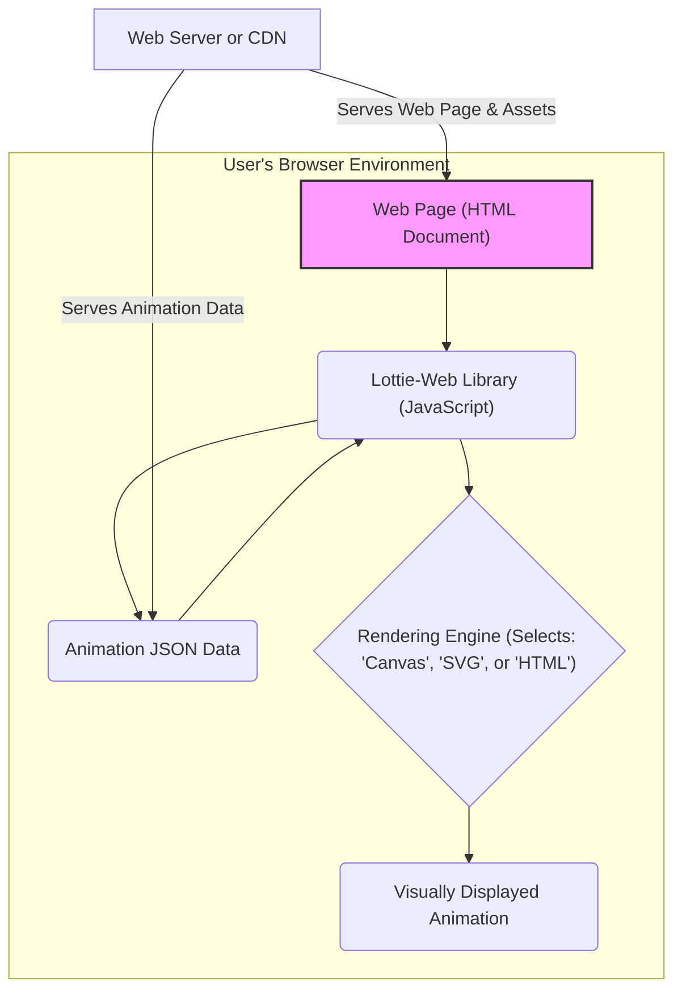

## Project Design Document: Lottie-Web (Improved)

**1. Introduction**

This document provides an enhanced and more detailed design overview of the Lottie-Web project, a powerful JavaScript library enabling the rendering of Adobe After Effects animations natively within web and mobile browser environments. This document is specifically crafted to serve as a robust foundation for subsequent threat modeling activities. It meticulously outlines the key components, intricate data flows, and critical architectural considerations inherent in Lottie-Web's operation.

**2. Goals**

* Deliver a significantly clearer and more comprehensive description of the Lottie-Web architecture, leaving no ambiguity in its functionality.
* Precisely identify all key components and meticulously detail their interactions within the system.
* Thoroughly describe the complete data flow, tracing the journey of animation data from its source to its rendered output.
* Proactively highlight potential areas of security concern with greater specificity, providing actionable insights for future threat modeling exercises.
* Serve as an authoritative and easily understandable reference point for developers, security analysts, and other stakeholders involved in the project.

**3. System Architecture**

The fundamental operation of Lottie-Web is centered within the user's web browser. It ingests animation data structured in JSON format – typically generated through the Bodymovin plugin for Adobe After Effects – and subsequently renders these animations utilizing a variety of browser-native technologies.

**4. Component Breakdown**

* **Web Page (HTML Document):** The foundational HTML document where the Lottie animation is integrated. This page incorporates the Lottie-Web JavaScript library, typically through a `<script>` tag, and references the animation data file, often via a URL or embedded data.
* **Lottie-Web Library (JavaScript):** The core JavaScript library that orchestrates the entire animation rendering process. Its responsibilities include:
    * **Animation Data Loading and Management:**  Fetching the animation JSON data, handling potential loading errors, and managing the data in memory.
    * **Data Parsing and Interpretation:**  Deconstructing the JSON structure to understand the animation's layers, keyframes, shapes, and expressions.
    * **Animation State Management:**  Maintaining the current animation frame, playback progress, direction, and other dynamic parameters.
    * **Rendering Logic and Strategy:**  Selecting and executing the appropriate rendering technique (Canvas, SVG, or HTML) based on configuration or animation characteristics.
    * **Canvas Rendering:** Utilizing the HTML Canvas API for pixel-based rendering, suitable for complex effects and rasterized elements.
    * **SVG Rendering:** Employing Scalable Vector Graphics for vector-based rendering, ensuring scalability and sharpness, particularly for shape-based animations.
    * **HTML Rendering:** Leveraging standard HTML elements and CSS for rendering, offering flexibility for certain animation types but potentially with performance limitations for intricate animations.
    * **Expression Evaluation and Execution:**  Interpreting and executing JavaScript-like expressions embedded within the animation data, allowing for dynamic control of animation properties. This is a critical component from a security perspective.
    * **Asset Management:** Handling external assets referenced in the animation data, such as images, ensuring they are loaded and integrated correctly.
    * **Event Handling and Interaction API:** Providing a JavaScript API to control the animation (play, pause, stop, seek, set speed, etc.) and to listen for animation events (e.g., animation complete, frame rendered).
* **Animation JSON Data:** A JSON-formatted file that meticulously describes the animation, typically exported from Adobe After Effects using the Bodymovin plugin. This data encompasses:
    * **Composition Details:**  Information about the animation's duration, frame rate, and overall structure.
    * **Layer Definitions:**  Detailed descriptions of each layer in the animation, including its type (shape, image, text, etc.), properties, and transformations.
    * **Keyframe Data:**  Precise definitions of property changes over time for each layer, forming the basis of the animation.
    * **Shape and Path Data:**  Vector information defining the geometry of shapes and paths used in the animation.
    * **Expression Code:**  JavaScript-like code snippets that can dynamically manipulate animation properties based on various factors.
    * **Asset References:**  URLs or paths to external assets, such as images or other media files, used within the animation.
* **Rendering Engine (Selects: 'Canvas', 'SVG', or 'HTML'):** The specific browser API or rendering method chosen by Lottie-Web to draw the animation frames:
    * **Canvas API:** Provides a low-level, pixel-based drawing surface, offering fine-grained control over rendering.
    * **SVG (Scalable Vector Graphics):**  A markup language for describing two-dimensional vector graphics, allowing for resolution-independent rendering.
    * **HTML and CSS:**  Utilizes standard HTML elements and CSS styling to represent and animate elements, offering flexibility but potentially lower performance for complex animations.
* **Visually Displayed Animation:** The final rendered output of the animation, visible to the user within the web page. This is the culmination of the data processing and rendering steps.
* **Web Server or CDN:** The infrastructure responsible for hosting and delivering the necessary files:
    * **Serving Lottie-Web Library:**  Delivering the `lottie.js` file (or similar bundled file) to the user's browser.
    * **Serving Animation JSON Data:** Providing access to the animation data file.
    * **Serving Assets (Optional):**  Hosting any external assets referenced by the animation data.

**5. Data Flow (Detailed)**

1. **Initial Request:** A user navigates to a web page containing an embedded Lottie animation. The browser initiates a request to the web server for the HTML document.
2. **Web Page Delivery:** The web server responds by sending the HTML document to the user's browser. This document includes references to the Lottie-Web library (typically via a `<script>` tag) and instructions for initializing the animation.
3. **Lottie-Web Library Loading:** The browser parses the HTML and fetches the Lottie-Web JavaScript library from the specified location (either the same server or a CDN).
4. **Animation Initialization:** The Lottie-Web library is initialized within the web page's JavaScript environment. This often involves specifying the URL of the animation JSON data file and the target HTML element where the animation should be rendered.
5. **Animation Data Fetch:** The Lottie-Web library makes an HTTP request (or HTTPS, ideally) to the web server or CDN to retrieve the animation JSON data file.
6. **JSON Data Reception:** The web server or CDN responds with the animation JSON data.
7. **Data Parsing and Interpretation:** The Lottie-Web library parses the received JSON data, meticulously interpreting the structure and extracting information about layers, keyframes, shapes, expressions, and assets.
8. **Rendering Engine Selection:** Based on configuration or animation characteristics, Lottie-Web selects the appropriate rendering engine (Canvas, SVG, or HTML).
9. **Frame-by-Frame Rendering:** The chosen rendering engine draws the animation frame by frame, based on the parsed animation data and the current animation state. This involves:
    * **Applying Transformations:** Calculating and applying transformations (position, scale, rotation, opacity) to each layer and shape.
    * **Drawing Shapes and Paths:**  Using the selected rendering API (Canvas or SVG) to draw the vector graphics defined in the animation data.
    * **Evaluating Expressions:**  If expressions are present, the Lottie-Web library evaluates and executes these JavaScript-like code snippets to dynamically modify animation properties.
    * **Asset Integration:**  Loading and displaying any external assets (images) referenced in the animation data.
10. **Display Update:** The rendered frame is displayed within the designated area of the web page, updating the visual representation of the animation.
11. **Animation Progression:** Lottie-Web continues to render subsequent frames, creating the illusion of motion.
12. **User Interaction (Optional):** If the user interacts with the animation (e.g., through JavaScript API calls to control playback), Lottie-Web updates the animation state and triggers re-rendering accordingly.

**6. Security Considerations (Detailed for Threat Modeling)**

* **Cross-Site Scripting (XSS) via Malicious Animation Data:**
    * **Script Injection through Properties:** Attackers could craft malicious JSON data containing JavaScript code within string properties that are later interpreted or used in a way that allows script execution.
    * **Exploiting Expression Evaluation:** The expression evaluation feature is a prime target for XSS. Malicious expressions could be injected to execute arbitrary JavaScript code within the user's browser, potentially stealing cookies, session tokens, or performing other malicious actions. Robust sandboxing and input validation are crucial here.
* **Dependency Vulnerabilities:**
    * Lottie-Web relies on various third-party JavaScript libraries (transitive dependencies). Vulnerabilities in these dependencies could be exploited if not regularly updated and managed. Supply chain security is a concern.
* **Client-Side Vulnerabilities in Lottie-Web Library:**
    * Bugs or vulnerabilities within the Lottie-Web library's parsing, rendering, or expression evaluation logic could be exploited by attackers providing specially crafted animation data. This could lead to arbitrary code execution, denial of service, or information disclosure.
* **Data Integrity and Man-in-the-Middle Attacks:**
    * If the animation JSON data is fetched over an insecure HTTP connection, it is susceptible to interception and modification by attackers. This could lead to the display of altered or malicious animations. Enforcing HTTPS for data retrieval is essential.
* **Denial of Service (DoS) on the Client-Side:**
    * **Resource Exhaustion:**  Extremely complex or large animation files with excessive layers, shapes, or intricate expressions could consume significant client-side resources (CPU, memory), leading to performance degradation, browser crashes, or even system instability.
    * **Infinite Loops in Expressions:** Maliciously crafted expressions could introduce infinite loops, causing the browser to freeze or become unresponsive.
* **Code Injection and Sandbox Escapes in Expression Evaluation:**
    * Even with sandboxing, vulnerabilities in the expression evaluation engine could allow attackers to escape the sandbox and execute arbitrary code with the privileges of the web page.
* **Server-Side Vulnerabilities (Indirect):**
    * While Lottie-Web is primarily client-side, vulnerabilities on the server hosting the animation data or the Lottie-Web library could indirectly impact its security. For example, a compromised server could serve malicious animation data or a backdoored version of the library.
* **Asset Security:**
    * If the animation relies on external assets (images), vulnerabilities in how these assets are loaded or handled could be exploited. For example, loading assets from untrusted sources could introduce security risks.

**7. Technology Stack**

* **Core Programming Language:** JavaScript (ECMAScript)
* **Primary Rendering Technologies:**
    * HTML Canvas API
    * SVG (Scalable Vector Graphics)
    * Standard HTML and CSS
* **Animation Data Format:** JSON (specifically the Bodymovin format)
* **Build and Packaging Tools:**  Likely utilizes tools such as Webpack, Rollup, or Parcel for bundling and optimization.
* **Version Control System:** Git (as hosted on GitHub).
* **Potential Dependencies:** Various utility libraries for tasks like math operations, string manipulation, and potentially animation-specific algorithms.

**8. Deployment Model**

Lottie-Web is fundamentally a client-side library, and its deployment typically involves:

* **Hosting Lottie-Web Library Files:**  Deploying the bundled `lottie.js` (or similar) file on a web server or a Content Delivery Network (CDN) for efficient distribution.
* **Hosting Animation JSON Data Files:**  Storing the animation data files on a web server or CDN, making them accessible via URLs.
* **Web Page Integration:**  Embedding the Lottie-Web library into the HTML of the target web page, usually through a `<script>` tag.
* **Animation Initialization via JavaScript:**  Using JavaScript code within the web page to initialize the Lottie animation, specifying the path to the JSON data and the target rendering element.

**9. Assumptions and Constraints**

* **Modern Browser Compatibility:** Lottie-Web is designed to function correctly in modern web browsers that support the necessary JavaScript features and rendering APIs (Canvas, SVG).
* **Animation Complexity and Performance Trade-offs:** The performance of Lottie-Web can be influenced by the complexity of the animation. Highly intricate animations with numerous layers and complex expressions may require more processing power on the client-side.
* **Shared Security Responsibility:** While Lottie-Web aims to be secure, developers integrating it into their web applications bear the responsibility of ensuring the security of their overall environment and carefully vetting the sources of animation data.
* **Reliance on Bodymovin Plugin:** The standard workflow assumes that animation data is generated using the Bodymovin plugin for Adobe After Effects. Compatibility with other animation tools or formats may be limited.
* **Open Source Nature:** As an open-source project, the security of Lottie-Web relies on community contributions and scrutiny.

This improved design document provides a more comprehensive and detailed understanding of the Lottie-Web project, specifically tailored for effective threat modeling. It highlights key components, data flows, and potential security vulnerabilities, serving as a valuable resource for security analysis and mitigation efforts.