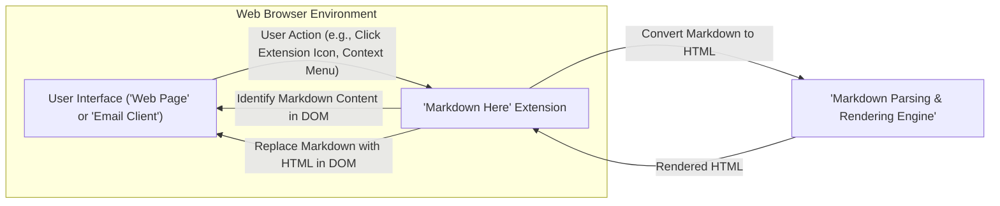
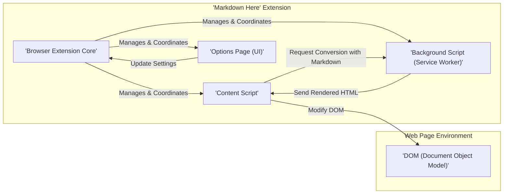
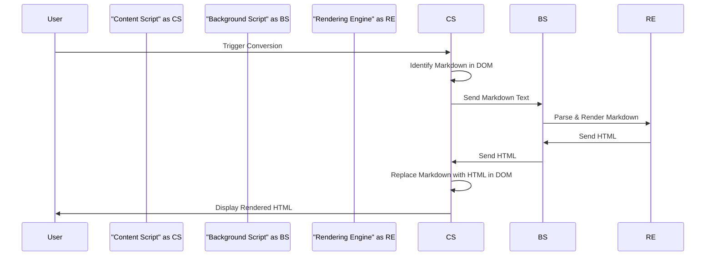

# Project Design Document: Markdown Here

**Project Name:** Markdown Here

**Project Repository:** [https://github.com/adam-p/markdown-here](https://github.com/adam-p/markdown-here)

**Document Version:** 1.1

**Date:** October 26, 2023

**Author:** Gemini (AI Language Model)

## 1. Introduction

This document provides an enhanced design overview of the "Markdown Here" project, building upon the initial design to provide greater clarity and detail. This document serves as a crucial resource for understanding the system's architecture, components, and data flow, which is essential for subsequent threat modeling activities. The aim is to provide a comprehensive understanding of the project to facilitate a robust security analysis.

### 1.1. Project Overview

Markdown Here is a browser extension designed to enable users to compose emails and other web content using Markdown syntax. The extension then renders this Markdown into rich HTML directly within the user's browser before the content is submitted. The core functionality is performed client-side, ensuring user data remains within their browser environment.

### 1.2. Goals

*   Provide a detailed and refined description of the Markdown Here extension's architecture and functionality.
*   Clearly define the responsibilities and interactions of each key component.
*   Illustrate the data flow within the extension with specific examples.
*   Highlight potential areas of security concern with greater specificity for future threat modeling exercises.

### 1.3. Scope

This document encompasses the design of the core functionality of the Markdown Here browser extension, including:

*   Mechanisms for user interaction to initiate the conversion process.
*   The process by which the extension identifies Markdown content within a web page's structure.
*   The transformation of Markdown syntax into its corresponding HTML representation.
*   The method of replacing the original Markdown text with the generated HTML within the web page.
*   The extension's interaction with the web browser environment and the web pages it operates on.

This document explicitly excludes:

*   In-depth analysis of the internal workings of the chosen Markdown parsing library.
*   The technical details of the extension's build, packaging, and distribution.
*   Line-by-line code implementation details.
*   The identification of specific, actionable security vulnerabilities (these are the target of the subsequent threat modeling phase).

## 2. System Architecture

The Markdown Here extension operates as an integral part of the user's web browser. It is composed of distinct components that collaborate to deliver the extension's core functionality.

### 2.1. High-Level Architecture

### 2.2. Component-Level Architecture

The Markdown Here extension is further segmented into the following key components, each with specific responsibilities:

*   **Browser Extension Core:**
    *   Manages the overall lifecycle of the extension, including installation, updates, and enabling/disabling.
    *   Acts as a central point for communication and coordination between other extension components.
    *   Persists user-configurable settings and preferences, leveraging browser storage mechanisms.
*   **Content Script:**
    *   Dynamically injected into web pages that match the extension's defined scope (e.g., email composition pages).
    *   Monitors user interactions (e.g., clicks on the extension icon, context menu selections, keyboard shortcuts) to trigger the Markdown conversion process.
    *   Analyzes the Document Object Model (DOM) of the web page to locate blocks of text that are intended to be treated as Markdown. This might involve looking for specific delimiters or identifying user-selected text.
    *   Receives the fully rendered HTML from the background script.
    *   Modifies the DOM of the web page, replacing the original Markdown text with its corresponding HTML representation.
*   **Background Script (Service Worker):**
    *   Operates in the background of the browser, independent of specific web pages.
    *   Serves as the primary processing unit for the extension's core logic.
    *   Receives requests from the content script containing the Markdown text to be converted.
    *   Instantiates and utilizes a dedicated Markdown parsing and rendering library (e.g., `marked.js`, `commonmark.js`).
    *   Executes the conversion of Markdown to HTML using the chosen library.
    *   Returns the generated HTML back to the originating content script.
*   **Options Page (User Interface):**
    *   Provides a dedicated user interface, typically accessible through the browser's extension management page.
    *   Allows users to customize the extension's behavior through configurable settings (e.g., enabling/disabling the extension on specific websites, defining custom CSS styles for rendered output, choosing different rendering options).

## 3. Data Flow

The central data flow within the extension revolves around the transformation of Markdown text into its HTML equivalent.

### 3.1. Markdown Conversion Flow (Example: Email Composition)

1. **User Composes Email:** The user writes an email within their web-based email client, using Markdown syntax for formatting.
2. **User Triggers Conversion:** The user initiates the conversion process by clicking the Markdown Here extension icon in the browser toolbar or by using a predefined context menu option within the email composition area.
3. **Content Script Activation & Markdown Identification:** The content script, which is active on the email composition page, detects the user's action. It then analyzes the DOM to identify the specific text area containing the Markdown content. This might involve targeting the currently focused text input or a user-selected block of text.
4. **Request to Background Script:** The content script extracts the identified Markdown text and sends it as a message to the background script. This message signals a request for conversion.
5. **Background Script Receives and Processes:** The background script receives the Markdown text from the content script.
6. **Conversion to HTML:** The background script invokes the configured Markdown parsing and rendering library, passing the received Markdown text as input. The library processes the Markdown and generates the corresponding HTML markup.
7. **HTML Transmission:** The background script sends the generated HTML back to the originating content script.
8. **DOM Manipulation and Replacement:** The content script receives the HTML. It then manipulates the DOM of the email composition page, carefully replacing the original Markdown text with the newly generated HTML. This might involve creating new HTML elements or modifying existing ones.
9. **User Views Rendered HTML:** The user now sees the formatted email content rendered in HTML within their email client's interface.

### 3.2. Settings Data Flow

1. **User Accesses Options:** The user navigates to the browser's extension management page and opens the Options Page for Markdown Here.
2. **User Modifies Settings:** The user interacts with the controls on the Options Page (e.g., checkboxes, text fields) to change the extension's settings.
3. **Settings Update Request:** The Options Page sends a message to the Browser Extension Core, containing the updated settings data.
4. **Settings Storage:** The Browser Extension Core receives the updated settings and utilizes the browser's storage API (e.g., `chrome.storage.sync` or `browser.storage.local`) to persist these settings.
5. **Settings Retrieval (as needed):** When the Content Script or Background Script needs to access the current settings (e.g., to determine if the extension is enabled on a particular site or to retrieve custom CSS), they retrieve the settings from the Browser Extension Core, which in turn accesses the browser's storage.

## 4. Security Considerations (Detailed)

This section expands on the initial security considerations, providing more specific examples of potential threats that should be thoroughly investigated during the threat modeling process.

*   **Cross-Site Scripting (XSS) via Malicious Markdown:**
    *   If the Markdown rendering library has vulnerabilities, an attacker could craft specific Markdown syntax that, when rendered, injects malicious JavaScript into the web page. This could lead to session hijacking, data theft, or other malicious actions performed in the context of the user's session on the website.
    *   Example: Including a Markdown image tag with a malicious `onerror` attribute containing JavaScript.
*   **Content Security Policy (CSP) Bypasses through DOM Manipulation:**
    *   The extension's ability to modify the DOM could potentially be exploited to bypass a website's Content Security Policy. For instance, if the extension injects inline `<style>` or `<script>` tags, it might circumvent the intended restrictions of the CSP.
*   **Data Injection and Manipulation:**
    *   Vulnerabilities in the logic that identifies and replaces Markdown text could allow an attacker to inject arbitrary content into the web page or modify existing content in unintended ways.
    *   Example: If the delimiters used to identify Markdown are not handled carefully, an attacker might be able to inject content outside of the intended Markdown block.
*   **Excessive Permissions:**
    *   If the extension requests overly broad permissions (e.g., access to all websites' data), it increases the potential impact if the extension itself is compromised.
*   **Supply Chain Attacks (Third-Party Library Vulnerabilities):**
    *   The security of the chosen Markdown parsing library is paramount. Vulnerabilities in this library directly translate to vulnerabilities in the extension. Regular updates and security audits of the library are crucial.
*   **Sensitive Data Exposure:**
    *   Although the extension primarily processes text locally, vulnerabilities could lead to the unintentional logging or transmission of sensitive information contained within the Markdown content.
*   **Compromised Update Mechanism:**
    *   If the extension's update mechanism is not secure, an attacker could potentially push malicious updates to users, introducing vulnerabilities or malware.
*   **Clickjacking:**
    *   While less likely, if the extension introduces new UI elements, care must be taken to prevent clickjacking attacks where users are tricked into performing unintended actions.
*   **Regular Expression Denial of Service (ReDoS):**
    *   If regular expressions are used extensively in the Markdown parsing or identification process, poorly crafted input could potentially cause a denial of service by exploiting the regex engine's performance characteristics.

## 5. Technologies Used

*   **JavaScript:** The primary programming language for implementing the extension's logic, including content scripts and background scripts.
*   **HTML:** Used for creating the structure of the Options Page and potentially for manipulating the DOM when rendering Markdown.
*   **CSS:** Used for styling the Options Page and potentially for applying custom styles to the rendered HTML content.
*   **Markdown Parsing Library:** A third-party JavaScript library (e.g., `marked.js`, `commonmark.js`, `showdown.js`) responsible for the core functionality of converting Markdown syntax to HTML.
*   **Browser Extension APIs:**  A set of APIs provided by web browsers (e.g., `chrome.*` APIs for Chromium-based browsers, `browser.*` APIs for Firefox) that enable extensions to interact with the browser, access web page content, manage storage, and more.

## 6. Future Considerations

*   **Support for Additional Markdown Features:** Expanding the extension's capabilities to support more advanced Markdown syntax and extensions.
*   **Theming and Customization:** Providing users with more granular control over the visual appearance of the rendered HTML through themes or custom CSS.
*   **Integration with Other Services:** Exploring potential integrations with other web services or applications.
*   **Enhanced Security Measures:** Implementing additional security features such as input sanitization, output encoding, and regular security audits.
*   **Modular Architecture:**  Considering a more modular architecture to improve maintainability and testability.

This revised document provides a more detailed and comprehensive understanding of the Markdown Here project's design. This enhanced information will be invaluable for conducting a thorough and effective threat model to identify and mitigate potential security risks.
