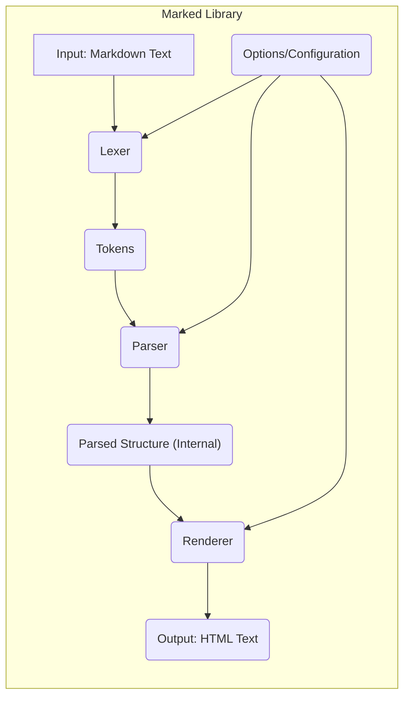

# Project Design Document: Marked

**Version:** 1.1
**Date:** October 26, 2023
**Author:** AI Software Architect

## 1. Introduction

This document provides an enhanced and more detailed design overview of the `marked` JavaScript library, a fast and lightweight Markdown parser and compiler. This document serves as a robust foundation for subsequent threat modeling activities, offering a comprehensive understanding of the system's architecture, data flow, and key components. The improvements in this version aim to provide greater clarity and depth for security analysis.

## 2. Project Overview

*   **Project Name:** marked
*   **Project Description:** `marked` is a JavaScript library meticulously designed to transform Markdown formatted text into HTML. Its core principles are speed and simplicity, making it an excellent choice for both client-side rendering within web browsers and server-side processing in Node.js environments.
*   **Project Goal:** To deliver a dependable, high-performance, and easily customizable solution for parsing Markdown in JavaScript environments. A key objective is to maintain a balance between feature richness and a minimal attack surface.
*   **Target Users:**  Primarily software developers who require the functionality to convert Markdown content into HTML within their projects. This includes developers building web applications, static site generators, documentation tools, and other JavaScript-centric applications.

## 3. System Architecture

The `marked` library employs a well-defined pipeline architecture, systematically processing input Markdown through distinct stages to generate the final HTML output. This modular design enhances maintainability and allows for potential customization at each stage.

*   **Core Components:**
    *   **Input Stage:**
        *   **Component:**  Markdown Text Input.
        *   **Description:**  Represents the raw Markdown string provided to the `marked` library for processing. This is the initial point of interaction and a critical area for security considerations.
    *   **Lexing Stage:**
        *   **Component:** Lexer.
        *   **Description:**  The Lexer's primary responsibility is to perform lexical analysis on the input Markdown text. It meticulously scans the text, identifying and categorizing individual Markdown elements based on predefined rules and regular expressions. This process breaks down the continuous text into a structured stream of tokens.
    *   **Token Processing Stage:**
        *   **Component:** Tokens.
        *   **Description:**  An intermediate representation of the Markdown document. Each token encapsulates information about a specific Markdown element, such as its type (e.g., heading, paragraph, list item), content, and any relevant attributes.
    *   **Parsing Stage:**
        *   **Component:** Parser.
        *   **Description:** The Parser takes the stream of tokens generated by the Lexer and interprets them according to the established rules of Markdown syntax. It constructs a hierarchical representation of the document's structure, often in the form of an Abstract Syntax Tree (AST) or a similar internal data structure. This stage ensures the logical organization of the Markdown content.
    *   **Rendering Stage:**
        *   **Component:** Renderer.
        *   **Description:** The Renderer traverses the parsed structure (e.g., the AST) and translates each Markdown element into its corresponding HTML markup. It contains specific logic for converting different Markdown constructs into valid HTML tags and attributes. This stage is crucial for controlling the final output and implementing security measures like sanitization.
    *   **Output Stage:**
        *   **Component:** HTML Output.
        *   **Description:** The final output of the `marked` library, consisting of the generated HTML string. This is the result that will typically be displayed in a web browser or used by other applications.
    *   **Configuration and Customization:**
        *   **Component:** Options/Configuration.
        *   **Description:**  Provides a mechanism for users to tailor the behavior of the Lexer, Parser, and Renderer. This includes options for enabling or disabling specific Markdown extensions (like GitHub Flavored Markdown), controlling sanitization levels, and providing custom rendering functions.

*   **Data Flow Diagram:**

## 4. Detailed Component Description

*   **Lexer:**
    *   **Functionality:**  Scans the input Markdown text character by character, applying regular expressions and pattern matching techniques to identify and categorize distinct Markdown elements. It maintains internal state to handle context-dependent parsing (e.g., recognizing code blocks or blockquotes).
    *   **Input:** The raw Markdown text string.
    *   **Output:** An ordered array of tokens. Each token is typically a JavaScript object with properties defining the element's type (e.g., `heading`, `paragraph`, `list_start`), its content, and potentially other relevant metadata (e.g., heading level).
    *   **Key Considerations:**
        *   **Regular Expression Efficiency:** The performance of the Lexer heavily relies on the efficiency of its regular expressions. Poorly designed regex can lead to performance bottlenecks or even ReDoS vulnerabilities.
        *   **Accuracy of Tokenization:** Correctly identifying and categorizing Markdown elements is fundamental for subsequent parsing. Errors in tokenization can lead to incorrect HTML output.
        *   **Handling Edge Cases:** The Lexer needs to handle various edge cases and potentially ambiguous Markdown syntax according to the CommonMark specification or the specific flavor of Markdown being parsed.

*   **Parser:**
    *   **Functionality:**  Consumes the stream of tokens produced by the Lexer and builds a hierarchical representation of the Markdown document. This involves understanding the relationships between different Markdown elements (e.g., nested lists, code blocks within blockquotes) and constructing a data structure that reflects this structure.
    *   **Input:** An array of tokens from the Lexer.
    *   **Output:**  An internal representation of the parsed Markdown structure. This is often an Abstract Syntax Tree (AST), where each node represents a Markdown element and the tree structure reflects the document's hierarchy.
    *   **Key Considerations:**
        *   **Syntax Tree Construction:** The Parser must correctly implement the rules of Markdown syntax to build an accurate representation of the document.
        *   **Error Handling:**  The Parser should gracefully handle invalid or malformed Markdown input, potentially providing warnings or errors instead of crashing.
        *   **Performance for Complex Documents:** The parsing process should be efficient even for large and complex Markdown documents.

*   **Renderer:**
    *   **Functionality:**  Traverses the parsed Markdown structure (e.g., the AST) and generates the corresponding HTML markup. It contains a set of functions or methods, often one for each type of Markdown element, that define how that element should be translated into HTML.
    *   **Input:** The parsed Markdown structure (e.g., the AST).
    *   **Output:** A string containing the generated HTML.
    *   **Key Considerations:**
        *   **HTML Correctness and Semantics:** The Renderer is responsible for generating valid and semantically meaningful HTML.
        *   **Security (Sanitization and Escaping):**  A critical responsibility of the Renderer is to prevent XSS vulnerabilities by properly sanitizing or escaping user-provided content within the Markdown. This often involves escaping HTML special characters.
        *   **Customization:** `marked` allows users to customize the rendering process by providing their own rendering functions for specific Markdown elements. This flexibility needs to be handled carefully to avoid introducing security issues.

*   **Options/Configuration:**
    *   **Functionality:**  Provides a way for users to configure various aspects of the parsing and rendering process. These options can influence how the Lexer identifies tokens, how the Parser interprets the token stream, and how the Renderer generates HTML.
    *   **Input:** Typically a JavaScript object containing key-value pairs representing different configuration options.
    *   **Output:**  Modifies the behavior of the Lexer, Parser, and Renderer according to the specified options.
    *   **Examples of Options:**
        *   `gfm` (boolean): Enables or disables GitHub Flavored Markdown extensions.
        *   `breaks` (boolean):  Controls whether line breaks within paragraphs are rendered as ` ` tags.
        *   `sanitize` (boolean): Enables or disables HTML sanitization of the output.
        *   `xhtml` (boolean):  Outputs self-closing tags in XML style.
        *   `highlight` (function): A custom function for syntax highlighting code blocks.
        *   `renderer` (object): An object containing custom rendering functions for specific Markdown elements.
    *   **Key Considerations:**
        *   **Security Implications of Options:**  Certain options, like disabling sanitization, have significant security implications and should be used with caution.
        *   **Validation and Default Values:**  The options system should have appropriate validation to prevent invalid configurations and should provide sensible default values.

## 5. Data Flow

The conversion of Markdown to HTML using `marked` follows a sequential data flow:

1. The process begins when a user or application provides Markdown formatted text as input to the `marked` library.
2. The **Lexer** receives this input text and performs lexical analysis, breaking it down into a stream of individual **Tokens**.
3. The **Parser** takes the stream of **Tokens** and interprets them according to Markdown syntax rules, building an internal **Parsed Structure** (e.g., an AST).
4. The **Renderer** then traverses this **Parsed Structure**, converting each Markdown element into its corresponding HTML representation.
5. The **Renderer** generates the final **HTML Output** string.
6. Throughout this process, **Options/Configuration** settings influence the behavior of the **Lexer**, **Parser**, and **Renderer**, allowing for customization of the conversion process.

## 6. Technology Stack

*   **Primary Language:** JavaScript (ECMAScript)
*   **Dependencies:** `marked` is designed to be lightweight and has minimal to no external runtime dependencies, enhancing its portability and reducing potential dependency-related vulnerabilities. Development dependencies for testing and building are typically managed using npm or yarn.
*   **Build Tools:**  Commonly uses Node.js and npm (or yarn) for development tasks such as running tests, building distribution files, and managing development dependencies.

## 7. Deployment Model

`marked` is versatile and can be deployed in various JavaScript environments:

*   **Client-Side (Browser):**
    *   Directly included in HTML pages using a ` -->` or a link like `[Click Me](javascript:alert('XSS'))` could be exploited if not properly handled.
*   **Denial of Service (DoS):**
    *   **Threat:**   специально crafted Markdown input with deeply nested structures (e.g., excessively nested lists or blockquotes) or extremely large input sizes could consume excessive CPU and memory resources, potentially causing the server or client application to become unresponsive.
    *   **Mitigation:** Implementing safeguards such as input size limits or timeouts for parsing could help mitigate this risk.
    *   **Example:** A Markdown document with thousands of nested lists could overwhelm the parser.
*   **Regular Expression Denial of Service (ReDoS):**
    *   **Threat:**  Inefficient regular expressions used in the Lexer could be exploited by providing specific input patterns that cause the regex engine to backtrack excessively, leading to a significant increase in processing time and potentially a denial of service.
    *   **Mitigation:**  Careful review and optimization of regular expressions used in the Lexer are crucial. Using techniques to prevent excessive backtracking can be beneficial.
    *   **Example:**  A long string of repeating characters that almost matches a complex regex pattern could trigger ReDoS.
*   **Supply Chain Security:**
    *   **Threat:**  The `marked` package itself could be compromised on npm, leading to the distribution of malicious code to a large number of downstream users. This could involve injecting code that steals credentials or performs other malicious actions.
    *   **Mitigation:**  Practices like using dependency scanning tools, verifying package integrity, and being aware of the maintainership and security practices of the `marked` project are important.
*   **Configuration Vulnerabilities:**
    *   **Threat:**  Developers might misconfigure `marked` by disabling essential security features like sanitization, inadvertently creating vulnerabilities in their applications.
    *   **Mitigation:**  Providing clear documentation and warnings about the security implications of different configuration options is essential. Secure defaults should be enabled where possible.
*   **HTML Injection through Custom Renderers:**
    *   **Threat:** If developers use custom renderers without proper input validation and output encoding, they could inadvertently introduce HTML injection vulnerabilities.
    *   **Mitigation:**  Emphasize the importance of secure coding practices when implementing custom renderers, including proper escaping of user-provided data.

## 9. Assumptions and Constraints

*   The primary use case for `marked` is assumed to be the conversion of Markdown to HTML for display purposes in web browsers or within other HTML rendering contexts.
*   This design document focuses on the core parsing and rendering functionalities of the `marked` library. Features beyond this core, such as live preview capabilities or editor integrations, are considered out of scope.
*   The threat model derived from this document will primarily concentrate on vulnerabilities inherent within the `marked` library itself, rather than the security of the surrounding environment where it is deployed. However, interactions with the environment will be considered where relevant.
*   It is assumed that developers integrating `marked` into their projects have a basic understanding of web security principles, including the risks of XSS and HTML injection.

## 10. Future Considerations

*   **Further Modularization:** Exploring opportunities to further decouple the Lexer, Parser, and Renderer components could enhance maintainability, testability, and allow for more granular customization or replacement of individual components.
*   **Performance Optimization:** Continuously evaluating and optimizing the performance of the parsing and rendering pipeline, particularly for large and complex Markdown documents.
*   **Enhanced Error Handling and Reporting:** Implementing more robust error handling mechanisms and providing more informative error messages for invalid or malformed Markdown input.
*   **Formal Security Audits:**  Conducting regular security audits by independent experts to identify and address potential vulnerabilities.
*   **Integration with Content Security Policy (CSP):**  Providing guidance and features that facilitate the use of `marked` in environments with strict Content Security Policies.

This enhanced design document provides a more in-depth understanding of the `marked` library, serving as a valuable resource for comprehensive threat modeling and security analysis. The added details and clarifications aim to facilitate a more thorough assessment of potential vulnerabilities and the development of appropriate mitigation strategies.
