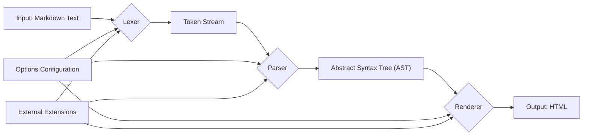

# Project Design Document: Marked.js

**Version:** 1.1
**Date:** October 26, 2023
**Author:** AI Software Architect

## 1. Introduction

This document provides an enhanced design overview of the Marked.js project, a widely used JavaScript library for parsing Markdown into HTML. The primary goal of this document is to offer a detailed understanding of the library's internal workings, architecture, and data flow, specifically tailored to facilitate effective threat modeling.

## 2. Goals

*   Provide a clear and detailed explanation of Marked.js's architecture and its constituent components.
*   Accurately illustrate the flow of data through the library's processing stages.
*   Identify key functionalities, extension points, and their potential security implications.
*   Serve as a robust foundation for identifying and analyzing potential security vulnerabilities during threat modeling exercises.

## 3. Project Overview

Marked.js is a high-performance, lightweight JavaScript library designed to parse and compile Markdown formatted text into HTML. Its core functionality revolves around transforming human-readable Markdown into web-compatible HTML. The library is designed for flexibility and extensibility, allowing developers to customize its behavior to suit various application needs.

## 4. Target Audience

This document is primarily intended for:

*   Security engineers responsible for performing threat modeling and security assessments.
*   Software developers who are contributing to the Marked.js project or integrating it into their applications.
*   Anyone requiring a deep technical understanding of the library's internal mechanisms for security analysis or development purposes.

## 5. System Architecture

Marked.js employs a modular pipeline architecture, processing Markdown input through distinct stages. The core components are:

*   **Lexer:**  The initial stage responsible for breaking down the raw Markdown input into a stream of meaningful tokens. These tokens represent individual Markdown elements.
*   **Parser:**  This component receives the token stream from the Lexer and constructs an Abstract Syntax Tree (AST). The AST represents the hierarchical structure of the Markdown document.
*   **Renderer:**  The final stage that traverses the AST generated by the Parser and transforms it into the corresponding HTML output. It defines how each Markdown element is rendered into HTML.
*   **Options:** A configuration object that allows users to customize the behavior of the Lexer, Parser, and Renderer. This includes settings for enabling/disabling features, specifying sanitization rules, and more.
*   **Extensions:** A powerful mechanism for extending the core functionality of Marked.js. Extensions can modify the behavior of the Lexer, Parser, and Renderer to support custom Markdown syntax or alter the output.

### 5.1. Data Flow

The following diagram visualizes the flow of data through the Marked.js pipeline:

**Detailed Explanation of Data Flow:**

*   The process starts with **"Input: Markdown Text"**, the raw Markdown string to be processed.
*   The **"Lexer"** receives this input and, guided by the **"Options Configuration"** and any **"External Extensions"**, performs lexical analysis, producing a **"Token Stream"**.
*   The **"Parser"** consumes the **"Token Stream"** and, based on the **"Options Configuration"** and **"External Extensions"**, constructs a structured representation of the Markdown, the **"Abstract Syntax Tree (AST)"**.
*   The **"Renderer"** then traverses the **"Abstract Syntax Tree (AST)"**, utilizing the **"Options Configuration"** and **"External Extensions"** to generate the final **"Output: HTML"**.

## 6. Component Deep Dive

### 6.1. Lexer

*   **Core Function:**  Scans the input Markdown text and identifies individual syntactic elements, emitting a stream of tokens.
*   **Input:**  A string containing Markdown formatted text.
*   **Output:** An ordered array of tokens. Each token typically includes a `type` (e.g., `heading`, `paragraph`, `code`) and associated `raw` or `text` content.
*   **Security Relevance:**
    *   Heavily relies on regular expressions for pattern matching. Poorly constructed regex can be susceptible to Regular Expression Denial of Service (ReDoS) attacks.
    *   Custom tokenizer extensions introduce potential vulnerabilities if they don't handle input validation and edge cases correctly.

### 6.2. Parser

*   **Core Function:**  Takes the flat stream of tokens from the Lexer and builds a hierarchical representation (the AST) that reflects the logical structure of the Markdown document.
*   **Input:**  An array of tokens generated by the Lexer.
*   **Output:** An Abstract Syntax Tree (AST), a nested object structure representing the parsed Markdown.
*   **Security Relevance:**
    *   Flaws in the parsing logic can lead to unexpected AST structures, which might be exploited by malicious renderers or lead to bypasses in security sanitization.
    *   Custom parser extensions can introduce vulnerabilities if they don't correctly handle token sequences or create malformed AST nodes.

### 6.3. Renderer

*   **Core Function:**  Traverses the AST and generates the corresponding HTML markup. It contains methods for rendering each type of AST node into its HTML equivalent.
*   **Input:**  The Abstract Syntax Tree (AST).
*   **Output:**  A string containing the generated HTML.
*   **Security Relevance:**
    *   This is a critical component for security. If the Renderer doesn't properly escape or sanitize user-provided content within the AST, it can lead to Cross-Site Scripting (XSS) vulnerabilities.
    *   The `options.sanitizer` function is crucial here. A weak or missing sanitizer can expose the application to XSS.
    *   Custom renderer extensions can introduce vulnerabilities if they generate unsafe HTML or fail to sanitize data correctly.

### 6.4. Options

*   **Core Function:**  Provides a mechanism to configure the behavior of the Lexer, Parser, and Renderer.
*   **Examples of Key Options:**
    *   `gfm`: Enables GitHub Flavored Markdown parsing.
    *   `breaks`:  Allows newline characters in paragraphs to create ` ` tags.
    *   `sanitize`:  If `true`, uses a built-in sanitizer to escape potentially dangerous HTML.
    *   `sanitizer`:  A custom function to provide more control over HTML sanitization.
    *   `highlight`:  A custom function for syntax highlighting code blocks.
*   **Security Relevance:**
    *   Misconfigured options can directly impact security. For example, setting `sanitize` to `false` or providing a flawed custom `sanitizer` can open the door to XSS attacks.
    *   Understanding the security implications of each option is vital for secure integration.

### 6.5. Extensions

*   **Core Function:**  Allows developers to extend or modify the core parsing and rendering pipeline.
*   **Types of Extensions:**
    *   **Tokenizer:**  Adds new rules to the Lexer to recognize custom Markdown syntax.
    *   **Parser:**  Modifies how the Parser interprets tokens and builds the AST.
    *   **Renderer:**  Customizes how AST nodes are rendered into HTML.
*   **Security Relevance:**
    *   Extensions operate with the same privileges as the core Marked.js library. Malicious or poorly written extensions can introduce significant security vulnerabilities, including arbitrary code execution if they manipulate the rendering process to inject scripts.
    *   The security of an application using Marked.js is directly tied to the trustworthiness and security of any extensions it uses.

## 7. Security Considerations and Potential Threats

Based on the architecture and component details, the following security considerations and potential threats are identified:

*   **Cross-Site Scripting (XSS):**  The primary security concern. If unsanitized user-controlled Markdown input is rendered, it can lead to the injection of malicious scripts into the output HTML. Mitigation relies heavily on the `sanitize` option and a robust `sanitizer` implementation.
*   **Regular Expression Denial of Service (ReDoS):**  Complex or maliciously crafted Markdown input can exploit the regular expressions used in the Lexer, causing excessive processing and potentially leading to a denial of service.
*   **Prototype Pollution:** While less common in the core library, extensions that manipulate object prototypes without proper validation could introduce prototype pollution vulnerabilities, potentially leading to unexpected behavior or security breaches.
*   **Dependency Vulnerabilities:** Although Marked.js has minimal direct dependencies, the environment in which it operates will have its own set of dependencies. Vulnerabilities in these surrounding dependencies could indirectly impact the security of applications using Marked.js.
*   **Malicious Extensions:**  Using untrusted or poorly vetted extensions poses a significant risk. These extensions could bypass security measures, inject malicious code, or leak sensitive information. Input validation and careful selection of extensions are crucial.
*   **Server-Side Vulnerabilities:** When used server-side, vulnerabilities in the surrounding application logic that handles user input and renders the output HTML can compound the risks associated with Marked.js. For example, failing to properly handle and escape the final HTML output.

## 8. Deployment Scenarios and Security Implications

The context in which Marked.js is deployed significantly impacts the potential attack surface and security considerations:

*   **Client-Side in Web Browsers:**
    *   **Implication:** Direct exposure to potentially malicious user input. XSS is the primary concern. The effectiveness of the `sanitize` option and the browser's built-in security features are critical.
*   **Server-Side Rendering (Node.js):**
    *   **Implication:**  While the server controls the rendering process, vulnerabilities can still arise if user input is not properly sanitized before being passed to Marked.js or if the final HTML output is not correctly handled before being sent to the client. ReDoS attacks can also impact server resources.
*   **Static Site Generators:**
    *   **Implication:**  The risk is lower if the Markdown content is from trusted sources. However, if the Markdown source is user-provided or external, the same XSS and ReDoS risks apply during the site generation process.
*   **Desktop Applications (e.g., Electron):**
    *   **Implication:**  If the application renders user-provided Markdown, XSS vulnerabilities can be exploited within the application's web view. The security of the application's rendering environment becomes a key factor.

## 9. Dependencies

Marked.js intentionally has very few direct dependencies to minimize its footprint and potential attack surface. However, the security of the overall system relies on ensuring that the environment in which Marked.js is used, and any extensions it utilizes, are also secure and up-to-date. Regularly reviewing and updating dependencies is a crucial security practice.

## 10. Future Considerations (Security Focused)

*   ** 강화된 기본 보안 설정 (Strengthened Default Security Settings):**  Consider making stricter sanitization options the default behavior to reduce the risk of accidental misconfiguration.
*   **정규 표현식 보안 강화 (Regular Expression Security Enhancements):**  Explore using more robust and less vulnerable regular expression patterns to mitigate ReDoS risks.
*   **확장 기능에 대한 보안 검토 프로세스 (Security Review Process for Extensions):** If a formal extension ecosystem develops, implementing a security review process for contributed extensions would be beneficial.
*   **샌드박스 환경에서의 렌더링 (Rendering in a Sandboxed Environment):** Investigate the feasibility of rendering Markdown in a sandboxed environment to further isolate potential threats.

## 11. Conclusion

This enhanced design document provides a more in-depth understanding of the Marked.js library, with a particular focus on security considerations. By detailing the architecture, data flow, and potential vulnerabilities within each component, this document aims to equip security engineers and developers with the necessary information to perform thorough threat modeling and build secure applications that utilize Marked.js. A strong understanding of the library's internals, its configuration options, and the risks associated with extensions is essential for mitigating potential security threats.
