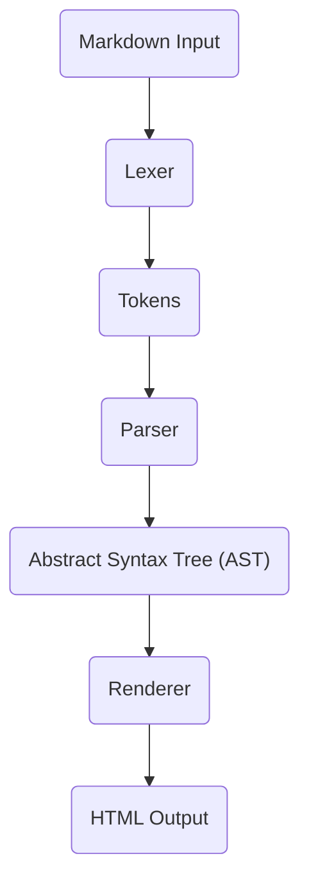
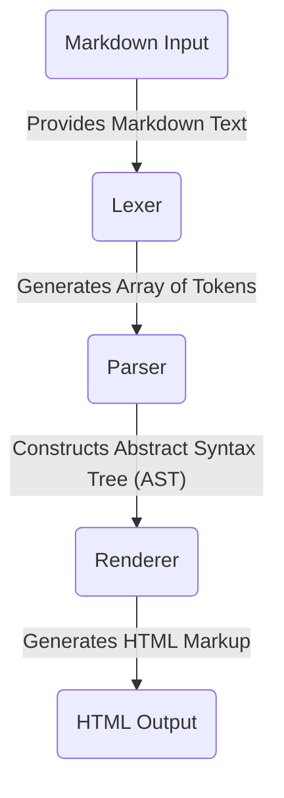

# Project Design Document: Marked (Improved)

**Project Name:** Marked

**Project Repository:** https://github.com/markedjs/marked

**Document Version:** 1.1

**Date:** October 26, 2023

**Author:** Gemini (AI Language Model)

## 1. Introduction

This document provides an enhanced design overview of the `marked` JavaScript library, building upon the previous version. `marked` is a widely used, performant, and CommonMark-compliant Markdown parser and compiler. This document aims to provide a more in-depth understanding of the library's internal architecture, component interactions, and data transformations, specifically to facilitate comprehensive threat modeling.

## 2. Goals

The primary goals of this design document are to:

* Provide a detailed and technically accurate description of the `marked` library's architecture and internal components.
* Clearly illustrate the flow of data and transformations within the library during the Markdown parsing and compilation process.
* Identify key interfaces, data structures, and algorithms employed by the system.
* Offer sufficient technical detail to enable security engineers to perform effective and targeted threat modeling of the `marked` library, particularly focusing on its handling of potentially malicious input.

## 3. Scope

This document focuses on the core logic and internal workings of the `marked` library involved in converting Markdown text into HTML. It includes:

* The complete parsing and rendering pipeline, from initial input to final output.
* Detailed descriptions of key internal components, their functions, and interactions.
* The representation and transformation of data at each stage of the process.
* The influence of configuration options on the parsing and rendering behavior.

This document explicitly does *not* cover:

* The library's build process, tooling, or development environment.
* The library's unit or integration testing framework.
* The intricacies of the full CommonMark specification (assumed knowledge of basic Markdown syntax).
* The specific context of how the `marked` library is integrated and used within an external, embedding application. The threat model will primarily consider `marked` as a standalone component processing untrusted Markdown input.

## 4. High-Level Architecture

The `marked` library processes Markdown input through a well-defined pipeline, transforming it into HTML output. This pipeline consists of distinct stages, each with specific responsibilities.

**Components:**

* **"Markdown Input":** The raw string containing the Markdown text to be processed by the library.
* **"Lexer":** The component responsible for the lexical analysis of the input Markdown, breaking it down into a stream of meaningful tokens.
* **"Tokens":** An intermediate representation of the Markdown input, where each token represents a recognized syntactic element (e.g., heading, paragraph, list item).
* **"Parser":** The component that takes the stream of tokens and constructs an Abstract Syntax Tree (AST), representing the hierarchical structure of the Markdown document.
* **"Abstract Syntax Tree (AST)":** A tree-like data structure that represents the parsed Markdown document's structure, facilitating further processing and rendering.
* **"Renderer":** The component that traverses the AST and generates the corresponding HTML markup for each node in the tree.
* **"HTML Output":** The final string containing the HTML representation of the input Markdown content.

## 5. Detailed Component Descriptions

### 5.1. Lexer

* **Functionality:** The Lexer performs lexical analysis, scanning the input Markdown text and identifying individual syntactic units. It uses regular expressions to match patterns corresponding to different Markdown elements.
* **Input:** A string containing the raw Markdown text.
* **Output:** An ordered array of token objects. Each token typically includes a `type` (e.g., `heading`, `paragraph`, `list_start`), and potentially other properties like `text`, `depth`, or `raw`.
* **Key Responsibilities:**
    * Identifying and extracting block-level elements (e.g., headings, paragraphs, code blocks, blockquotes, lists, thematic breaks).
    * Identifying and extracting inline-level elements (e.g., emphasis, strong emphasis, links, images, code spans, line breaks).
    * Handling special characters, escape sequences, and HTML entities.
    * Maintaining state to correctly interpret context-dependent syntax (e.g., list item indentation).
* **Internal Mechanisms:** Employs a series of regular expressions to match different Markdown syntax patterns. The order of these regex checks is crucial for correct tokenization.
* **Configuration Influence:** Options like `gfm` (GitHub Flavored Markdown) and `breaks` alter the Lexer's behavior by enabling or disabling specific syntax rules and influencing how line breaks are handled.

### 5.2. Parser

* **Functionality:** The Parser takes the stream of tokens produced by the Lexer and builds an Abstract Syntax Tree (AST). This involves understanding the grammatical rules of Markdown and organizing the tokens into a hierarchical structure.
* **Input:** An array of token objects from the Lexer.
* **Output:** A single root node representing the AST. The AST is a nested structure of objects, where each object represents a Markdown element and can contain child nodes.
* **Key Responsibilities:**
    * Interpreting the sequence of tokens and applying Markdown parsing rules.
    * Creating the hierarchical structure of the AST, representing the relationships between different Markdown elements (e.g., a list containing list items, a paragraph containing inline elements).
    * Handling nested elements and complex Markdown structures.
    * Resolving ambiguities in the Markdown syntax based on the specification.
* **Internal Mechanisms:** Uses a state machine or recursive descent approach to process the tokens and build the AST. It maintains context to correctly interpret nested structures.
* **Configuration Influence:** Options like `pedantic` enforce stricter adherence to the original Markdown specification, potentially affecting how certain ambiguous syntax is parsed.

### 5.3. Abstract Syntax Tree (AST)

* **Functionality:** The AST serves as an intermediate, structured representation of the parsed Markdown document. It provides a convenient way for the Renderer to traverse and generate the final HTML output.
* **Structure:** A tree-like data structure composed of nodes. Each node represents a specific Markdown element (e.g., a heading node, a paragraph node, a list node). Nodes can have properties (e.g., heading level, link URL) and child nodes representing nested elements.
* **Example Node Structure (Conceptual):**
    * `{ type: 'heading', depth: 1, text: [ { type: 'text', raw: 'My Title' } ] }`
    * `{ type: 'paragraph', text: [ { type: 'text', raw: 'This is a paragraph.' } ] }`
    * `{ type: 'list', ordered: false, items: [ { type: 'list_item', text: [ ... ] } ] }`
* **Usage:** The Renderer iterates through the AST, processing each node and generating the corresponding HTML.

### 5.4. Renderer

* **Functionality:** The Renderer traverses the Abstract Syntax Tree (AST) and generates the final HTML markup. It maps each AST node to its corresponding HTML representation.
* **Input:** The Abstract Syntax Tree (AST) generated by the Parser.
* **Output:** A string containing the HTML representation of the Markdown document.
* **Key Responsibilities:**
    * Mapping AST node types to specific HTML tags and attributes (e.g., a `heading` node to `<h1>` to `<h6>`).
    * Handling inline elements and their corresponding HTML tags (e.g., `emphasis` to `<em>`, `link` to `<a>`).
    * Performing HTML encoding of special characters to prevent XSS vulnerabilities (though this might be configurable or require specific options).
    * Providing hooks or customization points to allow users to override the default rendering behavior for specific elements.
* **Internal Mechanisms:** Uses a set of functions or methods, often associated with a `Renderer` class, that handle the rendering of different AST node types.
* **Configuration Influence:** The `renderer` option allows users to provide custom rendering functions for specific Markdown elements, offering significant flexibility but also introducing potential security risks if not handled carefully. Options like `sanitize` can influence whether potentially harmful HTML is allowed in the output.

## 6. Data Flow

The data flows through the `marked` library in a sequential and transformative manner:

1. **"Markdown Input":** The process begins with a string containing the Markdown text to be processed.
2. **Lexing:** The "Lexer" receives the "Markdown Input" and applies regular expressions to break it down into an array of "Tokens".
3. **Parsing:** The "Parser" receives the array of "Tokens" and interprets them according to Markdown grammar rules, building the "Abstract Syntax Tree (AST)".
4. **Rendering:** The "Renderer" receives the "Abstract Syntax Tree (AST)" and traverses its nodes, generating the corresponding HTML markup.
5. **"HTML Output":** The final output is a string containing the HTML representation of the original "Markdown Input".

## 7. Key Technologies

* **JavaScript (ECMAScript):** The primary programming language in which the `marked` library is implemented.
* **Regular Expressions:** Used extensively within the "Lexer" for pattern matching and token identification.
* **String Manipulation:** Core to the processing and transformation of text throughout the library.

## 8. Deployment Model

The `marked` library is designed to be embedded within other applications to provide Markdown rendering functionality.

* **Client-Side (Browser):** Included directly in HTML using a `<script>` tag or bundled using module bundlers like Webpack, Parcel, or Rollup. The library executes within the user's browser.
* **Server-Side (Node.js):** Installed as a dependency via npm (`npm install marked`) and imported into Node.js applications using `require()` or `import`. The library executes on the server.

The security context of `marked` is heavily influenced by the environment in which it is deployed and the way it is used by the embedding application. When considering threat modeling, it's crucial to understand how the embedding application handles the generated HTML.

## 9. Security Considerations (For Threat Modeling)

When threat modeling `marked`, consider the following potential vulnerabilities:

* **Cross-Site Scripting (XSS):**
    * **Malicious Markdown Injection:** If an attacker can control the Markdown input, they might inject crafted Markdown that, when rendered, produces malicious HTML (e.g., ``).
    * **Bypassing Sanitization:** If the `sanitize` option is used, vulnerabilities might exist in the sanitization logic, allowing certain malicious HTML to slip through.
    * **Custom Renderers:**  Custom renderers, if not implemented carefully, can introduce XSS vulnerabilities by directly outputting unsanitized content.
* **Regular Expression Denial of Service (ReDoS):**
    * **Crafted Input:**  Attackers might provide specially crafted Markdown input that causes the Lexer's regular expressions to take an excessively long time to process, leading to CPU exhaustion and denial of service. This is particularly relevant for complex or nested Markdown structures.
* **HTML Injection:** Even if full XSS is prevented, attackers might be able to inject arbitrary HTML that, while not executing scripts, could still alter the page's appearance or functionality in unintended ways.
* **Input Validation and Error Handling:**
    * **Unexpected Input:** The library should handle malformed or unexpected Markdown input gracefully without crashing or producing unpredictable output.
    * **Resource Exhaustion:** Processing extremely large Markdown documents could potentially lead to memory exhaustion or other resource limitations.
* **Configuration Vulnerabilities:**
    * **Insecure Defaults:**  Default configuration options might not be the most secure.
    * **Misconfiguration:** Developers might misconfigure the library, for example, by disabling sanitization when processing untrusted input.

## 10. Out of Scope for Threat Modeling (at this stage)

For the purpose of focusing on the core parsing and rendering logic, the following are considered out of scope for this specific threat modeling exercise:

* **Security of the `marked` GitHub repository and its infrastructure.**
* **Security of the npm package distribution process.**
* **The library's build and release pipeline security.**
* **Vulnerabilities in the JavaScript engine or browser environment where `marked` is executed.**
* **Specific security vulnerabilities in applications that embed and use the `marked` library (focus is on `marked` itself).**

## 11. Future Considerations

* **Formal security audit of the codebase, focusing on input validation and output encoding.**
* **Detailed analysis of the regular expressions used in the Lexer to identify and mitigate potential ReDoS vulnerabilities.**
* **Enhancements to the sanitization logic to provide more robust protection against XSS.**
* **Consideration of integrating static analysis tools into the development process to identify potential security flaws.**
* **Providing clearer guidance and documentation on secure configuration and usage of the library.**

This improved design document provides a more detailed and technically focused overview of the `marked` library, specifically tailored to support comprehensive threat modeling activities. The enhanced descriptions of components, data flow, and security considerations should enable security engineers to effectively identify and address potential vulnerabilities.