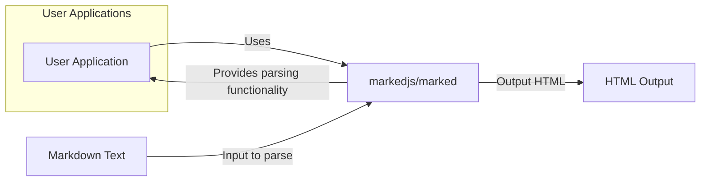
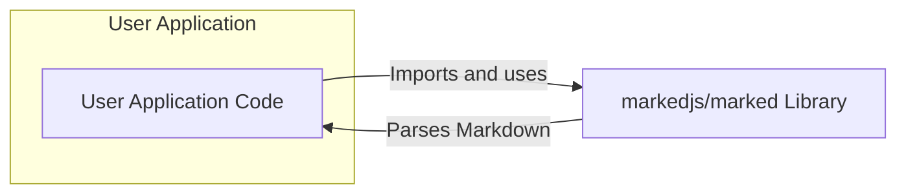
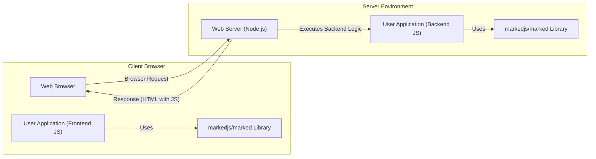

# BUSINESS POSTURE

This project, `markedjs/marked`, is a Javascript library for parsing Markdown into HTML.

- Business Priorities and Goals:
  - Provide a fast and accurate Markdown parsing library for Javascript environments.
  - Ensure broad compatibility across different Javascript environments (browsers, Node.js, etc.).
  - Maintainability and extensibility to adapt to evolving Markdown standards and user needs.
  - Security, ensuring the library does not introduce vulnerabilities when processing user-supplied Markdown.
  - Community adoption and active maintenance to ensure long-term viability.

- Business Risks:
  - Cross-Site Scripting (XSS) vulnerabilities if the parser incorrectly handles malicious Markdown input, allowing execution of arbitrary Javascript in user browsers. This is the most critical risk for a Markdown parser.
  - Denial of Service (DoS) vulnerabilities if specially crafted Markdown input can cause excessive resource consumption, making applications using `markedjs/marked` unresponsive.
  - Data breaches if `markedjs/marked` is used in server-side applications and vulnerabilities allow attackers to access sensitive data or gain unauthorized access.
  - Supply chain attacks if dependencies of `markedjs/marked` are compromised, potentially injecting malicious code into applications using the library.
  - Lack of maintenance and community support leading to stagnation and unaddressed security vulnerabilities over time.

# SECURITY POSTURE

- Existing Security Controls:
  - security control: Github repository with version control and issue tracking (https://github.com/markedjs/marked).
  - security control: Open source project with community contributions and peer review (https://github.com/markedjs/marked).
  - security control: Unit and integration tests to ensure functionality and potentially catch some basic input validation issues (inferred from standard software development practices).
  - accepted risk: Reliance on community contributions for security vulnerability discovery and patching, which can be slower than dedicated security teams.
  - accepted risk: Potential vulnerabilities in dependencies that are not actively monitored or patched.
  - accepted risk: Limited formal security testing or code audits specifically focused on security vulnerabilities.

- Recommended Security Controls:
  - security control: Implement automated Static Application Security Testing (SAST) in the CI/CD pipeline to detect potential code-level vulnerabilities.
  - security control: Implement automated Dependency Scanning to identify known vulnerabilities in third-party dependencies.
  - security control: Introduce fuzz testing to proactively discover input validation vulnerabilities by feeding the parser with a large volume of potentially malicious Markdown inputs.
  - security control: Conduct periodic security code reviews by security experts to identify and address potential vulnerabilities that automated tools might miss.
  - security control: Establish a clear vulnerability disclosure and response process to handle reported security issues effectively.

- Security Requirements:
  - Authentication: Not directly applicable to a Javascript library. Authentication is the responsibility of the applications using `markedjs/marked`.
  - Authorization: Not directly applicable to a Javascript library. Authorization is the responsibility of the applications using `markedjs/marked`.
  - Input Validation: Critical. `markedjs/marked` must rigorously validate and sanitize Markdown input to prevent injection attacks, especially XSS. This includes:
    - Encoding HTML entities properly.
    - Sanitizing or removing potentially dangerous HTML tags and attributes.
    - Handling edge cases and unexpected input formats robustly.
  - Cryptography: Not directly applicable to the core functionality of a Markdown parser. Cryptography might be relevant if features like encrypted Markdown extensions were to be added in the future, but not for the current scope.

# DESIGN

## C4 CONTEXT

- Context Diagram Elements:
  - Element 1:
    - Name: User Application
    - Type: Software System
    - Description: Any software application (web application, desktop application, mobile application, server-side application) that uses `markedjs/marked` to parse Markdown text.
    - Responsibilities:
      - Integrate `markedjs/marked` library.
      - Provide Markdown text as input to `markedjs/marked`.
      - Receive and use the HTML output generated by `markedjs/marked`.
      - Implement authentication and authorization for users and data within the application.
      - Handle and display the HTML output securely, preventing secondary injection vulnerabilities.
    - Security Controls:
      - security control: Input validation of user-provided Markdown before passing it to `markedjs/marked` (application-specific).
      - security control: Output encoding of HTML received from `markedjs/marked` before displaying it in the application (application-specific).
      - security control: Authentication and authorization mechanisms to control access to the application and its data (application-specific).

  - Element 2:
    - Name: markedjs/marked
    - Type: Software System / Javascript Library
    - Description: The `markedjs/marked` Javascript library, responsible for parsing Markdown formatted text into HTML.
    - Responsibilities:
      - Parse Markdown text according to Markdown specifications and extensions.
      - Generate valid and semantically correct HTML output.
      - Handle various Markdown syntax elements and edge cases.
      - Provide configuration options for parsing behavior and extensions.
      - Ensure secure parsing to prevent injection vulnerabilities.
    - Security Controls:
      - security control: Input validation and sanitization of Markdown text during parsing.
      - security control: Output encoding of generated HTML to prevent injection vulnerabilities.
      - security control: Unit and integration tests covering security-related edge cases and potential vulnerabilities.
      - security control: (Recommended) SAST and fuzz testing in development and CI/CD.

  - Element 3:
    - Name: Markdown Text
    - Type: Data
    - Description: Text written in Markdown format, provided as input to `markedjs/marked` for parsing.
    - Responsibilities:
      - Represent content in a human-readable and easily authorable format.
      - Can be user-provided or application-generated.
    - Security Controls:
      - security control: (Application responsibility) Input validation and sanitization before being processed by `markedjs/marked` if user-provided.

  - Element 4:
    - Name: HTML Output
    - Type: Data
    - Description: HTML formatted text generated by `markedjs/marked` as a result of parsing Markdown text.
    - Responsibilities:
      - Represent the parsed Markdown content in a format suitable for rendering in web browsers or other HTML rendering engines.
    - Security Controls:
      - security control: (Library responsibility) Output encoding to prevent injection vulnerabilities.
      - security control: (Application responsibility) Output encoding and sanitization before displaying to users to prevent secondary injection vulnerabilities.

## C4 CONTAINER

- Container Diagram Elements:
  - Element 1:
    - Name: User Application Code
    - Type: Software Container / Application Code
    - Description: The codebase of the application that integrates and uses the `markedjs/marked` library. This could be Javascript code running in a browser, Node.js server, or other Javascript environment.
    - Responsibilities:
      - Import and instantiate the `markedjs/marked` library.
      - Call `markedjs/marked` functions to parse Markdown text.
      - Handle the HTML output from `markedjs/marked`.
      - Manage application logic, user interface, data storage, and other application-specific functionalities.
    - Security Controls:
      - security control: Application-level authentication and authorization.
      - security control: Input validation of user inputs before using `markedjs/marked`.
      - security control: Output encoding of HTML from `markedjs/marked` before rendering.
      - security control: Secure coding practices in application code.

  - Element 2:
    - Name: markedjs/marked Library
    - Type: Software Container / Javascript Library
    - Description: The compiled and packaged `markedjs/marked` Javascript library, typically distributed via npm or similar package managers.
    - Responsibilities:
      - Provide Markdown parsing functionality as a reusable library.
      - Expose API for parsing Markdown text.
      - Implement parsing logic and algorithms.
      - Manage dependencies on other libraries (if any).
    - Security Controls:
      - security control: Input validation and sanitization within the library.
      - security control: Output encoding within the library.
      - security control: Security testing of the library code.
      - security control: (Recommended) Automated security scanning of library code and dependencies.

## DEPLOYMENT

Deployment is primarily about how the *user application* that *uses* `markedjs/marked` is deployed. `markedjs/marked` itself is a library and is "deployed" by being included in the user application's build and distributed with it.

Assuming a common deployment scenario where `markedjs/marked` is used in a web application:

- Deployment Diagram Elements:
  - Element 1:
    - Name: Web Browser
    - Type: Environment / Client Browser
    - Description: User's web browser where the frontend part of the web application and `markedjs/marked` (if used on the frontend) are executed.
    - Responsibilities:
      - Render the user interface of the web application.
      - Execute Javascript code, including the user application frontend code and `markedjs/marked` library (if used client-side).
      - Handle user interactions.
    - Security Controls:
      - security control: Browser security features (e.g., Content Security Policy, XSS protection).
      - security control: User's responsibility to keep browser updated and secure.

  - Element 2:
    - Name: User Application (Frontend JS)
    - Type: Software Component / Javascript Code
    - Description: Javascript code of the web application's frontend, running in the user's browser. May include `markedjs/marked` for client-side Markdown parsing.
    - Responsibilities:
      - Implement the user interface and frontend logic.
      - Use `markedjs/marked` to parse Markdown (if client-side parsing is implemented).
      - Communicate with the backend server.
    - Security Controls:
      - security control: Client-side input validation (if applicable).
      - security control: Secure coding practices in frontend Javascript.

  - Element 3:
    - Name: markedjs/marked Library (Client-side)
    - Type: Software Component / Javascript Library
    - Description: Instance of the `markedjs/marked` library included in the frontend Javascript bundle, running in the user's browser.
    - Responsibilities:
      - Parse Markdown text in the browser.
    - Security Controls:
      - security control: Input validation and output encoding within the library.

  - Element 4:
    - Name: Web Server (Node.js)
    - Type: Environment / Server Environment
    - Description: Node.js server environment hosting the backend part of the web application.
    - Responsibilities:
      - Host and serve the web application.
      - Execute backend application logic.
      - Run the backend part of the user application and `markedjs/marked` (if used server-side).
      - Handle HTTP requests and responses.
    - Security Controls:
      - security control: Server hardening and security configurations.
      - security control: Network security controls (firewalls, intrusion detection).
      - security control: Operating system and Node.js security updates.

  - Element 5:
    - Name: User Application (Backend JS)
    - Type: Software Component / Javascript Code
    - Description: Javascript code of the web application's backend, running on the Node.js server. May include `markedjs/marked` for server-side Markdown parsing.
    - Responsibilities:
      - Implement backend application logic.
      - Use `markedjs/marked` to parse Markdown (if server-side parsing is implemented).
      - Interact with databases or other backend services.
    - Security Controls:
      - security control: Server-side input validation.
      - security control: Secure coding practices in backend Javascript.
      - security control: Access control and authorization on the server.

  - Element 6:
    - Name: markedjs/marked Library (Server-side)
    - Type: Software Component / Javascript Library
    - Description: Instance of the `markedjs/marked` library installed on the server and used by the backend application code.
    - Responsibilities:
      - Parse Markdown text on the server.
    - Security Controls:
      - security control: Input validation and output encoding within the library.

## BUILD

```mermaid
flowchart LR
    A["Developer"] -->|Code Changes, Commit, Push| B["Version Control (GitHub)"]
    B -->|Webhook, Trigger| C["CI/CD System (GitHub Actions)"]
    C -->|Checkout Code, Install Dependencies| D["Build Environment"]
    D -->|Run Linters, SAST, Unit Tests| E["Security & Quality Checks"]
    E -->|Compile/Bundle, Package| F["Build Artifacts (JS Library)"]
    F -->|Publish to NPM Registry| G["Package Registry (NPM)"]
```

- Build Process Elements:
  - Element 1:
    - Name: Developer
    - Type: Human Role
    - Description: Software developer contributing code to the `markedjs/marked` project.
    - Responsibilities:
      - Write and maintain code for `markedjs/marked`.
      - Perform local testing and code quality checks.
      - Commit and push code changes to the version control system.
    - Security Controls:
      - security control: Developer training on secure coding practices.
      - security control: Code review process.
      - security control: Local development environment security.

  - Element 2:
    - Name: Version Control (GitHub)
    - Type: Service / Code Repository
    - Description: GitHub repository hosting the `markedjs/marked` source code and version history (https://github.com/markedjs/marked).
    - Responsibilities:
      - Store and manage source code.
      - Track code changes and versions.
      - Facilitate collaboration among developers.
      - Trigger CI/CD pipelines on code changes.
    - Security Controls:
      - security control: Access control to the repository (authentication and authorization).
      - security control: Audit logging of repository activities.
      - security control: Branch protection rules.

  - Element 3:
    - Name: CI/CD System (GitHub Actions)
    - Type: Service / Automation Platform
    - Description: GitHub Actions used for automated build, test, and deployment processes for `markedjs/marked`.
    - Responsibilities:
      - Automate the build process.
      - Run automated tests (unit, integration, security).
      - Perform code quality checks (linting, SAST).
      - Package and publish build artifacts.
    - Security Controls:
      - security control: Secure configuration of CI/CD pipelines.
      - security control: Access control to CI/CD workflows and secrets.
      - security control: Audit logging of CI/CD activities.
      - security control: Use of secure build environments.

  - Element 4:
    - Name: Build Environment
    - Type: Environment / Build Server
    - Description: Environment where the build process is executed, typically a containerized or virtualized environment managed by the CI/CD system.
    - Responsibilities:
      - Provide necessary tools and dependencies for building `markedjs/marked`.
      - Execute build scripts and commands.
      - Isolate build processes.
    - Security Controls:
      - security control: Hardened build environment.
      - security control: Regularly updated build tools and dependencies.
      - security control: Secure access to build environment.

  - Element 5:
    - Name: Security & Quality Checks
    - Type: Process / Automated Checks
    - Description: Automated checks performed during the build process to ensure code quality and security, including linters, SAST scanners, and unit tests.
    - Responsibilities:
      - Detect code style issues, potential bugs, and security vulnerabilities.
      - Enforce code quality standards.
      - Verify functionality through automated tests.
    - Security Controls:
      - security control: SAST tools to identify potential security vulnerabilities.
      - security control: Dependency scanning tools to identify vulnerable dependencies.
      - security control: Code linters to enforce code quality and style.
      - security control: Unit tests to verify functionality and catch regressions.

  - Element 6:
    - Name: Build Artifacts (JS Library)
    - Type: Data / Software Package
    - Description: Compiled and packaged Javascript library (`markedjs/marked`) produced by the build process, ready for distribution.
    - Responsibilities:
      - Contain the distributable version of the `markedjs/marked` library.
      - Be securely stored and transferred.
    - Security Controls:
      - security control: Integrity checks (e.g., checksums) of build artifacts.
      - security control: Secure storage of build artifacts before publishing.

  - Element 7:
    - Name: Package Registry (NPM)
    - Type: Service / Package Repository
    - Description: NPM registry (npmjs.com) where the `markedjs/marked` library is published and distributed for public consumption.
    - Responsibilities:
      - Host and distribute Javascript packages.
      - Provide package management tools (npm client).
      - Ensure package integrity and availability.
    - Security Controls:
      - security control: Package signing and verification.
      - security control: Malware scanning of published packages.
      - security control: Access control to package publishing.

# RISK ASSESSMENT

- Critical Business Processes:
  - Parsing Markdown text accurately and reliably.
  - Preventing security vulnerabilities, especially XSS, in the parsed HTML output.
  - Maintaining the library's functionality and security over time.
  - Ensuring availability and accessibility of the library through package registries.

- Data to Protect and Sensitivity:
  - Markdown Input: Sensitivity depends on the context of use. If processing user-generated content, it can be considered sensitive as it might contain personal or confidential information. The primary concern is not data confidentiality of the Markdown itself, but rather preventing malicious Markdown from causing harm.
  - HTML Output:  Sensitivity is derived from the Markdown input. If the Markdown input is sensitive, the HTML output might also be considered sensitive. However, the main security concern with HTML output is integrity and preventing injection vulnerabilities.
  - Source Code: Sensitive as it represents the intellectual property and contains the logic of the `markedjs/marked` library. Confidentiality and integrity of the source code are important to prevent unauthorized modifications or disclosure.
  - Build Artifacts (JS Library Package): Sensitive in terms of integrity. Malicious modification of the published package could have widespread impact on applications using `markedjs/marked`.

# QUESTIONS & ASSUMPTIONS

- BUSINESS POSTURE:
  - Question: What are the primary use cases for `markedjs/marked`? Is it primarily used in browser-based applications, server-side applications, or both?
  - Assumption: `markedjs/marked` is used in both browser-based and server-side Javascript environments.
  - Question: What are the performance requirements for `markedjs/marked`? Is speed of parsing a critical factor?
  - Assumption: Performance is important, but security and accuracy are higher priorities.

- SECURITY POSTURE:
  - Question: What security testing is currently performed on `markedjs/marked`? Are there any existing SAST, DAST, or fuzzing processes?
  - Assumption: Current security testing is primarily based on unit and integration tests, with limited dedicated security testing processes.
  - Question: Is there a documented vulnerability disclosure and response process for `markedjs/marked`?
  - Assumption: A formal vulnerability disclosure process may not be explicitly documented but likely follows standard open-source project practices of using GitHub issues and pull requests.
  - Question: Are there any known past security vulnerabilities in `markedjs/marked`?
  - Assumption:  Need to review the project's issue history and security advisories to determine if there are known past vulnerabilities and how they were addressed.

- DESIGN:
  - Question: Are there any specific Markdown extensions or non-standard Markdown features that `markedjs/marked` needs to support?
  - Assumption: `markedjs/marked` aims to support standard Markdown and common extensions, but specific requirements might vary depending on user needs.
  - Question: Are there any dependencies on other Javascript libraries?
  - Assumption: `markedjs/marked` likely has minimal dependencies to reduce its footprint and potential attack surface, but this needs to be verified.
  - Question: Is client-side parsing the primary use case, or is server-side parsing equally or more important?
  - Assumption: Both client-side and server-side parsing are important use cases.