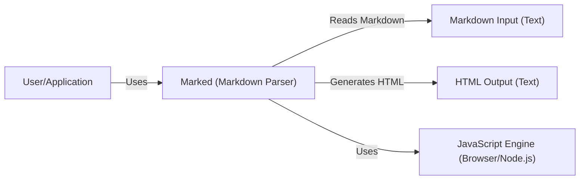
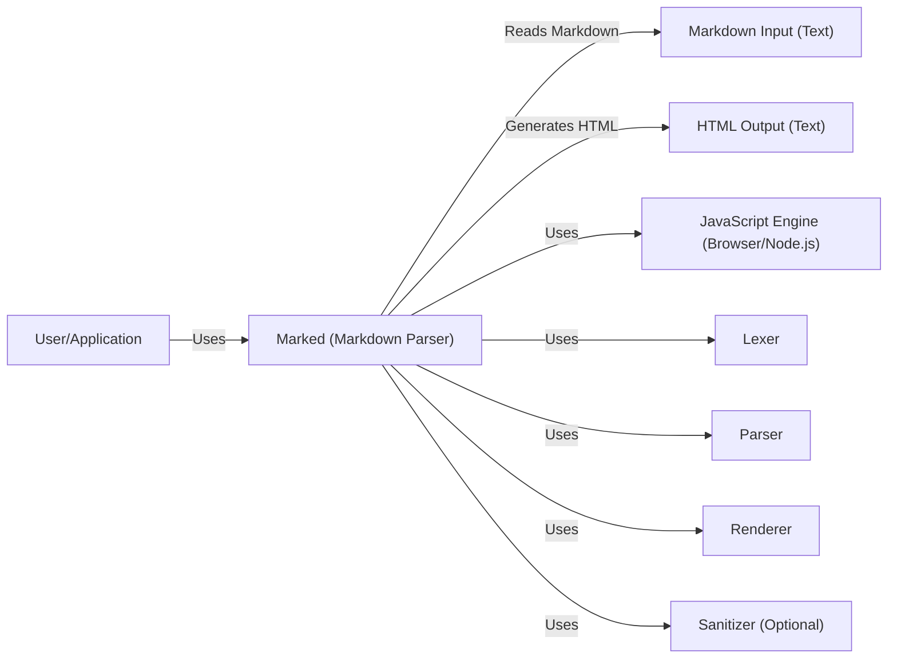
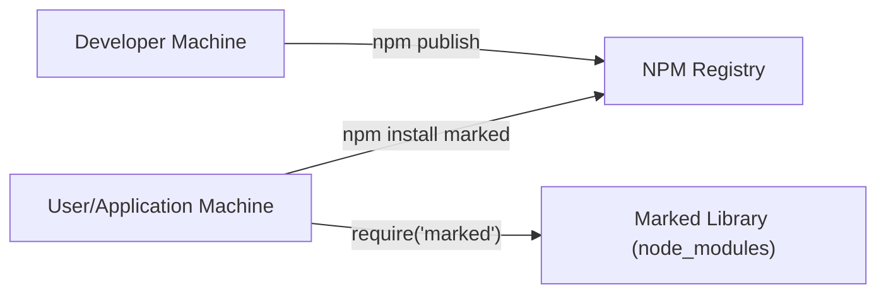
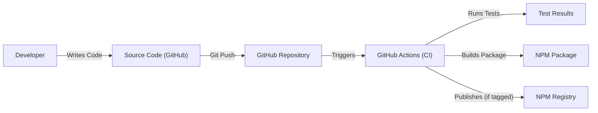

Okay, let's create a design document for the `marked` project, a Markdown parser and compiler.

# BUSINESS POSTURE

Business Priorities and Goals:

*   Provide a fast and reliable Markdown parsing library for JavaScript developers.
*   Maintain a low barrier to entry for contributors and users.
*   Ensure compatibility with various JavaScript environments (browsers, Node.js, etc.).
*   Offer a robust and extensible API for customization.
*   Maintain high code quality and test coverage.
*   Be a good open source citizen, responsive to community feedback and contributions.

Most Important Business Risks:

*   Inconsistent parsing behavior leading to unexpected output and potential security vulnerabilities in applications using `marked`.
*   Performance bottlenecks impacting the usability of applications relying on `marked` for large Markdown documents.
*   Lack of maintenance and updates, leading to security vulnerabilities and compatibility issues with newer JavaScript versions or Markdown specifications.
*   Lack of community trust due to unresponsiveness or poor handling of reported issues.
*   Introduction of breaking changes without proper versioning and communication, disrupting existing applications.

# SECURITY POSTURE

Existing Security Controls:

*   security control: Regular Expressions: `marked` heavily relies on regular expressions for parsing Markdown syntax. (Implemented in the source code, primarily in the lexer.)
*   security control: Test Suite: `marked` has an extensive test suite to ensure correct parsing and prevent regressions. (Described in the `test` directory of the repository.)
*   security control: Sanitization (optional): `marked` provides an optional `sanitize` option and a `sanitizer` function to help prevent XSS vulnerabilities by sanitizing the output HTML. (Documented in the README and implemented in the code.)
*   security control: Community Scrutiny: As an open-source project, `marked` benefits from community scrutiny, with users reporting potential issues and vulnerabilities.
*   security control: Dependency Management: `marked` has minimal external dependencies, reducing the attack surface. (Visible in `package.json`.)

Accepted Risks:

*   accepted risk: Complex Regular Expressions: The complexity of regular expressions used for parsing can potentially lead to ReDoS (Regular Expression Denial of Service) vulnerabilities if not carefully crafted and tested.
*   accepted risk: User-Provided Sanitizer: If users provide their own custom sanitizer function, it's their responsibility to ensure its effectiveness. `marked` itself cannot guarantee the security of custom sanitizers.
*   accepted risk: HTML in Markdown: Markdown inherently allows raw HTML. While `marked` offers sanitization, it's ultimately up to the user to decide how to handle raw HTML and its potential security implications.

Recommended Security Controls:

*   security control: Regular Expression Fuzzing: Implement fuzzing tests specifically targeting the regular expressions used in `marked` to identify potential ReDoS vulnerabilities.
*   security control: Content Security Policy (CSP) Guidance: Provide clear guidance in the documentation on how to use `marked` securely in conjunction with Content Security Policy (CSP) to mitigate XSS risks.
*   security control: Automated Dependency Updates: Integrate a tool like Dependabot or Renovate to automatically update dependencies and address potential security vulnerabilities in those dependencies.

Security Requirements:

*   Authentication: Not directly applicable to `marked` itself, as it's a library. However, applications using `marked` should implement proper authentication mechanisms.
*   Authorization: Not directly applicable to `marked` itself. Applications using `marked` should implement appropriate authorization controls.
*   Input Validation: `marked` performs input validation by parsing the Markdown syntax according to its defined grammar. However, it's crucial to validate the *output* of `marked` (the generated HTML) if it's being displayed to users, especially if the input Markdown comes from untrusted sources.
*   Cryptography: Not directly applicable to `marked` in most cases. If `marked` is used to process encrypted content, the application using it should handle the cryptography separately.
*   Output Encoding: `marked` should properly escape characters in the generated HTML to prevent XSS vulnerabilities. The built-in sanitizer (when enabled) should handle this, but custom sanitizers need careful attention.

# DESIGN

## C4 CONTEXT

Element Descriptions:

*   Element:
    *   Name: User/Application
    *   Type: Person/System
    *   Description: A user or an application that utilizes the `marked` library to parse Markdown text.
    *   Responsibilities: Provides Markdown input to `marked`, receives and uses the generated HTML output.
    *   Security controls: Should implement appropriate security measures, such as input validation and output encoding, when handling the output from `marked`, especially if the Markdown input comes from untrusted sources.

*   Element:
    *   Name: Marked (Markdown Parser)
    *   Type: System
    *   Description: The `marked` library itself, a Markdown parser and compiler.
    *   Responsibilities: Parses Markdown input, generates HTML output, provides options for customization and sanitization.
    *   Security controls: Uses regular expressions for parsing, includes a test suite, offers optional sanitization, and benefits from community scrutiny.

*   Element:
    *   Name: Markdown Input (Text)
    *   Type: Data
    *   Description: The Markdown text that is provided as input to `marked`.
    *   Responsibilities: N/A
    *   Security controls: N/A

*   Element:
    *   Name: HTML Output (Text)
    *   Type: Data
    *   Description: The HTML text generated by `marked` from the Markdown input.
    *   Responsibilities: N/A
    *   Security controls: N/A

*   Element:
    *   Name: JavaScript Engine (Browser/Node.js)
    *   Type: System
    *   Description: The JavaScript runtime environment in which `marked` is executed (e.g., a web browser or Node.js).
    *   Responsibilities: Executes the `marked` code.
    *   Security controls: The security of the JavaScript engine itself is outside the scope of `marked`.

## C4 CONTAINER

Element Descriptions:

*  All elements from C4 CONTEXT diagram, plus:

*   Element:
    *   Name: Lexer
    *   Type: Component
    *   Description: The component responsible for tokenizing the Markdown input.
    *   Responsibilities: Breaks down the Markdown text into a stream of tokens.
    *   Security controls: Uses regular expressions extensively. Should be carefully reviewed and tested for ReDoS vulnerabilities.

*   Element:
    *   Name: Parser
    *   Type: Component
    *   Description: The component responsible for parsing the token stream into an abstract syntax tree (AST).
    *   Responsibilities: Interprets the tokens and creates a structured representation of the Markdown document.
    *   Security controls: Relies on the correctness of the lexer.

*   Element:
    *   Name: Renderer
    *   Type: Component
    *   Description: The component responsible for generating HTML output from the AST.
    *   Responsibilities: Traverses the AST and produces the corresponding HTML.
    *   Security controls: Should ensure proper escaping of characters to prevent XSS.

*   Element:
    *   Name: Sanitizer (Optional)
    *   Type: Component
    *   Description: An optional component that sanitizes the generated HTML to prevent XSS vulnerabilities.
    *   Responsibilities: Removes or escapes potentially dangerous HTML tags and attributes.
    *   Security controls: Crucial for security when handling untrusted Markdown input. The built-in sanitizer should be robust, but custom sanitizers require careful attention.

## DEPLOYMENT

Possible Deployment Solutions:

1.  **npm Package:**  `marked` is primarily distributed as an npm package.  Users install it via `npm install marked` and then `require` or `import` it into their JavaScript code. This is the most common deployment method.
2.  **CDN:**  `marked` can be included directly in web pages via a CDN (Content Delivery Network) like jsDelivr or unpkg. This avoids the need for local installation.
3.  **Bundled with Application:** `marked` can be bundled with a web application using tools like Webpack, Rollup, or Parcel. This creates a self-contained application package.

Chosen Deployment Solution (npm Package):

Element Descriptions:

*   Element:
    *   Name: Developer Machine
    *   Type: System
    *   Description: The machine used by the `marked` developers to create and publish the library.
    *   Responsibilities: Runs tests, builds the package, and publishes it to the npm registry.
    *   Security controls: Should have appropriate security measures in place to prevent unauthorized access and code modification.

*   Element:
    *   Name: NPM Registry
    *   Type: System
    *   Description: The public npm registry where `marked` is hosted.
    *   Responsibilities: Stores and distributes the `marked` package.
    *   Security controls: npm itself has security measures to protect against malicious packages, but users should still verify the integrity of downloaded packages.

*   Element:
    *   Name: User/Application Machine
    *   Type: System
    *   Description: The machine where a user or application installs and uses `marked`.
    *   Responsibilities: Downloads `marked` from the npm registry, installs it, and runs the application code that uses it.
    *   Security controls: Should have appropriate security measures in place to protect against malicious code.

*   Element:
    *   Name: Marked Library (node_modules)
    *   Type: System
    *   Description: The installed `marked` library within the `node_modules` directory of the user's project.
    *   Responsibilities: Provides the Markdown parsing functionality.
    *   Security controls: Relies on the security of the npm installation process and the integrity of the downloaded package.

## BUILD

Build Process Description:

1.  **Code Development:** Developers write code and commit it to the `marked` repository on GitHub.
2.  **Continuous Integration:** GitHub Actions is used as the CI/CD system. When code is pushed to the repository (or a pull request is created), GitHub Actions automatically triggers a workflow.
3.  **Testing:** The workflow runs the test suite using `npm test`. This includes unit tests and potentially integration tests.
4.  **Building:** If the tests pass, the workflow builds the `marked` package. This likely involves transpiling the code (if necessary) and preparing it for distribution.
5.  **Publishing (Conditional):** If the commit is tagged (indicating a new release), the workflow publishes the package to the npm registry using `npm publish`.

Security Controls in Build Process:

*   security control: GitHub Actions: Using a CI/CD system like GitHub Actions ensures that tests are run automatically on every code change, preventing regressions and catching potential issues early.
*   security control: Test Suite: The extensive test suite is a crucial security control, ensuring that the parser behaves as expected and doesn't introduce vulnerabilities.
*   security control: Automated Dependency Updates: Tools like Dependabot (integrated with GitHub) can automatically create pull requests to update dependencies, addressing potential security vulnerabilities in those dependencies.
*   security control: Code Review: The pull request process on GitHub enforces code review, allowing other developers to scrutinize changes for potential security issues before they are merged.
*   security control: Linting: `marked` uses ESLint to enforce code style and identify potential errors, including some security-related issues. (Described in `.eslintrc.js`.)

# RISK ASSESSMENT

Critical Business Processes to Protect:

*   Accurate and consistent Markdown parsing.
*   Maintaining the availability and performance of the library.
*   Preserving the trust and reputation of the `marked` project.

Data to Protect and Sensitivity:

*   **Source Code:** The `marked` source code itself is publicly available on GitHub. While not sensitive in the traditional sense, its integrity is crucial. Unauthorized modifications could introduce vulnerabilities. Sensitivity: Medium (due to the potential impact of malicious modifications).
*   **Markdown Input (from users of applications using `marked`):** This data is not directly handled by `marked` itself, but by the applications that use it. The sensitivity of this data depends entirely on the application. `marked` should be treated as a potential attack vector if the input is untrusted. Sensitivity: Variable (depends on the application).
*   **HTML Output (generated by `marked`):** This data is generated by `marked`. If the input Markdown is untrusted, the HTML output could contain malicious code (XSS). Sensitivity: Variable (depends on the application and whether sanitization is used).
*   **NPM Credentials:** The credentials used to publish `marked` to the npm registry are highly sensitive. Compromise of these credentials could allow an attacker to publish a malicious version of the library. Sensitivity: High.

# QUESTIONS & ASSUMPTIONS

Questions:

*   Are there any specific security certifications or compliance requirements that `marked` needs to adhere to (e.g., for use in specific industries)?
*   What is the expected threat model for applications using `marked`? Are they primarily processing trusted or untrusted Markdown input?
*   What is the process for handling security vulnerability reports? Is there a security policy or contact information?
*   Are there any plans to add features that might introduce new security considerations (e.g., support for custom extensions)?

Assumptions:

*   BUSINESS POSTURE: The primary goal is to provide a reliable and performant Markdown parser, with security being a high priority but not necessarily the *absolute* highest (e.g., compared to a security-critical library like a cryptographic implementation).
*   SECURITY POSTURE: The existing security controls (test suite, optional sanitization) are considered adequate for many use cases, but there's room for improvement (e.g., ReDoS fuzzing).
*   DESIGN: The design is relatively straightforward, with the core components being the lexer, parser, and renderer. The optional sanitizer is a key security component. The deployment model is standard for a JavaScript library (npm package). The build process relies on GitHub Actions for CI/CD.
*   It's assumed that users of `marked` are responsible for the security of their own applications, including how they handle the output of `marked`. `marked` provides tools (like sanitization) to help, but it's ultimately the user's responsibility to use them correctly.