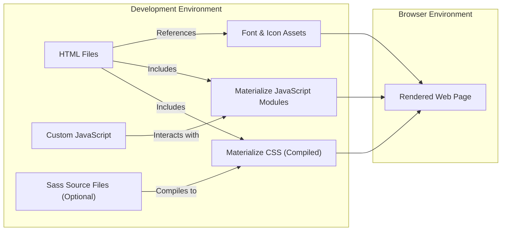
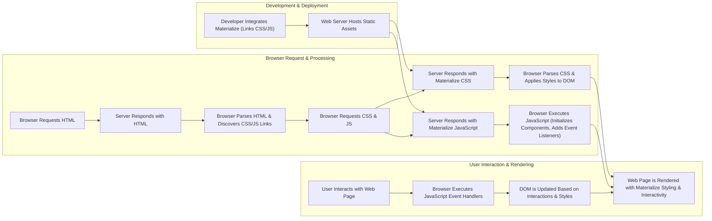

# Project Design Document: Materialize CSS Framework

**Revision History:**

* **Version 1.0:** Initial Draft - [Date: October 26, 2023]
* **Version 1.1:** Improved Draft - [Date: October 27, 2023]

## 1. Introduction

This document details the design of the Materialize CSS framework, an open-source project located at [https://github.com/Dogfalo/materialize](https://github.com/Dogfalo/materialize). This document serves as a foundational reference for understanding the framework's architectural design, core components, and data flow mechanisms. This understanding is crucial for conducting effective threat modeling activities. Materialize is a responsive front-end framework adhering to Material Design principles, offering pre-built CSS styles and optional JavaScript components to facilitate the development of visually consistent and modern web applications.

## 2. Goals and Objectives

The primary design goals of Materialize are to:

* **Implement Material Design:** Provide a readily available implementation of Google's Material Design specification for web interfaces.
* **Promote Reusability:** Offer a comprehensive library of reusable and composable UI components.
* **Ensure Responsiveness:** Deliver a fluid and adaptable layout system that functions seamlessly across various screen sizes and devices.
* **Simplify Styling:** Abstract away complex CSS implementation details, allowing developers to focus on application logic.
* **Enhance Interactivity (Optional):** Provide optional JavaScript enhancements for richer user interactions.
* **Facilitate Customization:** Offer a structure that allows developers to customize the framework's appearance and behavior.

## 3. System Architecture

Materialize's architecture is structured around distinct modules that work together to provide its functionality:

* **Core CSS Styles:**  The foundational CSS rules defining the basic appearance of HTML elements and the grid system.
* **Component-Specific CSS:**  CSS classes dedicated to styling individual UI components (e.g., buttons, cards, navigation).
* **JavaScript Modules:**  Independent JavaScript files responsible for the behavior and interactivity of specific components.
* **Sass Preprocessing:** The framework is developed using Sass, enabling modularity, maintainability, and theming capabilities. While not directly deployed, it's integral to the development process.
* **Static Assets:**  Includes font files (Roboto) and icon sets (Material Design Icons) that are served as static resources.
* **Documentation Structure:** The documentation itself is a web application demonstrating the usage of the framework.

A refined architectural diagram is shown below, emphasizing the separation of concerns:

## 4. Component Description

This section provides a more detailed breakdown of Materialize's key components and their functionalities:

* **Core CSS Framework (`materialize.css`):**
    * **Base Styles:** Defines default styles for standard HTML elements (typography, links, lists, etc.), providing a consistent baseline.
    * **Grid System:** Implements a responsive, mobile-first 12-column grid layout system using CSS classes. This allows for flexible and adaptable layouts.
    * **Utility Classes:** Offers a collection of helper classes for common styling adjustments (e.g., colors, spacing, visibility, float management).
* **Component-Specific CSS (within `materialize.css`):**
    * **UI Component Styles:** Provides pre-defined CSS classes for styling various UI elements such as buttons, cards, forms, navigation bars, modals, tabs, and more. Each component has a specific set of CSS classes to control its appearance.
* **JavaScript Modules (`materialize.js` or individual component files):**
    * **Component Initialization:** JavaScript code that automatically initializes interactive components when the DOM is ready, often based on specific CSS classes applied to HTML elements.
    * **Interactive Logic:** Implements the dynamic behavior of components like modals (opening/closing), dropdowns (showing/hiding), collapsibles (expanding/contracting), and more. This involves event listeners and DOM manipulation.
    * **Plugin System (Implicit):** While not a formal plugin system, the modular nature of the JavaScript allows for selective inclusion of component functionalities.
* **Sass Source Files (`.scss`):**
    * **Variables:** Centralized definitions for design tokens like colors, fonts, breakpoints, and spacing units, facilitating theming and consistency.
    * **Mixins:** Reusable blocks of Sass code that encapsulate common CSS patterns, reducing redundancy and improving maintainability.
    * **Partials:**  Modular Sass files organized by component or functionality, promoting a structured codebase.
    * **Main Sass File:**  The entry point for compiling the entire CSS framework, importing all necessary partials.
* **Font and Icon Assets:**
    * **Roboto Font:** The default typeface used by Materialize, typically included as local font files or linked from a CDN.
    * **Material Design Icons:** A comprehensive set of icons adhering to the Material Design guidelines, often included as a font or SVG sprites.
* **Documentation (Website):**
    * **HTML Structure:** Demonstrates the correct usage and implementation of Materialize components through example HTML markup.
    * **CSS Styling:**  Styles the documentation website itself, often using Materialize components to showcase their capabilities.
    * **JavaScript Enhancements:** May include JavaScript for interactive elements within the documentation, such as code highlighting or live previews.
    * **Asset Delivery:**  Hosts and serves the CSS, JavaScript, font, and icon files necessary for the documentation website.

## 5. Data Flow Diagram

The primary data flow in the context of using Materialize involves the delivery and processing of static assets (CSS, JavaScript, fonts, icons) to the browser and their subsequent application to render the web page.

**Detailed Data Flow:**

1. **Integration:** Developers include Materialize's CSS and JavaScript files in their HTML, typically using `<link>` and `<script>` tags.
2. **Asset Hosting:** A web server is configured to host the `materialize.css`, `materialize.js`, font files, and icon assets.
3. **HTML Request:** A user's browser requests the HTML file of the web page.
4. **HTML Response:** The web server sends the HTML content to the browser.
5. **Resource Discovery:** The browser parses the HTML and identifies links to external CSS and JavaScript files.
6. **Asset Requests:** The browser sends separate requests to the web server for the `materialize.css` and `materialize.js` files.
7. **CSS Delivery & Processing:** The server responds with the `materialize.css` file. The browser parses the CSS rules and applies them to the Document Object Model (DOM), styling the HTML elements.
8. **JavaScript Delivery & Execution:** The server responds with the `materialize.js` file. The browser executes this JavaScript code. This execution typically involves:
    * Identifying HTML elements with specific Materialize CSS classes.
    * Initializing the corresponding JavaScript components, adding necessary event listeners.
9. **Rendering:** The browser renders the web page, incorporating the styles from the CSS and the interactive behavior provided by the JavaScript.
10. **User Interaction:** The user interacts with the web page (e.g., clicks a button, opens a dropdown).
11. **Event Handling:** The browser executes the JavaScript event handlers associated with the interacted element.
12. **DOM Update:** The JavaScript code may manipulate the DOM based on the user interaction, updating the page's content or appearance.
13. **Re-rendering:** The browser re-renders the affected parts of the web page to reflect the changes.

## 6. Dependencies

Materialize relies on the following:

* **Web Browser (Runtime):**  A modern web browser that supports CSS (including features like flexbox and grid) and JavaScript is the fundamental runtime environment.
* **Sass Compiler (Development):**  To modify or rebuild the CSS framework from its source, a Sass compiler (like Dart Sass or LibSass) is required.
* **Roboto Font (Included):**  The default font, which needs to be accessible to the browser (either locally hosted or via a CDN).
* **Material Design Icons (Included):** The icon set, similarly requiring accessibility for the browser.

## 7. Security Considerations (Initial)

This section outlines initial security considerations relevant to Materialize, serving as a starting point for more in-depth threat modeling.

* **Cross-Site Scripting (XSS) Vulnerabilities:**
    * **Risk:**  Improper handling of user-supplied data within JavaScript components could lead to XSS vulnerabilities if this data is directly injected into the DOM without sanitization.
    * **Mitigation:**  Developers using Materialize must be vigilant about sanitizing user input before rendering it. Review Materialize's JavaScript code for potential XSS sinks. Utilize browser security features like Content Security Policy (CSP).
* **Dependency Chain Risks:**
    * **Risk:** Vulnerabilities in the included Roboto font files or Material Design Icon files could potentially be exploited by attackers.
    * **Mitigation:** Keep Materialize and its included assets up-to-date. Monitor security advisories related to these dependencies. Consider using Subresource Integrity (SRI) hashes for CDN-hosted assets.
* **Content Security Policy (CSP) Misconfiguration:**
    * **Risk:**  A poorly configured CSP might not adequately protect against XSS attacks or could prevent Materialize's assets from loading correctly, leading to a broken application.
    * **Mitigation:**  Developers should implement a strict CSP that allows only necessary resources.
* **Subresource Integrity (SRI) Absence:**
    * **Risk:** If Materialize's CSS and JavaScript files are loaded from a CDN without SRI hashes, there's a risk of a compromised CDN serving malicious code.
    * **Mitigation:**  Use SRI hashes when including Materialize from a CDN to ensure the integrity of the loaded files.
* **Denial of Service (DoS) through Excessive Customization:**
    * **Risk:** While less direct, overly complex or inefficient CSS customizations could potentially impact page load times and contribute to a perceived DoS for users with limited bandwidth or processing power.
    * **Mitigation:**  Optimize CSS customizations and avoid overly complex selectors or rules.
* **Third-Party CDN Compromise:**
    * **Risk:** If Materialize is loaded from a third-party CDN, the security of the application is dependent on the security of that CDN provider.
    * **Mitigation:**  Choose reputable CDN providers with strong security practices. Consider self-hosting Materialize's assets for greater control.
* **Incorrect or Insecure Usage of JavaScript Components:**
    * **Risk:** Developers might misuse Materialize's JavaScript components in ways that introduce vulnerabilities (e.g., insecure event handling, improper data handling).
    * **Mitigation:**  Adhere to best practices for secure JavaScript development. Thoroughly understand the functionality and potential security implications of each Materialize component.
* **CSS Injection Attacks:**
    * **Risk:** While less common than XSS, attackers might try to inject malicious CSS to alter the appearance of the website in a harmful way (e.g., phishing attacks).
    * **Mitigation:**  Sanitize any user-controlled data that influences CSS styles. Implement a strong CSP.

## 8. Future Considerations

* **Component Evolution and Security Audits:** As Materialize evolves and new components are added, regular security audits should be conducted to identify and address potential vulnerabilities.
* **Framework Updates and Patching:** Staying up-to-date with the latest versions of Materialize is crucial for benefiting from security patches and improvements.
* **Accessibility and Security Overlap:**  Improvements in accessibility often align with security best practices (e.g., semantic HTML reduces reliance on potentially vulnerable JavaScript).
* **Integration with Modern Web Security Standards:** Future versions could explore tighter integration with emerging web security standards and browser features.

This improved design document provides a more detailed and nuanced understanding of the Materialize CSS framework, enhancing its value as a foundation for subsequent threat modeling activities.