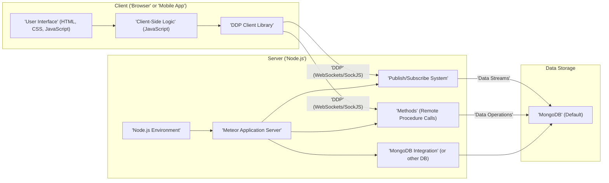
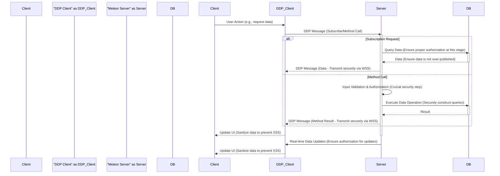

# Project Design Document: Meteor Framework - Enhanced for Threat Modeling

**Version:** 1.1
**Date:** October 26, 2023
**Author:** AI Software Architect

## 1. Introduction

This document provides an enhanced architectural overview of the Meteor JavaScript framework, based on its open-source repository at [https://github.com/meteor/meteor](https://github.com/meteor/meteor). This revised document is specifically tailored to facilitate threat modeling by providing a clear understanding of the system's components, interactions, data flows, and potential security vulnerabilities.

## 2. Goals and Objectives (with Security Context)

The core goals of the Meteor framework, with an emphasis on their security implications, are:

*   **Full-Stack JavaScript Platform:** To provide a unified environment, reducing context switching but potentially increasing the attack surface if vulnerabilities exist in shared components.
*   **Rapid Development:** To accelerate development, but potentially leading to shortcuts in security practices if not carefully managed.
*   **Real-time Data Synchronization:** To offer seamless updates, but requiring careful consideration of data access controls and potential for information leakage.
*   **Simplified Development:** To abstract complexity, but potentially hiding underlying security mechanisms that developers might overlook.
*   **Reactive Programming:** To enable dynamic UIs, but requiring careful handling of data binding to prevent unintended data exposure or manipulation.

## 3. High-Level Architecture

Meteor employs a client-server architecture with a strong focus on real-time data synchronization via DDP. This architecture presents various points of interaction that need to be considered for security.

**Key Components and Security Relevance:**

*   **Client ('Browser' or 'Mobile App'):** The entry point for user interaction, making it a prime target for attacks like XSS.
    *   **'User Interface' (HTML, CSS, JavaScript):** Renders the application. Vulnerable to XSS if not properly sanitized.
    *   **'Client-Side Logic' (JavaScript):** Handles user interactions and data manipulation. Sensitive logic here could be reverse-engineered or exploited.
    *   **'DDP Client Library':** Manages communication with the server. Security depends on secure connection establishment and proper authentication.

*   **Server ('Node.js'):** The core of the application, responsible for data access and business logic. Vulnerabilities here can have significant impact.
    *   **'Meteor Application Server':** Handles requests and manages the application lifecycle. Needs protection against common web server vulnerabilities.
    *   **'Publish/Subscribe System':** Controls real-time data flow. Improperly configured publications can lead to data leaks.
    *   **'Methods' (Remote Procedure Calls):** Allows clients to execute server-side code. Requires strict authorization and input validation to prevent abuse.
    *   **'MongoDB Integration' (or other DB):**  Facilitates database interaction. Vulnerable to NoSQL injection if not handled carefully.
    *   **'Node.js Environment':** The runtime environment. Outdated versions or vulnerable dependencies can be exploited.

*   **Data Storage:** The persistent storage layer. Requires robust access controls and encryption.
    *   **'MongoDB' (Default):** Stores application data. Security depends on proper authentication, authorization, and potentially encryption at rest.

## 4. Component Details (Enhanced for Security)

### 4.1. Client-Side Components

*   **'User Interface' (HTML, CSS, JavaScript):**
    *   **Functionality:** Renders the user interface and handles user interactions.
    *   **Security Considerations:**
        *   **Cross-Site Scripting (XSS):**  Vulnerable if user-provided data is not properly sanitized before being rendered. Attackers can inject malicious scripts to steal cookies, redirect users, or perform actions on their behalf.
        *   **Content Security Policy (CSP):**  Implementing a strong CSP is crucial to mitigate XSS risks by controlling the sources from which the browser is allowed to load resources.
        *   **Dependency Vulnerabilities:** Client-side libraries and frameworks can have known vulnerabilities that need to be addressed through regular updates.

*   **'Client-Side Logic' (JavaScript):**
    *   **Functionality:** Implements application logic, manages local state, and interacts with the DDP client.
    *   **Security Considerations:**
        *   **Sensitive Data Exposure:** Avoid storing sensitive information directly in client-side code or local storage without proper encryption.
        *   **Logic Manipulation:**  While harder to directly exploit, poorly written client-side logic could potentially be manipulated to bypass intended workflows.
        *   **Third-Party Library Vulnerabilities:**  Ensure all client-side dependencies are up-to-date and free from known security flaws.

*   **'DDP Client Library':**
    *   **Functionality:** Establishes and maintains a connection with the Meteor server, handles DDP message serialization and deserialization, manages subscriptions and method calls.
    *   **Security Considerations:**
        *   **Insecure Connection:** Ensure connections are established over HTTPS/WSS to protect data in transit from eavesdropping and manipulation.
        *   **Authentication Bypass:**  The authentication mechanism used with DDP needs to be robust to prevent unauthorized access.
        *   **Man-in-the-Middle Attacks:**  Without secure connections, attackers could intercept and modify DDP messages.

### 4.2. Server-Side Components

*   **'Meteor Application Server':**
    *   **Functionality:**  Handles incoming client requests, manages DDP connections, executes server-side code, and orchestrates data flow.
    *   **Security Considerations:**
        *   **Web Server Vulnerabilities:**  Susceptible to common web server attacks like injection flaws (SQL/NoSQL), cross-site scripting (if rendering server-side templates), and denial-of-service attacks.
        *   **Configuration Errors:**  Misconfigured server settings can expose sensitive information or create vulnerabilities.
        *   **Resource Exhaustion:**  Without proper safeguards, the server could be overwhelmed by excessive requests.

*   **'Publish/Subscribe System':**
    *   **Functionality:** Allows the server to publish subsets of data and clients to subscribe to specific datasets, enabling real-time updates.
    *   **Security Considerations:**
        *   **Over-Publication:**  Publishing more data than necessary can lead to information leakage to unauthorized clients.
        *   **Insecure Subscription Logic:**  Vulnerabilities in the logic that determines which data is published to which clients can be exploited to gain access to sensitive information.
        *   **Denial of Service:**  Malicious clients could subscribe to a large number of publications to overload the server.

*   **'Methods' (Remote Procedure Calls):**
    *   **Functionality:** Provides a mechanism for clients to execute specific functions on the server.
    *   **Security Considerations:**
        *   **Insecure Direct Object References:**  Ensure that clients cannot directly access or manipulate data objects without proper authorization checks within the method.
        *   **Input Validation Failures:**  Methods must rigorously validate all input parameters to prevent injection attacks and other forms of malicious input.
        *   **Authorization Bypass:**  Implement robust authorization checks within each method to ensure that only authorized users can execute specific actions.

*   **'MongoDB Integration' (or other DB):**
    *   **Functionality:**  Manages the connection to the database and provides an interface for data interaction.
    *   **Security Considerations:**
        *   **NoSQL Injection:**  Improperly constructed database queries based on user input can lead to unauthorized data access or manipulation.
        *   **Database Credential Exposure:**  Securely store and manage database credentials to prevent unauthorized access.
        *   **Insufficient Access Controls:**  Implement the principle of least privilege when granting database access to the Meteor application.

*   **'Node.js Environment':**
    *   **Functionality:** Provides the runtime environment for the Meteor server and manages dependencies.
    *   **Security Considerations:**
        *   **Dependency Vulnerabilities:**  Regularly audit and update Node.js dependencies to patch known security flaws. Use tools like `npm audit` or `yarn audit`.
        *   **Outdated Node.js Version:**  Using an outdated version of Node.js can expose the application to known vulnerabilities in the runtime environment itself.
        *   **Supply Chain Attacks:** Be cautious about the dependencies you include and their provenance.

## 5. Data Flow (with Security Implications)

The data flow highlights critical points where security measures are necessary to protect data integrity and confidentiality.

**Security Implications in Data Flow:**

*   **Client to Server Communication:**  Must be secured using HTTPS/WSS to prevent eavesdropping and tampering.
*   **Server-Side Input Validation:**  All data received from the client must be rigorously validated before being used in any operations, especially database queries.
*   **Authorization Checks:**  Every data access and modification request must be authorized to ensure that users only have access to the data they are permitted to see and modify.
*   **Database Interactions:**  Database queries must be constructed carefully to prevent injection attacks. Access to the database should be restricted based on the principle of least privilege.
*   **Real-time Updates:**  The publish/subscribe system needs to enforce authorization to prevent unauthorized clients from receiving sensitive data updates.
*   **Client-Side Rendering:**  Data received from the server must be sanitized before being rendered in the UI to prevent XSS attacks.

## 6. Security Considerations (Detailed)

This section provides a more detailed breakdown of potential security considerations.

*   **Authentication and Authorization:**
    *   **Threats:** Brute-force attacks, credential stuffing, session hijacking, privilege escalation.
    *   **Mitigations:** Implement strong password policies, multi-factor authentication, secure session management (using HTTP-only and secure cookies), role-based access control, and regular security audits.

*   **Data Security:**
    *   **Threats:** Data breaches, information leakage, unauthorized access, data manipulation.
    *   **Mitigations:** Encrypt sensitive data at rest and in transit (HTTPS/WSS), implement proper access controls at the database level, sanitize user inputs, and regularly back up data.

*   **Input Validation:**
    *   **Threats:** Cross-Site Scripting (XSS), SQL/NoSQL injection, command injection, path traversal.
    *   **Mitigations:** Implement robust input validation on both the client and server sides, use parameterized queries or prepared statements for database interactions, and sanitize output before rendering.

*   **Session Management:**
    *   **Threats:** Session hijacking, session fixation, replay attacks.
    *   **Mitigations:** Use secure and HTTP-only cookies, generate strong and unpredictable session IDs, implement session timeouts, and regenerate session IDs upon login.

*   **Dependency Management:**
    *   **Threats:** Exploitation of known vulnerabilities in third-party libraries.
    *   **Mitigations:** Regularly audit and update dependencies, use dependency management tools with security scanning capabilities, and be mindful of the provenance of dependencies.

*   **Denial of Service (DoS):**
    *   **Threats:** Application downtime, resource exhaustion.
    *   **Mitigations:** Implement rate limiting, input validation, and consider using a Content Delivery Network (CDN) and load balancers.

*   **Cross-Site Request Forgery (CSRF):**
    *   **Threats:** Unauthorized actions performed on behalf of a logged-in user.
    *   **Mitigations:** Implement anti-CSRF tokens (synchronizer tokens) for state-changing requests.

*   **Publish/Subscribe Security:**
    *   **Threats:** Unauthorized data access, information leakage.
    *   **Mitigations:** Implement fine-grained authorization rules for publications, avoid over-publishing data, and carefully design subscription logic.

*   **Method Call Security:**
    *   **Threats:** Unauthorized actions, data manipulation, injection attacks.
    *   **Mitigations:** Implement strict authorization checks within methods, validate all input parameters, and avoid directly exposing sensitive data through method calls without proper controls.

## 7. Deployment Considerations (Security Focused)

*   **Platform Security:** Ensure the underlying operating system and hosting environment are secure and up-to-date.
*   **Network Security:** Configure firewalls and network access controls to restrict access to the application server and database.
*   **Secrets Management:** Securely manage API keys, database credentials, and other sensitive information using environment variables or dedicated secrets management tools. Avoid hardcoding secrets in the codebase.
*   **Regular Security Audits:** Conduct regular security assessments and penetration testing to identify potential vulnerabilities in the deployed application.
*   **Monitoring and Logging:** Implement robust monitoring and logging to detect and respond to security incidents.

## 8. Future Considerations

*   Detailed threat modeling workshops based on this design document.
*   Implementation of specific security controls and best practices within the Meteor application.
*   Continuous monitoring and improvement of the application's security posture.
*   Exploration of advanced security features and packages available within the Meteor ecosystem.

This enhanced design document provides a more detailed and security-focused overview of the Meteor framework, serving as a solid foundation for comprehensive threat modeling activities. The outlined components, data flows, and security considerations are crucial for identifying potential vulnerabilities and implementing effective mitigation strategies.
