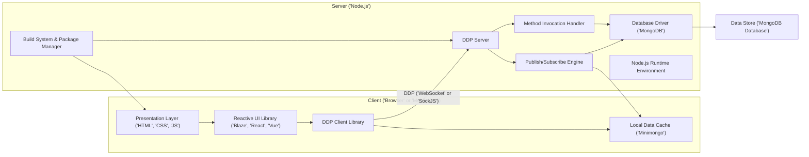
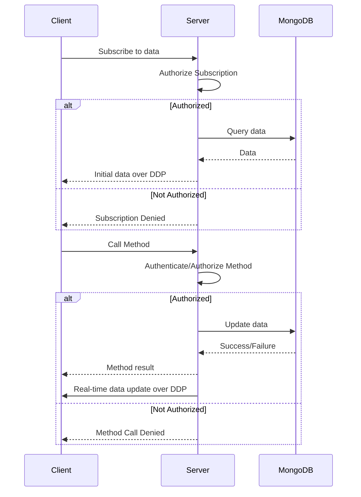
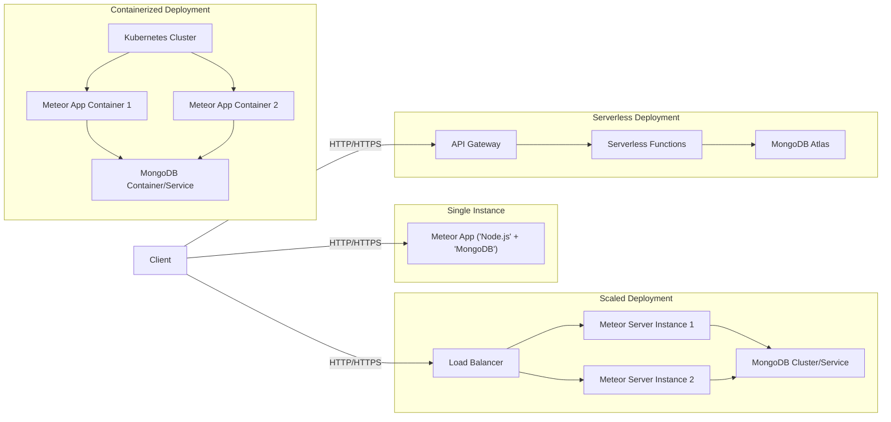

# Project Design Document: Meteor Framework

**Version:** 1.1
**Date:** October 26, 2023
**Author:** Gemini (AI Language Model)

## 1. Project Overview

This document provides a detailed architectural design of the Meteor framework, an open-source isomorphic JavaScript web framework. It focuses on the core components, data flow, and interactions within the framework to facilitate effective threat modeling. This document aims to provide a comprehensive understanding of Meteor's architecture for security analysis, enabling the identification of potential vulnerabilities and attack vectors.

## 2. Goals and Objectives

*   Clearly define the architectural components of the Meteor framework and their responsibilities.
*   Illustrate the data flow and interactions between these components, highlighting potential trust boundaries.
*   Provide sufficient detail to enable thorough threat modeling of the framework, including identifying assets, threats, and vulnerabilities.
*   Serve as a reference document for security assessments, secure development practices, and incident response planning.

## 3. Target Audience

*   Security engineers and architects responsible for assessing the security of Meteor applications or the framework itself.
*   Software developers building applications with or contributing to the Meteor framework.
*   Threat modeling practitioners seeking to analyze the attack surface of Meteor applications.
*   Anyone requiring a detailed understanding of Meteor's architecture from a security perspective.

## 4. Scope

This document covers the core architectural components of the Meteor framework as represented in the provided GitHub repository (https://github.com/meteor/meteor). It focuses on the framework's fundamental mechanisms for data synchronization, client-server communication, and build processes. While the package ecosystem is mentioned, the security analysis of individual packages is outside the scope unless directly impacting core framework functionality.

## 5. High-Level Architecture

**Description:**

*   **Client ('Browser' or 'Mobile App'):** Represents the user interface environment.
    *   **Presentation Layer ('HTML', 'CSS', 'JS'):**  Renders the user interface and handles user interactions. Susceptible to client-side vulnerabilities like XSS.
    *   **Reactive UI Library ('Blaze', 'React', 'Vue'):** Manages UI updates based on data changes. Security depends on the chosen library and its usage (e.g., avoiding direct HTML injection).
    *   **DDP Client Library:** Manages the connection and communication with the server using DDP over WebSockets or SockJS. A critical component for secure communication.
    *   **Local Data Cache ('Minimongo'):**  A client-side, in-memory database that caches data received from the server. Sensitive data stored here requires careful consideration.
*   **Server ('Node.js'):** The backend environment responsible for application logic and data management.
    *   **DDP Server:**  Handles incoming DDP connections, authenticates clients, and routes messages. A key point for access control and preventing unauthorized actions.
    *   **Publish/Subscribe Engine:** Controls the flow of data from the database to connected clients based on defined publications and subscriptions. Vulnerable to authorization bypass if not correctly implemented.
    *   **Method Invocation Handler:** Processes remote procedure calls (Methods) initiated by clients. Requires robust input validation and authorization to prevent malicious operations.
    *   **Database Driver ('MongoDB'):**  Facilitates communication with the MongoDB database. Proper configuration and secure credentials are essential.
    *   **Node.js Runtime Environment:** The execution environment for the server-side JavaScript code. Subject to general Node.js security best practices.
    *   **Build System & Package Manager:**  Responsible for bundling client-side assets and managing server-side dependencies (npm/Atmosphere). A potential attack vector for supply chain attacks.
*   **Data Store ('MongoDB Database'):** The persistent storage for application data. Requires strong access controls, encryption, and regular security audits.

## 6. Component Details

This section provides a more detailed description of the key components, highlighting potential security implications.

*   **Client Components:**
    *   **Presentation Layer ('HTML', 'CSS', 'JS'):**
        *   **Functionality:** Renders the user interface and handles user input.
        *   **Security Implications:**  Primary target for Cross-Site Scripting (XSS) attacks if user-provided data is not properly sanitized before rendering. Also susceptible to Clickjacking and other client-side injection attacks.
    *   **Reactive UI Library ('Blaze', 'React', 'Vue'):**
        *   **Functionality:** Provides a declarative way to manage the user interface and update it based on data changes.
        *   **Security Implications:**  Improper use of features like `dangerouslySetInnerHTML` in React can introduce XSS vulnerabilities. The library itself needs to be kept up-to-date to patch any known vulnerabilities.
    *   **DDP Client Library:**
        *   **Functionality:** Establishes and maintains a real-time connection with the server, serializes and deserializes DDP messages, and manages subscriptions and method calls.
        *   **Security Implications:**  If the connection is not secured with HTTPS/WSS, it's vulnerable to man-in-the-middle attacks, allowing eavesdropping and manipulation of data. Improper handling of authentication tokens can lead to session hijacking.
    *   **Local Data Cache ('Minimongo'):**
        *   **Functionality:** Stores a subset of the server's data locally for faster access and optimistic UI updates.
        *   **Security Implications:**  Sensitive data cached here could be exposed if the client's device is compromised. Care should be taken to avoid storing highly sensitive information client-side.

*   **Server Components:**
    *   **DDP Server:**
        *   **Functionality:** Listens for and manages DDP connections from clients, authenticates users, and routes messages to the appropriate handlers.
        *   **Security Implications:**  Vulnerable to denial-of-service (DoS) attacks if not properly rate-limited. Authentication flaws can lead to unauthorized access. Improper handling of DDP messages could lead to unexpected behavior or vulnerabilities.
    *   **Publish/Subscribe Engine:**
        *   **Functionality:** Controls which data from the MongoDB database is sent to which clients based on defined publications and client subscriptions.
        *   **Security Implications:**  Authorization vulnerabilities can occur if publications are not properly secured, allowing clients to subscribe to data they shouldn't have access to. This can lead to information disclosure.
    *   **Method Invocation Handler:**
        *   **Functionality:** Executes server-side functions in response to method calls from clients.
        *   **Security Implications:**  A major attack surface. Lack of input validation can lead to injection attacks (e.g., MongoDB injection). Insufficient authorization checks can allow clients to perform actions they are not permitted to.
    *   **Database Driver ('MongoDB'):**
        *   **Functionality:**  Facilitates communication with the MongoDB database.
        *   **Security Implications:**  Requires secure configuration, including strong authentication credentials and proper access controls. Vulnerable to NoSQL injection attacks if queries are constructed using unsanitized user input.
    *   **Node.js Runtime Environment:**
        *   **Functionality:** Executes the server-side JavaScript code.
        *   **Security Implications:**  Subject to general Node.js security vulnerabilities. Keeping Node.js and its dependencies updated is crucial. Care must be taken to avoid common Node.js security pitfalls.
    *   **Build System & Package Manager:**
        *   **Functionality:** Bundles client-side assets and manages server-side dependencies.
        *   **Security Implications:**  A potential entry point for supply chain attacks if malicious or vulnerable packages are introduced as dependencies. The build process itself needs to be secure to prevent tampering with the application code.

*   **Data Store ('MongoDB Database'):**
    *   **Functionality:** Stores the application's persistent data.
    *   **Security Implications:**  Requires robust access control mechanisms, strong authentication, and authorization. Data should be encrypted at rest and in transit. Regular security audits and patching are necessary.

## 7. Data Flow

The core data flow in a Meteor application centers around real-time data synchronization and client-initiated actions.

1. **Client Subscription Request:** The client requests to subscribe to a specific dataset published by the server.
2. **Server Authorization Check:** The server verifies if the client is authorized to access the requested data based on the publication's logic.
3. **Data Retrieval:** If authorized, the server queries the MongoDB database for the requested data.
4. **Initial Data Transmission:** The server sends the initial dataset to the client over the DDP connection.
5. **Real-time Data Updates:** When data in the MongoDB database changes (due to server-side methods or direct database modifications), the server identifies subscribed clients.
6. **Data Change Notification:** The server sends notifications of data changes to the subscribed clients via DDP.
7. **Client-Side Data Update:** The DDP client library on the client-side updates the local Minimongo cache.
8. **UI Update:** The reactive UI library detects changes in Minimongo and updates the user interface accordingly.
9. **Client Method Call:** The client initiates an action by calling a server-side method via DDP.
10. **Server Authentication and Authorization:** The server authenticates the client and authorizes the method call.
11. **Method Execution:** The server executes the requested method, potentially interacting with the database.
12. **Method Response:** The server sends a response back to the client, indicating success or failure.
13. **Data Update Propagation (if applicable):** If the method call resulted in data changes, these changes are propagated to subscribed clients as described in steps 5-8.

## 8. Security Considerations

Threat modeling of a Meteor application should consider the following categories of potential vulnerabilities:

*   **Client-Side Attacks:**
    *   **Cross-Site Scripting (XSS):** Exploiting vulnerabilities in the presentation layer or UI library to inject malicious scripts into the client's browser.
    *   **Man-in-the-Middle (MITM):** Intercepting and potentially manipulating communication between the client and server if DDP is not secured with WSS.
    *   **Client-Side Data Tampering:** Manipulating data stored in `Minimongo` or browser storage if sensitive information is not properly protected.
    *   **Clickjacking:** Tricking users into clicking on unintended elements.
    *   **Cross-Site Request Forgery (CSRF):**  Although less common in typical Meteor applications due to DDP, it's still a consideration for any HTTP endpoints.
*   **Server-Side Attacks:**
    *   **Insecure Method Implementations:** Lack of input validation, insufficient authorization, and improper error handling in Meteor Methods.
    *   **Publish/Subscribe Authorization Flaws:** Allowing unauthorized access to data through improperly configured publications.
    *   **NoSQL Injection:** Exploiting vulnerabilities in database queries constructed with unsanitized user input.
    *   **Denial of Service (DoS):** Overwhelming the server with requests, potentially targeting the DDP connection handling.
    *   **Authentication and Authorization Bypass:** Circumventing security measures to gain unauthorized access.
    *   **Supply Chain Attacks:** Compromise through vulnerable or malicious dependencies managed by npm or Atmosphere.
*   **Database Attacks:**
    *   **Unauthorized Access:** Gaining access to the MongoDB database without proper credentials.
    *   **Data Breaches:** Exposure of sensitive data due to insecure configuration or vulnerabilities.
    *   **Data Manipulation:** Modifying or deleting data without authorization.
*   **Communication Channel Attacks:**
    *   **Eavesdropping:** Intercepting sensitive data transmitted over an unsecured DDP connection.
    *   **Data Tampering:** Modifying data in transit between the client and server.

## 9. Deployment Architecture

Meteor applications can be deployed in various configurations, each with its own security implications.

*   **Single Instance Deployment:**
    *   **Description:** All components (Node.js server, MongoDB) reside on a single server.
    *   **Security Considerations:**  Security of the single server is paramount. A compromise of this server compromises the entire application. Proper firewall configuration and OS-level security are crucial.
*   **Horizontally Scaled Deployment:**
    *   **Description:** Multiple instances of the Node.js server run behind a load balancer, while MongoDB can be a managed service or a replicated cluster.
    *   **Security Considerations:** Secure communication between server instances and the database is essential. Load balancer configuration and security are critical. Session management and synchronization across instances need to be handled securely.
*   **Containerized Deployment (Docker/Kubernetes):**
    *   **Description:** Components are packaged into containers and orchestrated using tools like Kubernetes.
    *   **Security Considerations:** Container image security, Kubernetes security configurations (RBAC, network policies, Pod Security Policies/Admission Controllers), and secure secrets management are crucial. Regularly scanning container images for vulnerabilities is important.
*   **Serverless Deployment (e.g., with Galaxy Functions):**
    *   **Description:**  Parts of the application logic are deployed as serverless functions.
    *   **Security Considerations:**  Security relies heavily on the serverless platform's security model. Properly configuring function permissions and managing secrets within the serverless environment are key.

## 10. Technology Stack

*   **Primary Language:** JavaScript (both client and server)
*   **Server-Side Runtime:** Node.js
*   **Database:** MongoDB
*   **Real-time Communication:** Distributed Data Protocol (DDP) over WebSockets or SockJS
*   **UI Libraries (Common):** Blaze (legacy), React, Vue
*   **Package Management (Server):** npm (Node Package Manager), Atmosphere
*   **Package Management (Client):** npm, Yarn

## 11. Assumptions and Constraints

*   This document focuses on the core architectural principles of the Meteor framework.
*   It assumes a basic understanding of web application security concepts.
*   The security analysis of specific community packages is generally outside the scope, unless they directly impact core framework security.
*   The document assumes the use of standard deployment practices.

## 12. Future Considerations

*   Detailed analysis of Meteor's built-in authentication and authorization mechanisms (e.g., `accounts-password`).
*   In-depth security review of the Atmosphere package ecosystem and its governance.
*   Best practices for securing Meteor applications, including input validation, output encoding, and secure coding guidelines.
*   Analysis of specific security features and mitigations offered by the Meteor framework and related libraries.
*   Guidance on performing security testing and penetration testing of Meteor applications.