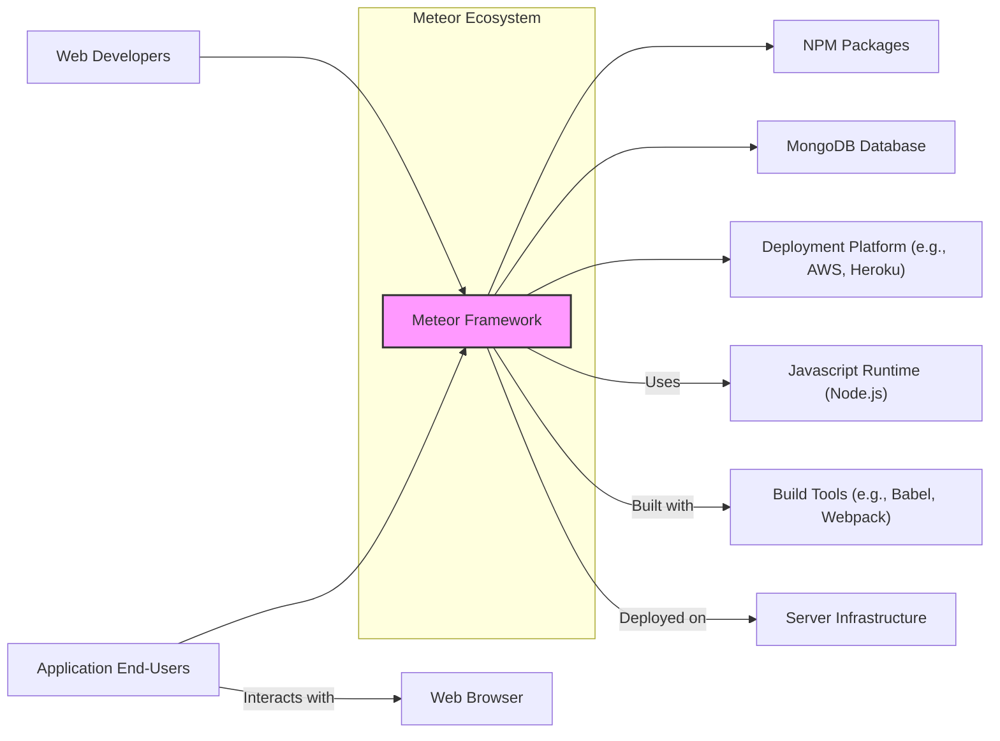
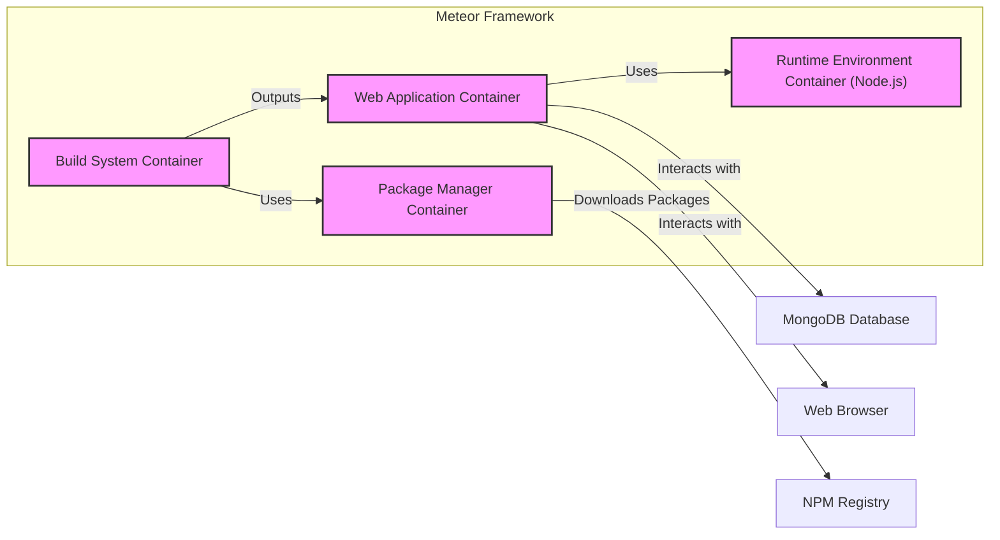
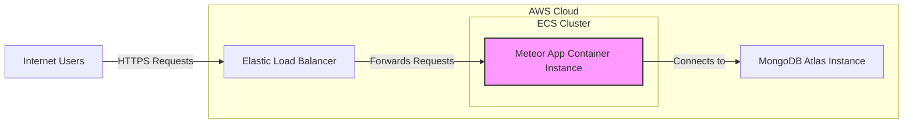
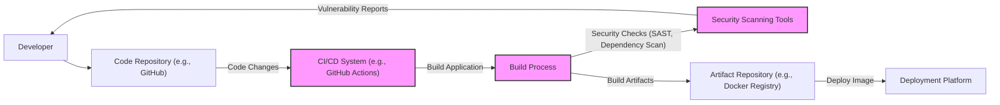

# BUSINESS POSTURE

- Business Priorities and Goals:
 - Rapid Application Development: Meteor aims to enable developers to build applications quickly and efficiently, reducing time to market.
 - Real-time Functionality: Meteor is designed for building applications that require real-time data updates and interactions.
 - Full-Stack JavaScript Development: Meteor allows developers to use JavaScript for both frontend and backend development, simplifying the development process and reducing technology stack complexity.
 - Open Source Community: Meteor relies on a vibrant open-source community for contributions, package development, and support.
- Business Risks:
 - Security Vulnerabilities: As a full-stack framework and open-source project, Meteor and its ecosystem might be susceptible to security vulnerabilities that could impact applications built with it.
 - Dependency Management Risks: Meteor relies on a package ecosystem, introducing risks associated with vulnerable or malicious packages.
 - Community Dependency: The project's future and support depend on the active community, which can fluctuate.
 - Compatibility and Updates:  Maintaining compatibility across different browsers, platforms, and evolving JavaScript standards can be challenging.
 - Performance and Scalability:  Real-time features and reactive data handling might introduce performance and scalability challenges for large-scale applications.

# SECURITY POSTURE

- Existing Security Controls:
 - security control: Rate limiting on API endpoints (implementation details would be in application code or server configurations).
 - security control: Input sanitization and validation (developer responsibility within application code, guidance in documentation).
 - security control: HTTPS for communication (server configuration responsibility, recommended in deployment guides).
 - security control: MongoDB security features (database configuration responsibility, documented by MongoDB).
 - security control: Package security scanning (community-driven, tools like `npm audit` or similar can be used on project dependencies).
- Accepted Risks:
 - accepted risk: Reliance on community-maintained packages, which might have varying security quality.
 - accepted risk: Developer responsibility for implementing many security controls within applications built on Meteor.
 - accepted risk: Potential vulnerabilities in older versions of Meteor and its packages if not actively maintained.
- Recommended Security Controls:
 - security control: Automated security scanning of application code (SAST/DAST) integrated into the development pipeline.
 - security control: Dependency vulnerability scanning as part of the build process.
 - security control: Regular security audits and penetration testing of applications built with Meteor.
 - security control: Security training for developers on secure coding practices for Meteor applications.
 - security control: Centralized security logging and monitoring for Meteor applications.
- Security Requirements:
 - Authentication:
  - Requirement: Meteor applications should support secure user authentication mechanisms.
  - Requirement: Support for multi-factor authentication (MFA) should be considered for sensitive applications.
  - Requirement: Secure password storage using hashing algorithms.
 - Authorization:
  - Requirement: Implement role-based access control (RBAC) to manage user permissions and access to resources.
  - Requirement: Fine-grained authorization mechanisms to control data access based on user roles and context.
 - Input Validation:
  - Requirement: All user inputs, both on the client and server-side, must be thoroughly validated to prevent injection attacks (e.g., XSS, SQL injection, command injection).
  - Requirement: Input validation should be applied at multiple layers (client-side for immediate feedback, server-side for security enforcement).
 - Cryptography:
  - Requirement: Sensitive data at rest and in transit must be encrypted using strong cryptographic algorithms.
  - Requirement: Secure key management practices for encryption keys.
  - Requirement: Proper use of HTTPS for all communication between clients and servers.

# DESIGN

## C4 CONTEXT

- Context Diagram Elements:
 - - Name: Meteor Framework
  - Type: Software System
  - Description: The Meteor JavaScript framework itself, providing the core functionalities for building web applications.
  - Responsibilities: Provides the framework for application development, including reactive data handling, build system, and package management.
  - Security controls: Codebase security, vulnerability patching, secure development practices for the framework itself.
 - - Name: Web Developers
  - Type: Person
  - Description: Developers who use the Meteor framework to build web applications.
  - Responsibilities: Developing, deploying, and maintaining Meteor applications, implementing security controls within their applications.
  - Security controls: Secure coding practices, input validation, authentication and authorization implementation in applications.
 - - Name: Application End-Users
  - Type: Person
  - Description: Users who interact with applications built using the Meteor framework.
  - Responsibilities: Using the applications, providing data, expecting secure and functional applications.
  - Security controls: Client-side security measures in web browsers, user awareness of phishing and other online threats.
 - - Name: NPM Packages
  - Type: Software System
  - Description: The Node Package Manager ecosystem, providing a vast collection of JavaScript packages that Meteor applications can depend on.
  - Responsibilities: Providing reusable components and functionalities for Meteor applications.
  - Security controls: Package vulnerability scanning, dependency management, using reputable and well-maintained packages.
 - - Name: MongoDB Database
  - Type: Software System
  - Description: A NoSQL database, commonly used with Meteor for data persistence.
  - Responsibilities: Storing application data, providing data access to Meteor applications.
  - Security controls: Database access control, data encryption at rest and in transit, regular backups, vulnerability patching.
 - - Name: Deployment Platform (e.g., AWS, Heroku)
  - Type: Infrastructure
  - Description: Cloud platforms or hosting providers used to deploy and run Meteor applications.
  - Responsibilities: Hosting and running Meteor applications, providing infrastructure services.
  - Security controls: Infrastructure security, network security, access control to deployment environments, platform security features.
 - - Name: Javascript Runtime (Node.js)
  - Type: Software System
  - Description: The JavaScript runtime environment that Meteor applications run on.
  - Responsibilities: Executing JavaScript code, providing server-side functionalities.
  - Security controls: Node.js security updates, runtime environment hardening, process isolation.
 - - Name: Build Tools (e.g., Babel, Webpack)
  - Type: Software System
  - Description: Tools used by Meteor's build system to transpile, bundle, and optimize application code.
  - Responsibilities: Transforming and packaging application code for deployment.
  - Security controls: Build tool security, ensuring tools are from trusted sources, vulnerability scanning of build tool dependencies.
 - - Name: Server Infrastructure
  - Type: Infrastructure
  - Description: Physical or virtual servers where Meteor applications are deployed.
  - Responsibilities: Providing the underlying hardware and operating system for running Meteor applications.
  - Security controls: Server hardening, operating system security updates, physical security of servers.
 - - Name: Web Browser
  - Type: Software System
  - Description: Web browsers used by end-users to access Meteor applications.
  - Responsibilities: Rendering and executing client-side JavaScript code, displaying the application UI.
  - Security controls: Browser security features, sandboxing, protection against malicious websites and scripts, user security settings.

## C4 CONTAINER

- Container Diagram Elements:
 - - Name: Web Application Container
  - Type: Container
  - Description: Represents the deployed Meteor web application, including server-side and client-side code.
  - Responsibilities: Handling user requests, serving web pages, managing real-time data, interacting with the database.
  - Security controls: Input validation, authentication, authorization, session management, secure API endpoints, rate limiting, output encoding.
 - - Name: Build System Container
  - Type: Container
  - Description: The Meteor build system responsible for compiling, bundling, and optimizing the application code.
  - Responsibilities: Transpiling JavaScript, bundling assets, optimizing code for production, managing dependencies.
  - Security controls: Secure build process, dependency vulnerability scanning, build output integrity checks, access control to build environment.
 - - Name: Package Manager Container
  - Type: Container
  - Description:  Manages and installs packages from the NPM registry and Meteor package ecosystem.
  - Responsibilities: Resolving dependencies, downloading packages, managing package versions.
  - Security controls: Package integrity checks (checksums), vulnerability scanning of packages, using a private package registry for internal packages.
 - - Name: Runtime Environment Container (Node.js)
  - Type: Container
  - Description: The Node.js runtime environment where the Meteor server-side application executes.
  - Responsibilities: Executing server-side JavaScript code, providing APIs, handling network requests.
  - Security controls: Node.js security updates, runtime environment hardening, process isolation, resource limits.
 - - Name: MongoDB Database
  - Type: External Container
  - Description: The external MongoDB database used for data persistence.
  - Responsibilities: Storing and retrieving application data.
  - Security controls: Database access control, authentication, authorization, data encryption at rest and in transit, regular backups, vulnerability patching.
 - - Name: Web Browser
  - Type: External Container
  - Description: The web browser used by end-users to access the application.
  - Responsibilities: Rendering the user interface, executing client-side JavaScript code, interacting with the server.
  - Security controls: Browser security features, Content Security Policy (CSP), HTTP Strict Transport Security (HSTS), secure cookies.
 - - Name: NPM Registry
  - Type: External Container
  - Description: The public NPM registry where JavaScript packages are hosted.
  - Responsibilities: Providing a repository of JavaScript packages.
  - Security controls: Package signing, malware scanning (by NPM registry), community reporting of malicious packages.

## DEPLOYMENT

- Deployment Options:
 - Cloud Platforms (e.g., AWS, Google Cloud, Azure): Deploying Meteor applications to cloud platforms using services like EC2, Google Compute Engine, Azure VMs, or container services like ECS, GKE, AKS.
 - Platform-as-a-Service (PaaS) (e.g., Heroku, Galaxy): Using PaaS offerings specifically designed for Meteor or general web applications.
 - On-Premise Servers: Deploying to traditional server infrastructure within a company's own data center.

- Detailed Deployment (Cloud Platform - AWS ECS):

- Deployment Diagram Elements (AWS ECS):
 - - Name: Internet Users
  - Type: Person
  - Description: End-users accessing the Meteor application over the internet.
  - Responsibilities: Initiating requests to access the application.
  - Security controls: User's own device security, network security.
 - - Name: Elastic Load Balancer
  - Type: Infrastructure Component (AWS)
  - Description: AWS Elastic Load Balancer distributing incoming traffic across Meteor application instances.
  - Responsibilities: Load balancing, SSL termination, traffic routing, health checks.
  - Security controls: HTTPS termination, security groups, access logs, DDoS protection (AWS Shield).
 - - Name: Meteor App Container Instance
  - Type: Container Instance (AWS ECS)
  - Description: A container running the Meteor application within an AWS ECS cluster.
  - Responsibilities: Running the Meteor application, handling requests, interacting with the database.
  - Security controls: Container image security, runtime security (container isolation), resource limits, security groups, IAM roles for access to AWS services.
 - - Name: MongoDB Atlas Instance
  - Type: Managed Database Service (MongoDB Atlas)
  - Description: A managed MongoDB database instance provided by MongoDB Atlas.
  - Responsibilities: Storing application data, providing database services.
  - Security controls: Database access control, authentication, authorization, data encryption at rest and in transit, network security (VPC peering), regular backups, vulnerability patching (managed by MongoDB Atlas).

## BUILD

- Build Process Elements:
 - - Name: Developer
  - Type: Person
  - Description: Software developer writing and modifying the Meteor application code.
  - Responsibilities: Writing secure code, committing code changes, addressing security vulnerabilities.
  - Security controls: Secure development environment, code review, security training.
 - - Name: Code Repository (e.g., GitHub)
  - Type: Software System
  - Description: Version control system used to store and manage the application codebase.
  - Responsibilities: Source code management, version control, collaboration.
  - Security controls: Access control, branch protection, audit logs, vulnerability scanning of repository dependencies (GitHub Dependabot).
 - - Name: CI/CD System (e.g., GitHub Actions)
  - Type: Automation System
  - Description: Continuous Integration and Continuous Delivery system automating the build, test, and deployment process.
  - Responsibilities: Automated build, testing, security scanning, deployment.
  - Security controls: Secure CI/CD pipeline configuration, access control to CI/CD system, secret management, build environment security.
 - - Name: Build Process
  - Type: Process
  - Description: The automated process of compiling, bundling, and packaging the Meteor application.
  - Responsibilities: Transforming source code into deployable artifacts, running tests, performing security checks.
  - Security controls: Dependency management, build reproducibility, secure build environment, minimized build dependencies.
 - - Name: Security Scanning Tools
  - Type: Software System
  - Description: Static Application Security Testing (SAST) and dependency scanning tools used to identify vulnerabilities in the code and dependencies.
  - Responsibilities: Identifying potential security vulnerabilities, generating vulnerability reports.
  - Security controls: Regularly updated vulnerability databases, accurate scanning rules, integration into the build process.
 - - Name: Artifact Repository (e.g., Docker Registry)
  - Type: Software System
  - Description: Repository for storing build artifacts, such as Docker images.
  - Responsibilities: Securely storing and distributing build artifacts.
  - Security controls: Access control, image signing, vulnerability scanning of stored images, audit logs.
 - - Name: Deployment Platform
  - Type: Infrastructure
  - Description: The target environment where the application is deployed (e.g., AWS ECS).
  - Responsibilities: Running and hosting the deployed application.
  - Security controls: Platform security controls as described in the Deployment section.

# RISK ASSESSMENT

- Critical Business Processes:
 - User Registration and Authentication: Securely managing user accounts and authentication is critical for user privacy and application security.
 - Data Storage and Retrieval:  Reliable and secure storage and retrieval of application data, especially if it includes sensitive user information or business-critical data.
 - Real-time Data Updates: Ensuring the integrity and availability of real-time data updates, especially in applications where data accuracy and timeliness are crucial.
 - Application Functionality: Maintaining the overall functionality and availability of the application to serve its intended purpose and users.
- Data Sensitivity:
 - User Credentials (passwords, API keys): Highly sensitive data requiring strong encryption and secure storage.
 - User Personal Information (PII): Sensitive data requiring protection according to privacy regulations (e.g., GDPR, CCPA).
 - Application Data: Sensitivity depends on the application's purpose. Could range from public data to highly confidential business data.
 - Application Code: Sensitive intellectual property that needs to be protected from unauthorized access and modification.
 - Database Connection Strings and Secrets: Sensitive credentials that must be securely managed and protected from exposure.

# QUESTIONS & ASSUMPTIONS

- BUSINESS POSTURE Questions:
 - What is the target audience for applications built with Meteor? (e.g., startups, enterprises, specific industries)
 - What are the key business drivers for choosing Meteor over other frameworks? (e.g., speed of development, real-time features, JavaScript ecosystem)
 - What is the acceptable level of risk for applications built with Meteor? (risk appetite)

- BUSINESS POSTURE Assumptions:
 - Rapid development and time-to-market are high priorities for projects using Meteor.
 - Real-time functionality is a key requirement for many Meteor applications.
 - Developers using Meteor are comfortable with JavaScript and the Node.js ecosystem.

- SECURITY POSTURE Questions:
 - Are there any specific compliance requirements for applications built with Meteor? (e.g., HIPAA, PCI DSS)
 - What security best practices are currently recommended or enforced for Meteor development?
 - Is there a dedicated security team or process for reviewing and addressing security vulnerabilities in Meteor and its ecosystem?

- SECURITY POSTURE Assumptions:
 - Security is a concern for applications built with Meteor, but might not be the absolute top priority compared to speed of development for all projects.
 - Developers are expected to take responsibility for implementing security controls within their Meteor applications.
 - The open-source community plays a role in identifying and addressing security vulnerabilities in Meteor and its packages.

- DESIGN Questions:
 - What are the typical deployment architectures for Meteor applications?
 - What are the common patterns for scaling Meteor applications?
 - Are there any specific security considerations for different deployment environments (e.g., cloud vs. on-premise)?

- DESIGN Assumptions:
 - Meteor applications are typically deployed as web applications.
 - MongoDB is a common database choice for Meteor applications, but other databases can also be used.
 - Deployment environments can vary widely, from simple PaaS deployments to complex cloud infrastructure.