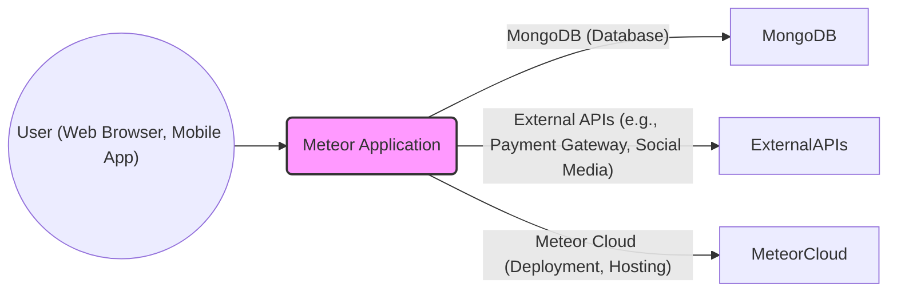
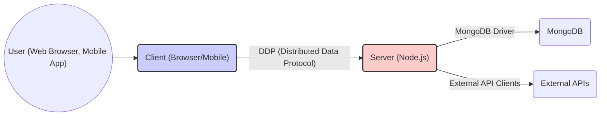
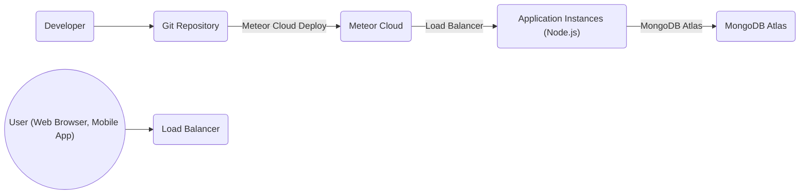
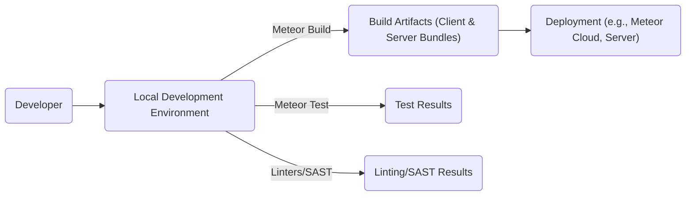

Okay, let's create a design document for the Meteor.js project, focusing on aspects relevant to threat modeling.

# BUSINESS POSTURE

Meteor.js is a full-stack JavaScript framework designed for building real-time web and mobile applications.  It simplifies development by providing a unified platform for the client, server, and database.  The business priorities likely revolve around:

*   Rapid Development: Enabling developers to build and deploy applications quickly.
*   Real-time Functionality: Providing seamless real-time updates without complex configurations.
*   Ease of Use: Offering a developer-friendly experience with a gentle learning curve.
*   Cross-Platform Compatibility: Supporting web, iOS, and Android platforms.
*   Community and Ecosystem: Maintaining a vibrant community and a rich package ecosystem.
*   Scalability: Allowing applications to scale to handle increasing user loads.

Based on these priorities, the most important business risks are:

*   Security Vulnerabilities: Vulnerabilities in the framework or its packages could lead to data breaches, service disruptions, and reputational damage. This is paramount, as real-time applications often handle sensitive data.
*   Scalability Bottlenecks:  Inability to handle a large number of concurrent users or real-time connections could hinder growth and user satisfaction.
*   Dependency Management Issues:  Reliance on third-party packages introduces risks related to package vulnerabilities, maintenance, and compatibility.
*   Data Consistency Problems:  Real-time data synchronization can be complex, and failures could lead to data inconsistencies and application errors.
*   Platform Lock-in: While Meteor aims for cross-platform compatibility, reliance on its specific features could make it difficult to migrate to other platforms.

# SECURITY POSTURE

Meteor.js has evolved over time, and its security posture has improved. Here's an assessment:

*   security control: Data Sanitization: Meteor provides built-in mechanisms to sanitize data and prevent common web vulnerabilities like Cross-Site Scripting (XSS) and SQL injection (though MongoDB is NoSQL, similar injection risks exist). Implemented in core packages and documented in the Meteor Guide.
*   security control: Authentication and Authorization: Meteor has built-in user account management (accounts-password, accounts-ui) and supports various authentication methods (OAuth, etc.). Authorization mechanisms are available, allowing developers to control access to data and methods. Implemented in core packages and documented in the Meteor Guide.
*   security control: Rate Limiting: Meteor provides packages and techniques to implement rate limiting, preventing abuse and denial-of-service attacks. Implemented via community packages and documented in the Meteor Guide.
*   security control: Secure Communication: Meteor uses WebSockets for real-time communication, and these connections can be secured using SSL/TLS. Implemented by default when deploying with Meteor Cloud or configured manually in other environments.
*   security control: Minimongo Security: Minimongo, the client-side database, has security rules that control data access. Developers must explicitly define which data is accessible to the client. Implemented in core packages and documented in the Meteor Guide.
*   security control: Method Calls: Server-side methods are used to perform sensitive operations, preventing direct client-side manipulation of data. Implemented in core packages and documented in the Meteor Guide.
*   accepted risk: Package Vulnerabilities: While Meteor's core packages are generally well-maintained, the broader ecosystem of community packages may contain vulnerabilities. Developers are responsible for vetting and updating packages.
*   accepted risk: Client-Side Code Security: Meteor's client-side code is ultimately executed in the user's browser, making it susceptible to client-side attacks if developers are not careful.
*   accepted risk: Deployment Configuration: Security relies heavily on proper deployment configuration (e.g., setting up SSL/TLS, configuring firewalls, etc.).

Recommended Security Controls (High Priority):

*   Implement a robust Content Security Policy (CSP) to mitigate XSS and other code injection attacks.
*   Regularly conduct security audits and penetration testing, focusing on both the framework and application-specific code.
*   Establish a clear process for reporting and addressing security vulnerabilities.
*   Implement robust input validation and sanitization on both the client and server, even for data coming from Minimongo.
*   Use a dependency management tool that automatically checks for known vulnerabilities in packages.
*   Consider using a Web Application Firewall (WAF) to protect against common web attacks.

Security Requirements:

*   Authentication:
    *   Support for strong password policies (length, complexity, etc.).
    *   Support for multi-factor authentication (MFA).
    *   Secure storage of user credentials (hashing and salting).
    *   Protection against brute-force attacks.
*   Authorization:
    *   Role-based access control (RBAC) to restrict access to data and functionality.
    *   Fine-grained permissions to control access at the data field level.
    *   Secure handling of user sessions.
*   Input Validation:
    *   Strict validation of all user inputs on both the client and server.
    *   Whitelist-based validation whenever possible.
    *   Sanitization of data to prevent XSS and other injection attacks.
*   Cryptography:
    *   Use of strong, industry-standard cryptographic algorithms for data encryption and hashing.
    *   Secure key management practices.
    *   Protection of sensitive data in transit and at rest.

# DESIGN

## C4 CONTEXT

*   Elements Description:

    *   Name: User
        *   Type: Person
        *   Description: Represents a user interacting with the Meteor application through a web browser or mobile app.
        *   Responsibilities: Accessing application features, viewing data, submitting data.
        *   Security controls: Browser security features, mobile device security.

    *   Name: Meteor Application
        *   Type: Software System
        *   Description: The core Meteor application, encompassing client-side and server-side code.
        *   Responsibilities: Handling user requests, managing data, providing real-time updates.
        *   Security controls: Data sanitization, authentication, authorization, rate limiting, secure communication, Minimongo security, method calls.

    *   Name: MongoDB
        *   Type: Database
        *   Description: The primary database used by the Meteor application.
        *   Responsibilities: Storing application data, providing data access to the server.
        *   Security controls: Database access controls, encryption at rest, regular backups.

    *   Name: External APIs
        *   Type: Software System
        *   Description: External services used by the Meteor application (e.g., payment gateways, social media APIs).
        *   Responsibilities: Providing specific functionalities (e.g., processing payments, authenticating users).
        *   Security controls: API keys, OAuth, secure communication.

    *   Name: Meteor Cloud
        *   Type: Software System
        *   Description: Meteor's official cloud platform for deploying and hosting applications.
        *   Responsibilities: Providing infrastructure, scaling, and deployment services.
        *   Security controls: Platform-level security features, SSL/TLS, access controls.

## C4 CONTAINER

*   Elements Description:

    *   Name: Client
        *   Type: Container (Browser/Mobile)
        *   Description: The client-side code running in the user's web browser or mobile app.
        *   Responsibilities: Rendering the user interface, handling user interactions, communicating with the server via DDP.
        *   Security controls: Minimongo security, client-side input validation, CSP.

    *   Name: Server
        *   Type: Container (Node.js)
        *   Description: The server-side code running on Node.js.
        *   Responsibilities: Handling DDP requests, interacting with the database, communicating with external APIs, enforcing business logic and security rules.
        *   Security controls: Server-side input validation, authentication, authorization, rate limiting, secure communication.

    *   Name: MongoDB
        *   Type: Container (Database)
        *   Description: The MongoDB database.
        *   Responsibilities: Storing application data.
        *   Security controls: Database access controls, encryption at rest.

    *   Name: External APIs
        *   Type: Container (External System)
        *   Description: External services used by the application.
        *   Responsibilities: Providing specific functionalities.
        *   Security controls: API keys, OAuth, secure communication.

## DEPLOYMENT

Meteor applications can be deployed in several ways:

1.  Meteor Cloud: Meteor's official hosting platform.
2.  Self-hosting: Deploying on a custom server (e.g., using Docker, PM2, or other process managers).
3.  PaaS Providers: Deploying on platforms like Heroku, AWS Elastic Beanstalk, etc.

We'll describe deployment using Meteor Cloud, as it's the officially recommended approach and provides built-in security features.

*   Elements Description:

    *   Name: Developer
        *   Type: Person
        *   Description: The developer writing and deploying the Meteor application.
        *   Responsibilities: Writing code, committing to Git, deploying to Meteor Cloud.
        *   Security controls: Strong passwords, secure development environment.

    *   Name: Git Repository
        *   Type: Code Repository
        *   Description: The repository storing the application's source code.
        *   Responsibilities: Version control, code collaboration.
        *   Security controls: Access controls, branch protection rules.

    *   Name: Meteor Cloud
        *   Type: Cloud Platform
        *   Description: Meteor's official cloud platform.
        *   Responsibilities: Building, deploying, and hosting the application.
        *   Security controls: Platform-level security, SSL/TLS, access controls.

    *   Name: Load Balancer
        *   Type: Infrastructure
        *   Description: Distributes incoming traffic across multiple application instances.
        *   Responsibilities: Ensuring high availability and scalability.
        *   Security controls: SSL/TLS termination, DDoS protection.

    *   Name: Application Instances
        *   Type: Container Instance (Node.js)
        *   Description: Instances of the Meteor application running on Node.js.
        *   Responsibilities: Handling user requests, processing data.
        *   Security controls: Server-side security controls (see Container diagram).

    *   Name: MongoDB Atlas
        *   Type: Database Service
        *   Description: MongoDB's cloud database service.
        *   Responsibilities: Providing a managed MongoDB database.
        *   Security controls: Database access controls, encryption at rest, regular backups.
    *   Name: User
        *   Type: Person
        *   Description: Represents a user interacting with the Meteor application through a web browser or mobile app.
        *   Responsibilities: Accessing application features, viewing data, submitting data.
        *   Security controls: Browser security features, mobile device security.

## BUILD

Meteor has a built-in build system that handles compilation, minification, and bundling of code.  It also manages package dependencies.

*   Build Process Description:

    1.  Developer writes code on their local machine.
    2.  The `meteor build` command is used to create optimized bundles for the client and server.
    3.  During the build process, Meteor handles:
        *   Dependency resolution and installation (using Atmosphere, Meteor's package manager, and npm).
        *   Compilation of code (e.g., transpiling ES6+ to ES5).
        *   Minification and bundling of JavaScript and CSS.
        *   Creation of source maps (for debugging).
    4.  The build artifacts are then deployed to the target environment.
    5.  `meteor test` command can be used to run automated tests.
    6.  Linters and SAST tools can be integrated into the build process (e.g., ESLint, SonarQube). These are not built-in but are highly recommended.

*   Security Controls:

    *   security control: Dependency Management: Meteor's package system (Atmosphere and npm) allows for managing dependencies, but developers must be vigilant about updating packages and checking for vulnerabilities.
    *   security control: Build Automation: The build process is automated, reducing the risk of manual errors.
    *   security control: (Recommended) SAST: Integrate Static Application Security Testing (SAST) tools into the build pipeline to identify potential vulnerabilities in the code.
    *   security control: (Recommended) SCA: Integrate Software Composition Analysis (SCA) tools to scan for known vulnerabilities in dependencies.
    *   security control: (Recommended) Code Signing: Consider code signing the build artifacts to ensure their integrity.

# RISK ASSESSMENT

*   Critical Business Processes:
    *   User authentication and authorization.
    *   Real-time data synchronization.
    *   Data storage and retrieval.
    *   External API integrations (especially payment processing).
    *   Application availability and performance.

*   Data Sensitivity:
    *   User credentials (passwords, email addresses, etc.): Highly sensitive.
    *   Personal data (names, addresses, contact information): Sensitive, subject to privacy regulations (e.g., GDPR, CCPA).
    *   Financial data (payment information, transaction history): Highly sensitive, subject to PCI DSS.
    *   Application-specific data: Sensitivity depends on the nature of the application (e.g., medical records, financial records, etc.).

# QUESTIONS & ASSUMPTIONS

*   Questions:

    *   What specific external APIs are being used, and what security measures are in place for those integrations?
    *   What is the expected user load and scalability requirements?
    *   What are the specific data privacy requirements (e.g., GDPR, CCPA)?
    *   What is the current level of security awareness and training among developers?
    *   Are there any existing security policies or procedures in place?
    *   What is the budget for security tools and services?
    *   What level of logging and monitoring is currently implemented?
    *   What is the process for handling security incidents?

*   Assumptions:

    *   BUSINESS POSTURE: The primary goal is to build real-time applications quickly and easily. Security is a high priority, but rapid development is also crucial.
    *   SECURITY POSTURE: Developers are familiar with basic security concepts but may not be security experts.  A balance between security and ease of use is desired.
    *   DESIGN: The application uses a standard Meteor architecture with a client, server, and MongoDB database.  Deployment is likely to be on Meteor Cloud or a similar PaaS provider. The build process uses Meteor's built-in tools.