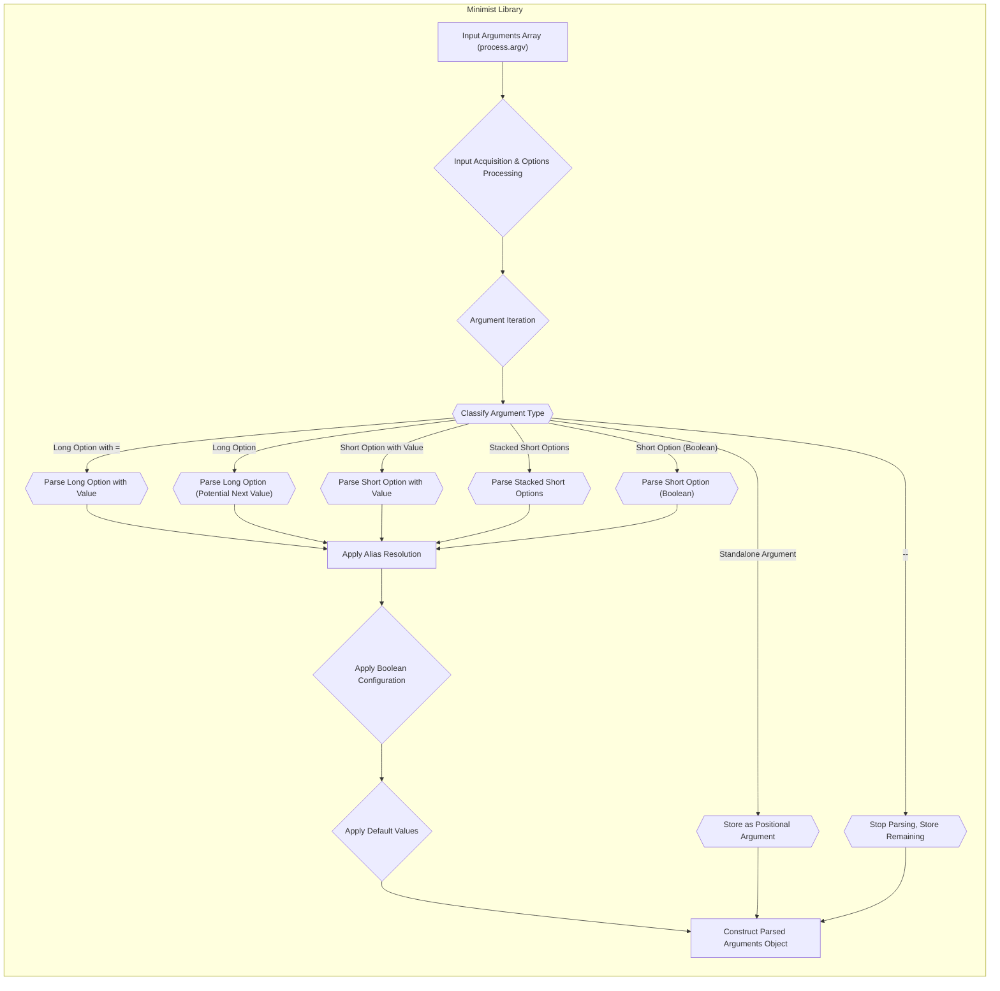

# Project Design Document: Minimist Command-Line Argument Parser

**Version:** 1.1
**Date:** October 26, 2023
**Author:** AI Software Architect

## 1. Introduction

This document provides an enhanced and more detailed design overview of the `minimist` project, a widely adopted Node.js library for parsing command-line arguments. This revised document is specifically tailored to facilitate comprehensive threat modeling activities. It offers a deeper understanding of `minimist`'s internal workings, data transformations, and configuration options, thereby enabling a more thorough identification of potential attack surfaces and vulnerabilities.

## 2. Goals

The primary goals of this enhanced design document are:

*   To provide a highly detailed and unambiguous description of the `minimist` library's architecture, internal processes, and configurable options.
*   To meticulously identify the key components, their specific functionalities, and the intricate interactions between them.
*   To precisely illustrate the transformation of data as it flows through the library, from raw input to the final parsed output.
*   To serve as a robust and actionable foundation for identifying a wide range of potential security threats and vulnerabilities during subsequent threat modeling exercises.
*   To foster clear and effective communication among security analysts, developers, and other stakeholders regarding the library's design and potential security implications.

## 3. Overview

`minimist` is a fundamental Node.js library designed to parse argument options from an array of strings, typically derived from `process.argv` representing command-line arguments. It transforms these raw arguments into a structured JavaScript object, making them easily accessible and manageable within Node.js applications. The library's versatility lies in its ability to handle various argument formats and configurations, including:

*   Simple boolean flags (e.g., `--verbose`)
*   Key-value pairs with explicit values (e.g., `--name John`)
*   Key-value pairs using the equals sign (e.g., `--name=John`)
*   Short options (e.g., `-v`)
*   Stacked short options (e.g., `-abc` treated as `-a -b -c`)
*   Aliased options, allowing for alternative names for the same option
*   Default values assigned when an option is not explicitly provided
*   The stop-early mechanism (`--`) to separate options from positional arguments

The core of `minimist`'s operation involves sequentially processing the input argument array, applying a defined set of rules and configurations to interpret each argument, and incrementally building the final parsed arguments object.

## 4. Detailed Design

The `minimist` library's internal workings can be dissected into the following detailed components and processes:

### 4.1. Input Acquisition and Initial Setup

*   **Input Source:** The primary input is an array of strings, typically obtained by slicing `process.argv` (e.g., `process.argv.slice(2)` to exclude the Node.js executable and script path).
*   **Options Object:** An optional configuration object can be passed to `minimist()` to customize parsing behavior. This object can include properties like `alias`, `boolean`, `default`, `string`, `stopEarly`, and `unknown`.
*   **Initialization:** The parsing process begins by creating an empty JavaScript object that will store the parsed arguments. This object will be populated as arguments are processed.

### 4.2. Core Argument Parsing Loop

*   **Iteration:** The library iterates through the input argument array using a `for` loop, processing each argument sequentially.
*   **Argument Classification:** For each argument, `minimist` performs a series of checks to determine its type:
    *   **Long Option with Value (Equals Sign):**  Checks if the argument starts with `--` and contains an `=`. The part before `=` is the key, and the part after is the value.
    *   **Long Option (Potential Next Value):** Checks if the argument starts with `--`. The subsequent argument might be its value.
    *   **Short Option with Value (Separate Argument):** Checks if the argument starts with `-` and is followed by another argument that doesn't start with `-`.
    *   **Stacked Short Options:** Checks if the argument starts with `-` and is followed by multiple characters (excluding the case of a short option with a value).
    *   **Short Option (Boolean):** Checks if the argument starts with `-` and is a single character (or part of a stacked short option).
    *   **Standalone Argument:**  If none of the above conditions are met, the argument is considered a standalone positional argument.
*   **Alias Resolution:** If an `alias` configuration is provided, `minimist` checks if the current long or short option matches any defined aliases and uses the canonical option name for storage in the output object.

### 4.3. Handling Different Argument Types

*   **Long Options:**
    *   If a long option has an explicit value (using `=`), the key-value pair is directly added to the output object.
    *   If a long option is followed by a non-option argument, that argument is treated as the value.
    *   If a long option is present without a subsequent value and is listed in the `boolean` configuration, it's set to `true`. Otherwise, it might remain `true` or be treated based on other configurations.
*   **Short Options:**
    *   If a short option is followed by a value, the key-value pair is added to the output object.
    *   If it's a stacked short option (e.g., `-abc`), each character is treated as a separate boolean option and set to `true` in the output object.
    *   If a short option is listed in the `boolean` configuration, it's treated as a boolean flag.
*   **Boolean Arguments:** Options specified in the `boolean` array are treated as boolean flags. If present, they are set to `true`. If not present, their value depends on whether a default is set.
*   **Default Values:** If default values are provided in the `default` object, these values are assigned to the corresponding keys in the output object if the argument was not present in the input.
*   **Stop Early (`--`):** When the `--` argument is encountered, the parsing of options stops. The remaining arguments in the input array are collected and stored in the `_` property of the output object as positional arguments.

### 4.4. Output Object Construction

*   **Key Assignment:**  Parsed option names (after alias resolution) become keys in the output JavaScript object.
*   **Value Assignment:**  The corresponding values are assigned to the keys based on the parsing rules described above.
*   **Positional Arguments:** Standalone arguments are collected in an array and assigned to the `_` property of the output object.
*   **Double-Dash Arguments:** Arguments following `--` are also included in the `_` array.

### 4.5. `unknown` Function Handling

*   If an `unknown` function is provided in the options object, this function is called when an argument is encountered that doesn't match any known options or aliases.
*   The `unknown` function receives the unknown argument as input and can return `true` to indicate that the argument was intentionally ignored or `false` to throw an error.

## 5. Enhanced Data Flow Diagram

## 6. Enhanced Key Security Considerations (For Threat Modeling)

Building upon the previous considerations, here are more specific security aspects to evaluate during threat modeling:

*   **Malicious Input Injection:**
    *   **Command Injection:** Could crafted argument values be interpreted as commands by downstream systems if not properly sanitized? For example, if the parsed arguments are used to construct shell commands.
    *   **Path Traversal:** If argument values are used as file paths, could malicious input like `../../sensitive_file` allow access to unauthorized files?
*   **Denial of Service (DoS) Attacks:**
    *   **Excessive Argument Count:** Could providing an extremely large number of arguments exhaust server resources (CPU, memory)?
    *   **Deeply Nested Structures (if supported by custom parsing logic):** While `minimist` itself doesn't create nested objects from arguments, if custom logic builds upon its output, deeply nested structures could lead to stack overflow or excessive memory usage.
*   **Prototype Pollution Vulnerabilities:**
    *   Can specially crafted argument keys (e.g., `__proto__.isAdmin=true`) modify the `Object.prototype`, potentially affecting the behavior of the entire application? This is a significant concern in JavaScript environments.
*   **Type Confusion and Unexpected Behavior:**
    *   Could providing arguments in unexpected formats (e.g., a string where a number is expected) lead to unexpected behavior or vulnerabilities in downstream code that relies on the parsed output?
*   **Abuse of Alias Functionality:**
    *   Could malicious actors exploit alias configurations, especially if they are dynamically loaded or user-configurable, to inject unexpected option names or values?
*   **Security Implications of the `unknown` Function:**
    *   If a custom `unknown` function is used, does it introduce any vulnerabilities? For example, does it execute arbitrary code based on the unknown argument? Does it leak sensitive information?
*   **Regular Expression Vulnerabilities (ReDoS):** While not immediately apparent in `minimist`'s core logic, if custom parsing logic or downstream processing uses regular expressions on the parsed arguments, carefully crafted input could lead to ReDoS attacks.
*   **Dependency Vulnerabilities:**  While `minimist` has minimal dependencies, it's crucial to ensure that any dependencies it might have in the future are regularly checked for known vulnerabilities.

## 7. Assumptions and Constraints

*   This design document provides a detailed logical view of `minimist`'s operation, focusing on the parsing process and data flow. It does not delve into the specific implementation details of the source code at a line-by-line level.
*   It assumes a foundational understanding of command-line argument parsing concepts and basic Node.js programming principles.
*   The subsequent threat modeling activities will leverage this design document to identify specific threat scenarios and potential vulnerabilities.

## 8. Future Considerations

*   As `minimist` evolves, any new features or modifications to the argument parsing logic should be carefully analyzed for potential security implications, and this design document should be updated accordingly.
*   Exploring built-in mechanisms for input validation and sanitization could enhance the library's security posture and reduce the burden on developers using it.
*   Adherence to secure coding practices and regular security audits are essential for maintaining the security of the library.

This enhanced design document provides a more granular and comprehensive understanding of the `minimist` library's internal workings, making it a more effective tool for threat modeling. The expanded security considerations offer specific areas of focus for identifying potential vulnerabilities and developing appropriate mitigation strategies.