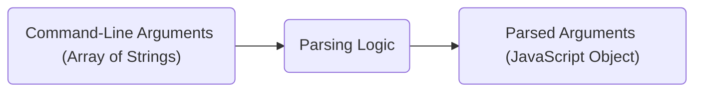
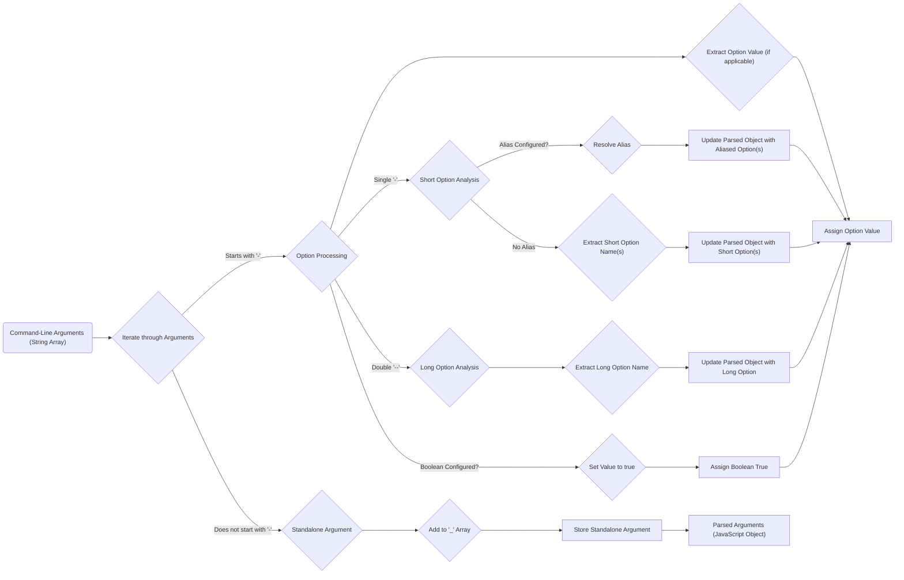

# Project Design Document: Minimist Command-Line Argument Parser

**Version:** 1.1
**Date:** October 26, 2023
**Author:** AI Software Architect

## 1. Project Overview

This document provides an enhanced design specification for the `minimist` project, a lightweight yet powerful JavaScript library designed for parsing command-line arguments. This document aims to offer a comprehensive understanding of the project's architectural nuances, component interactions, and data flow mechanisms. It serves as a crucial artifact for subsequent threat modeling exercises and provides a detailed blueprint of the system. `minimist` efficiently transforms an array of strings, typically derived from `process.argv.slice(2)`, into a structured JavaScript object representing the parsed command-line arguments.

## 2. Goals and Objectives

*   **Primary Goal:** To reliably and efficiently parse command-line arguments into a well-structured JavaScript object.
*   **Objectives:**
    *   Accurately identify command-line options distinguished by leading hyphens (`-`).
    *   Seamlessly handle both abbreviated (short) options (e.g., `-a`) and verbose (long) options (e.g., `--long-option`).
    *   Effectively process argument values associated with options (e.g., `--name John`).
    *   Intelligently recognize boolean flags, which are options present without explicit values.
    *   Provide a mechanism for defining aliases for option names, enhancing flexibility.
    *   Correctly process standalone arguments that are not associated with any specific option.
    *   Maintain a lean and performant codebase, ensuring minimal overhead.

## 3. Scope

This design document focuses on the fundamental mechanisms of `minimist` in parsing command-line arguments. The scope encompasses:

*   The format of the input: command-line arguments represented as an array of strings.
*   The internal logic and data structures employed during the parsing process.
*   The structure and format of the output: the resulting JavaScript object.
*   Key configuration options that influence parsing behavior, including `alias`, `boolean`, `default`, and `string`.

This document explicitly excludes:

*   Specific use cases or detailed integration patterns with other JavaScript libraries or frameworks.
*   Advanced error handling strategies beyond the core parsing logic.
*   In-depth performance optimization techniques or benchmarks.
*   Details regarding the library's build process, testing methodologies, or contribution guidelines.

## 4. High-Level Architecture

At a high level, `minimist` functions as a single, self-contained function that accepts an array of strings as input and produces a JavaScript object as output. The fundamental process can be illustrated as follows:

*   **Input:** An array of strings representing the command-line arguments. This is typically obtained by slicing the `process.argv` array in Node.js (e.g., `process.argv.slice(2)`).
*   **Parsing Logic:** The central function within the `minimist` library. It iterates through the input array, interpreting each element as either an option, an option value, or a standalone argument based on its syntax and configured options.
*   **Output:** A JavaScript object where:
    *   Option names (with leading hyphens removed) serve as keys.
    *   The corresponding option values are assigned to these keys.
    *   Boolean flags, when present, are represented with a value of `true`.
    *   Standalone arguments, those not associated with any option, are collected and stored in a property named `_` (underscore) as an array of strings.

## 5. Detailed Design

The core functionality of `minimist` resides within its parsing function. The following details the key components and their interactions during the parsing process:

*   **Input Acquisition and Initial Setup:**
    *   The primary parsing function accepts an array of strings representing the command-line arguments.
    *   An optional configuration object can be provided to customize the parsing behavior. This object can include settings for aliases, boolean flags, default values, and forced string types.

*   **Iterative Argument Processing:**
    *   The function iterates through the input array of arguments sequentially.
    *   For each argument, it determines its type: option, option value, or standalone argument.

*   **Option Identification and Handling:**
    *   Arguments beginning with `-` or `--` are identified as options.
        *   **Short Option Handling (`-`):**
            *   A single hyphen followed by a character (e.g., `-a`) denotes a short option.
            *   Multiple short options can be combined after a single hyphen (e.g., `-abc` is equivalent to `-a -b -c`).
            *   If an alias configuration exists, the short option is mapped to its corresponding long option name(s).
        *   **Long Option Handling (`--`):**
            *   A double hyphen followed by a word (e.g., `--name`) denotes a long option.
            *   Long options can have associated values specified in the next argument (e.g., `--name John`) or using an equals sign (e.g., `--name=John`).

*   **Option Value Extraction:**
    *   If an option is expected to have a value, the subsequent argument in the array (that does not start with a hyphen) is considered the value for that option.
    *   For long options using the equals sign syntax (e.g., `--name=John`), the value is extracted directly.
    *   If an option is configured as a boolean flag, its presence (without an explicit value) sets its value to `true` in the output object.

*   **Configuration-Driven Parsing:**
    *   **Alias Resolution:** If an `alias` configuration is provided, short option names are internally mapped to their designated long option names before being added to the output object.
    *   **Boolean Flag Interpretation:** Options listed in the `boolean` configuration are treated as boolean flags. If such an option is encountered, its value in the output object is set to `true`.
    *   **Default Value Application:** If a `default` configuration is provided, and an option is not present in the input arguments, its corresponding default value from the configuration is included in the output object.
    *   **String Type Enforcement:** Options specified in the `string` configuration are always treated as strings. This prevents automatic type coercion (e.g., a string that looks like a number being treated as a number).

*   **Standalone Argument Handling:**
    *   Arguments that do not begin with a hyphen are considered standalone arguments.
    *   These standalone arguments are collected and stored in the `_` (underscore) property of the output object as an array, maintaining their order.

*   **End of Options Delimiter (`--`):**
    *   The presence of `--` in the command-line arguments signals the end of option parsing.
    *   Any subsequent arguments after `--` are treated as standalone arguments, even if they start with a hyphen.

*   **Output Object Construction:**
    *   A JavaScript object is dynamically built to store the parsed arguments.
    *   Option names (after alias resolution) become the keys of this object.
    *   The corresponding option values, boolean flags, or default values are assigned to these keys.
    *   The `_` property holds the array of standalone arguments.

## 6. Data Flow Diagram

## 7. Security Considerations (Initial)

While `minimist` is designed to be a lightweight and efficient library, it's crucial to consider potential security implications, particularly when processing input from untrusted sources:

*   **Prototype Pollution Vulnerability:**  Maliciously crafted command-line arguments could potentially manipulate the prototype of the resulting JavaScript object. For example, an attacker might provide an argument like `--__proto__.polluted=true`. If not handled carefully, this could inject properties into the `Object.prototype`, leading to unexpected behavior or security vulnerabilities across the application.
*   **Denial-of-Service (DoS) Potential:**  Extremely long or deeply nested command-line arguments could potentially consume excessive processing time or memory resources during the parsing phase, leading to a denial-of-service condition. Consider scenarios with a very large number of arguments or extremely long option names/values.
*   **Command Injection via Argument Injection:** If the parsed arguments are subsequently used to construct and execute shell commands or interact with external systems without proper sanitization or escaping, it could lead to command injection vulnerabilities. An attacker could inject malicious commands through argument values.
*   **Integer Overflow or Unexpected Type Coercion:** If argument values are expected to be numeric, but are not strictly validated, malicious input could cause integer overflows or unexpected type coercion issues, potentially leading to application errors or unexpected behavior.
*   **Regular Expression Denial of Service (ReDoS):** While less likely in the core parsing logic of `minimist`, if any internal string processing or validation relies on complex regular expressions, carefully crafted input could exploit inefficiencies in the regex engine, leading to a ReDoS attack.

These initial security considerations will form the basis for a more detailed threat modeling exercise to identify specific attack vectors and mitigation strategies.

## 8. Assumptions

*   The primary intended use case for `minimist` is parsing command-line arguments for Node.js applications.
*   The input array of strings is generally assumed to be derived from processing the `process.argv` array within a Node.js environment.
*   The library is designed for basic command-line argument parsing and does not inherently provide advanced features such as strict argument validation against predefined schemas or automatic type coercion beyond basic string and boolean handling as configured.

## 9. Future Considerations

*   **Formal TypeScript Definitions:** Providing and maintaining official TypeScript definition files would significantly enhance type safety and improve the developer experience for TypeScript users.
*   **Enhanced Argument Validation Capabilities:** Incorporating options for more explicit and configurable argument validation rules could improve the robustness and security of applications using `minimist`.
*   **Improved Error Handling and Reporting:** Providing more informative error messages or mechanisms for handling parsing errors gracefully could aid in debugging and improve the overall user experience.
*   **Performance Benchmarking and Optimization:** Conducting thorough performance analysis and implementing optimizations in the parsing logic could be beneficial for performance-critical applications that process a large number of command-line arguments frequently.
*   **Consideration for Asynchronous Parsing (Potentially):** While not immediately necessary, exploring the potential for asynchronous parsing in scenarios with extremely large input sets could be a future consideration.