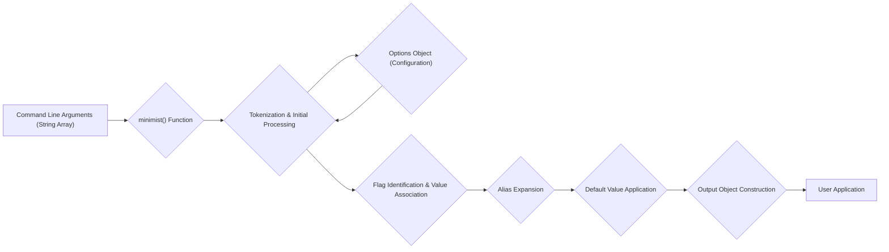

# Project Design Document: Minimist Command-Line Argument Parser

**Version:** 1.1
**Date:** October 26, 2023
**Author:** AI Software Architect

## 1. Introduction

This document provides an enhanced and more detailed design overview of the `minimist` project, a widely used Node.js library for parsing command-line arguments. This document is specifically tailored to serve as a robust foundation for subsequent threat modeling activities, offering a comprehensive understanding of the system's architecture, components, and data flow.

## 2. Goals

The primary goals of this design document are to:

*   Provide a clear and in-depth description of the functionality and architecture of the `minimist` library.
*   Thoroughly identify the key components and their interactions, including internal processing steps.
*   Accurately illustrate the data flow within the library, highlighting critical stages.
*   Offer sufficient detail and context to facilitate effective and targeted threat modeling.
*   Strictly adhere to specified formatting guidelines (markdown, mermaid, no tables).

## 3. Overview

`minimist` is a lightweight yet powerful Node.js library designed to parse command-line arguments provided as an array of strings (typically obtained from `process.argv.slice(2)`). It transforms these raw strings into a more structured and easily accessible JavaScript object. This object represents the parsed arguments as key-value pairs, where keys correspond to argument names (flags) and values represent the associated argument values. The library supports a variety of common command-line argument formats, including boolean flags, key-value pairs (using `=` or separate tokens), combined flags, and more complex scenarios configurable through options.

## 4. Detailed Design

### 4.1. Core Functionality

The central entry point of the library is the `minimist()` function. This function accepts an array of strings representing the command-line arguments and optionally an `options` object to customize the parsing behavior. It returns a JavaScript object containing the parsed arguments.

### 4.2. Input Processing Stages

The `minimist()` function processes the input array of strings through a series of distinct stages:

*   **Tokenization:** The input array of strings is iterated over, and each string is treated as a token.
*   **Flag Identification:** Tokens starting with one or two hyphens (`-` or `--`) are identified as potential flags.
    *   Single hyphen flags (e.g., `-a`) can represent either a boolean flag or a series of grouped boolean flags (e.g., `-abc` is equivalent to `-a -b -c`).
    *   Double hyphen flags (e.g., `--name`) typically represent named arguments.
*   **Value Association:**  The library attempts to associate values with identified flags.
    *   For flags with an equals sign (e.g., `--name=value`), the part after the `=` is treated as the value.
    *   For flags followed by another token (e.g., `--name value`), the subsequent token is treated as the value.
    *   For boolean flags, if no explicit value is provided, the value defaults to `true`.
*   **Alias Expansion:** If an `alias` option is provided, short aliases (e.g., `-n`) are expanded to their corresponding full argument names (e.g., `--name`).
*   **Default Value Application:** If a `default` option is provided, and an argument is not present in the input, its default value is assigned in the output object.
*   **Boolean Flag Handling (Forced):** If the `boolean` option is provided, specified arguments are always treated as boolean flags, regardless of whether a value is provided.
*   **String Flag Handling (Forced):** If the `string` option is provided, specified arguments are always treated as strings.
*   **Stop Argument Handling:** When the `--` token is encountered, all subsequent tokens are treated as positional arguments and are not parsed as flags.
*   **Multiple Value Collection:** If the `collect` option is used for a specific argument, and that argument appears multiple times, its values are collected into an array.
*   **Unknown Argument Handling:** If an `unknown` function is provided in the options, it is called for arguments that cannot be parsed according to the defined rules.

### 4.3. Output Object Structure

The `minimist()` function returns a JavaScript object whose structure reflects the parsed command-line arguments:

*   **Named Arguments:** Arguments identified by flags become properties of the object. For example, `--name value` results in `output.name = 'value'`.
*   **Boolean Flags:** Boolean flags are represented as properties with a boolean value. For example, `--verbose` results in `output.verbose = true`.
*   **Positional Arguments:** Arguments that are not identified as flags are stored in the `_` property of the output object as an array. The order of these arguments is preserved.
*   **Double-Hyphen Arguments:** Arguments starting with `--` are typically used as keys directly in the output object.
*   **Single-Hyphen Grouped Booleans:**  Single-hyphen flags can be grouped (e.g., `-abc`). This results in individual boolean properties for each letter (e.g., `output.a = true`, `output.b = true`, `output.c = true`).
*   **Alias Resolution:** Aliases are resolved, and the value is assigned to the primary argument name in the output object.
*   **Default Values:** Default values specified in the `default` option are present in the output object if the corresponding argument was not provided in the input.

### 4.4. Options Object Details

The optional `options` object provides fine-grained control over the parsing process:

*   **`alias`:** An object where keys are the alias names (e.g., `'n'`) and values are the corresponding full argument names (e.g., `'name'`). Example: `{ n: 'name', v: 'verbose' }`.
*   **`default`:** An object where keys are argument names (e.g., `'port'`) and values are their default values (e.g., `8080`). Example: `{ port: 8080, debug: false }`.
*   **`boolean`:** An array of argument names that should always be treated as boolean flags. Example: `['verbose', 'debug']`.
*   **`string`:** An array of argument names that should always be treated as strings. Example: `['version']`.
*   **`stopEarly`:** A boolean value. If `true`, parsing stops after the first non-option argument.
*   **`unknown`:** A function that takes one argument (the unknown option) and should return `true` if the option is valid, otherwise `false`. This allows for custom validation or handling of unknown arguments.
*   **`"--"`:** A boolean value. If `true`, the arguments after the `--` delimiter are stored in the `--` property of the output object as an array.
*   **`collect`:** An array of argument names whose values should be collected into an array if the argument is specified multiple times. Example: `['include']`.

## 5. Data Flow Diagram

## 6. Security Considerations (For Threat Modeling)

The following aspects of `minimist` are particularly relevant for security threat modeling:

*   **Input Validation Vulnerabilities:** `minimist` is designed to be flexible and generally does not perform strict input validation. This can lead to unexpected behavior or vulnerabilities if the user application relies on specific input formats. For example, providing non-numeric input to an argument expected to be a number might not throw an error in `minimist` but could cause issues in the application logic.
*   **Prototype Pollution:** The way `minimist` constructs the output object, especially when handling aliases and default values, needs careful scrutiny to prevent prototype pollution vulnerabilities. Maliciously crafted input could potentially overwrite properties on the `Object.prototype`, leading to widespread security implications. For example, an attacker might try to inject `__proto__.polluted = true` through command-line arguments.
*   **Denial of Service (DoS):** While less likely due to the library's core functionality, consider if extremely long or deeply nested argument structures could lead to excessive processing time or memory consumption, potentially causing a denial of service. For instance, a very long string assigned to an argument could consume significant memory.
*   **Information Disclosure through Error Handling (Limited):** While `minimist` itself doesn't have extensive error handling that could leak information, the way the *user application* handles the parsed output is crucial. If the application exposes error messages based on the parsed arguments, this could potentially leak information.
*   **Dependency Chain Risks:** Although `minimist` has no direct dependencies, the applications that use it do. Vulnerabilities in those downstream dependencies could be exploited through the arguments parsed by `minimist`.
*   **Configuration Vulnerabilities:** Misconfiguration of the `options` object can introduce vulnerabilities. For example, overly broad or incorrect alias configurations could lead to unexpected argument parsing. Allowing arbitrary values for certain arguments without proper validation in the user application is also a risk.
*   **Regular Expression Complexity (Internal):** While not explicitly exposed, if internal parsing logic relies on complex regular expressions, these should be reviewed for potential Regular expression Denial of Service (ReDoS) vulnerabilities. Although less likely in a simple parser like `minimist`, it's a general consideration for any text processing library.
*   **Type Confusion:**  Due to the dynamic nature of JavaScript, and `minimist`'s flexible parsing, there's a potential for type confusion if the user application doesn't strictly validate the types of the parsed arguments. For example, an argument intended to be a boolean might be parsed as a string if not handled carefully.

## 7. Assumptions and Constraints

*   This design document focuses on the core parsing functionality of the `minimist` library and its configurable options.
*   It assumes a foundational understanding of Node.js and the concept of command-line arguments.
*   The subsequent threat modeling process will leverage the detailed information presented in this document to identify potential security vulnerabilities.

## 8. Future Considerations

*   A deeper dive into the specific algorithms and data structures used within the parsing logic could provide further insights for security analysis.
*   Performance benchmarking under various input scenarios, including potentially malicious inputs, could help identify potential DoS vulnerabilities.
*   Exploring potential security enhancements or mitigations that could be implemented within the `minimist` library itself, such as optional input validation or sanitization features.
*   Analyzing the impact of potential future changes or additions to the library's functionality on its security posture.