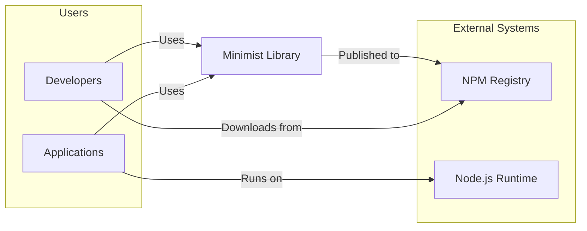
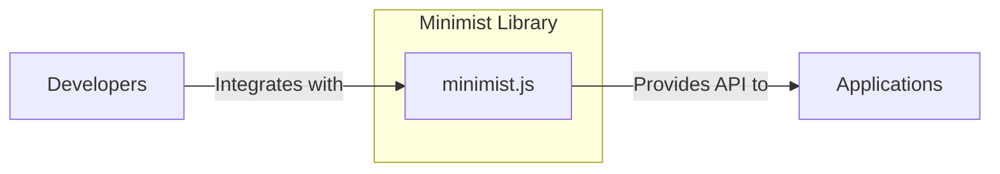
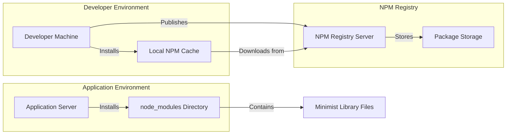
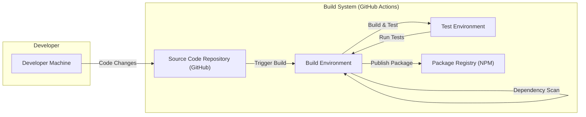

# BUSINESS POSTURE

This project, minimist, is a utility library for parsing command-line arguments in JavaScript. It is designed to be a small, portable, and dependency-free module that can be easily integrated into other Node.js projects or used in browser environments.

Business priorities for a library like minimist are:
- Stability: The library should be reliable and function as expected across different environments and Node.js versions.
- Compatibility: It should be compatible with a wide range of Node.js versions and browser environments.
- Performance:  Argument parsing should be efficient and not introduce significant overhead to applications using it.
- Security: The library must be free from vulnerabilities that could be exploited by malicious command-line arguments.
- Maintainability: The codebase should be easy to understand and maintain, allowing for timely security updates and bug fixes.

The primary business goal is to provide a robust and secure command-line argument parsing solution that developers can confidently use in their projects.

Most important business risks related to minimist:
- Dependency Risk: Applications depend on minimist. If minimist has a vulnerability, all dependent applications are potentially vulnerable.
- Supply Chain Risk: If the minimist package on npm is compromised, applications using it could be affected.
- Reputation Risk: If a security vulnerability is found in minimist, it could damage the reputation of projects that rely on it and the maintainers of minimist.
- Availability Risk: If a vulnerability causes crashes or denial of service in applications using minimist, it can impact the availability of those applications.

# SECURITY POSTURE

Existing security controls:
- security control: Code review - The project is open source and available on GitHub, allowing for community code review. (Implemented: GitHub Repository)
- security control: Automated testing - The project includes unit tests to verify functionality. (Implemented: GitHub Actions, package.json scripts)

Accepted risks:
- accepted risk: Dependency vulnerabilities - As a library, minimist itself has minimal dependencies, reducing direct dependency vulnerability risks. However, vulnerabilities in the Node.js runtime or environment where it is used are accepted risks.
- accepted risk: Input validation complexity -  Minimist provides basic argument parsing but relies on the consuming application to perform higher-level input validation and sanitization based on the application's specific needs. The risk of improper input validation in consuming applications is accepted.

Recommended security controls:
- security control: Static Application Security Testing (SAST) - Integrate SAST tools into the CI/CD pipeline to automatically scan the codebase for potential vulnerabilities.
- security control: Dependency scanning - Although minimist has minimal dependencies, dependency scanning can help ensure no unexpected or vulnerable dependencies are introduced in the future.
- security control: Security focused code review - Conduct specific security focused code reviews, especially when introducing new features or modifying core parsing logic.
- security control: Signed releases - Sign npm package releases to enhance supply chain security and verify package integrity.

Security requirements:
- Authentication: Not applicable to a library like minimist. Authentication is handled by the applications that use minimist.
- Authorization: Not applicable to a library like minimist. Authorization is handled by the applications that use minimist based on the parsed arguments.
- Input validation: Minimist itself performs basic parsing of command-line arguments. Security-critical input validation must be implemented by the applications that use minimist to interpret and process the parsed arguments. Minimist should avoid introducing vulnerabilities through its parsing logic, such as injection flaws or denial of service.
- Cryptography: Not directly applicable to minimist. Cryptographic operations would be handled by the applications using minimist if needed based on the parsed arguments. Minimist itself should not implement or require cryptographic functions.

# DESIGN

## C4 CONTEXT

### Context Diagram Elements

- Name: Developers
  - Type: User
  - Description: Software developers who use minimist as a dependency in their Node.js projects.
  - Responsibilities: Integrate minimist into their applications, use minimist API to parse command-line arguments, perform input validation on parsed arguments within their applications.
  - Security controls: Secure development practices in applications using minimist, input validation implementation.

- Name: Applications
  - Type: Software System
  - Description: Node.js applications that depend on minimist for command-line argument parsing.
  - Responsibilities: Execute application logic based on parsed command-line arguments, handle user input securely, implement application-level security controls.
  - Security controls: Application-level authentication, authorization, input validation, secure configuration management.

- Name: Minimist Library
  - Type: Software System
  - Description: A JavaScript library for parsing command-line arguments.
  - Responsibilities: Parse command-line arguments provided to applications, provide a simple API for accessing parsed arguments.
  - Security controls: Code review, automated testing, SAST, dependency scanning, secure build process.

- Name: NPM Registry
  - Type: External System
  - Description: The public registry for Node.js packages, used to distribute and download minimist.
  - Responsibilities: Host and distribute minimist package, provide package integrity verification mechanisms.
  - Security controls: Package signing, vulnerability scanning, access control.

- Name: Node.js Runtime
  - Type: External System
  - Description: The JavaScript runtime environment in which applications using minimist are executed.
  - Responsibilities: Execute JavaScript code, provide system-level security features.
  - Security controls: Operating system security, runtime environment security updates, process isolation.

## C4 CONTAINER

### Container Diagram Elements

- Name: minimist.js
  - Type: Container - JavaScript Module
  - Description: The main JavaScript file containing the implementation of the minimist library. It includes the argument parsing logic and API.
  - Responsibilities: Parse command-line arguments, expose API for accessing parsed arguments, handle different argument formats.
  - Security controls: Input validation within parsing logic, code review, automated testing, SAST.

- Name: Developers
  - Type: User
  - Description: Software developers who integrate the minimist.js module into their projects.
  - Responsibilities:  Include minimist.js in their projects, use the API correctly, understand the parsing behavior.
  - Security controls: Secure coding practices when using minimist API.

- Name: Applications
  - Type: Software System
  - Description: Node.js applications that utilize the minimist.js module for command-line argument parsing.
  - Responsibilities: Call minimist API to parse arguments, process parsed arguments, implement application logic.
  - Security controls: Application-level security controls, input validation on parsed arguments.

## DEPLOYMENT

Minimist as a library is not deployed in the traditional sense of a running application. It is published to the NPM registry and then included as a dependency within other Node.js applications. The "deployment" context here refers to how minimist is made available for use by developers and applications.

Deployment Architecture: NPM Registry Distribution

### Deployment Diagram Elements

- Name: Developer Machine
  - Type: Environment
  - Description: The local development environment used by developers to work on and publish the minimist library.
  - Responsibilities: Development, testing, building, and publishing the minimist package.
  - Security controls: Developer workstation security, code signing keys (for publishing).

- Name: Local NPM Cache
  - Type: Environment
  - Description: Local cache on developer machines where downloaded NPM packages are stored.
  - Responsibilities: Caching downloaded packages to speed up installation.
  - Security controls: File system permissions.

- Name: NPM Registry Server
  - Type: Infrastructure
  - Description: The server infrastructure hosting the NPM registry.
  - Responsibilities:  Serving package download requests, managing package metadata, user authentication for publishing.
  - Security controls: Server hardening, access control, DDoS protection, vulnerability scanning.

- Name: Package Storage
  - Type: Infrastructure
  - Description: Storage system within the NPM registry that stores the actual package files.
  - Responsibilities: Securely storing package files, ensuring data integrity and availability.
  - Security controls: Data encryption at rest, access control, backup and recovery.

- Name: Application Server
  - Type: Environment
  - Description: Server environment where applications that depend on minimist are deployed and run.
  - Responsibilities: Running applications, installing dependencies, executing application code.
  - Security controls: Server hardening, runtime environment security, access control, network security.

- Name: node_modules Directory
  - Type: Environment
  - Description: Directory within an application's project where NPM dependencies, including minimist, are installed.
  - Responsibilities: Storing installed dependencies for use by the application.
  - Security controls: File system permissions.

- Name: Minimist Library Files
  - Type: Software Component
  - Description: The files of the minimist library as installed within the node_modules directory of an application.
  - Responsibilities: Providing command-line argument parsing functionality to the application.
  - Security controls: Integrity verification during download (via package checksums).

## BUILD

### Build Process Elements

- Name: Developer Machine
  - Type: Environment
  - Description: Developer's local machine where code changes are made and potentially tested locally before committing.
  - Responsibilities: Writing code, running local tests, committing code changes.
  - Security controls: Developer workstation security, code signing (optional for commits).

- Name: Source Code Repository (GitHub)
  - Type: System
  - Description: GitHub repository hosting the minimist source code.
  - Responsibilities: Version control, code storage, collaboration, triggering CI/CD pipelines.
  - Security controls: Access control, branch protection, audit logging.

- Name: Build Environment (GitHub Actions)
  - Type: Environment
  - Description: GitHub Actions environment used for automated builds.
  - Responsibilities: Compiling (if needed), running linters, performing SAST and dependency scans, running unit tests, building package artifacts.
  - Security controls: Secure build environment, access control to secrets, isolated build jobs.

- Name: Test Environment (GitHub Actions)
  - Type: Environment
  - Description: Environment within GitHub Actions used for running automated tests.
  - Responsibilities: Executing unit tests to verify code functionality.
  - Security controls: Isolated test environment, secure test data management.

- Name: Package Registry (NPM)
  - Type: System
  - Description: NPM registry where the minimist package is published.
  - Responsibilities: Hosting and distributing the minimist package.
  - Security controls: Package signing, access control for publishing, vulnerability scanning.

# RISK ASSESSMENT

Critical business process:
- Secure command-line argument parsing in applications. Minimist indirectly supports the functionality and security of applications that rely on command-line interfaces. If minimist is vulnerable, applications using it can be vulnerable.

Data sensitivity:
- Command-line arguments can contain sensitive data, such as passwords, API keys, file paths, and user-provided input. Minimist itself processes these arguments but does not store or manage them. The sensitivity of data handled by minimist depends entirely on how it is used by consuming applications. If applications pass sensitive data through command-line arguments and rely on minimist to parse them, then minimist becomes part of the sensitive data handling process.

Data we are trying to protect:
- Integrity of the minimist library itself: Ensuring that the code is not tampered with and remains free from vulnerabilities.
- Availability of the minimist library: Ensuring that the library is available for developers to use and applications to depend on.
- Confidentiality and integrity of data processed by applications using minimist: While minimist doesn't directly handle sensitive data storage, it plays a role in how applications process command-line inputs, which can include sensitive data.

# QUESTIONS & ASSUMPTIONS

Questions:
- What is the intended scope of security responsibility for the minimist library maintainers versus the applications that use it?
- Are there specific types of applications or use cases where minimist is most commonly used? Understanding the typical use cases can help prioritize security concerns.
- Are there any known historical security vulnerabilities or concerns related to minimist or similar argument parsing libraries?
- What is the process for reporting and addressing security vulnerabilities in minimist?

Assumptions:
- BUSINESS POSTURE: The primary business goal is to provide a stable, reliable, and secure utility library for the JavaScript ecosystem. Security is a significant non-functional requirement.
- SECURITY POSTURE: Current security controls are basic (code review, testing). There is an opportunity to enhance security posture by implementing SAST, dependency scanning, and security-focused code reviews. Applications using minimist are responsible for application-level security controls and input validation of parsed arguments.
- DESIGN: The design is simple, focused on a single JavaScript module. Deployment is via NPM registry distribution. The build process can be enhanced with more security checks.