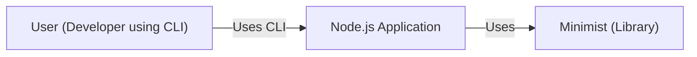
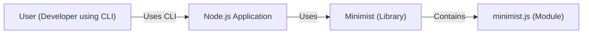
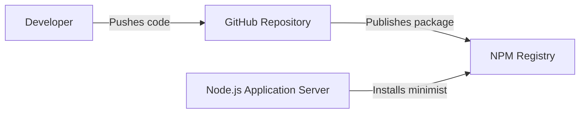
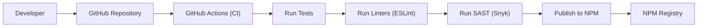

# BUSINESS POSTURE

Business Priorities and Goals:

The `minimist` project is a lightweight, popular (heavily downloaded) JavaScript library for parsing command-line arguments. Its primary goal is to provide a simple and efficient way for developers to handle command-line options in their Node.js applications. The project prioritizes ease of use, minimal dependencies, and broad compatibility. The business value lies in its widespread adoption, making it a critical component in many Node.js command-line tools and applications.

Business Risks:

*   Vulnerabilities: Given its widespread use, any vulnerability in `minimist` can have a significant impact on a large number of applications. This makes it an attractive target for attackers. Specifically, prototype pollution vulnerabilities have been a recurring issue.
*   Supply Chain Attacks: As a foundational library, a compromised version of `minimist` could be used to inject malicious code into numerous downstream applications.
*   Maintainability: The project's reliance on a small number of maintainers (or even a single maintainer) introduces a risk of abandonment or slow response to security issues.
*   Reputation: Security incidents can damage the reputation of the library and erode trust within the developer community.

# SECURITY POSTURE

Existing Security Controls:

*   security control: Issue Tracking: The GitHub repository provides a platform for reporting and tracking security vulnerabilities. (Described in GitHub Issues)
*   security control: Community Vigilance: The large user base and open-source nature of the project mean that vulnerabilities are often quickly identified and reported by the community. (Described in GitHub Issues)
*   security control: Code Review: While not explicitly formalized, pull requests are subject to review by maintainers before being merged. (Described in GitHub Pull Requests)
*   security control: Versioning: The project uses semantic versioning, allowing users to easily identify and avoid versions with known vulnerabilities. (Described in package.json and GitHub Releases)

Accepted Risks:

*   accepted risk: Limited Formal Security Processes: The project appears to lack formal security processes such as regular security audits, penetration testing, or a dedicated security team.
*   accepted risk: Dependency on Community Reporting: The project relies heavily on the community to identify and report vulnerabilities, which may not be sufficient for proactive security.
*   accepted risk: Single Point of Failure: The project's reliance on a small number of maintainers creates a single point of failure for security updates and maintenance.

Recommended Security Controls:

*   security control: Implement a Security Policy: Create a `SECURITY.md` file in the repository outlining the vulnerability reporting process, security considerations, and supported versions.
*   security control: Static Analysis: Integrate static analysis tools (e.g., ESLint with security plugins, Snyk, SonarQube) into the development workflow to automatically detect potential vulnerabilities.
*   security control: Fuzz Testing: Introduce fuzz testing to identify unexpected behavior and potential vulnerabilities by providing random or malformed inputs to the library.
*   security control: Regular Dependency Updates: Regularly update dependencies to address known vulnerabilities in third-party libraries.
*   security control: Security Audits: Consider periodic security audits by independent security researchers.

Security Requirements:

*   Authentication: Not applicable, as `minimist` is a library and does not handle authentication.
*   Authorization: Not applicable, as `minimist` is a library and does not handle authorization.
*   Input Validation:
    *   Requirement: The library should handle various input formats correctly, including edge cases and potentially malicious inputs.
    *   Requirement: The library should prevent prototype pollution vulnerabilities by sanitizing input and avoiding unsafe operations on object prototypes.
    *   Requirement: The library should provide clear error messages for invalid input, without revealing sensitive information.
*   Cryptography: Not applicable, as `minimist` does not handle cryptographic operations.

# DESIGN

## C4 CONTEXT

Element Descriptions:

*   Element:
    *   Name: User
    *   Type: Person
    *   Description: A developer interacting with a Node.js application via the command line.
    *   Responsibilities: Provides command-line arguments to the application.
    *   Security controls: None (external to the system).

*   Element:
    *   Name: Minimist
    *   Type: Library
    *   Description: The `minimist` library for parsing command-line arguments.
    *   Responsibilities: Parses command-line arguments into a structured object.
    *   Security controls: Input validation, prototype pollution prevention.

*   Element:
    *   Name: Node.js Application
    *   Type: Software System
    *   Description: A Node.js application that uses `minimist` to handle command-line arguments.
    *   Responsibilities: Executes the application logic based on the parsed arguments.
    *   Security controls: Application-specific security controls.

## C4 CONTAINER

Element Descriptions:

*   Element:
    *   Name: User
    *   Type: Person
    *   Description: A developer interacting with a Node.js application via the command line.
    *   Responsibilities: Provides command-line arguments to the application.
    *   Security controls: None (external to the system).

*   Element:
    *   Name: Node.js Application
    *   Type: Software System
    *   Description: A Node.js application that uses `minimist` to handle command-line arguments.
    *   Responsibilities: Executes the application logic based on the parsed arguments.
    *   Security controls: Application-specific security controls.

*   Element:
    *   Name: Minimist
    *   Type: Library
    *   Description: The `minimist` library for parsing command-line arguments.
    *   Responsibilities: Parses command-line arguments into a structured object.
    *   Security controls: Input validation, prototype pollution prevention.

*   Element:
    *   Name: MinimistModule
    *   Type: Module
    *   Description: The main JavaScript module (`minimist.js`) containing the parsing logic.
    *   Responsibilities: Implements the argument parsing algorithm.
    *   Security controls: Input validation, prototype pollution prevention (implementation details).

## DEPLOYMENT

Deployment Solutions:

1.  NPM Registry: Developers install `minimist` via the npm package manager. This is the primary and recommended deployment method.
2.  GitHub Repository: Developers can clone the repository directly, although this is less common for typical usage.
3.  CDN: While less common for libraries primarily used in Node.js environments, `minimist` could potentially be served via a CDN for browser-based use cases.

Chosen Solution (NPM Registry):

Element Descriptions:

*   Element:
    *   Name: Developer
    *   Type: Person
    *   Description: A developer maintaining the `minimist` library.
    *   Responsibilities: Writes code, manages the repository, publishes releases.
    *   Security controls: Code review, secure coding practices.

*   Element:
    *   Name: GitHub Repository
    *   Type: Code Repository
    *   Description: The source code repository for `minimist`.
    *   Responsibilities: Stores the code, tracks changes, manages releases.
    *   Security controls: Access controls, branch protection rules.

*   Element:
    *   Name: NPM Registry
    *   Type: Package Registry
    *   Description: The public registry for Node.js packages.
    *   Responsibilities: Hosts the published `minimist` package.
    *   Security controls: Registry-level security measures (e.g., two-factor authentication for publishers).

*   Element:
    *   Name: Node.js Application Server
    *   Type: Server
    *   Description: The server where a Node.js application using `minimist` is deployed.
    *   Responsibilities: Runs the application.
    *   Security controls: Server-level security measures (e.g., firewalls, intrusion detection systems).

## BUILD

Build Process Description:

1.  Developer: The developer writes code and pushes changes to the GitHub repository.
2.  GitHub: The GitHub repository hosts the code and triggers the CI/CD pipeline (GitHub Actions).
3.  GitHub Actions: GitHub Actions orchestrates the build process.
4.  Tests: The CI pipeline runs automated tests to ensure the code functions correctly.
5.  Linters: The CI pipeline runs linters (e.g., ESLint) to enforce code style and identify potential issues.
6.  SAST: The CI pipeline runs static application security testing (SAST) tools (e.g., Snyk) to detect vulnerabilities.
7.  Publish: If all checks pass, the CI pipeline publishes the package to the NPM registry.
8.  NPM: The NPM registry hosts the published package, making it available for installation.

Security Controls:

*   security control: Automated Testing: Unit tests and integration tests are run automatically to verify code correctness.
*   security control: Linting: Linters enforce code style and identify potential errors.
*   security control: Static Analysis (SAST): SAST tools scan the code for vulnerabilities.
*   security control: CI/CD Pipeline: GitHub Actions automates the build and deployment process, ensuring consistency and reducing manual errors.
*   security control: NPM Publish Security: The publishing process to NPM should require two-factor authentication and use access tokens with limited scope.

# RISK ASSESSMENT

Critical Business Processes:

*   Providing a reliable and secure command-line argument parsing library for Node.js applications.
*   Maintaining the trust and reputation of the library within the developer community.

Data Protection:

*   Data Sensitivity: `minimist` itself does not handle sensitive data directly. However, it processes command-line arguments, which *could* contain sensitive information (e.g., passwords, API keys) if misused by developers in their applications. The primary concern is preventing vulnerabilities that could allow attackers to manipulate the parsing process or inject malicious code.

# QUESTIONS & ASSUMPTIONS

Questions:

*   Are there any specific performance requirements or limitations for the library?
*   Are there any plans for future expansion or new features?
*   What is the current process for handling security vulnerability reports?
*   Is there a budget for security tools or audits?
*   What level of test coverage is currently in place?

Assumptions:

*   BUSINESS POSTURE: The project prioritizes simplicity, ease of use, and wide adoption.
*   BUSINESS POSTURE: The project has limited resources for dedicated security personnel or extensive security tooling.
*   SECURITY POSTURE: The project relies primarily on community contributions and informal security practices.
*   DESIGN: The library is designed to be lightweight and have minimal dependencies.
*   DESIGN: The primary deployment method is via the NPM registry.
*   DESIGN: The build process is automated using GitHub Actions.