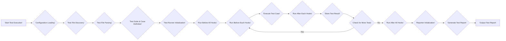

# Project Design Document: Mocha JavaScript Test Framework

**Version:** 1.1
**Date:** October 26, 2023
**Author:** AI Software Architect

## 1. Introduction

This document provides an enhanced design overview of the Mocha JavaScript test framework. It details the key components, architecture, and data flow within the system, offering a deeper understanding of its structure. This document is intended to serve as a robust foundation for subsequent threat modeling activities.

Mocha is a versatile and widely adopted JavaScript test framework that runs on both Node.js and within web browsers. It is designed to be flexible and extensible, providing developers with a powerful tool for writing and executing various types of JavaScript tests.

## 2. Goals and Objectives

The core goals and objectives of the Mocha project are:

* To offer a straightforward and intuitive Application Programming Interface (API) for authoring JavaScript tests.
* To provide robust support for asynchronous testing patterns, including Promises and async/await.
* To enable flexible and customizable reporting of test results.
* To be highly extensible through the use of custom reporters, interfaces, and plugins, allowing for integration with diverse development workflows.
* To ensure cross-environment compatibility, enabling test execution in both Node.js and browser environments.

## 3. System Architecture

Mocha's architecture is modular and well-defined, comprising the following key components:

* **Core Library:** The fundamental codebase responsible for managing the entire test lifecycle, including test discovery, execution orchestration, and result aggregation.
* **Test Loader/Discovery Mechanism:**  The component dedicated to locating and loading test files based on user-defined patterns, directory structures, or specific file paths.
* **Test Runner Engine:** The module that executes individual test cases and manages the associated lifecycle events, such as setup, teardown, and hook execution.
* **Reporter Interface:**  The abstraction layer responsible for formatting and outputting test results to various destinations, supporting a range of built-in formats and allowing for custom implementations.
* **Interface Definition:** The component that defines the syntax and style used for writing tests, offering different paradigms to suit various testing preferences.
* **Configuration Management System:** The module responsible for loading, merging, and managing configuration options sourced from command-line arguments, configuration files, and programmatic settings.
* **Plugin Extensibility Framework:** The system that enables the extension of Mocha's core functionality through custom reporters, interfaces, and other extensions, fostering integration and customization.

## 4. Data Flow

The typical sequence of operations and data flow within Mocha during a test execution is illustrated below:



Detailed explanation of the data flow:

* **Start Test Execution:** The process begins when a user initiates test execution, typically via the command line interface (`mocha`) or programmatically through its API.
* **Configuration Loading:** Mocha loads and consolidates configuration settings from various sources, prioritizing command-line arguments over configuration files and programmatic settings.
* **Test File Discovery:** Based on the loaded configuration, Mocha identifies the relevant test files to be included in the current test run, using glob patterns or specified file paths.
* **Test File Parsing:** The content of the discovered test files is parsed and interpreted to identify and structure test suites and individual test cases defined within the files.
* **Test Suite & Case Definition:** Mocha organizes the parsed tests into a hierarchical structure of test suites and individual test cases, reflecting the organization within the test files.
* **Test Runner Initialization:** The test runner component is initialized with the discovered tests and the loaded configuration, preparing it for the execution phase.
* **Run Before All Hooks:**  `beforeAll` hooks, if defined within a test suite, are executed once before any of the tests within that suite are run.
* **Run Before Each Hooks:** `beforeEach` hooks, if defined, are executed before the execution of each individual test case within a suite.
* **Execute Test Case:** The actual test logic defined within an individual test case is executed. This is where the assertions and validation logic reside.
* **Run After Each Hooks:** `afterEach` hooks, if defined, are executed immediately after each individual test case completes, regardless of its outcome (pass or fail).
* **Store Test Result:** The outcome of the executed test case (pass, fail, pending, skipped) is recorded and stored for later reporting.
* **Check for More Tests:** Mocha checks if there are more test cases remaining to be executed within the current suite or in other discovered test files.
* **Run After All Hooks:** `afterAll` hooks, if defined, are executed once after all the tests within a suite have been executed.
* **Reporter Initialization:** The configured reporter component is initialized, preparing it to process and format the collected test results.
* **Generate Test Report:** The reporter processes the stored test results, aggregating them and formatting them according to its specific output format (e.g., plain text, HTML, JSON).
* **Output Test Report:** The generated test report is outputted to the designated destination, which could be the console, a file, or another configured output stream.

## 5. Key Components in Detail

### 5.1. Core Library

* **Responsibilities:**
    * Orchestrates the entire test execution lifecycle, from discovery to reporting.
    * Manages the creation and execution of test suites and individual test cases.
    * Provides the fundamental API for defining tests and hooks (e.g., `describe()`, `it()`, `before()`, `after()`).
    * Handles error management and exception propagation during test execution.
* **Key Modules:**
    * `lib/mocha.js`: The primary entry point and core logic of the Mocha library.
    * `lib/suite.js`: Defines the `Suite` class, representing a collection of related tests.
    * `lib/test.js`: Defines the `Test` class, representing an individual test case.
    * `lib/context.js`: Manages the `this` context available within tests and hooks, providing access to Mocha's API.

### 5.2. Test Loader/Discovery Mechanism

* **Responsibilities:**
    * Locates test files based on user-specified patterns, typically using glob syntax.
    * Supports various methods for specifying test files, including command-line arguments and configuration file entries.
    * Offers options for recursive directory searching to discover tests in nested folders.
* **Key Mechanisms:**
    * Utilizes Node.js's `require()` mechanism to load test files as modules.
    * Often leverages external libraries like `glob` for efficient file pattern matching.

### 5.3. Test Runner Engine

* **Responsibilities:**
    * Executes individual test cases in a controlled environment.
    * Manages the execution of lifecycle hooks (`before`, `after`, `beforeEach`, `afterEach`) at the appropriate times.
    * Tracks the execution state of each test (pending, running, passed, failed, skipped).
    * Provides support for handling asynchronous operations within tests using Promises, callbacks, and the `async`/`await` syntax.
* **Key Modules:**
    * Core logic resides within `lib/runner.js`.

### 5.4. Reporter Interface

* **Responsibilities:**
    * Formats and presents test results in a user-friendly and informative manner.
    * Supports a variety of built-in output formats, including `spec`, `list`, `progress`, `json`, and `html`.
    * Allows for the creation of custom reporters to integrate with specific tools or reporting platforms.
    * Provides real-time feedback on test execution progress.
* **Examples of Built-in Reporters:**
    * `spec`: Presents results in a hierarchical, nested format.
    * `list`: Displays a simple list of executed tests and their status.
    * `progress`: Shows a progress bar indicating the completion of tests.
    * `json`: Outputs test results in a structured JSON format, suitable for programmatic consumption.
    * `html`: Generates an interactive HTML report of the test results.

### 5.5. Interface Definition

* **Responsibilities:**
    * Defines the syntax and structure used for writing test specifications.
    * Offers different styles to cater to various testing methodologies and developer preferences.
* **Common Interfaces:**
    * **BDD (Behavior-Driven Development):** Employs constructs like `describe()`, `it()`, `before()`, `after()`, `beforeEach()`, `afterEach()`.
    * **TDD (Test-Driven Development):** Utilizes constructs such as `suite()`, `test()`, `setup()`, `teardown()`, `beforeEach()`, `afterEach()`.
    * **Exports:** Allows tests to be defined as properties of the `exports` object in a module.

### 5.6. Configuration Management System

* **Responsibilities:**
    * Loads configuration options from multiple sources, including command-line arguments, dedicated configuration files (e.g., `.mocharc.js`, `.mocharc.json`), and `package.json`.
    * Merges configuration settings from different sources, with command-line arguments typically taking precedence.
    * Provides a consistent mechanism for accessing configuration values throughout the Mocha application.
* **Configuration Sources:**
    * Command-line flags and options (e.g., `--reporter`, `--grep`, `--timeout`).
    * Configuration files in JavaScript, JSON, or YAML formats.
    * Settings within the `mocha` section of a project's `package.json` file.

### 5.7. Plugin Extensibility Framework

* **Responsibilities:**
    * Enables developers to extend Mocha's core functionality by creating and using custom reporters, interfaces, and other extensions.
    * Facilitates integration with other testing tools, assertion libraries, and reporting services.
* **Mechanism:**
    * Typically involves requiring or registering custom modules that adhere to Mocha's plugin API.

## 6. Security Considerations (For Threat Modeling)

Considering Mocha's role in the development process, several security aspects warrant attention for threat modeling:

* **Dependency Vulnerabilities:** Mocha relies on a number of npm packages. Security vulnerabilities in these dependencies could introduce risks to projects using Mocha. This includes potential for arbitrary code execution if vulnerable dependencies are exploited.
* **Malicious Test Code Execution:** Mocha executes arbitrary JavaScript code provided in test files. If developers introduce malicious or poorly written test code, it could potentially lead to unintended consequences, such as data exfiltration, resource exhaustion, or denial-of-service within the testing environment.
* **Sensitive Information Exposure via Reporters:** Custom or poorly implemented reporters might inadvertently expose sensitive information contained within test results, environment variables, or other contextual data. This could be particularly problematic if reports are stored or transmitted insecurely.
* **Configuration Tampering:** If configuration files are not properly secured, malicious actors could potentially modify them to alter test execution behavior, bypass tests, or inject malicious code into the testing process.
* **Third-Party Plugin Risks:**  The use of untrusted or vulnerable third-party reporters, interfaces, or other plugins can introduce security vulnerabilities into the testing environment. These plugins might contain malicious code or have security flaws that could be exploited.
* **Insecure Test Fixtures and Mocks:** If test fixtures or mock data contain sensitive information and are not handled securely, they could become a source of data leaks.

## 7. Deployment

Mocha is typically deployed as a development dependency within a JavaScript project. Installation is commonly performed using npm or yarn:

```bash
npm install --save-dev mocha
# or
yarn add --dev mocha
```

Once installed, Mocha is executed via its command-line interface or integrated into build pipelines and Continuous Integration/Continuous Deployment (CI/CD) systems for automated testing.

## 8. Future Considerations

* **Enhanced Watch Mode Capabilities:** Improvements to the file watching mechanism for more efficient and reliable re-running of tests upon code changes.
* **Advanced Parallel Test Execution Strategies:** Further optimization of parallel test execution to minimize overall test run time, potentially through better resource management and test distribution.
* **More Granular and Flexible Configuration Options:** Providing developers with more fine-grained control over various aspects of test execution and reporting.
* **Improved Support for Modern JavaScript Features:** Ensuring seamless integration and support for the latest ECMAScript features and module systems.

This revised document provides a more detailed and comprehensive design overview of the Mocha JavaScript test framework. It aims to offer a deeper understanding of the system's architecture and serves as an enhanced foundation for subsequent threat modeling activities.
