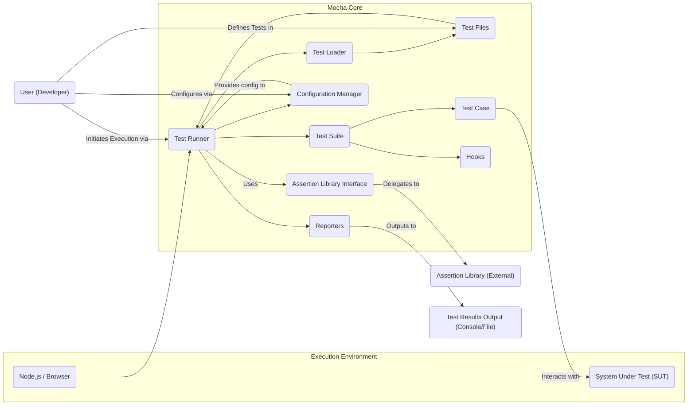
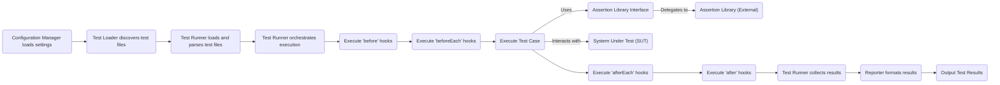

# Project Design Document: Mocha JavaScript Test Framework

**Version:** 1.1
**Date:** October 26, 2023
**Author:** AI Software Architect

## 1. Introduction

This document provides an enhanced architectural design of the Mocha JavaScript test framework, building upon the previous version. It aims to provide a clearer and more detailed understanding of the system's components, their interactions, and the data flow, specifically for the purpose of threat modeling.

Mocha is a versatile JavaScript test framework designed for both Node.js and browser environments. It facilitates asynchronous testing and provides flexible reporting capabilities. This document focuses on the architectural aspects relevant to security considerations.

## 2. Goals and Non-Goals

### 2.1 Goals

*   Provide a more granular description of Mocha's architectural components and their responsibilities.
*   Elaborate on the data flow, highlighting key data transformations and interaction points.
*   Strengthen the identification of potential security considerations relevant for threat modeling exercises.
*   Offer a comprehensive architectural understanding suitable for security analysis.

### 2.2 Non-Goals

*   In-depth analysis of specific code implementations within Mocha.
*   Performance benchmarking or optimization strategies.
*   Detailed guidance on writing effective tests using Mocha's API.
*   A comprehensive comparison with other testing frameworks.

## 3. Architectural Overview

Mocha's architecture revolves around orchestrating the execution of test code and reporting the results. The core components interact to load, run, and report on tests defined by the user.

*   **Test Runner:** The central orchestrator responsible for managing the test lifecycle.
*   **Test Loader:** Discovers and loads test files based on configuration.
*   **Test Suite:** A container for organizing related test cases.
*   **Test Case:** An individual test unit with specific assertions.
*   **Hooks:** Lifecycle methods executed at different stages of the test run.
*   **Reporters:** Format and output test execution results.
*   **Configuration Manager:** Handles loading and managing Mocha's configuration settings.
*   **Assertion Library Interface:**  The point of interaction with external assertion libraries.
*   **Environment (Node.js/Browser):** The runtime environment where Mocha executes.
*   **System Under Test (SUT):** The application or code being tested.

## 4. Detailed Design

### 4.1 Component Diagram

### 4.2 Component Descriptions

*   **Test Runner:**
    *   The primary engine that controls the flow of test execution.
    *   Receives configuration from the Configuration Manager.
    *   Delegates test discovery to the Test Loader.
    *   Manages the execution order of test suites and cases.
    *   Invokes lifecycle hooks at appropriate times.
    *   Collects test results and passes them to the configured Reporter.
    *   Handles asynchronous operations, timeouts, and error management during test execution.

*   **Test Loader:**
    *   Responsible for locating and loading test files.
    *   Accepts file paths, globs, or directory specifications from the Configuration Manager or command-line arguments.
    *   Reads and interprets the content of test files, identifying test suites and cases defined using Mocha's API (`describe`, `it`).

*   **Test Files:**
    *   JavaScript files written by developers containing test specifications.
    *   Organized using Mocha's API to define test suites (`describe`) and individual test cases (`it`).
    *   Contain calls to assertion functions provided by an external assertion library.

*   **Test Suite:**
    *   A logical grouping of related test cases, defined using the `describe` function.
    *   Provides a hierarchical structure for organizing tests.
    *   Can have its own set of hooks (`before`, `after`, `beforeEach`, `afterEach`) that apply to all test cases within the suite.

*   **Test Case:**
    *   The fundamental unit of testing, defined using the `it` function.
    *   Contains one or more assertions that verify specific aspects of the System Under Test.
    *   Represents a single, independent test scenario.

*   **Hooks:**
    *   Functions that execute at specific points in the test lifecycle, providing setup and teardown capabilities.
    *   `before`: Runs once before all tests in a suite.
    *   `after`: Runs once after all tests in a suite.
    *   `beforeEach`: Runs before each test case in a suite.
    *   `afterEach`: Runs after each test case in a suite.

*   **Reporters:**
    *   Modules responsible for formatting and outputting the results of test execution.
    *   Different reporters provide various output formats (e.g., `spec`, `dot`, `json`, `xunit`).
    *   Can output to the console, files, or other specified destinations.
    *   Support customization and the development of custom reporters.

*   **Configuration Manager:**
    *   Handles loading and managing Mocha's configuration settings.
    *   Reads configuration from command-line arguments, configuration files (`.mocharc.js`, `.mocharc.json`, etc.), and environment variables.
    *   Provides configuration values to other components, particularly the Test Runner and Test Loader.

*   **Assertion Library Interface:**
    *   Provides an abstraction layer for interacting with external assertion libraries.
    *   Allows Mocha to work with different assertion libraries without direct dependencies on specific implementations.
    *   Test cases use the functions provided by the linked assertion library to make assertions.

*   **Environment (Node.js/Browser):**
    *   The runtime environment where Mocha executes.
    *   Provides the necessary APIs and resources for Mocha to function.
    *   The environment can influence the behavior of tests, especially those interacting with environment-specific features.

*   **System Under Test (SUT):**
    *   The application, library, or code being tested by Mocha.
    *   Test cases interact with the SUT to verify its behavior.
    *   Mocha itself does not directly manage the SUT but provides the framework for testing it.

### 4.3 Data Flow

The data flow during a typical Mocha test execution involves the following steps:

1. **Configuration Loading:** The Configuration Manager loads settings from various sources (command line, config files, environment variables).
2. **Test File Discovery:** The Test Loader uses the configuration to locate test files.
3. **Test File Loading and Parsing:** The Test Loader reads the content of test files, and the Test Runner parses them to identify test suites, cases, and hooks.
4. **Test Execution Orchestration:** The Test Runner begins executing test suites and cases sequentially or in parallel based on configuration.
5. **Hook Execution (Before):**  `before` and `beforeEach` hooks are executed before relevant test suites or cases.
6. **Test Case Execution:** The Test Runner executes individual test cases. These test cases interact with the System Under Test and use the Assertion Library Interface to perform checks.
7. **Assertion Evaluation:** The Assertion Library (external) evaluates the assertions made within the test case.
8. **Hook Execution (After):** `after` and `afterEach` hooks are executed after relevant test suites or cases.
9. **Result Collection:** The Test Runner collects the results (pass/fail/pending) of each test case.
10. **Result Reporting:** The Test Runner passes the collected results to the configured Reporter.
11. **Output Generation:** The Reporter formats the results and outputs them to the designated destination (console, file, etc.).

## 5. Security Considerations (For Threat Modeling)

This section expands on potential security considerations relevant for threat modeling:

*   **Malicious Test Code Injection:** Developers could intentionally or unintentionally introduce malicious code within test files. This code could:
    *   Access sensitive data in the testing environment.
    *   Modify the testing environment or the System Under Test in unintended ways.
    *   Execute arbitrary commands on the host system.
*   **Dependency Vulnerabilities:** Mocha relies on numerous dependencies. Vulnerabilities in these dependencies could be exploited if not properly managed and updated. This includes:
    *   Known vulnerabilities in transitive dependencies.
    *   Malicious packages with the same or similar names (typosquatting).
*   **Insecure Configuration:** Improperly configured Mocha settings could create security vulnerabilities:
    *   Allowing the execution of arbitrary code through insecure reporter configurations.
    *   Exposing sensitive information in overly verbose or insecure reporting formats.
    *   Disabling security features or introducing insecure defaults.
*   **Reporter Exploits:** Custom or vulnerable reporter implementations could be exploited:
    *   To inject malicious scripts into reports if they are rendered in a browser.
    *   To exfiltrate sensitive information through network requests initiated by the reporter.
    *   To execute arbitrary code if the reporter processes untrusted input.
*   **Exposure of Sensitive Information in Reports:** Test reports might inadvertently contain sensitive data, such as:
    *   API keys or credentials used in testing.
    *   Personally identifiable information (PII) if testing involves user data.
    *   Internal system details that could aid attackers.
*   **Command Injection through Configuration or Test Files:** If configuration options or test file content are processed without proper sanitization, it could lead to command injection vulnerabilities, allowing attackers to execute arbitrary commands on the system running the tests.
*   **Denial of Service (DoS):** Maliciously crafted tests or configurations could lead to resource exhaustion:
    *   Tests with infinite loops or excessive resource consumption.
    *   Configurations that trigger excessive logging or reporting.
*   **Code Injection through Reporters:** If reporters process untrusted input (e.g., from test results or configuration), it could lead to code injection vulnerabilities, allowing attackers to execute arbitrary code within the reporter's context.
*   **Man-in-the-Middle Attacks on Dependency Resolution:** If dependencies are fetched over insecure protocols (HTTP), they could be intercepted and replaced with malicious versions.

## 6. Dependencies

Mocha has dependencies on various Node.js packages, which are crucial to consider for security analysis. Key dependencies include:

*   `debug`: Used for conditional logging and debugging output.
*   `diff`: Used for generating diff outputs in some reporters.
*   `glob`: Used for matching file paths based on patterns.
*   `js-yaml`: Used for parsing YAML configuration files.
*   Various reporter implementations (e.g., `mocha-multi-reporters`), each with their own dependencies.

It's important to regularly review and update these dependencies to mitigate known vulnerabilities.

## 7. Deployment

Mocha is typically deployed in the following environments:

*   **Local Development Environments:** Developers use Mocha on their workstations to run tests during development. This environment might have varying security configurations.
*   **Continuous Integration/Continuous Deployment (CI/CD) Pipelines:** Mocha is integrated into CI/CD systems to automate testing. These environments should have robust security measures but are still potential targets.
*   **Server Environments:** In some cases, tests might be executed on dedicated test servers or within containerized environments.

The security posture of the deployment environment significantly impacts the overall security of the testing process.

## 8. Future Considerations

Potential future architectural changes or additions that could introduce new security considerations include:

*   **Enhanced Parallel Test Execution with Isolation:** While improving performance, ensuring proper isolation between parallel test executions is crucial to prevent interference or information leakage.
*   **Built-in Plugin System:** A more formalized plugin system could introduce vulnerabilities if plugins are not properly sandboxed, vetted, or if the plugin API exposes sensitive functionality.
*   **Web-Based UI for Test Management and Reporting:** Introducing a web interface would add new attack surfaces related to web security (e.g., XSS, CSRF). Secure authentication and authorization would be critical.
*   **Integration with Cloud-Based Testing Services:** Integrating with external services introduces dependencies on their security posture and the security of the communication channels.

This enhanced design document provides a more detailed and nuanced understanding of Mocha's architecture, specifically tailored for threat modeling. By considering these aspects, security professionals can more effectively identify and mitigate potential security risks associated with the use of the Mocha testing framework.