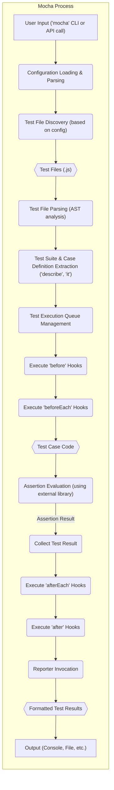

# Project Design Document: Mocha JavaScript Test Framework

**Version:** 1.1
**Date:** October 26, 2023
**Author:** AI Software Architect

## 1. Introduction

This document provides an enhanced and detailed design overview of the Mocha JavaScript test framework. It meticulously outlines the key components, architecture, data flow, and security considerations, making it suitable for comprehensive threat modeling activities. This document serves as a critical resource for understanding the system's structure, interactions, and potential vulnerabilities, enabling proactive security measures.

## 2. Project Overview

Mocha is a widely adopted, feature-rich, and flexible JavaScript test framework that runs on both Node.js and within web browsers. It empowers developers to write and execute various types of tests, including unit, integration, and end-to-end tests. Mocha's extensibility through reporters, interfaces, and plugins has made it a cornerstone of the JavaScript testing ecosystem. Its ability to integrate with numerous assertion libraries further enhances its versatility.

**Key Goals of Mocha:**

*   Provide a straightforward and intuitive API for defining and structuring test suites and cases.
*   Offer robust support for asynchronous testing patterns, including Promises and async/await.
*   Enable highly customizable reporting of test results in various formats.
*   Facilitate extensibility through a plugin architecture, allowing for custom behaviors and integrations.
*   Support test execution across diverse JavaScript environments, including Node.js and web browsers.

## 3. System Architecture

Mocha's architecture is modular, comprising several interacting components that orchestrate test execution and reporting.

*   **Core Engine (Test Runner):** The central orchestrator responsible for the entire test lifecycle. It discovers test files, parses them, manages test suites and cases, executes tests, and collects results.
*   **Test Files:** JavaScript files authored by users, containing test suites and individual test cases. Mocha uses configurable patterns or explicit paths to locate these files.
*   **Test Suites (`describe` blocks):**  Logical containers for grouping related test cases, providing hierarchical organization and context. They can include setup (`before`, `beforeEach`) and teardown (`after`, `afterEach`) hooks.
*   **Test Cases (`it` blocks):**  The fundamental units of testing, each containing assertions to verify specific aspects of the code under test.
*   **Assertions Interface:** While Mocha doesn't provide its own assertion library, it seamlessly integrates with external libraries like `assert`, `chai`, and `expect.js`. The chosen assertion library is used within test cases to make verifiable statements.
*   **Reporters:** Modules responsible for formatting and presenting test results. Mocha offers built-in reporters (e.g., `spec`, `list`, `json`, `mochawesome`) and supports the development of custom reporters. Reporters consume test execution events and generate output.
*   **Configuration Manager:** Handles the loading and management of Mocha's configuration settings. Configuration can be specified through command-line arguments, dedicated configuration files (`.mocharc.js`, `.mocharc.json`, `.mocharc.yaml`), or within `package.json`.
*   **Command-Line Interface (CLI):** The primary interface for interacting with Mocha. It parses command-line arguments, invokes the core engine, and manages the test execution process from the terminal.
*   **Programmatic API:** Allows developers to embed and control Mocha's test execution within other JavaScript applications or scripts. This provides flexibility for custom test runners and integrations.
*   **Browser Environment Adapter (Mocha in the Browser):**  Facilitates the execution of Mocha tests within a web browser environment. This involves adapting to the browser's event loop and providing necessary global objects.
*   **Watch Mode Handler:** Monitors file system changes in test files and related source code. Upon detecting changes, it automatically re-runs the relevant tests, improving the development feedback loop.
*   **Plugin System:** Enables extending Mocha's functionality through custom plugins. Plugins can intercept and modify the test execution process, add new reporters, or integrate with other tools.

## 4. Data Flow

The following diagram illustrates a more detailed data flow during a typical Mocha test execution:

**Detailed Data Flow:**

1. **User Input ('mocha' CLI or API call):** The test execution begins with a user command via the CLI (e.g., `mocha`) or through a programmatic invocation of Mocha's API.
2. **Configuration Loading & Parsing:** Mocha loads configuration settings from specified sources (command-line, config files, `package.json`) and parses them to determine execution parameters.
3. **Test File Discovery (based on config):** Based on the loaded configuration (e.g., test directory, file patterns), Mocha discovers the relevant JavaScript files containing test definitions.
4. **Test Files (.js):** These are the user-authored files containing test suites and cases.
5. **Test File Parsing (AST analysis):** Mocha parses the discovered test files, often using an Abstract Syntax Tree (AST) parser, to understand the structure of the code.
6. **Test Suite & Case Definition Extraction ('describe', 'it'):** Mocha identifies and extracts the definitions of test suites (`describe` blocks) and individual test cases (`it` blocks) from the parsed code.
7. **Test Execution Queue Management:** The core engine manages a queue of test suites and cases to be executed, respecting any specified order or concurrency settings.
8. **Execute 'before' Hooks:** Before executing the tests within a suite, any `before` hooks defined in that suite are executed.
9. **Execute 'beforeEach' Hooks:** Before executing each individual test case within a suite, any `beforeEach` hooks defined in that suite are executed.
10. **Test Case Code:** The code within the `it` block, containing the actual test logic and assertions, is executed.
11. **Assertion Evaluation (using external library):** Assertions within the test case are evaluated using the configured or chosen assertion library (e.g., `assert.equal()`, `expect().to.be.true`).
12. **Collect Test Result:** The outcome of the test case (pass, fail, pending, skipped) and any associated error information are collected.
13. **Execute 'afterEach' Hooks:** After executing each individual test case, any `afterEach` hooks defined in the suite are executed.
14. **Execute 'after' Hooks:** After all test cases within a suite have been executed, any `after` hooks defined in that suite are executed.
15. **Reporter Invocation:**  The configured reporter is invoked, receiving events and data about the completed tests (e.g., test names, durations, results, errors).
16. **Formatted Test Results:** The reporter processes the received data and formats the test results according to its specific implementation.
17. **Output (Console, File, etc.):** The formatted test results are outputted to the console, a specified file, or another configured destination.

## 5. Security Considerations

Given its role in executing user-provided JavaScript code, Mocha presents several security considerations that need careful attention.

**Potential Threats:**

*   **Malicious Test Code Execution:**
    *   **Threat:**  Test files from untrusted sources could contain malicious code designed to compromise the system running the tests (e.g., file system access, network requests, environment variable manipulation).
    *   **Mitigation:**  Strictly control the sources of test files. Implement code review processes for test code. Run tests in isolated and sandboxed environments (e.g., containers, virtual machines) with limited privileges. Employ static analysis tools to scan test code for potential vulnerabilities.
*   **Reporter Vulnerabilities:**
    *   **Threat:**  Custom or third-party reporters might contain security vulnerabilities (e.g., cross-site scripting (XSS) if generating HTML reports, arbitrary code execution if processing untrusted input).
    *   **Mitigation:**  Prefer well-established and actively maintained reporters. Thoroughly vet any custom or third-party reporters before use. Regularly update reporter dependencies to patch known vulnerabilities. Sanitize any user-provided data processed by reporters.
*   **Information Disclosure:**
    *   **Threat:**  Reporters might inadvertently expose sensitive information (e.g., API keys, database credentials, internal paths) in test results, especially if custom reporters are not carefully implemented or if environment variables are logged.
    *   **Mitigation:**  Review the output of reporters to ensure no sensitive data is being exposed. Implement secure logging practices within custom reporters, filtering out sensitive information. Avoid logging sensitive environment variables in test output.
*   **Dependency Chain Vulnerabilities:**
    *   **Threat:**  Mocha relies on numerous dependencies, and vulnerabilities in any of these dependencies could potentially be exploited through Mocha. This includes both direct and transitive dependencies.
    *   **Mitigation:**  Regularly update Mocha's dependencies using tools like `npm update` or `yarn upgrade`. Utilize security scanning tools like `npm audit` or `yarn audit` to identify and address dependency vulnerabilities. Employ dependency pinning and integrity checks (e.g., `package-lock.json`, `yarn.lock`) to ensure consistent and secure dependency versions.
*   **Configuration Exploitation:**
    *   **Threat:**  Misconfigured Mocha settings could create security risks. For example, allowing arbitrary file access through configuration options or executing external commands.
    *   **Mitigation:**  Follow security best practices when configuring Mocha. Limit file access permissions. Avoid using configuration options that allow arbitrary command execution. Securely manage configuration files and prevent unauthorized modifications.
*   **Supply Chain Attacks:**
    *   **Threat:**  The risk of malicious code being injected into Mocha's dependencies or the build process.
    *   **Mitigation:**  Verify the integrity of downloaded packages using checksums or other verification methods. Use reputable package registries. Implement security measures in the development and build pipeline.

## 6. Deployment Model

Mocha is a versatile tool used across various stages of the software development lifecycle.

*   **Local Development Environment:** Developers use Mocha to execute tests locally during development, providing immediate feedback on code changes and ensuring code quality before integration. This often involves using watch mode for automatic re-running of tests.
*   **Continuous Integration/Continuous Deployment (CI/CD) Pipelines:** Mocha is a standard component in CI/CD pipelines. Automated test execution with Mocha ensures that code changes do not introduce regressions before deployment. Results are often integrated with CI/CD reporting tools.
*   **Browser-Based Testing:** Mocha can be deployed and executed directly within web browsers to test front-end JavaScript code, simulating user interactions and browser environments. This often involves using a test runner in the browser or integrating with browser automation tools.
*   **Integration Testing Environments:** Mocha can be used in dedicated integration testing environments to verify the interaction between different components or services.
*   **Pre-commit Hooks:** Mocha can be integrated with pre-commit hooks to automatically run a subset of tests before allowing code commits, preventing the introduction of broken code into the repository.

## 7. Dependencies

Mocha relies on a set of dependencies for its functionality and development.

*   **Runtime Dependencies:**
    *   **Node.js:** The JavaScript runtime environment required to execute Mocha in Node.js environments.
    *   **Assertion Libraries (e.g., `assert`, `chai`, `expect.js`):** While not strictly a direct dependency of Mocha itself, an assertion library is essential for writing meaningful tests.
*   **Development Dependencies:**
    *   **Chokidar:** Used for efficient file system watching in watch mode.
    *   **Glob:** Used for matching file paths according to patterns for test discovery.
    *   **Yargs:**  A command-line argument parsing library used by the Mocha CLI.
    *   **Supports-color:** Detects terminal color support.
    *   **Source-map-support:** Adds source map support to node's stack traces.
    *   Numerous other development and testing utilities.

## 8. Glossary

*   **Test Runner:** The core component of Mocha responsible for discovering, loading, and executing tests.
*   **Test Suite:** A logical grouping of related test cases, defined using the `describe` function.
*   **Test Case:** An individual unit of testing, defined using the `it` function, containing assertions.
*   **Assertion:** A statement within a test case that verifies an expected condition or outcome.
*   **Reporter:** A module that formats and outputs test results in various formats.
*   **Hook:** Functions (`before`, `beforeEach`, `after`, `afterEach`) that execute at specific points in the test lifecycle, allowing for setup and teardown operations.
*   **Plugin:** An extension that adds custom functionality or integrates Mocha with other tools.
*   **Configuration File:** A file (e.g., `.mocharc.js`, `package.json`) used to specify Mocha's settings and behavior.
*   **Watch Mode:** A feature that automatically re-runs tests when changes are detected in relevant files.

This improved document provides a more detailed and comprehensive design overview of the Mocha JavaScript test framework, specifically tailored for effective threat modeling. It elaborates on the architecture, data flow, and security considerations, offering a solid foundation for identifying and mitigating potential vulnerabilities.