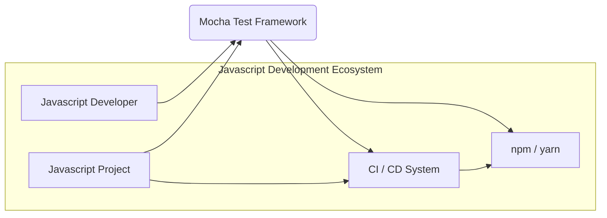
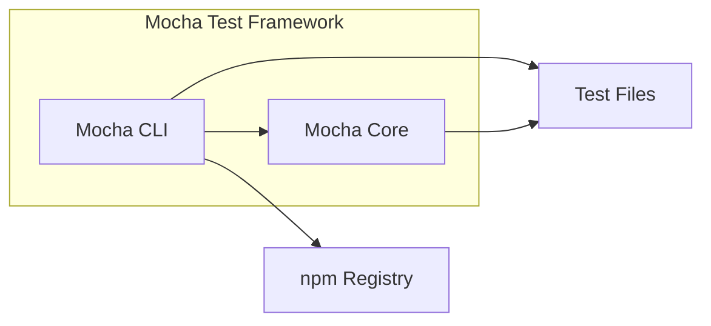
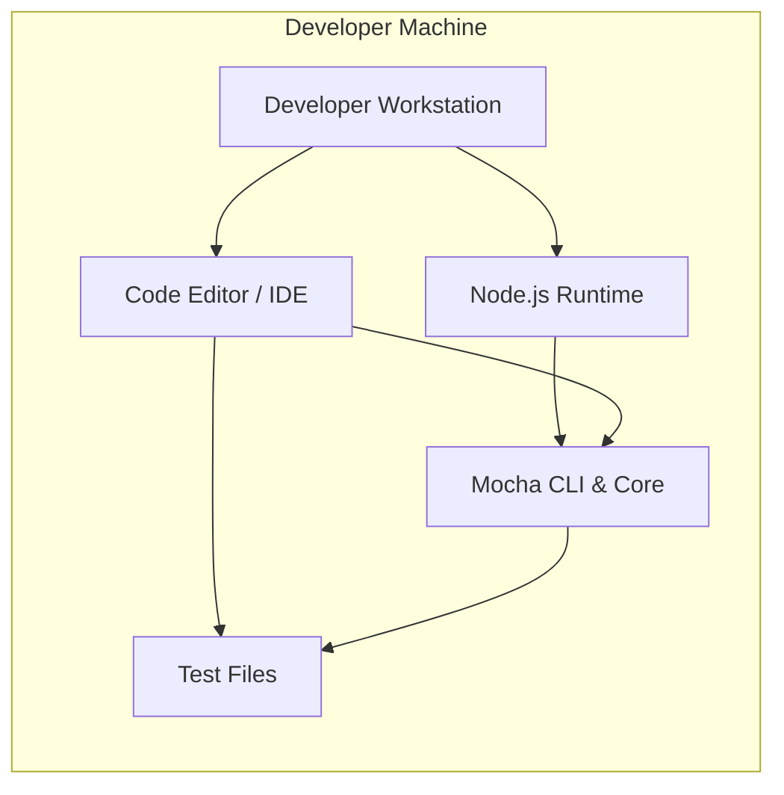
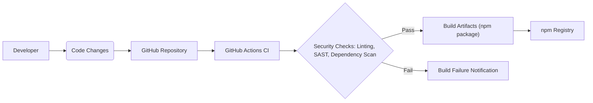

# BUSINESS POSTURE

Mocha is a Javascript test framework that runs on Node.js and in the browser, making asynchronous testing simple and fun. Mocha tests run serially, allowing for flexible and accurate reporting, while mapping uncaught exceptions to the correct test cases. Hosted on GitHub, it is available as an open-source project.

Business priorities and goals:
- Provide a flexible, reliable, and feature-rich testing framework for Javascript developers.
- Ensure ease of use and integration into various Javascript development workflows.
- Maintain a strong and active open-source community around the project.
- Support a wide range of Javascript environments (Node.js and browsers).
- Continuously improve the framework with new features and bug fixes based on community feedback and evolving Javascript ecosystem.

Most important business risks:
- Security vulnerabilities within Mocha could be exploited by malicious actors, potentially impacting projects that depend on it.
- Instability or bugs in Mocha could lead to unreliable test results, affecting software quality and release cycles.
- Lack of maintenance or community support could lead to stagnation and eventual obsolescence of the framework.
- Compatibility issues with new Javascript versions or environments could reduce its usability and adoption.
- Supply chain attacks targeting Mocha's dependencies could introduce vulnerabilities.

# SECURITY POSTURE

Existing security controls:
- security control: GitHub repository with public visibility, allowing community review of code. (Implemented: GitHub)
- security control: Standard Javascript development practices are likely followed by contributors. (Implemented: Development process)
- security control: npm package registry for distribution, which includes some basic security checks. (Implemented: npm registry)

Accepted risks:
- accepted risk: As an open-source project, resources for dedicated security testing might be limited.
- accepted risk: Reliance on community contributions means security vulnerabilities might be identified and patched reactively rather than proactively.
- accepted risk: Vulnerabilities in dependencies of Mocha could introduce security issues.

Recommended security controls:
- security control: Implement automated dependency scanning to identify vulnerabilities in Mocha's dependencies.
- security control: Integrate Static Application Security Testing (SAST) tools into the CI/CD pipeline to automatically detect potential code-level vulnerabilities.
- security control: Establish a clear process for reporting and handling security vulnerabilities, including a security policy and contact information.
- security control: Conduct regular security audits or penetration testing, especially before major releases.
- security control: Implement a Software Bill of Materials (SBOM) to track dependencies and facilitate vulnerability management.

Security requirements:
- Authentication: Not applicable for Mocha itself as a library. Authentication is relevant for the development and release processes (e.g., GitHub account for contributors, npm account for publishing).
- Authorization: Not applicable for Mocha itself. Authorization is relevant for repository access control on GitHub and npm package publishing permissions.
- Input validation: Mocha needs to handle various inputs from test files and command-line arguments. Input validation is crucial to prevent injection attacks or unexpected behavior. This should be implemented in Mocha's core logic, especially when parsing test files and command-line options.
- Cryptography: Cryptography is not a primary requirement for Mocha's core functionality. However, if Mocha introduces features that require secure communication or data storage in the future, appropriate cryptographic measures should be implemented. For now, ensure no sensitive data is logged or exposed in error messages.

# DESIGN

## C4 CONTEXT

### Context Diagram Elements

- Name: Javascript Developer
  - Type: Person
  - Description: Software developers who write and maintain Javascript applications and use Mocha to test their code.
  - Responsibilities: Writes test suites using Mocha, executes tests, and integrates Mocha into their development workflow.
  - Security controls: Responsible for writing secure test code and managing their development environment securely.

- Name: Javascript Project
  - Type: Software System
  - Description: The Javascript application or library being tested using Mocha.
  - Responsibilities: Contains the code under test and the Mocha test suites.
  - Security controls: Implements its own security controls to protect the application logic and data. Relies on Mocha for testing and quality assurance.

- Name: npm / yarn
  - Type: Software System
  - Description: Package managers used to distribute and install Javascript libraries, including Mocha.
  - Responsibilities: Provides a repository for Mocha package, handles package installation and updates.
  - Security controls: Implements security measures to protect the package registry and ensure package integrity.

- Name: CI / CD System
  - Type: Software System
  - Description: Continuous Integration and Continuous Delivery systems (e.g., GitHub Actions, Jenkins) that automate the build, test, and deployment processes for Javascript projects, including running Mocha tests.
  - Responsibilities: Automates the execution of Mocha tests as part of the software delivery pipeline.
  - Security controls: Implements security controls for the CI/CD pipeline, including secure access to repositories and build environments.

- Name: Mocha Test Framework
  - Type: Software System
  - Description: The Javascript testing framework itself, the focus of this design document.
  - Responsibilities: Provides a framework for writing and running Javascript tests, reporting test results, and integrating with development tools.
  - Security controls: Implements security best practices in its codebase, manages dependencies securely, and provides secure features where applicable.

## C4 CONTAINER

### Container Diagram Elements

- Name: Mocha Core
  - Type: Container - Javascript Library
  - Description: The core logic of the Mocha framework, implemented as a Javascript library. It includes the test runner, assertion library integration, reporting mechanisms, and core APIs.
  - Responsibilities: Executes test suites, manages test lifecycle, provides APIs for test definition and execution, generates test reports.
  - Security controls: Input validation for test inputs, dependency scanning, SAST, secure coding practices.

- Name: Mocha CLI
  - Type: Container - Javascript CLI Application
  - Description: Command-line interface for interacting with Mocha. It allows developers to run tests from the terminal, configure test execution, and view results.
  - Responsibilities: Provides a command-line interface to Mocha core, parses command-line arguments, invokes test execution, displays test results in the terminal.
  - Security controls: Input validation for command-line arguments, secure handling of file paths, protection against command injection.

- Name: Test Files
  - Type: Data Store - Javascript Files
  - Description: Javascript files written by developers that contain Mocha test suites. These files define the tests to be executed by Mocha.
  - Responsibilities: Define test cases, import Mocha library, and use Mocha APIs to structure tests.
  - Security controls: Developers are responsible for the security of their test files. Mocha should handle test files securely without introducing vulnerabilities.

- Name: npm Registry
  - Type: External System - Package Registry
  - Description: The npm registry (or alternative like yarn registry) where the Mocha package is published and distributed.
  - Responsibilities: Hosts the Mocha package, makes it available for download and installation.
  - Security controls: npm registry implements its own security controls to ensure package integrity and security. Mocha relies on npm for secure distribution.

## DEPLOYMENT

Mocha as a testing framework is not "deployed" in the traditional sense of a web application. It is used in development and CI/CD environments. Here we describe a typical developer environment deployment.

### Deployment Diagram Elements

- Name: Developer Workstation
  - Type: Infrastructure - Physical Machine / VM
  - Description: The local computer used by a Javascript developer for writing and running code.
  - Responsibilities: Provides the environment for development, including running Mocha tests locally.
  - Security controls: Operating system security controls, user access controls, endpoint security software.

- Name: Code Editor / IDE
  - Type: Software - Development Tool
  - Description: Integrated Development Environment or code editor used by developers (e.g., VS Code, WebStorm).
  - Responsibilities: Provides an interface for writing code, running tests, and debugging.
  - Security controls: Code editor security features, plugins from trusted sources only.

- Name: Node.js Runtime
  - Type: Software - Runtime Environment
  - Description: The Node.js runtime environment required to execute Mocha tests and Javascript code.
  - Responsibilities: Executes Javascript code, provides APIs for file system access, network communication, etc.
  - Security controls: Node.js security updates, secure configuration.

- Name: Mocha CLI & Core
  - Type: Software - Javascript Application & Library
  - Description: Installed Mocha CLI and Core libraries within the developer's Node.js environment.
  - Responsibilities: Executes tests based on developer commands, provides test framework functionality.
  - Security controls: Mocha's own security controls as described in previous sections.

- Name: Test Files
  - Type: Data - Javascript Files
  - Description: Test files residing on the developer's local file system.
  - Responsibilities: Contain test code to be executed by Mocha.
  - Security controls: File system permissions, secure storage of test files.

## BUILD

### Build Diagram Elements

- Name: Developer
  - Type: Person
  - Description: A software developer contributing to the Mocha project.
  - Responsibilities: Writes code, submits changes, and participates in code reviews.
  - Security controls: Secure development practices, code review process.

- Name: Code Changes
  - Type: Data - Code Modifications
  - Description: Changes to the Mocha codebase submitted by developers.
  - Responsibilities: Represent new features, bug fixes, or improvements to Mocha.
  - Security controls: Code review to identify potential security issues.

- Name: GitHub Repository
  - Type: Software System - Version Control
  - Description: The GitHub repository hosting the Mocha source code.
  - Responsibilities: Stores and manages the codebase, tracks changes, facilitates collaboration.
  - Security controls: GitHub access controls, branch protection, audit logs.

- Name: GitHub Actions CI
  - Type: Software System - CI/CD Platform
  - Description: GitHub Actions workflows configured to automate the build, test, and release process for Mocha.
  - Responsibilities: Automates build process, runs tests, performs security checks, and publishes releases.
  - Security controls: Secure CI/CD pipeline configuration, secrets management, access controls.

- Name: Security Checks: Linting, SAST, Dependency Scan
  - Type: Software - Security Tools
  - Description: Automated security checks integrated into the CI/CD pipeline, including code linters, Static Application Security Testing (SAST) tools, and dependency vulnerability scanners.
  - Responsibilities: Identify potential code quality issues, security vulnerabilities, and dependency risks.
  - Security controls: Regularly updated security tools and rulesets, automated failure reporting.

- Name: Build Artifacts (npm package)
  - Type: Data - Software Package
  - Description: The packaged and built version of Mocha, ready for distribution via npm.
  - Responsibilities: Distributable package of Mocha library and CLI.
  - Security controls: Signing of packages (if applicable), integrity checks during build and publishing.

- Name: Build Failure Notification
  - Type: Notification
  - Description: Notifications sent to developers in case of build failures, including security check failures.
  - Responsibilities: Alerts developers to issues that need to be addressed.
  - Security controls: Secure notification channels.

- Name: npm Registry
  - Type: Software System - Package Registry
  - Description: The npm registry where the built Mocha package is published.
  - Responsibilities: Distributes the Mocha package to users.
  - Security controls: npm registry security controls, package integrity checks.

# RISK ASSESSMENT

What are critical business process we are trying to protect?
- Maintaining the integrity and availability of the Mocha testing framework for the Javascript development community.
- Ensuring that Mocha does not introduce security vulnerabilities into projects that use it.
- Maintaining the reputation and trust in the Mocha project as a reliable testing tool.

What data we are trying to protect and what is their sensitivity?
- Mocha codebase: Sensitivity is medium to high. Protecting the codebase from unauthorized modifications and vulnerabilities is crucial for the project's integrity.
- Test files (example tests within Mocha repository): Sensitivity is low to medium. These are primarily for testing Mocha itself, but could contain examples that might reveal internal logic.
- Build artifacts (npm package): Sensitivity is high. Ensuring the integrity and authenticity of the published npm package is critical to prevent supply chain attacks.
- Developer credentials and secrets used in the build process: Sensitivity is high. Protecting these credentials is vital to prevent unauthorized access and malicious activities in the CI/CD pipeline.

# QUESTIONS & ASSUMPTIONS

Questions:
- What is the current process for handling security vulnerability reports for Mocha?
- Are there any existing security audits or penetration testing reports for Mocha?
- What dependency scanning tools are currently used, if any?
- Is there a documented security policy for the Mocha project?
- What is the process for managing and rotating secrets used in the build and release pipeline?

Assumptions:
- BUSINESS POSTURE: Mocha's primary goal is to serve the Javascript developer community as a reliable testing tool. Security is important for maintaining trust and preventing harm to users.
- SECURITY POSTURE: Current security controls are basic, relying on open-source community review and standard development practices. There is room for improvement in proactive security measures like automated security scanning and formal vulnerability management.
- DESIGN: Mocha's architecture is relatively simple, consisting of a core library and a CLI. Security considerations should focus on input validation, dependency management, and secure build/release processes.