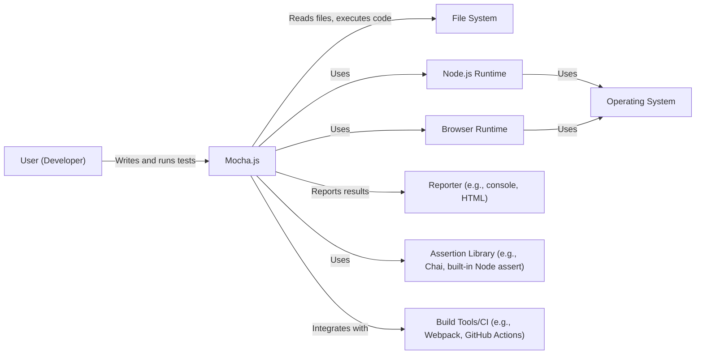
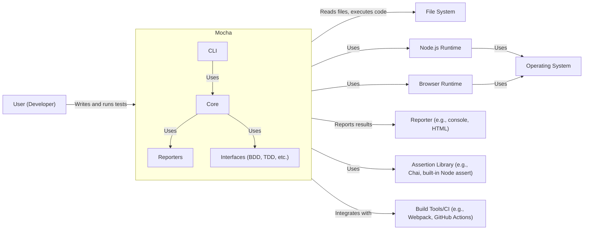
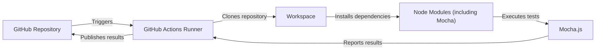
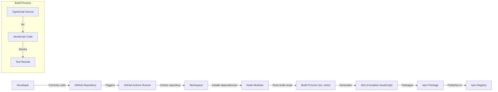

Okay, let's create a design document for the Mocha.js project, focusing on aspects relevant for threat modeling.

# BUSINESS POSTURE

Mocha.js is a widely-used, mature, open-source JavaScript test framework.  Its primary business goal is to provide a flexible, reliable, and extensible testing solution for JavaScript developers, both for Node.js and browser environments.  It aims to simplify the process of writing and running tests, supporting various testing styles (BDD, TDD, etc.), and integrating with other tools in the JavaScript ecosystem.  The project's success is tied to its adoption rate, community contributions, and perceived reliability.

Business Priorities:

*   Maintainability:  Ensure the codebase remains manageable and easy to update.
*   Extensibility:  Allow users to customize and extend Mocha's functionality.
*   Reliability:  Provide a stable and dependable testing framework.
*   Compatibility:  Support a wide range of JavaScript environments and tools.
*   Community Engagement:  Foster a vibrant and active community of users and contributors.
*   Ease of Use: Make it simple for developers to write and run tests.

Business Risks:

*   Loss of Community Trust:  Security vulnerabilities or major bugs could erode trust and lead to decreased adoption.
*   Competition:  Newer testing frameworks could surpass Mocha in features or popularity.
*   Maintenance Burden:  An unmanageable codebase could hinder future development and bug fixes.
*   Compatibility Issues:  Failure to keep up with evolving JavaScript standards and environments could limit Mocha's usefulness.
*   Supply Chain Attacks: Compromise of dependencies or build process could introduce malicious code.

# SECURITY POSTURE

Mocha, as a testing framework, doesn't directly handle sensitive user data in the same way a web application might. However, its security posture is crucial because it executes user-provided code (tests) and interacts with the file system and potentially network resources.  It's also a critical part of many CI/CD pipelines, making it a potential target for supply chain attacks.

Existing Security Controls:

*   security control: Code Reviews: Pull requests are reviewed by maintainers before merging. (Described in contributing guidelines).
*   security control: Dependency Management: Dependencies are managed using npm and listed in `package.json`. (Visible in the repository).
*   security control: Testing: Mocha tests itself extensively. (Visible in the `test` directory).
*   security control: Linting: ESLint is used to enforce code style and identify potential issues. (Configuration in `.eslintrc.js`).
*   security control: Continuous Integration: GitHub Actions are used for automated testing on various platforms. (Defined in `.github/workflows`).

Accepted Risks:

*   accepted risk: Execution of Untrusted Code: Mocha executes user-written tests, which could contain malicious code. This is inherent to its function as a test framework. Users are responsible for the security of their own test code.
*   accepted risk: Limited Sandboxing: While Mocha runs tests in separate processes (in Node.js), complete sandboxing is not guaranteed.
*   accepted risk: Dependency Vulnerabilities: Despite dependency management, vulnerabilities in third-party libraries could potentially be exploited.

Recommended Security Controls:

*   security control: Regular Dependency Audits: Implement automated dependency vulnerability scanning (e.g., `npm audit`, Snyk, Dependabot).
*   security control: Security Policy: Create a `SECURITY.md` file outlining vulnerability reporting procedures.
*   security control: Supply Chain Security: Explore options for signing releases and verifying build integrity.
*   security control: Content Security Policy (CSP) for Browser Tests: If running tests in a browser context, consider using CSP to mitigate XSS risks. This is more relevant to users of Mocha in the browser than to Mocha itself.

Security Requirements:

*   Authentication: Not directly applicable to Mocha itself, as it's a testing framework. However, if Mocha were integrated into a larger system with authentication, it should not interfere with or bypass those mechanisms.
*   Authorization: Not directly applicable, similar to authentication. Mocha should respect any authorization mechanisms in the system under test.
*   Input Validation: Mocha should handle various input types (test code, configuration files, command-line arguments) gracefully and without crashing or creating vulnerabilities.  It should validate configuration options to prevent unexpected behavior.
*   Cryptography: Not directly applicable in most cases. If Mocha were to handle sensitive data (e.g., API keys in tests, which is generally discouraged), it should use appropriate cryptographic practices. This is primarily the responsibility of the user writing the tests.
*   Error Handling: Mocha should handle errors gracefully, providing informative error messages without exposing sensitive information or creating vulnerabilities.

# DESIGN

## C4 CONTEXT

C4 Context Element Descriptions:

*   Element:
    *   Name: User (Developer)
    *   Type: Person
    *   Description: A software developer who writes and runs tests using Mocha.
    *   Responsibilities: Writing test cases, configuring Mocha, running tests, interpreting results.
    *   Security controls: Not directly applicable.

*   Element:
    *   Name: Mocha.js
    *   Type: Software System
    *   Description: The Mocha.js test framework.
    *   Responsibilities: Providing a test runner, managing test suites and cases, executing tests, reporting results.
    *   Security controls: Code Reviews, Dependency Management, Testing, Linting, Continuous Integration.

*   Element:
    *   Name: File System
    *   Type: External System
    *   Description: The underlying file system.
    *   Responsibilities: Storing test files, configuration files, and potentially test results.
    *   Security controls: Operating system file permissions.

*   Element:
    *   Name: Node.js Runtime
    *   Type: External System
    *   Description: The Node.js runtime environment.
    *   Responsibilities: Executing JavaScript code, providing APIs for interacting with the system.
    *   Security controls: Node.js security best practices, regular updates.

*   Element:
    *   Name: Browser Runtime
    *   Type: External System
    *   Description: A web browser runtime environment (e.g., Chrome, Firefox).
    *   Responsibilities: Executing JavaScript code in a browser context.
    *   Security controls: Browser security features (e.g., sandboxing, same-origin policy).

*   Element:
    *   Name: Reporter
    *   Type: External System
    *   Description: A component that formats and displays test results.
    *   Responsibilities: Presenting test results in a human-readable format.
    *   Security controls: None specific to Mocha.

*   Element:
    *   Name: Assertion Library
    *   Type: External System
    *   Description: A library that provides functions for making assertions in tests (e.g., Chai, Node.js built-in `assert`).
    *   Responsibilities: Providing functions for verifying expected outcomes.
    *   Security controls: None specific to Mocha.

*   Element:
    *   Name: Build Tools/CI
    *   Type: External System
    *   Description: Tools used for building and testing software, including continuous integration systems.
    *   Responsibilities: Automating the build and test process.
    *   Security controls: CI/CD system security best practices.

*   Element:
    *   Name: Operating System
    *   Type: External System
    *   Description: The underlying operating system.
    *   Responsibilities: Providing fundamental system resources.
    *   Security controls: Operating system security best practices, regular updates.

## C4 CONTAINER

In the case of Mocha, the container diagram is very similar to the context diagram, as Mocha itself is the primary "container."

C4 Container Element Descriptions:

*   Elements outside Mocha subgraph are the same as in C4 Context.

*   Element:
    *   Name: MochaCLI
    *   Type: Component
    *   Description: Command-line interface for Mocha.
    *   Responsibilities: Parsing command-line arguments, loading configuration, initiating test runs.
    *   Security controls: Input validation.

*   Element:
    *   Name: MochaCore
    *   Type: Component
    *   Description: Core logic of the Mocha test runner.
    *   Responsibilities: Managing test suites, executing tests, handling events.
    *   Security controls: Code Reviews, Testing.

*   Element:
    *   Name: MochaReporters
    *   Type: Component
    *   Description: Built-in reporters for formatting test results.
    *   Responsibilities: Generating output in various formats (e.g., console, HTML, JSON).
    *   Security controls: Output encoding (to prevent XSS in HTML reporters).

*   Element:
    *   Name: MochaInterfaces
    *   Type: Component
    *   Description: Different testing interfaces (BDD, TDD, QUnit, etc.).
    *   Responsibilities: Providing different styles for writing tests.
    *   Security controls: None specific.

## DEPLOYMENT

Mocha.js is typically installed as a development dependency via npm.  It can be used in various deployment environments, including local development machines, CI/CD servers, and potentially even within browser-based testing environments.

Possible Deployment Solutions:

1.  Local Development: Installed via `npm install mocha --save-dev`.
2.  CI/CD Server (e.g., GitHub Actions, Jenkins): Installed as part of the project's dependencies via `npm install`.
3.  Browser-based Testing Environment (e.g., Testem, Karma):  Mocha is loaded as a library within the browser.

Chosen Deployment Solution (CI/CD Server - GitHub Actions):

Deployment Element Descriptions:

*   Element:
    *   Name: GitHub Repository
    *   Type: Source Code Repository
    *   Description: The repository containing the project's code and tests.
    *   Responsibilities: Storing the codebase, triggering CI/CD workflows.
    *   Security controls: GitHub access controls, branch protection rules.

*   Element:
    *   Name: GitHub Actions Runner
    *   Type: CI/CD Server
    *   Description: A virtual machine provided by GitHub Actions.
    *   Responsibilities: Executing the CI/CD workflow.
    *   Security controls: GitHub Actions security best practices.

*   Element:
    *   Name: Workspace
    *   Type: File System
    *   Description: The working directory on the GitHub Actions runner.
    *   Responsibilities: Containing the cloned repository and installed dependencies.
    *   Security controls: Limited access to the workspace during the workflow.

*   Element:
    *   Name: Node Modules
    *   Type: Directory
    *   Description: The directory containing the project's installed npm packages, including Mocha.
    *   Responsibilities: Providing the necessary dependencies for the project.
    *   Security controls: Dependency auditing, potentially using a fixed version of dependencies.

*   Element:
    *   Name: Mocha.js
    *   Type: Software System
    *   Description: The Mocha.js test framework.
    *   Responsibilities: Running the tests.
    *   Security controls: As described in previous sections.

## BUILD

Mocha's build process involves compiling TypeScript to JavaScript, running tests, and packaging the code for distribution on npm.  GitHub Actions is used for automation.

Build Process Security Controls:

* security control: Linting (ESLint): Enforces code style and identifies potential issues.
* security control: Automated Testing: Mocha itself is used to test the codebase.
* security control: Continuous Integration (GitHub Actions): Automates the build and test process on every push.
* security control: Dependency Management (npm): Dependencies are managed and versioned.
* security control: (Recommended) Dependency Auditing: Regularly scan for vulnerabilities in dependencies.
* security control: (Recommended) Supply Chain Security: Consider signing releases and verifying build integrity.

# RISK ASSESSMENT

Critical Business Processes:

*   Software Development: Mocha is a critical tool for ensuring the quality and reliability of software projects.
*   Continuous Integration/Continuous Delivery (CI/CD): Mocha is often integrated into CI/CD pipelines, making it a potential target for attacks.

Data to Protect:

*   Source Code: While Mocha itself doesn't handle sensitive data directly, it has access to the source code of the projects it tests.  The sensitivity of this data depends on the project.
*   Test Results: Test results may indirectly reveal information about the codebase or its behavior.
*   Configuration Files: Mocha configuration files might contain information about the testing environment.
*   Dependencies: The list of project dependencies is public, but vulnerabilities in those dependencies could be exploited.

Data Sensitivity:

*   Source Code: Varies greatly depending on the project. Could range from non-sensitive (open-source) to highly confidential (proprietary).
*   Test Results: Generally low sensitivity, but could potentially reveal information about vulnerabilities or internal logic.
*   Configuration Files: Generally low sensitivity.
*   Dependencies: Public information, but vulnerabilities are a concern.

# QUESTIONS & ASSUMPTIONS

Questions:

*   Are there any specific security concerns or compliance requirements related to the use of Mocha in specific projects or environments?
*   What is the process for handling security vulnerabilities reported in Mocha or its dependencies?
*   Are there any plans to implement additional security features, such as enhanced sandboxing or code signing?

Assumptions:

*   BUSINESS POSTURE: The primary goal is to provide a reliable and widely-used testing framework.  Maintaining community trust and adoption is paramount.
*   SECURITY POSTURE: Users are responsible for the security of their own test code. Mocha's maintainers prioritize addressing vulnerabilities in the framework itself and its dependencies.
*   DESIGN: Mocha's architecture is relatively simple, with a focus on extensibility and flexibility. The build and deployment processes are standard for a JavaScript project.