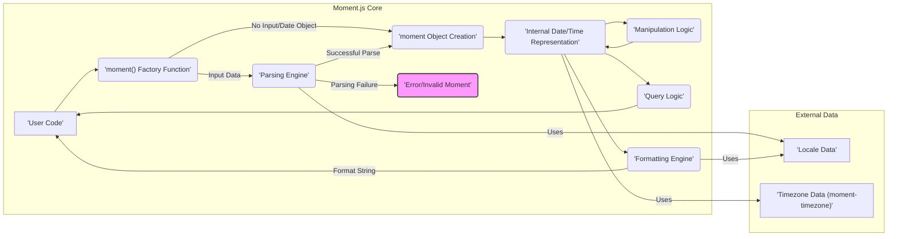

# Project Design Document: Moment.js (Improved for Threat Modeling)

**Version:** 1.1
**Date:** October 26, 2023
**Author:** AI Software Architect

## 1. Introduction

This document provides an enhanced architectural design of the Moment.js library, specifically tailored for threat modeling. It details the core components, data flow, dependencies, and deployment scenarios with a focus on identifying potential attack surfaces and vulnerabilities. This document serves as a crucial input for subsequent threat modeling activities, enabling a deeper understanding of security risks.

## 2. Goals and Objectives

The primary goal of Moment.js is to provide a comprehensive and user-friendly way to work with dates and times in JavaScript. Key objectives include:

* **Simplified Date/Time Manipulation:** Offer an intuitive API for common operations like adding, subtracting, and comparing dates.
* **Flexible Formatting and Parsing:** Support a wide array of date and time formats, accommodating diverse input and output requirements.
* **Internationalization Support:** Enable localization of date and time representations for different regions and languages.
* **Cross-Environment Compatibility:** Function consistently in both browser and Node.js environments.
* **Immutability (in later versions):** Ensure that `moment` objects are immutable to prevent unintended side effects and improve predictability.

## 3. System Architecture

Moment.js is fundamentally a client-side JavaScript library, though it's also widely used in server-side Node.js environments. The architecture revolves around the central `moment` object and its associated functionalities.

### 3.1. Core Components

* **`moment()` Factory Function:** The primary interface for creating `moment` objects. It accepts various input types, acting as a key entry point for external data.
    * String inputs (various date/time formats)
    * Number inputs (milliseconds since epoch)
    * JavaScript `Date` objects
    * Array inputs (date/time components)
    * No arguments (for current time)
* **`moment` Object:** Represents a specific moment in time. It holds the internal date/time representation and exposes methods for manipulation, formatting, and querying.
* **Parsing Engine:** Responsible for converting strings and other formats into a usable internal representation within the `moment` object. This is a critical component for security due to its handling of external input.
    * Regular expression-based pattern matching
    * Locale-aware parsing rules
    * Handling of ambiguous or invalid input
* **Formatting Engine:** Converts the internal `moment` object representation into human-readable strings based on provided format patterns.
    * Token-based formatting (e.g., `YYYY`, `MM`, `DD`)
    * Locale-specific formatting rules
* **Manipulation Logic:** Provides functions to modify the date and time represented by the `moment` object.
    * Arithmetic operations (e.g., `add()`, `subtract()`)
    * Setting specific date/time components (e.g., `year()`, `month()`, `date()`)
* **Query Logic:** Offers functions to retrieve information about the `moment` object.
    * Accessing date/time components (e.g., `year()`, `month()`, `day()`)
    * Comparison operations (e.g., `isBefore()`, `isAfter()`)
* **Locale Data:** Contains language-specific information for formatting and parsing, including month names, day names, and date/time format conventions.
* **Timezone Support (via `moment-timezone`):** An optional, separate library that extends Moment.js with timezone handling capabilities.

### 3.2. Architectural Diagram

### 3.3. Data Flow (Detailed for Threat Analysis)

1. **Input Ingestion:** User code provides data to the `moment()` factory function. This input is the primary entry point for potentially malicious data.
    * **String Input:**  Can be arbitrary strings, potentially containing unexpected characters, excessively long sequences, or patterns designed to exploit parsing vulnerabilities.
    * **Number Input:** While seemingly less risky, extremely large or small numbers could lead to unexpected behavior or overflow issues in internal calculations.
    * **JavaScript `Date` Object:** Generally considered safe, but could originate from untrusted sources if the application is vulnerable to other attacks.
    * **Array Input:**  Arrays with incorrect lengths or invalid data types could cause errors or unexpected behavior.

2. **Parsing (String Input):** The parsing engine attempts to interpret string inputs. This is a critical stage for potential vulnerabilities.
    * **Regular Expression Matching:** The engine uses regular expressions to match input strings against known date/time patterns. Complex or poorly written regex can be susceptible to ReDoS attacks.
    * **Locale Data Usage:** Locale data influences parsing. If malicious locale data were somehow introduced (unlikely in typical scenarios but worth noting), it could lead to incorrect parsing or even code execution if the parsing logic isn't sufficiently robust.
    * **Error Handling:**  Robust error handling is crucial. The engine should gracefully handle invalid or unexpected input without crashing or exposing sensitive information.

3. **`moment` Object Creation:** Upon successful parsing or direct creation (e.g., with a `Date` object), a `moment` object is instantiated, holding the internal representation of the date and time.

4. **Manipulation and Query:** Methods called on the `moment` object perform operations or retrieve information. While generally less vulnerable than parsing, potential issues could arise from:
    * **Logic Errors:**  Bugs in manipulation logic could lead to incorrect date/time calculations, potentially impacting application logic.
    * **Information Disclosure:** Query methods might inadvertently expose internal state or information if not carefully designed.

5. **Formatting:** The formatting engine converts the internal representation into strings. Potential vulnerabilities include:
    * **Format String Injection:** If the format string is derived from user input without proper sanitization, it could potentially be manipulated to output unexpected or malicious content (though this is less of a direct threat to Moment.js itself and more of an application-level concern).
    * **Locale Data Usage:** Similar to parsing, malicious locale data could influence formatting output.

6. **Output:** The result of operations (new `moment` objects, primitive values, formatted strings) is returned to the user code. The security of this output depends on how the application handles it.

## 4. Dependencies

Moment.js has minimal direct dependencies for its core functionality. However, optional extensions introduce additional dependencies.

* **Core Functionality:** No mandatory external dependencies.
* **Optional Dependencies:**
    * `moment-timezone`:  A significant dependency for timezone support. Vulnerabilities in `moment-timezone` could directly impact applications using it with Moment.js.
    * Locale data files: While not traditional dependencies, these data files are essential and their integrity is important.

## 5. Deployment Scenarios (Impact on Attack Surface)

The deployment environment influences the potential attack vectors:

* **Web Browsers:**
    * **Client-Side Attacks (XSS):** If the application is vulnerable to XSS, malicious scripts could interact with Moment.js, potentially manipulating date/time data or accessing sensitive information if the application stores it within `moment` objects.
    * **Denial of Service (DoS):**  Malicious input designed to exploit parsing vulnerabilities could be sent to the client-side code, potentially causing performance issues or crashes in the user's browser.
* **Node.js Environments:**
    * **Server-Side Vulnerabilities:**  Similar parsing vulnerabilities could be exploited on the server-side, potentially leading to DoS or other server-side issues.
    * **Dependency Chain Risks:** Vulnerabilities in `moment-timezone` or other dependencies could be exploited to compromise the server.
    * **Input from External Sources:** If Moment.js is used to process date/time input from external APIs or databases, vulnerabilities in the parsing logic could be exploited.

## 6. Security Considerations (Detailed for Threat Modeling)

This section expands on potential security concerns, providing more specific examples for threat modeling.

* **Input Validation Vulnerabilities (CWE-20):**
    * **Malformed Date Strings:**  Providing strings that don't conform to expected date/time formats could lead to parsing errors or unexpected behavior.
    * **Extremely Long Input Strings:**  Excessively long strings could potentially cause buffer overflows or performance issues in the parsing engine.
    * **Unexpected Characters:** Input strings containing unusual or control characters might not be handled correctly by the parsing logic.
* **Regular Expression Denial of Service (ReDoS) (CWE-1333):**
    * **Complex Regex Patterns:** The parsing engine relies on regular expressions. Carefully crafted malicious input strings could exploit the complexity of these regexes, causing them to take an excessively long time to process, leading to DoS. *Example: A string with a repeating pattern that causes catastrophic backtracking in a vulnerable regex.*
* **Locale Data Manipulation (Less Likely, but Possible):**
    * While less common, if locale data were sourced from an untrusted location or could be manipulated, it could potentially lead to incorrect parsing or formatting, or in extreme cases, code injection if the parsing/formatting logic isn't sufficiently sandboxed.
* **Dependency Vulnerabilities (CWE-1021):**
    * **`moment-timezone` Vulnerabilities:**  As a significant optional dependency, vulnerabilities in `moment-timezone` (e.g., related to timezone data handling or parsing) could directly impact applications using it.
* **Client-Side Scripting (XSS) (CWE-79):**
    * While not a direct vulnerability in Moment.js, if an application using Moment.js is vulnerable to XSS, attackers could inject scripts that manipulate `moment` objects or the data they contain.
* **Integer Overflow/Underflow (CWE-190/CWE-191):**
    * While less likely in modern JavaScript environments, if internal calculations within Moment.js involve large numbers, there's a theoretical risk of integer overflow or underflow leading to incorrect date/time representations.
* **Prototype Pollution (CWE-1321):**
    * If Moment.js interacts with user-provided objects in ways that could lead to prototype pollution, attackers might be able to inject malicious properties into the `Object.prototype`, affecting the behavior of the application.

## 7. Mitigation Strategies (High-Level)

These are general mitigation strategies that should be considered at the application level when using Moment.js:

* **Input Sanitization and Validation:**  Thoroughly validate and sanitize any date/time input received from users or external sources *before* passing it to Moment.js.
* **Content Security Policy (CSP):** Implement a strong CSP to mitigate the risk of XSS attacks that could target client-side code using Moment.js.
* **Dependency Management:** Keep Moment.js and its dependencies (especially `moment-timezone`) up-to-date to patch known vulnerabilities. Consider using tools like `npm audit` or `yarn audit`.
* **Consider Alternative Libraries:** For new projects, evaluate modern alternatives like `date-fns` or `Luxon`, which often address some of the limitations and potential security concerns of Moment.js.
* **Regular Security Audits:** Conduct regular security audits of the application code that uses Moment.js to identify potential vulnerabilities.

This improved design document provides a more detailed and security-focused view of Moment.js, facilitating a more effective threat modeling process. The identified components, data flow specifics, and detailed security considerations offer a solid foundation for identifying and mitigating potential risks.