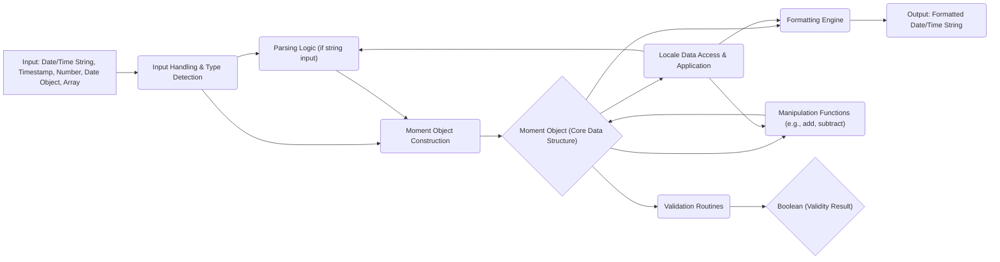
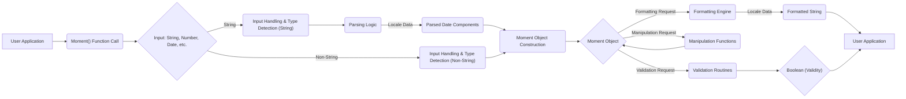

## Project Design Document: Moment.js Library (Improved)

**1. Introduction**

This document provides an enhanced architectural design overview of the Moment.js library, a widely-used JavaScript library for handling dates and times. This detailed design is specifically tailored to facilitate thorough threat modeling activities.

**2. Project Overview**

*   **Project Name:** Moment.js
*   **Project Repository:** [https://github.com/moment/moment](https://github.com/moment/moment)
*   **Project Description:** Moment.js is a JavaScript library designed for parsing, validating, manipulating, and formatting dates and times. It operates in both browser and Node.js environments, providing a consistent API across platforms.
*   **Primary Goal:** To offer a straightforward and comprehensive way to work with date and time data in JavaScript applications.
*   **Target Users:** Primarily web and Node.js developers requiring date and time manipulation.

**3. Architecture Overview**

Moment.js's architecture revolves around the central `Moment` object. Input is processed to create this object, which then serves as the basis for various operations.

**4. Component Details**

*   **Input Handling & Type Detection:**
    *   The initial entry point for creating `Moment` objects.
    *   Determines the type of input (string, number, Date object, etc.).
    *   Prepares the input for subsequent processing by either the parsing logic or direct object construction.
*   **Parsing Logic:**
    *   Activated when the input is a string.
    *   Employs a combination of predefined formats and user-specified format strings to interpret the date and time information.
    *   Utilizes regular expressions extensively to match patterns within the input string.
    *   Relies on locale data to understand localized date and time formats (e.g., month names, day names).
    *   Includes logic for handling ambiguous dates and implementing parsing heuristics.
*   **Moment Object Construction:**
    *   Creates the core `Moment` object.
    *   Internally stores the date and time information, typically as a Unix timestamp (milliseconds since the Unix epoch) or a similar numerical representation.
    *   Initializes the object with the parsed or directly provided date and time values.
*   **Moment Object (Core Data Structure):**
    *   The central representation of a specific point in time.
    *   Encapsulates the date and time data.
    *   Provides methods to access and manipulate individual components (year, month, day, hour, minute, second, millisecond).
    *   Acts as the primary data source for formatting, manipulation, and validation operations.
*   **Formatting Engine:**
    *   Transforms the internal representation of the `Moment` object into human-readable strings.
    *   Uses a system of formatting tokens (e.g., `YYYY`, `MM`, `DD`) to specify the desired output format.
    *   Leverages locale data to format output according to language and regional conventions (e.g., date order, separators, month names).
    *   Handles escaping of literal characters within format strings.
*   **Manipulation Functions:**
    *   Provides methods to modify the `Moment` object (e.g., `add()`, `subtract()`, `set()`).
    *   Allows for adding or subtracting various time units (years, months, days, hours, etc.).
    *   Implements logic for handling calendar-aware operations (e.g., adding a month while considering the number of days in the month).
*   **Validation Routines:**
    *   Offers methods to check the validity of a `Moment` object (e.g., `isValid()`).
    *   Used internally after parsing to determine if the input string represented a valid date and time.
    *   Can be used to validate manually created or manipulated `Moment` objects.
*   **Locale Data Access & Application:**
    *   Manages the storage and retrieval of locale-specific information.
    *   Includes data for various languages and regions, defining date and time formats, month and day names, relative time strings, etc.
    *   Allows for setting and switching between different locales.
    *   Crucial for both parsing and formatting localized date and time representations.

**5. Data Flow (Detailed)**

A more detailed view of the data flow within Moment.js:

**6. Deployment Model**

Moment.js is commonly deployed in these scenarios:

*   **Web Browsers:**
    *   Directly included using a `<script>` tag, making the `moment` global object available.
    *   Bundled with application code using module bundlers like Webpack, Rollup, or Parcel.
*   **Node.js Environments:**
    *   Installed as a project dependency using npm or yarn (`npm install moment`).
    *   Imported into modules using `require('moment')`.

**7. Security Considerations (Targeted for Threat Modeling)**

This section outlines specific security considerations relevant for threat modeling:

*   **Parsing Vulnerabilities:**
    *   **Regular Expression Denial of Service (ReDoS):**  Maliciously crafted date strings with patterns that cause the parsing regular expressions to exhibit catastrophic backtracking, leading to excessive CPU consumption and denial of service. *Example: A long string with repeating ambiguous date parts.*
    *   **Format String Exploitation (Indirect):** While Moment.js doesn't directly evaluate format strings as code, vulnerabilities in the parsing logic for specific format tokens could be exploited with carefully crafted input. *Example: Input strings designed to overflow internal buffers or trigger unexpected states based on format token handling.*
    *   **Locale Injection via Parsing:** If an application allows user-controlled locale settings during parsing without proper sanitization, malicious locale data could potentially introduce vulnerabilities if the parsing logic interacts with locale data in an unsafe manner.
*   **Formatting Vulnerabilities:**
    *   **Format String Injection (Limited Risk):** While less critical than in other contexts (like `printf`), if user-provided data is incorporated into format strings without careful handling, it could lead to unexpected output or expose internal information, though this is less likely with Moment.js's design.
    *   **Locale Data Manipulation:** If an attacker can influence the locale data used for formatting, they could cause the application to display incorrect date and time information, potentially leading to confusion or misinterpretation.
*   **Manipulation Vulnerabilities:**
    *   **Integer Overflow/Underflow:**  Performing arithmetic operations on date and time components could potentially lead to integer overflow or underflow if not handled carefully, although JavaScript's number type mitigates this to some extent. However, logic errors in handling large date ranges could still occur.
    *   **Time Zone Issues (if using `moment-timezone`):** Incorrect or manipulated timezone data could lead to incorrect date and time calculations, with potential security implications depending on the application's use of this data.
*   **Validation Bypass:**
    *   Flaws in the validation logic could allow invalid date and time values to be treated as valid, potentially leading to errors or unexpected behavior in downstream processing.
*   **Prototype Pollution:**
    *   While less likely in Moment.js's structure, vulnerabilities in the library or its dependencies could potentially allow attackers to pollute the `Object.prototype` or other built-in prototypes, leading to unexpected behavior across the application.
*   **Dependency Chain Vulnerabilities:**
    *   Although Moment.js has minimal direct dependencies, vulnerabilities in its build tools or the environment it runs in could indirectly impact its security.

**8. Assumptions and Constraints**

*   This design document primarily focuses on the core `moment.js` library. The `moment-timezone` extension is considered an external component and is not analyzed in detail within this document, though its interaction points are noted.
*   The analysis assumes the context of a standard web browser or Node.js environment.
*   The document reflects the architecture of the library as of its last major releases, acknowledging that the project is currently in maintenance mode.

**9. Future Considerations and Security Implications of Maintenance Mode**

*   **Maintenance Mode:** Moment.js is currently in maintenance mode, meaning active development and feature additions have ceased. Critical bug fixes and security patches are less likely to be released.
*   **Increased Risk Over Time:**  As new vulnerabilities are discovered in JavaScript environments or related libraries, Moment.js becomes increasingly vulnerable due to the lack of active maintenance.
*   **Migration Recommendations:**  The official Moment.js documentation recommends migrating to more modern date/time libraries like Luxon, date-fns, or Temporal (the built-in JavaScript API).
*   **Security Audits:** For applications still relying on Moment.js, regular security audits and careful input validation are crucial to mitigate potential risks.
*   **Limited Mitigation Options:**  If vulnerabilities are discovered, patching them might fall on the application developers themselves, as official updates are unlikely.

This improved design document provides a more detailed and security-focused view of the Moment.js library, making it a more effective resource for threat modeling activities. The emphasis on potential vulnerabilities and the implications of the library's maintenance mode are crucial considerations for assessing the security posture of applications using Moment.js.