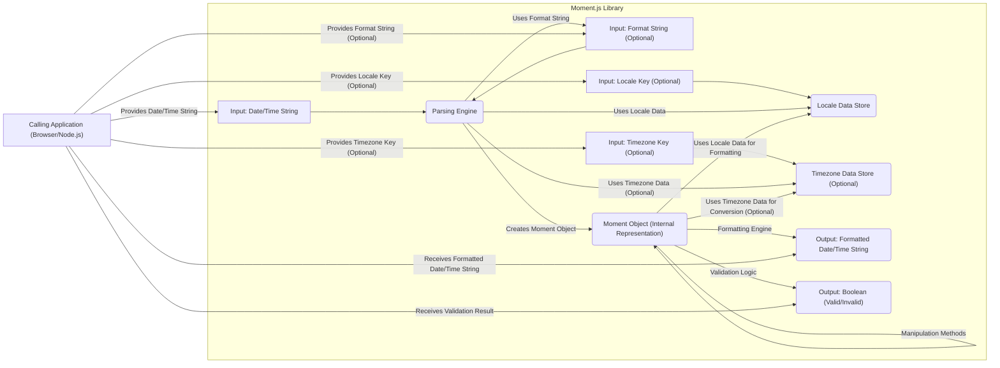

# Project Design Document: Moment.js

**Version:** 1.1
**Date:** October 26, 2023
**Prepared By:** AI Software Architect

## 1. Project Overview

This document outlines the design of the Moment.js project, a widely used JavaScript library for parsing, validating, manipulating, and formatting dates and times. This document serves as a foundation for subsequent threat modeling activities by providing a detailed understanding of its architecture and functionality.

## 2. Goals and Objectives

*   Provide a comprehensive and accurate representation of the Moment.js library's architecture and functionality, focusing on aspects relevant to security.
*   Identify key components, data flows, and external interfaces that could be potential attack surfaces.
*   Establish a clear understanding of the system's boundaries, trust zones, and interactions with external data.
*   Facilitate the identification and analysis of potential vulnerabilities and security risks associated with the library.

## 3. Target Audience

This document is intended for:

*   Security engineers and architects responsible for threat modeling, security assessments, and penetration testing of systems using Moment.js.
*   Developers contributing to or maintaining the Moment.js library, requiring a deep understanding of its internal workings for secure development practices.
*   Anyone seeking a detailed technical understanding of the library's architecture and data handling for security analysis and risk assessment.

## 4. System Architecture

Moment.js is primarily a client-side JavaScript library, also usable in Node.js environments. Its architecture revolves around the `moment` object, which encapsulates date and time information and offers methods for various operations.

*   **Core Functionality Breakdown:**
    *   **Parsing and Input Handling:**
        *   Receiving date/time strings in various formats.
        *   Utilizing format specifiers for structured parsing.
        *   Handling natural language date/time parsing (to a limited extent).
        *   Validating input against specified formats.
    *   **`moment` Object Creation and Management:**
        *   Instantiating `moment` objects from various inputs (strings, numbers, Date objects).
        *   Internally storing date and time information.
        *   Providing methods to access and modify internal date/time components.
    *   **Date and Time Manipulation:**
        *   Adding and subtracting time units (years, months, days, etc.).
        *   Setting specific date and time components.
        *   Calculating differences between dates.
        *   Working with timezones (with optional timezone data).
    *   **Formatting and Output:**
        *   Converting `moment` objects into strings based on format patterns.
        *   Supporting localized formatting.
        *   Generating various standard date/time string representations (ISO 8601, etc.).
    *   **Localization Support:**
        *   Loading and managing locale-specific data.
        *   Providing formatting and parsing rules for different languages and regions.
    *   **Timezone Handling (Optional):**
        *   Utilizing external timezone data (e.g., `moment-timezone`).
        *   Converting dates and times between timezones.
        *   Calculating timezone offsets.
    *   **Duration Management:**
        *   Representing and manipulating time intervals.
        *   Performing arithmetic operations on durations.
    *   **Calendar Operations:**
        *   Formatting dates relative to a reference point (e.g., "in 5 days").

*   **Key Architectural Elements:**
    *   **`moment` Factory Function:** The primary entry point for creating `moment` objects.
    *   **Parsing Logic:** A complex system of regular expressions and parsing functions to interpret date/time strings.
    *   **Internal Date Representation:** Likely leverages JavaScript's built-in `Date` object or a similar internal representation.
    *   **Formatting Token Handlers:** Functions responsible for converting specific format tokens into output strings.
    *   **Locale Data Store:** Holds loaded locale configurations.
    *   **Timezone Data Store (Optional):** Holds loaded timezone definitions and rules.
    *   **Plugin Interface:** Allows extending Moment.js functionality.

## 5. Data Flow Diagram

## 6. Key Components

*   **Parsing Engine:**
    *   **Format Token Matching:** Identifies patterns within the input string based on provided or default formats.
    *   **Regular Expression Processing:** Employs regular expressions to extract date and time components.
    *   **Input Validation:** Checks if extracted components form a valid date and time according to the rules of the Gregorian calendar and specified format.
    *   **Ambiguity Resolution:** Attempts to resolve ambiguous date/time inputs (e.g., handling different date orderings).
    *   **Error Handling:** Manages invalid input and provides mechanisms for error reporting.

*   **Formatting Engine:**
    *   **Format Token Interpretation:** Maps format specifiers (e.g., `YYYY`, `MM`, `DD`) to corresponding date/time components of the `moment` object.
    *   **Locale-Aware Formatting:** Utilizes locale data to output month names, day names, and other localized elements.
    *   **String Concatenation:** Assembles the formatted string based on the interpreted tokens and locale data.

*   **Locale Data Store:**
    *   **JSON Structure:** Stores locale information in a structured JSON format.
    *   **Language and Region Codes:** Organizes data by language and regional variations (e.g., `en`, `en-GB`).
    *   **Formatting Rules:** Contains patterns for displaying dates, times, and numbers.
    *   **Textual Representations:** Includes month names, day names, meridiem indicators (AM/PM), and relative time strings.

*   **Timezone Data Store (Optional):**
    *   **TZDB (Time Zone Database):** Typically based on the IANA Time Zone Database.
    *   **Timezone Definitions:** Contains rules for each timezone, including standard time offsets and daylight saving time transitions.
    *   **Historical Data:** Includes historical timezone rules to accurately handle dates in the past.

*   **`moment` Object (Internal Representation):**
    *   **Timestamp:** Likely stores the date and time as a Unix timestamp (milliseconds since the epoch) or a similar numerical representation.
    *   **Internal Properties:** Holds individual date and time components (year, month, day, hour, minute, second, millisecond).
    *   **Flags and Metadata:** May include flags indicating whether the `moment` is in UTC mode or has been explicitly validated.

## 7. External Interfaces

*   **JavaScript API:**
    *   **`moment()` Factory:**
        *   `moment()`: Creates a `moment` object with the current date and time.
        *   `moment(String)`: Parses a string to create a `moment` object.
        *   `moment(String, String)`: Parses a string with a specified format.
        *   `moment(Number)`: Creates a `moment` object from a Unix timestamp (milliseconds).
        *   `moment(Date)`: Creates a `moment` object from a JavaScript `Date` object.
    *   **Parsing Functions:**
        *   `moment.utc()`: Creates a `moment` object in UTC.
        *   `moment.parseZone()`: Parses a string with timezone information.
    *   **Manipulation Functions:**
        *   `.add(Number, String)`: Adds time units.
        *   `.subtract(Number, String)`: Subtracts time units.
        *   `.set(String, Number)`: Sets a specific date/time component.
        *   `.startOf(String)`: Sets to the beginning of a time unit.
        *   `.endOf(String)`: Sets to the end of a time unit.
    *   **Formatting Functions:**
        *   `.format(String)`: Formats the `moment` object into a string.
        *   `.toISOString()`: Returns an ISO 8601 formatted string.
        *   `.toLocaleString()`: Returns a localized string representation.
    *   **Locale Management:**
        *   `moment.locale()`: Gets or sets the global locale.
        *   `.locale(String)`: Sets the locale for a specific `moment` object.
        *   `moment.localeData(String)`: Gets locale data for a specific locale.
    *   **Timezone Functions (with `moment-timezone`):**
        *   `.tz(String)`: Converts the `moment` object to a specific timezone.
        *   `.utcOffset()`: Gets or sets the UTC offset.

*   **Locale Data Files (JSON):**
    *   Follow a predefined structure with keys for various locale settings.
    *   Example keys: `months`, `monthsShort`, `weekdays`, `weekdaysShort`, `longDateFormat`, `calendar`, `relativeTime`.

*   **Timezone Data Files (JSON - with `moment-timezone`):**
    *   Large JSON files containing timezone definitions and historical rules.
    *   Organized by timezone name (e.g., `America/New_York`).
    *   Include information about standard offsets, DST start and end times, and abbreviations.

## 8. Security Considerations (Detailed)

*   **Input Validation Vulnerabilities:**
    *   **Malformed Input:** Passing unexpected or malformed date/time strings that could crash the parsing engine or lead to incorrect parsing.
    *   **Format String Exploits:** Maliciously crafted format strings that could cause excessive resource consumption or unexpected behavior in the formatting engine.
    *   **Locale Injection:** Attempting to inject malicious code or data through locale settings if not properly sanitized.
*   **Regular Expression Denial of Service (ReDoS):**
    *   Complex regular expressions used in the parsing engine could be vulnerable to ReDoS attacks if crafted input strings cause catastrophic backtracking.
*   **Locale Data Tampering:**
    *   If locale data is loaded from untrusted sources, it could be tampered with to display incorrect information or potentially execute malicious scripts (though less likely in a typical browser environment).
*   **Timezone Data Manipulation (with `moment-timezone`):**
    *   Compromised timezone data could lead to incorrect date/time calculations, potentially impacting applications relying on accurate time information for critical functions.
*   **Prototype Pollution:**
    *   As a JavaScript library, Moment.js could be susceptible to prototype pollution vulnerabilities if properties are not carefully handled, potentially allowing attackers to inject malicious properties into object prototypes.
*   **Cross-Site Scripting (XSS) via Formatting (Less likely but possible):**
    *   In scenarios where user-provided format strings are used to format data that is then displayed on a web page without proper sanitization, there's a theoretical risk of XSS if a crafted format string could somehow inject malicious code.
*   **Dependency Chain Vulnerabilities:**
    *   While Moment.js has minimal direct dependencies, vulnerabilities in those dependencies (if any) could indirectly impact Moment.js.

## 9. Deployment Model

Moment.js is typically deployed as a static JavaScript file included in web pages or Node.js applications.

*   **Browser Environment:**
    *   Included via a `<script>` tag, either directly referencing a local file or a CDN.
    *   May be bundled using tools like Webpack or Rollup.
*   **Node.js Environment:**
    *   Installed using npm or yarn (`npm install moment`, `yarn add moment`).
    *   Imported using `require('moment')` in CommonJS modules or `import moment from 'moment'` in ES modules.
*   **Bundlers:**
    *   Commonly included in JavaScript bundles created by tools like Webpack, Rollup, or Parcel.

## 10. Technology Stack

*   **Core Library:** JavaScript (ECMAScript)
*   **Locale Data:** JSON
*   **Timezone Data (Optional):** JSON (TZDB format)

## 11. Assumptions and Constraints

*   This design document primarily focuses on the core `moment.js` library. Functionality provided by optional addons like `moment-timezone` is considered where explicitly mentioned.
*   The threat model will assume a standard web browser or Node.js execution environment with typical security features.
*   The analysis primarily focuses on vulnerabilities within the Moment.js library's code and data handling. Security of the underlying platform or network is considered out of scope.
*   It is assumed that developers using Moment.js are following general secure coding practices in their own applications.
*   This document reflects the architecture and functionality of commonly used versions of Moment.js. Specific implementation details may vary across different versions.

This improved design document provides a more detailed and nuanced understanding of the Moment.js project, enhancing its value for threat modeling activities. The expanded descriptions of components, data flows, and security considerations offer a more comprehensive basis for identifying and mitigating potential risks.