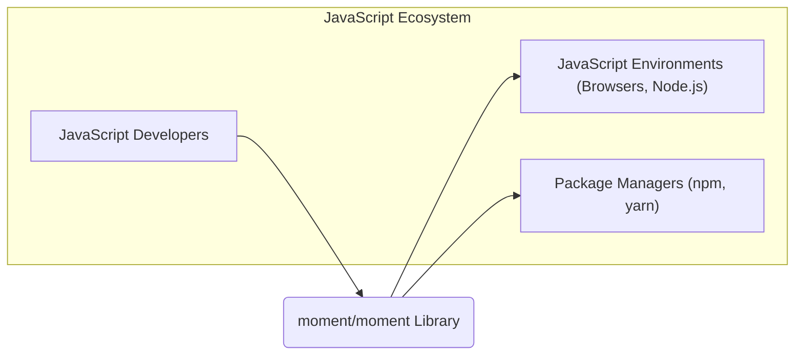
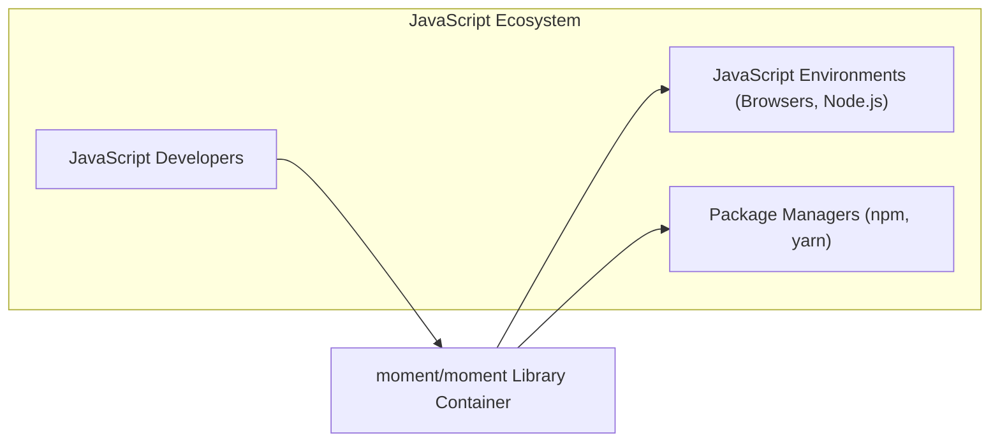

# BUSINESS POSTURE

The `moment/moment` project is a widely used JavaScript library for parsing, validating, manipulating, and displaying dates and times in JavaScript.

*   Business Priorities:
    *   Maintainability: Ensuring the library is easy to understand, modify, and update by contributors and maintainers.
    *   Stability: Providing a reliable and consistent API that developers can depend on for their applications.
    *   Compatibility: Supporting a wide range of JavaScript environments (browsers, Node.js) and date/time formats.
    *   Performance: Optimizing the library for efficient date and time operations to minimize impact on application performance.
    *   Community Support: Fostering a healthy and active community of users and contributors to ensure the library's continued development and improvement.

*   Business Goals:
    *   To be the leading date and time manipulation library for JavaScript.
    *   To provide a comprehensive and user-friendly API for all date and time related tasks.
    *   To ensure the library remains relevant and up-to-date with the evolving JavaScript ecosystem.

*   Business Risks:
    *   Risk of introducing bugs or regressions during development, leading to incorrect date/time calculations in applications using the library.
    *   Risk of security vulnerabilities in the library code that could be exploited by malicious actors in client-side or server-side JavaScript environments.
    *   Risk of performance bottlenecks or inefficiencies in the library impacting the performance of applications.
    *   Risk of losing community support and contributions if the library becomes difficult to maintain or use.
    *   Risk of compatibility issues with new JavaScript environments or browser updates, breaking applications that rely on the library.
    *   Risk of supply chain attacks if the distribution channels (e.g., npm registry) are compromised.

# SECURITY POSTURE

*   Security Control: Code is hosted on a public GitHub repository, allowing for community review and scrutiny. Implemented in: GitHub repository.
*   Security Control: Pull requests are used for code contributions, enabling code review by maintainers before merging. Implemented in: GitHub workflow.
*   Security Control: Unit tests are present in the repository, helping to ensure the functional correctness of the code and prevent regressions. Implemented in: Test suite within the repository.
*   Security Control: Usage of linters and code formatters to maintain code quality and consistency. Implemented in: Development guidelines and potentially CI pipeline.
*   Accepted Risk: Potential for undiscovered vulnerabilities in the library code due to the complexity of date/time manipulation and the wide range of supported formats.
*   Accepted Risk: Reliance on community contributions for security vulnerability identification and patching.
*   Accepted Risk: Potential vulnerabilities in dependencies, although `moment/moment` has very few dependencies.

*   Recommended Security Controls:
    *   Security control: Implement automated Static Application Security Testing (SAST) in the CI/CD pipeline to identify potential security vulnerabilities in the code.
    *   Security control: Implement automated Software Composition Analysis (SCA) to monitor dependencies for known vulnerabilities, even though dependencies are minimal.
    *   Security control: Conduct periodic security audits by external security experts to identify and address potential security weaknesses.
    *   Security control: Establish a clear security vulnerability reporting and response process to handle security issues reported by the community or identified through audits.
    *   Security control: Implement input validation and sanitization practices rigorously throughout the codebase, especially in date parsing functions, to prevent injection vulnerabilities.

*   Security Requirements:
    *   Authentication: Not directly applicable to a JavaScript library. `moment/moment` itself does not handle authentication. Applications using `moment/moment` are responsible for their own authentication mechanisms.
    *   Authorization: Not directly applicable to a JavaScript library. `moment/moment` itself does not handle authorization. Applications using `moment/moment` are responsible for their own authorization mechanisms.
    *   Input Validation:
        *   Requirement: All date and time parsing functions must rigorously validate input strings to prevent unexpected behavior, denial-of-service, or injection vulnerabilities.
        *   Requirement: Error handling for invalid input should be robust and should not expose sensitive information.
    *   Cryptography:
        *   Requirement: While `moment/moment` is not expected to perform cryptographic operations directly, if any future features require cryptography, established and secure cryptographic libraries must be used.
        *   Requirement: Ensure no unintentional exposure of sensitive data through date/time manipulation or formatting, although this is unlikely in the core functionality of `moment/moment`.

# DESIGN

## C4 CONTEXT



*   Context Diagram Elements:
    *   Element:
        *   Name: JavaScript Developers
        *   Type: Person
        *   Description: Developers who use the `moment/moment` library in their JavaScript projects to handle date and time operations.
        *   Responsibilities: Integrate `moment/moment` into their applications, use its API to manipulate dates and times, and rely on its correctness and stability.
        *   Security Controls: Responsible for securely integrating and using `moment/moment` within their applications, including handling any data processed by `moment/moment` securely in their application context.
    *   Element:
        *   Name: JavaScript Environments (Browsers, Node.js)
        *   Type: Software System
        *   Description: The runtime environments where JavaScript code, including `moment/moment`, is executed. This includes web browsers and Node.js environments.
        *   Responsibilities: Provide the execution environment for JavaScript code, including the `moment/moment` library.
        *   Security Controls: Provide security features for JavaScript execution, such as sandboxing in browsers and process isolation in Node.js. These environments are responsible for protecting the user's system from malicious JavaScript code, but not specifically for the security of `moment/moment` itself.
    *   Element:
        *   Name: Package Managers (npm, yarn)
        *   Type: Software System
        *   Description: Tools used by JavaScript developers to manage project dependencies, including downloading and installing libraries like `moment/moment`.
        *   Responsibilities: Distribute and manage JavaScript packages, including `moment/moment`. Provide a platform for discovering and installing libraries.
        *   Security Controls: Implement security measures to prevent malicious packages from being distributed, such as package signing and vulnerability scanning. However, the security of the packages themselves, like `moment/moment`, is the responsibility of the package maintainers.
    *   Element:
        *   Name: moment/moment Library
        *   Type: Software System
        *   Description: The `moment/moment` JavaScript library itself, providing date and time manipulation functionality.
        *   Responsibilities: Provide accurate and reliable date and time operations, maintain compatibility, and address security vulnerabilities.
        *   Security Controls: Code reviews, unit testing, static analysis, and vulnerability management processes implemented by the `moment/moment` project maintainers.

## C4 CONTAINER



*   Container Diagram Elements:
    *   Element:
        *   Name: moment/moment Library Container
        *   Type: Container (JavaScript Library)
        *   Description: Represents the `moment/moment` library as a single deployable and usable component. It encapsulates all the JavaScript code and resources of the library.
        *   Responsibilities: Provide all date and time manipulation functionalities as defined by its API. Be easily installable and usable in JavaScript environments.
        *   Security Controls:
            *   Security control: Input validation within the library's functions.
            *   Security control: Code reviews for all changes.
            *   Security control: Unit and integration testing.
            *   Security control: Static analysis of the codebase.
            *   Security control: Vulnerability scanning of dependencies (though minimal).

## DEPLOYMENT

Deployment for a JavaScript library like `moment/moment` is primarily about distribution through package managers, not traditional server deployment. Developers then include this library in their own applications which are deployed in various ways. We will focus on the distribution aspect.

```mermaid
flowchart LR
    A["Developer's Machine"]
    B["GitHub Repository"]
    C["CI/CD Pipeline (GitHub Actions)"]
    D["npm Registry (or yarn registry)"]
    E["JavaScript Developer's Project"]
    F["JavaScript Environment (Browser/Node.js)"]

    A --> B: Code Push
    B --> C: Build & Test
    C --> D: Publish Package
    D --> E: Package Download
    E --> F: Application Deployment
```

*   Deployment Diagram Elements (Focusing on Library Distribution):
    *   Element:
        *   Name: Developer's Machine
        *   Type: Infrastructure
        *   Description: The local development environment of contributors to the `moment/moment` project.
        *   Responsibilities: Code development, testing, and contribution to the project.
        *   Security Controls: Developer workstation security practices, code signing (if applicable for commits).
    *   Element:
        *   Name: GitHub Repository
        *   Type: Infrastructure
        *   Description: The source code repository for `moment/moment` hosted on GitHub.
        *   Responsibilities: Version control, collaboration, issue tracking, and hosting the project's codebase.
        *   Security Controls: GitHub's security features, including access controls, audit logs, and vulnerability scanning.
    *   Element:
        *   Name: CI/CD Pipeline (GitHub Actions)
        *   Type: Infrastructure
        *   Description: Automated build, test, and deployment pipeline using GitHub Actions.
        *   Responsibilities: Automate the build process, run tests, perform security checks, and publish the library to package registries.
        *   Security Controls: Secure configuration of CI/CD pipelines, secrets management for publishing credentials, and integration of security scanning tools.
    *   Element:
        *   Name: npm Registry (or yarn registry)
        *   Type: Infrastructure
        *   Description: Public package registries where JavaScript packages, including `moment/moment`, are published and distributed.
        *   Responsibilities: Host and distribute JavaScript packages, manage package versions, and provide package download services.
        *   Security Controls: Package signing, malware scanning, and access controls to prevent unauthorized package publishing.
    *   Element:
        *   Name: JavaScript Developer's Project
        *   Type: Infrastructure
        *   Description: Represents projects of developers who use `moment/moment` as a dependency.
        *   Responsibilities: Integrate and utilize `moment/moment` in their applications.
        *   Security Controls: Dependency management practices, vulnerability scanning of dependencies in their projects.
    *   Element:
        *   Name: JavaScript Environment (Browser/Node.js)
        *   Type: Infrastructure
        *   Description: The runtime environment where applications using `moment/moment` are deployed and executed.
        *   Responsibilities: Execute JavaScript code, including `moment/moment` library code.
        *   Security Controls: Browser security features, Node.js security best practices, application-level security controls.

## BUILD

```mermaid
flowchart LR
    A["Developer"] --> B["GitHub Repository"]: Code Commit
    B --> C["GitHub Actions"]: CI Build Trigger
    subgraph "GitHub Actions CI"
        C --> D["Checkout Code"]
        D --> E["Install Dependencies"]
        E --> F["Linting & Formatting"]
        F --> G["Unit Tests"]
        G --> H["SAST (Recommended)"]
        H --> I["Build Artifacts"]
        I --> J["Publish to npm Registry"]: On Tag/Release
    end
    J --> K["npm Registry"]
```

*   Build Process Elements:
    *   Element:
        *   Name: Developer
        *   Type: Person
        *   Description: A software developer contributing to the `moment/moment` project.
        *   Responsibilities: Writing code, running local tests, and committing changes to the GitHub repository.
        *   Security Controls: Secure coding practices, local development environment security.
    *   Element:
        *   Name: GitHub Repository
        *   Type: Software System
        *   Description: Hosts the source code and triggers the CI/CD pipeline on code changes.
        *   Responsibilities: Version control, triggering builds, storing build configurations.
        *   Security Controls: Access controls, branch protection, audit logs.
    *   Element:
        *   Name: GitHub Actions
        *   Type: Software System
        *   Description: The CI/CD platform used to automate the build, test, and publish process.
        *   Responsibilities: Automating the build pipeline, running tests, performing security checks, and publishing artifacts.
        *   Security Controls: Secure pipeline configuration, secrets management, access controls for workflows.
    *   Element:
        *   Name: Checkout Code
        *   Type: Build Step
        *   Description: Step in the CI pipeline to retrieve the latest code from the GitHub repository.
        *   Responsibilities: Obtain the codebase for building.
        *   Security Controls: Access control to the repository.
    *   Element:
        *   Name: Install Dependencies
        *   Type: Build Step
        *   Description: Step to install project dependencies (though `moment/moment` has minimal dependencies).
        *   Responsibilities: Prepare the build environment with necessary libraries.
        *   Security Controls: Dependency vulnerability scanning (SCA - recommended), using trusted package sources.
    *   Element:
        *   Name: Linting & Formatting
        *   Type: Build Step
        *   Description: Step to enforce code style and quality using linters and formatters.
        *   Responsibilities: Improve code quality and consistency, potentially catch some simple errors.
        *   Security Controls: Configuration of linters to detect potential security issues (e.g., insecure coding patterns).
    *   Element:
        *   Name: Unit Tests
        *   Type: Build Step
        *   Description: Step to execute unit tests to verify the functional correctness of the code.
        *   Responsibilities: Ensure code functionality and prevent regressions.
        *   Security Controls: Well-written tests that cover security-relevant functionalities, test environment isolation.
    *   Element:
        *   Name: SAST (Recommended)
        *   Type: Build Step
        *   Description: Recommended step to integrate Static Application Security Testing tools to automatically identify potential security vulnerabilities in the code.
        *   Responsibilities: Proactively identify security weaknesses in the codebase.
        *   Security Controls: Configuration of SAST tools, vulnerability reporting and remediation process.
    *   Element:
        *   Name: Build Artifacts
        *   Type: Build Step
        *   Description: Step to compile and package the library into distributable artifacts.
        *   Responsibilities: Create deployable packages of the library.
        *   Security Controls: Integrity checks of build artifacts, secure storage of artifacts before publishing.
    *   Element:
        *   Name: Publish to npm Registry
        *   Type: Build Step
        *   Description: Step to publish the built library package to the npm registry (or yarn registry). Typically triggered on tagged releases.
        *   Responsibilities: Distribute the library to users through package managers.
        *   Security Controls: Secure publishing credentials management, package signing (if supported by registry), registry security policies.
    *   Element:
        *   Name: npm Registry
        *   Type: Software System
        *   Description: Public registry for JavaScript packages.
        *   Responsibilities: Host and distribute `moment/moment` package.
        *   Security Controls: Registry security measures, package verification processes.

# RISK ASSESSMENT

*   Critical Business Processes to Protect:
    *   Availability and integrity of the `moment/moment` library distribution through package managers.
    *   Integrity and confidentiality of the source code repository.
    *   Reliability and correctness of the date and time manipulation logic within the library.

*   Data to Protect and Sensitivity:
    *   Source Code: High sensitivity. Compromise could lead to malicious modifications and widespread impact on applications using the library.
    *   Build Artifacts (npm packages): High sensitivity. Compromise could lead to distribution of malicious versions of the library.
    *   Developer Credentials and Secrets: High sensitivity. Compromise could allow unauthorized code changes or package publishing.
    *   User Data: Low sensitivity in the context of the library itself. `moment/moment` processes date and time data, but does not store or manage user-specific data. However, applications using `moment/moment` may handle sensitive user data, and the library's correctness is crucial for those applications.

# QUESTIONS & ASSUMPTIONS

*   Questions:
    *   Is there a documented security vulnerability reporting process for `moment/moment`?
    *   Are there any plans to implement automated SAST and SCA in the CI/CD pipeline?
    *   Are there regular security audits conducted for the `moment/moment` project?
    *   What is the process for handling and patching security vulnerabilities once they are identified?
    *   Are there any specific input validation strategies currently employed in date parsing functions?

*   Assumptions:
    *   The primary distribution channel for `moment/moment` is npm registry.
    *   GitHub Actions is used for the CI/CD pipeline.
    *   The project maintainers are responsive to community contributions and security concerns.
    *   The library is primarily used in JavaScript environments (browsers and Node.js).
    *   Security is a concern for the project maintainers, even if not explicitly stated in the repository.