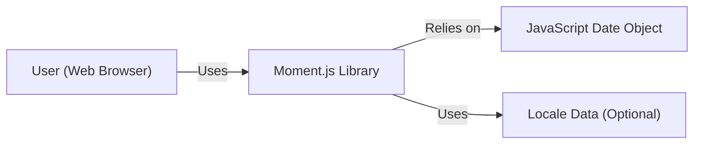
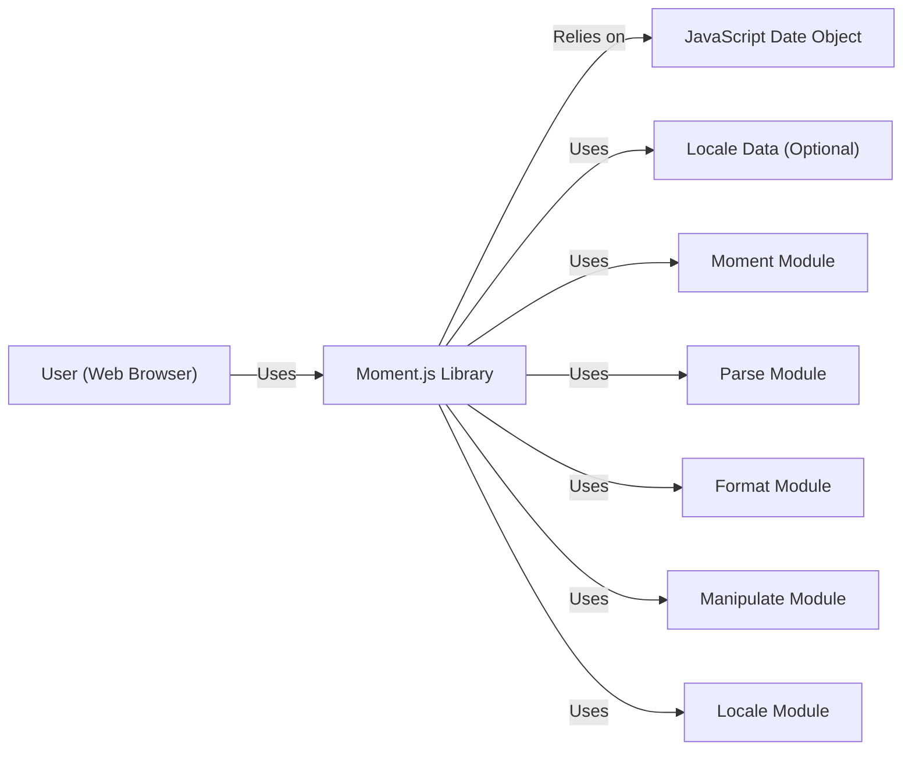
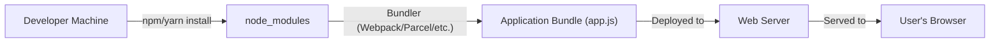
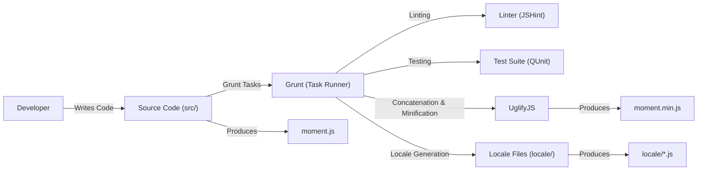

Okay, let's create a design document for the Moment.js library, keeping in mind its purpose and potential security considerations.

# BUSINESS POSTURE

Moment.js is a widely used, mature JavaScript library for parsing, validating, manipulating, and displaying dates and times.  It's a foundational component in countless web applications.

Priorities:

*   Maintainability:  The library should be easy to maintain and update, given its widespread use and the evolving nature of date/time standards.
*   Backward Compatibility:  Changes should ideally not break existing implementations, as this could disrupt a vast number of applications.  This is a major constraint.
*   Accuracy:  Date and time calculations must be accurate and reliable across different time zones and locales.
*   Performance:  The library should be performant, as it's often used in client-side applications where speed is crucial.
*   Lightweight: Keep size of library as small as possible.

Goals:

*   Provide a comprehensive and user-friendly API for date and time manipulation.
*   Support a wide range of date and time formats.
*   Handle time zones and locales correctly.
*   Be reliable and well-tested.

Business Risks:

*   Inaccurate Date/Time Calculations: Incorrect calculations could lead to significant business problems, especially in applications dealing with scheduling, financial transactions, or legal deadlines.
*   Security Vulnerabilities:  Vulnerabilities in date parsing or formatting could potentially be exploited for cross-site scripting (XSS) or other attacks.  While Moment.js itself might not be the primary target, vulnerabilities could be leveraged in applications that use it improperly.
*   Deprecation and Lack of Maintenance:  If the library is no longer actively maintained, it could become a liability over time as new browser versions or date/time standards emerge.  This risk is somewhat mitigated by the project's maturity and large community, but it's still a concern.
*   Breaking Changes: Introducing changes that break backward compatibility could cause widespread disruption and damage the library's reputation.

# SECURITY POSTURE

Existing Security Controls:

*   security control: Extensive Test Suite: Moment.js has a comprehensive test suite that helps ensure the accuracy and reliability of its calculations. (Described in the project's GitHub repository and contribution guidelines).
*   security control: Community Scrutiny: Being a widely used open-source project, Moment.js benefits from scrutiny by a large community of developers, which helps identify and address potential issues. (Visible through the project's issue tracker and pull requests on GitHub).
*   security control: Input Validation: Moment.js performs some input validation to handle invalid date formats gracefully. (Documented in the API reference).
*   security control: Regular Expression Usage: Moment.js uses regular expressions for parsing dates, which can be a potential source of vulnerabilities if not carefully crafted. (Visible in the source code).
*   security control: No External Dependencies: Moment.js has no external dependencies, reducing the risk of supply chain attacks. (Confirmed by examining the `package.json` file).

Accepted Risks:

*   accepted risk: Regular Expression Complexity: The complexity of some regular expressions used for date parsing could potentially lead to ReDoS (Regular Expression Denial of Service) vulnerabilities, although the risk is likely low given the library's maturity and testing.
*   accepted risk: Reliance on Browser Date/Time APIs: Moment.js relies on the underlying JavaScript engine's Date object, which can have inconsistencies across different browsers and environments.
*   accepted risk: Potential for Misuse: Developers might misuse Moment.js APIs, leading to security vulnerabilities in their applications (e.g., not properly sanitizing user-provided dates before parsing). This is an application-level concern, not a direct vulnerability in Moment.js itself.

Recommended Security Controls:

*   security control: Fuzz Testing: Implement fuzz testing to identify potential vulnerabilities related to unexpected or malformed input.
*   security control: Regular Expression Auditing: Regularly audit the regular expressions used for date parsing to ensure they are not vulnerable to ReDoS attacks.
*   security control: Content Security Policy (CSP) Guidance: Provide guidance to developers on how to use Moment.js securely within a Content Security Policy (CSP) context, particularly if they are using the `moment().format()` function with user-provided formats.

Security Requirements:

*   Authentication: Not applicable, as Moment.js is a client-side library and does not handle authentication.
*   Authorization: Not applicable, as Moment.js does not handle authorization.
*   Input Validation:
    *   Moment.js should gracefully handle invalid date inputs, returning an invalid date object rather than throwing an error or causing unexpected behavior.
    *   Developers should be encouraged to validate user-provided dates before passing them to Moment.js.
*   Cryptography: Not directly applicable, as Moment.js does not perform cryptographic operations. However, if Moment.js is used to handle timestamps related to security tokens or other sensitive data, developers should ensure those timestamps are handled securely at the application level.
*   Output Encoding:
    *   When using `moment().format()` with user-provided formats, developers should be aware of the potential for XSS vulnerabilities if the output is not properly encoded. Moment.js itself does not perform output encoding.

# DESIGN

## C4 CONTEXT

Element Description:

*   Element:
    *   Name: User
    *   Type: Person
    *   Description: A user interacting with a web application that utilizes Moment.js.
    *   Responsibilities: Interacts with the web application, potentially providing date/time input.
    *   Security controls: Browser security features (e.g., same-origin policy, CSP).
*   Element:
    *   Name: Moment.js Library
    *   Type: Software System
    *   Description: The Moment.js library itself, running within the user's web browser.
    *   Responsibilities: Parsing, validating, manipulating, and formatting dates and times.
    *   Security controls: Input validation, extensive test suite, community scrutiny.
*   Element:
    *   Name: JavaScript Date Object
    *   Type: Software System
    *   Description: The built-in JavaScript Date object, provided by the browser's JavaScript engine.
    *   Responsibilities: Provides fundamental date and time functionality.
    *   Security controls: Implemented and maintained by browser vendors.
*   Element:
    *   Name: Locale Data
    *   Type: Data
    *   Description: Optional locale data that can be loaded to customize date and time formatting for different languages and regions.
    *   Responsibilities: Provides localized strings and formatting rules.
    *   Security controls: Should be loaded from a trusted source.

## C4 CONTAINER

Since Moment.js is a single JavaScript library, the Container diagram is essentially the same as the Context diagram, with the addition of internal modules.

Element Description:

*   Element:
    *   Name: User, Moment.js Library, JavaScript Date Object, Locale Data
    *   Type: The same as C4 CONTEXT
    *   Description: The same as C4 CONTEXT
    *   Responsibilities: The same as C4 CONTEXT
    *   Security controls: The same as C4 CONTEXT
*   Element:
    *   Name: Moment Module
    *   Type: Module
    *   Description: Core module for creating Moment objects.
    *   Responsibilities: Provides the main `moment()` constructor and related functions.
    *   Security controls: Input validation.
*   Element:
    *   Name: Parse Module
    *   Type: Module
    *   Description: Module for parsing dates from strings.
    *   Responsibilities: Handles various date formats and uses regular expressions for parsing.
    *   Security controls: Input validation, regular expression auditing.
*   Element:
    *   Name: Format Module
    *   Type: Module
    *   Description: Module for formatting dates into strings.
    *   Responsibilities: Handles various date formats and locale-specific formatting.
    *   Security controls: None directly, but developers should be aware of potential XSS vulnerabilities when using user-provided formats.
*   Element:
    *   Name: Manipulate Module
    *   Type: Module
    *   Description: Module for manipulating dates (adding, subtracting, etc.).
    *   Responsibilities: Performs date arithmetic and adjustments.
    *   Security controls: None.
*   Element:
    *   Name: Locale Module
    *   Type: Module
    *   Description: Module for managing locales.
    *   Responsibilities: Loads and applies locale-specific data.
    *   Security controls: Ensure locale data is loaded from a trusted source.

## DEPLOYMENT

Moment.js is typically deployed in one of the following ways:

1.  **Direct Inclusion:** Including the `moment.js` (or `moment.min.js`) file directly in an HTML page using a `<script>` tag.
2.  **Bundling:** Using a module bundler like Webpack, Browserify, or Parcel to include Moment.js as part of a larger JavaScript bundle.
3.  **CDN:** Loading Moment.js from a Content Delivery Network (CDN) like jsDelivr or cdnjs.
4.  **Package Manager:** Installing Moment.js via a package manager like npm or yarn and then importing it into the project.

Chosen Deployment Solution (Package Manager + Bundling): This is a common and recommended approach for modern web development.

Element Description:

*   Element:
    *   Name: Developer Machine
    *   Type: Device
    *   Description: The developer's local machine where the code is written and built.
    *   Responsibilities: Writing code, running build tools, managing dependencies.
    *   Security controls: Standard development environment security practices.
*   Element:
    *   Name: node_modules
    *   Type: Directory
    *   Description: Directory where npm/yarn installs project dependencies, including Moment.js.
    *   Responsibilities: Stores downloaded packages.
    *   Security controls: Dependency auditing, using a lockfile (package-lock.json or yarn.lock).
*   Element:
    *   Name: Bundler (Webpack/Parcel/etc.)
    *   Type: Software System
    *   Description: A module bundler that combines JavaScript modules into a single bundle.
    *   Responsibilities: Resolving dependencies, optimizing code, creating the final bundle.
    *   Security controls: Using secure configurations, keeping the bundler up to date.
*   Element:
    *   Name: Application Bundle (app.js)
    *   Type: File
    *   Description: The final JavaScript bundle containing the application code and Moment.js.
    *   Responsibilities: Contains the application's logic, including date/time handling.
    *   Security controls: Code minification, obfuscation (optional).
*   Element:
    *   Name: Web Server
    *   Type: Server
    *   Description: The web server that hosts the application bundle.
    *   Responsibilities: Serving the bundle to the user's browser.
    *   Security controls: Standard web server security practices (e.g., HTTPS, proper configuration).
*   Element:
    *   Name: User's Browser
    *   Type: Device
    *   Description: The user's web browser where the application bundle is executed.
    *   Responsibilities: Running the JavaScript code, including Moment.js.
    *   Security controls: Browser security features (e.g., same-origin policy, CSP).

## BUILD

Moment.js uses a build process involving Grunt to create minified versions and manage locales. The process generally involves:

1.  **Source Code:** Developers write and modify the source code (primarily JavaScript files in the `src/` directory).
2.  **Grunt Tasks:** Grunt is used as a task runner to automate the build process. Tasks include:
    *   **Linting:** Checking code style and potential errors using linters (e.g., JSHint).
    *   **Testing:** Running the test suite to ensure code correctness.
    *   **Concatenation:** Combining multiple JavaScript files into a single file.
    *   **Minification:** Reducing the size of the JavaScript file by removing unnecessary characters and whitespace (using UglifyJS).
    *   **Locale Generation:** Building individual locale files.
3.  **Artifacts:** The build process produces the following artifacts:
    *   `moment.js`: The unminified version of the library.
    *   `moment.min.js`: The minified version of the library.
    *   `locale/*.js`: Individual locale files.

Security Controls in Build Process:

*   security control: Linting: Using a linter (JSHint) helps identify potential code quality and security issues early in the development process.
*   security control: Testing: The extensive test suite (QUnit) helps ensure the correctness and reliability of the code, reducing the risk of bugs and vulnerabilities.
*   security control: No External Build Dependencies: The build process primarily relies on tools within the Node.js ecosystem (Grunt, UglifyJS, JSHint, QUnit), which are well-established and maintained. There are no unusual external dependencies that could introduce supply chain risks.
*   security control: Dependency Management: Using npm/yarn and a lockfile (package-lock.json or yarn.lock) helps ensure consistent and reproducible builds, reducing the risk of introducing vulnerabilities through dependency updates.

# RISK ASSESSMENT

Critical Business Processes:

*   Accurate date and time calculations in web applications. This is critical for any application that deals with scheduling, deadlines, financial transactions, or any other time-sensitive data.
*   Consistent date and time display across different browsers and locales. This is important for user experience and data integrity.

Data to Protect:

*   While Moment.js itself doesn't directly handle sensitive data, it's often used to process and display dates and times that *are* sensitive. This could include:
    *   Dates of birth
    *   Financial transaction timestamps
    *   Appointment schedules
    *   Event deadlines
    *   Timestamps in security tokens

Data Sensitivity:

*   The sensitivity of the data processed by Moment.js depends entirely on the application using it. Moment.js itself treats all dates and times equally. It's the responsibility of the application developer to handle sensitive data appropriately.

# QUESTIONS & ASSUMPTIONS

Questions:

*   Are there any specific regulatory requirements (e.g., GDPR, CCPA) that impact how dates and times should be handled in applications using Moment.js? (Assumption: The application developer is responsible for complying with relevant regulations.)
*   Are there any specific security concerns related to the use of Moment.js in a particular environment (e.g., server-side rendering, embedded systems)? (Assumption: Moment.js is primarily used in client-side web applications.)
*   Are there plans to deprecate or replace any specific features of Moment.js in the future? (Assumption: The core API of Moment.js is stable, but new features may be added, and existing features may be improved.)

Assumptions:

*   BUSINESS POSTURE: The primary goal is to maintain a stable and reliable library, prioritizing backward compatibility.
*   SECURITY POSTURE: The existing test suite and community scrutiny provide a reasonable level of security.
*   DESIGN: The library is primarily used client-side, and the build process is well-defined and secure. The library is self-contained and does not have external runtime dependencies.
*   DESIGN: Developers are responsible for handling any sensitive data appropriately and for validating user input before passing it to Moment.js.
*   DESIGN: The use of regular expressions for date parsing is a potential, but low, risk.
*   DESIGN: The library is loaded and executed within a standard web browser environment, with typical browser security mechanisms in place.