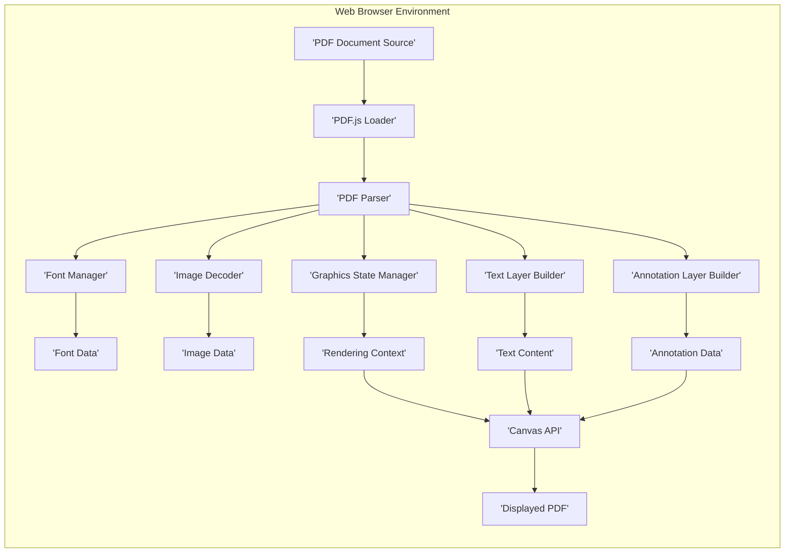
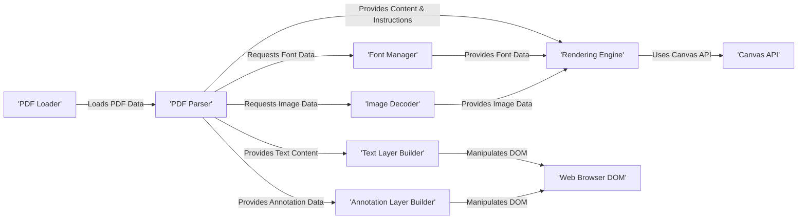
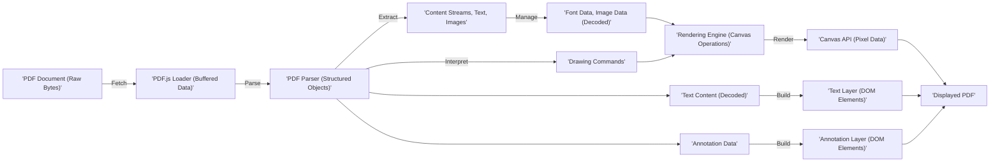

## Project Design Document: PDF.js for Threat Modeling (Improved)

**1. Introduction**

This document provides an enhanced design overview of the PDF.js project, the Mozilla-developed open-source JavaScript library for rendering Portable Document Format (PDF) files directly within web browsers. This document is specifically tailored to support comprehensive threat modeling, detailing the architecture, key components, data flow with transformations, and critical security considerations. The goal is to provide a clear understanding of the system's attack surface.

**2. Goals**

*   Provide a clear and concise understanding of the PDF.js architecture and its internal operations relevant to security.
*   Identify and describe key components and their interactions, highlighting potential trust boundaries.
*   Map the flow of data through the system, emphasizing data transformations and potential injection points.
*   Serve as a definitive resource for conducting thorough and effective threat modeling exercises.
*   Enable security engineers, developers, and testers to understand the potential attack vectors and vulnerabilities within PDF.js.

**3. Architecture Overview**

PDF.js operates entirely within the client-side web browser environment, utilizing JavaScript to process and display PDF documents. The core architectural stages involve:

*   **Retrieval:** Obtaining the PDF document from its source.
*   **Decomposition:** Parsing the binary PDF structure to extract content and metadata.
*   **Interpretation:** Understanding the extracted content and instructions.
*   **Visualization:** Rendering the interpreted content onto the browser canvas.
*   **User Engagement:** Handling user interactions with the displayed PDF.

**4. Detailed Design**

This section provides a deeper look into the key components and their functionalities, emphasizing security-relevant aspects.

**4.1. Core Components**

*   **PDF Loader:** Responsible for fetching the PDF document. This involves handling various protocols (HTTP, file://), managing asynchronous operations, and potential authentication/authorization challenges. *Security Focus: Potential for man-in-the-middle attacks during retrieval, exposure of credentials if not handled securely.*
*   **PDF Parser:** The central and most complex component, responsible for dissecting the binary PDF structure. It interprets the PDF syntax, including objects, streams, and cross-reference tables. *Security Focus: Primary attack surface. Vulnerabilities here can lead to remote code execution, denial of service, or information disclosure.*
    *   **Lexer:** Tokenizes the raw PDF data stream. *Security Focus: Potential for buffer overflows or incorrect tokenization leading to parser errors.*
    *   **Object Parser:** Parses individual PDF objects (dictionaries, arrays, strings, numbers). *Security Focus: Vulnerabilities in handling malformed or excessively large objects.*
    *   **Stream Parser:** Handles compressed data streams within the PDF. *Security Focus: Vulnerabilities in decompression algorithms or handling of malicious compression ratios (zip bombs).*
    *   **Cross-Reference Table Parser:** Interprets the xref table, which maps object numbers to their byte offsets. *Security Focus: Incorrect parsing can lead to accessing incorrect object data or out-of-bounds reads.*
*   **Font Manager:** Manages the loading and caching of fonts embedded within the PDF or available on the system. It handles different font formats and character encodings. *Security Focus: Malicious fonts could exploit vulnerabilities in font rendering engines or expose system resources.*
*   **Image Decoder:** Decodes various image formats embedded in the PDF (JPEG, PNG, etc.). *Security Focus: Relies on browser's image decoding capabilities, which may have their own vulnerabilities. Malicious images can exploit these.*
*   **Graphics State Manager:** Maintains the current graphics state during rendering, including colors, line styles, and transformations. *Security Focus: While less direct, incorrect state management could potentially be exploited in rendering vulnerabilities.*
*   **Rendering Engine:** The core logic for drawing PDF content onto the HTML5 Canvas. This involves interpreting drawing commands and applying the current graphics state. *Security Focus: Vulnerabilities in interpreting drawing commands could lead to unexpected behavior or even script injection if not handled carefully.*
*   **Text Layer Builder:** Creates a selectable and searchable text layer on top of the rendered PDF. This involves extracting text content and positioning it accurately. *Security Focus: Potential for XSS if text content is not properly sanitized before being added to the DOM.*
*   **Annotation Layer Builder:** Handles the rendering and interaction of annotations within the PDF (links, comments, form fields). *Security Focus: High-risk area for XSS vulnerabilities through malicious links or form field content. Potential for phishing attacks.*
*   **Event Handling:** Manages user interactions such as mouse clicks, scrolling, and keyboard input. *Security Focus:  Potential for triggering unintended actions or exploiting vulnerabilities through crafted events.*
*   **Worker API (Optional):** Utilizes web workers to perform computationally intensive tasks (like parsing and rendering) in a separate thread. *Security Focus: While improving performance, ensure secure communication and data handling between the main thread and workers.*

**4.2. Component Interaction Diagram**

This diagram illustrates the key interactions between the core components.

**4.3. Data Flow with Transformations**

The typical data flow within PDF.js, highlighting data transformations, is as follows:

1. **PDF Document Acquisition:** Raw binary data of the PDF is fetched.
    *   *Transformation: None initially.*
2. **Loading and Buffering:** The raw bytes are loaded and stored in a buffer.
    *   *Transformation: Potentially none, or basic buffering.*
3. **Parsing:** The PDF Parser processes the buffered data.
    *   *Transformation: Raw bytes are tokenized, then transformed into structured PDF objects (dictionaries, arrays, streams).*
4. **Content Extraction:** Content streams, text, images, and other resources are extracted from the parsed objects.
    *   *Transformation: Compressed streams are decompressed. Encoded text is decoded.*
5. **Resource Management:** Fonts and images are prepared for rendering.
    *   *Transformation: Font files are parsed and glyph data is extracted. Image data is decoded into pixel data.*
6. **Rendering:** Drawing commands are interpreted, and content is drawn onto the HTML5 Canvas.
    *   *Transformation: Abstract drawing commands are translated into concrete pixel manipulations on the canvas.*
7. **Layer Building:** Text and annotation data are used to build interactive layers.
    *   *Transformation: Text content is positioned and styled for display. Annotation data is used to create interactive elements in the DOM.*
8. **Display:** The rendered content is displayed in the browser.
    *   *Transformation: Canvas pixel data is displayed visually.*
9. **Interaction:** User interactions trigger events.
    *   *Transformation: User input is translated into browser events that PDF.js handles.*

**4.4. External Dependencies and Interfaces**

*   **Web Browser APIs:** PDF.js relies heavily on standard web browser APIs.
    *   **XMLHttpRequest/Fetch API:** For loading PDF documents. *Security Focus: Browser security policies govern these interactions.*
    *   **Canvas API:** For rendering graphics. *Security Focus: Potential vulnerabilities in the browser's Canvas implementation.*
    *   **Web Workers API:** For offloading processing. *Security Focus: Secure communication between main thread and workers is crucial.*
    *   **JavaScript Engine:** For executing the PDF.js code. *Security Focus: Subject to the security of the browser's JavaScript engine.*
    *   **DOM API:** For manipulating the HTML structure and user interface. *Security Focus:  Primary target for XSS vulnerabilities if manipulated with unsanitized data.*
*   **Font Files:** External font files may be loaded. *Security Focus:  Potential for malicious font files if not handled carefully.*
*   **Image Libraries (Browser Provided):** Relies on the browser's built-in image decoding. *Security Focus: Vulnerabilities in the browser's image decoders can be exploited.*

**5. Security Considerations (Detailed)**

This section provides a more detailed breakdown of potential security vulnerabilities, categorized for clarity.

*   **JavaScript Vulnerabilities:**
    *   **Cross-Site Scripting (XSS):**  Improper handling of user-provided PDF content (especially in annotations or form fields) can lead to script injection.
    *   **Prototype Pollution:**  Manipulating JavaScript object prototypes could lead to unexpected behavior or security bypasses.
    *   **Type Confusion:** Exploiting weaknesses in JavaScript's dynamic typing can lead to unexpected code execution.
*   **PDF Parsing Vulnerabilities:**
    *   **Remote Code Execution (RCE):** Exploiting vulnerabilities in the parser to execute arbitrary code on the user's machine.
    *   **Denial of Service (DoS):** Crafting PDFs that cause excessive resource consumption (CPU, memory), leading to browser crashes or hangs.
    *   **Information Disclosure:**  Exploiting parsing errors to leak sensitive information from the PDF content.
    *   **Integer Overflows/Underflows:**  Parsing large or complex PDF structures can lead to arithmetic errors.
    *   **Buffer Overflows:**  Writing beyond the allocated memory boundaries during parsing.
*   **Font Handling Vulnerabilities:**
    *   **Font Parsing Exploits:** Maliciously crafted fonts can exploit vulnerabilities in the font parsing logic.
    *   **Resource Exhaustion:**  Loading excessively large or complex fonts can lead to DoS.
*   **Image Decoding Vulnerabilities:**
    *   **Exploiting Browser Image Decoders:** Malicious images can trigger vulnerabilities in the browser's image decoding libraries.
    *   **Pixel Flood Attacks:**  Crafted images that consume excessive memory during decoding.
*   **Annotation Handling Vulnerabilities:**
    *   **XSS through Links and Form Fields:** Malicious URLs or JavaScript embedded in annotations.
    *   **Phishing Attacks:**  Deceptive links disguised as legitimate content.
*   **Error Handling and Logging:**
    *   **Information Leakage through Error Messages:**  Exposing sensitive information in error messages.
    *   **Lack of Proper Error Handling:**  Leading to unexpected behavior or exploitable states.
*   **Input Validation:**
    *   **Insufficient Validation:**  Failing to properly validate PDF structure and content can lead to parsing vulnerabilities.
    *   **Reliance on Client-Side Validation:**  Client-side validation can be bypassed; server-side validation (if applicable) is crucial.

**6. Threat Modeling Focus Areas**

Based on the architecture, data flow, and security considerations, the following areas should be the primary focus during threat modeling exercises, potentially using frameworks like STRIDE:

*   **PDF Parser (Spoofing, Tampering, Repudiation, Information Disclosure, Denial of Service, Elevation of Privilege):**  Thorough analysis of the parsing logic for vulnerabilities related to malformed or malicious PDF structures.
*   **Font Manager (Tampering, Denial of Service, Elevation of Privilege):**  Focus on the process of loading and rendering fonts, looking for vulnerabilities related to font parsing and malicious font files.
*   **Image Decoder Interface (Denial of Service, Elevation of Privilege):**  Analyze the interaction with the browser's image decoding capabilities and potential risks from malicious images.
*   **Annotation Handling (Spoofing, Tampering, Information Disclosure, Denial of Service, Elevation of Privilege):**  Examine the processing of annotations, especially links and form fields, for XSS and other injection vulnerabilities.
*   **Communication with Browser APIs (Information Disclosure, Denial of Service, Elevation of Privilege):**  Analyze the security of interactions with browser APIs, ensuring data passed is sanitized and secure.
*   **PDF Loading Mechanism (Spoofing, Tampering):**  Assess the security of the PDF loading process, especially when fetching documents from external sources, considering potential man-in-the-middle attacks.
*   **Text Layer Builder (Spoofing, Information Disclosure):**  Focus on preventing XSS vulnerabilities when creating the selectable text layer.

**7. Conclusion**

This improved design document provides a comprehensive and security-focused overview of the PDF.js project. It details the architecture, component interactions, data flow with transformations, and critical security considerations. This information is essential for conducting effective threat modeling to identify and mitigate potential vulnerabilities. By prioritizing the focus areas outlined, security engineers and developers can proactively address potential threats and enhance the security posture of PDF.js.