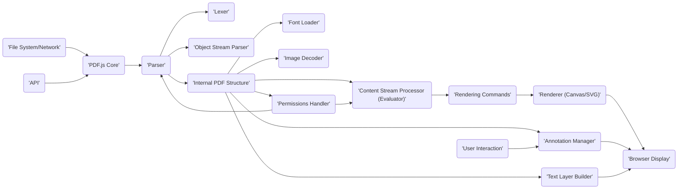

## Project Design Document: PDF.js (Improved)

**1. Introduction**

This document provides an enhanced and more detailed design overview of PDF.js, an open-source JavaScript library developed by Mozilla for rendering Portable Document Format (PDF) files directly within web browsers. This document is specifically crafted to facilitate subsequent threat modeling activities by providing a comprehensive understanding of the system's architecture, components, data flow, and potential security considerations.

**2. Goals and Objectives**

* **Primary Goal:** To enable web browsers to natively and securely render PDF documents without requiring external plugins or browser extensions, ensuring a consistent user experience across platforms.
* **Key Objectives:**
    * **Accurate Rendering:**  Faithfully reproduce the visual content of PDF documents according to the ISO 32000 standard and related specifications.
    * **High Performance:** Achieve efficient and responsive PDF rendering to provide a smooth user experience, even with complex documents.
    * **Robust Security:** Minimize the attack surface and mitigate security vulnerabilities inherent in PDF processing, protecting users from malicious content.
    * **Universal Accessibility:**  Support accessibility standards and guidelines to ensure PDF content is usable by individuals with disabilities.
    * **Cross-Browser Compatibility:**  Function reliably and consistently across a wide range of modern web browsers and operating systems.
    * **Developer Flexibility:** Offer well-defined APIs and extension points for developers to integrate and customize the PDF viewer functionality within their applications.

**3. System Architecture**

PDF.js employs a layered architecture to manage the complexity of PDF processing:

* **Core Parsing and Interpretation Layer:** This foundational layer is responsible for dissecting the PDF file structure, decoding objects, and interpreting the semantics of the PDF content. It forms the basis for all subsequent operations.
* **Rendering Engine Layer:** This layer takes the interpreted PDF data and translates it into visual representations on the browser canvas or using SVG elements. It manages the layout, drawing of graphics, and text rendering.
* **External Integration and Presentation Layer:** This layer provides the interface between the core rendering engine and the external environment, including the browser's DOM, user interactions, and application-level integrations.

**4. Components**

The following are key components within the PDF.js architecture, with a focus on their roles and potential security implications:

* **Parser:**
    * **Responsibility:** Reads the binary PDF file, interprets its structure (objects, headers, trailers), and extracts data streams. Handles incremental updates and repair mechanisms.
    * **Security Relevance:** A primary attack surface. Vulnerabilities here can lead to DoS, information leaks, or even RCE if malformed input is not handled correctly. Needs robust error handling and input validation.
* **Lexer:**
    * **Responsibility:** A sub-component of the Parser. Breaks down the raw byte stream into tokens representing PDF syntax elements (keywords, numbers, strings, etc.).
    * **Security Relevance:** Errors in tokenization can lead to incorrect parsing and potentially exploitable states.
* **Object Stream Parser:**
    * **Responsibility:** Specifically handles parsing of object streams (compressed collections of PDF objects), which are common in modern PDFs.
    * **Security Relevance:**  Improper decompression or parsing of object streams can introduce vulnerabilities.
* **Content Stream Processor (Evaluator):**
    * **Responsibility:** Interprets the instructions within PDF content streams, which dictate how text, graphics, and images are drawn. Executes PDF operators.
    * **Security Relevance:**  A critical component for security. Maliciously crafted content streams can exploit vulnerabilities in operator implementations, potentially leading to RCE or other undesirable behavior.
* **Font Loader and Manager:**
    * **Responsibility:** Loads and manages fonts referenced in the PDF, handling various font formats (TrueType, OpenType, Type 1, CFF). May involve fetching font data embedded in the PDF or from external sources (though external fetching is generally restricted for security).
    * **Security Relevance:**  Processing untrusted font data can lead to vulnerabilities in font parsing libraries or the operating system's font rendering engine.
* **Image Decoder:**
    * **Responsibility:** Decodes image data embedded within the PDF, supporting formats like JPEG, PNG, JBIG2, and CCITT.
    * **Security Relevance:** Image decoders are historically prone to vulnerabilities (buffer overflows, etc.). Secure and well-tested decoding libraries are essential.
* **Renderer (Canvas and SVG):**
    * **Responsibility:** Takes the interpreted content and draws it onto the browser's `<canvas>` element or using SVG. Handles drawing primitives, text rendering, and compositing.
    * **Security Relevance:** While generally less directly vulnerable than parsing components, issues in rendering logic could potentially be exploited. Browser security mechanisms (like the same-origin policy) provide some protection.
* **Annotation Manager:**
    * **Responsibility:** Handles interactive elements within the PDF, such as hyperlinks, form fields, and comments. Manages user interactions and associated actions.
    * **Security Relevance:** Annotations can be vectors for malicious actions (e.g., opening phishing links, executing embedded JavaScript – though PDF.js strictly limits this). Input validation and sanitization are crucial.
* **Text Layer Builder:**
    * **Responsibility:** Creates a selectable and searchable text layer by extracting text content and its positioning information.
    * **Security Relevance:** Less directly security-critical, but vulnerabilities could potentially lead to information leaks or incorrect text rendering.
* **Outline (Table of Contents) Builder:**
    * **Responsibility:** Parses the PDF's outline information to create a navigable table of contents.
    * **Security Relevance:**  Low security risk, primarily related to potential DoS from excessively large or malformed outlines.
* **Permissions Handler:**
    * **Responsibility:** Enforces security restrictions defined within the PDF document (e.g., preventing printing, copying, or modifying content).
    * **Security Relevance:**  Ensuring correct enforcement of permissions is vital to respect the author's intended restrictions. Bypass vulnerabilities would be a significant security issue.
* **Worker Thread Manager:**
    * **Responsibility:** Manages the use of Web Workers to offload computationally intensive tasks (parsing, decoding) to background threads, improving responsiveness.
    * **Security Relevance:** While primarily for performance, communication between the main thread and workers needs to be secure to prevent cross-worker contamination.
* **API (Application Programming Interface):**
    * **Responsibility:** Provides JavaScript functions and objects for external applications to interact with PDF.js, allowing for loading, rendering, and customization.
    * **Security Relevance:** The API must be designed to prevent misuse or exploitation by malicious web applications. Input validation and proper authorization checks are necessary.
* **Viewer UI (User Interface):**
    * **Responsibility:** The default user interface for displaying and interacting with PDFs in a browser, including controls for zooming, panning, navigation, searching, and printing.
    * **Security Relevance:**  Vulnerabilities in the UI (e.g., XSS) could be exploited if it improperly handles user input or data from the PDF.

**5. Data Flow**

The data flow within PDF.js can be broken down into the following stages:

1. **PDF Resource Acquisition:**
    * The process begins with the browser or application initiating the loading of a PDF resource. This can originate from a local file system (`'File System'`), a remote URL (`'Network'`), or be provided directly as a data stream.
2. **Initial Parsing and Structure Analysis:**
    * The raw PDF data is fed to the `'Parser'`. The `'Lexer'` tokenizes the input. The `'Object Stream Parser'` handles compressed object streams. The parser constructs an internal representation of the PDF's structure.
3. **Object Resolution and Decoding:**
    * The parser resolves indirect object references and retrieves the contents of various PDF objects. The `'Font Loader'` fetches and prepares font data. The `'Image Decoder'` decodes embedded images.
4. **Content Stream Interpretation and Rendering Command Generation:**
    * The `'Content Stream Processor (Evaluator)'` interprets the instructions within page content streams, generating a series of rendering commands.
5. **Rendering to Output:**
    * The `'Renderer (Canvas and SVG)'` receives the rendering commands and draws the PDF content onto the browser's rendering surface. The `'Text Layer Builder'` generates the selectable text layer.
6. **Annotation Processing and Interaction:**
    * The `'Annotation Manager'` processes annotations, making them interactive. User interactions (`'User Interaction'`) are handled, potentially triggering actions.
7. **API Interaction and Control:**
    * External applications can interact with PDF.js via the `'API'`, controlling the loading, rendering, and other aspects of the PDF viewer.
8. **Permissions Enforcement:**
    * The `'Permissions Handler'` enforces any security restrictions defined within the PDF document throughout the process.

**Mermaid Diagram - Enhanced Data Flow:**

**6. Security Considerations (Detailed)**

This section elaborates on potential security vulnerabilities within PDF.js, categorized by component and data flow stage:

* **PDF Parsing Vulnerabilities:**
    * **Malformed PDF Structures:**  Exploiting weaknesses in the `'Parser'`'s handling of invalid or unexpected PDF syntax to cause crashes, infinite loops (DoS), or memory corruption.
    * **Integer Overflows/Underflows:**  Crafting PDFs that cause arithmetic errors during size calculations or object indexing, potentially leading to buffer overflows.
    * **Heap Overflow/Underflow:**  Exploiting vulnerabilities in memory allocation and management during parsing, allowing attackers to overwrite adjacent memory regions.
    * **Type Confusion:**  Causing the parser to misinterpret the type of a PDF object, leading to unexpected behavior or exploitable states.
* **Content Stream Evaluation Vulnerabilities:**
    * **Operator Exploits:**  Finding vulnerabilities in the implementation of specific PDF operators that can be triggered by carefully crafted content streams, potentially allowing for RCE.
    * **Stack Overflow:**  Causing excessive recursion or large data structures during content stream processing, leading to stack exhaustion and potential code execution.
    * **Logic Errors:**  Exploiting flaws in the evaluator's logic to bypass security checks or execute unintended actions.
* **Font Handling Vulnerabilities:**
    * **Font Parsing Exploits:**  Using maliciously crafted fonts to trigger vulnerabilities in the `'Font Loader'` or underlying font rendering libraries (e.g., FreeType), potentially leading to RCE.
    * **Buffer Overflows in Font Data:**  Exploiting vulnerabilities in the handling of font data structures.
* **Image Decoding Vulnerabilities:**
    * **Decoder Exploits:**  Utilizing malformed images to trigger vulnerabilities (buffer overflows, etc.) in the `'Image Decoder'` libraries (e.g., libjpeg, libpng).
* **Annotation and Interactivity Vulnerabilities:**
    * **Cross-Site Scripting (XSS):**  Injecting malicious scripts through form fields or other annotation data, though PDF.js has mitigations against this.
    * **URI Handling Exploits:**  Crafting malicious URIs in hyperlinks that could lead to unexpected actions or information disclosure.
    * **Form Field Exploitation:**  Manipulating form field data to bypass validation or trigger server-side vulnerabilities.
* **API Security Vulnerabilities:**
    * **Improper Input Validation:**  Exploiting weaknesses in the `'API'`'s handling of external input to trigger unexpected behavior or vulnerabilities in core components.
    * **Lack of Authorization Checks:**  Circumventing security restrictions by making unauthorized API calls.
* **Sandboxing Issues:**
    * While PDF.js relies on the browser's security sandbox, vulnerabilities in the browser itself could potentially allow an attacker to escape the sandbox.

**7. Deployment Scenarios**

PDF.js is utilized in various deployment contexts, each presenting slightly different security considerations:

* **Direct Browser Integration:**  The most common scenario, where browsers like Firefox integrate PDF.js directly. Security relies heavily on the browser's sandbox and the robustness of PDF.js itself.
* **Embedded in Web Applications:**  Developers integrate PDF.js into their web applications. This requires careful consideration of the application's security context and how it interacts with PDF.js's API.
* **Server-Side Rendering (Node.js):**  Using PDF.js in a Node.js environment for tasks like generating PDF previews. This environment requires careful management of dependencies and potential server-side vulnerabilities.
* **Browser Extensions:**  Extensions can leverage PDF.js, but the extension's permissions and security context must be considered.

**8. Technologies Used**

* **JavaScript (ECMAScript):** The primary language for PDF.js logic.
* **HTML5 Canvas API:** Used for raster-based rendering of PDF content.
* **Scalable Vector Graphics (SVG):** Used for vector-based rendering and some UI elements.
* **Web Workers API:** For offloading CPU-intensive tasks to background threads.
* **Typed Arrays (ArrayBuffer, Uint8Array, etc.):** For efficient handling of binary data.
* **Various JavaScript libraries and polyfills:** To ensure cross-browser compatibility and provide utility functions.

**9. Future Considerations**

* **Ongoing Security Audits and Fuzzing:**  Regularly testing PDF.js for vulnerabilities using automated tools and manual code reviews.
* **Strengthening Input Validation and Sanitization:**  Implementing more robust checks at all input points to prevent malicious data from being processed.
* **Further Isolation and Sandboxing:**  Exploring ways to further isolate PDF.js components to limit the impact of potential vulnerabilities.
* **Adopting Memory-Safe Languages (Potentially):**  Considering the use of memory-safe languages like Rust for performance-critical and security-sensitive components.
* **Content Security Policy (CSP) Integration:**  Leveraging CSP to further restrict the capabilities of PDF.js within a web page.

This improved design document provides a more detailed and security-focused overview of PDF.js, serving as a solid foundation for comprehensive threat modeling activities.