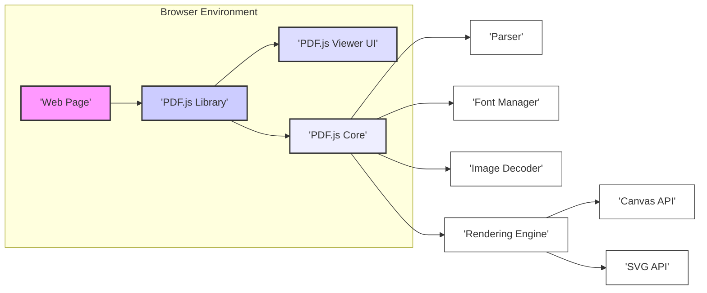

# Project Design Document: PDF.js

**Version:** 1.1
**Date:** October 26, 2023
**Author:** Gemini (AI Language Model)

## 1. Introduction

This document provides an enhanced and detailed design overview of the PDF.js project, an open-source JavaScript library that renders Portable Document Format (PDF) files directly within web browsers. This document is specifically tailored to facilitate threat modeling activities by providing a clear understanding of the system's architecture, components, and data flows.

## 2. Goals and Objectives

The primary goals of PDF.js are:

* **Accurate and Faithful PDF Rendering:** To precisely reproduce the visual content and layout of PDF documents within a web browser environment, adhering to PDF specifications.
* **Cross-Browser and Platform Compatibility:** To function consistently and reliably across a wide range of modern web browsers and operating systems without requiring external plugins or dependencies.
* **Efficient Performance:** To render PDF documents quickly and efficiently, minimizing resource consumption and providing a responsive user experience, even for complex documents.
* **Robust Security:** To render PDF documents in a secure manner, actively mitigating potential vulnerabilities and preventing the execution of malicious code embedded within PDF files.
* **Accessibility Compliance:** To provide accessible PDF rendering, adhering to accessibility standards and guidelines to ensure usability for individuals with disabilities.
* **Extensibility and Embeddability:** To offer a flexible architecture that allows for easy embedding and customization within various web applications and environments.

## 3. Architectural Overview

PDF.js employs a layered and modular architecture, clearly separating concerns between the core PDF processing logic and the user interface presentation. This design promotes maintainability, testability, and allows for diverse embedding scenarios.



## 4. Detailed Component Description

This section provides a detailed breakdown of the key components within the PDF.js architecture, highlighting their functionalities and potential security implications:

* **Web Page:** The HTML document that embeds the PDF.js library. It initiates the process of loading and rendering PDF documents, acting as the entry point for user interaction.
* **PDF.js Library (`pdf.js`):** The primary JavaScript file that orchestrates the entire PDF rendering process. It manages the loading, initialization, and interaction between various modules within PDF.js.
* **PDF.js Viewer UI (`viewer.html`):** A pre-built, optional user interface providing standard controls for interacting with the rendered PDF, such as navigation, zooming, searching, and printing. This component handles user input and interacts with the core rendering engine.
* **PDF.js Core:** The central rendering engine responsible for the core logic of parsing the PDF structure and generating the visual output.
    * **Parser:**  Analyzes the binary PDF file structure, extracting objects, streams, and metadata. It interprets the complex PDF syntax, including object streams, cross-reference tables, and encryption details, building an in-memory representation of the document. This component is a critical point for input validation and potential vulnerabilities related to malformed PDFs.
    * **Font Manager:**  Handles the loading, parsing, and management of embedded fonts within the PDF document. It supports various font formats (e.g., TrueType, OpenType, Type 1) and performs glyph mapping to render text correctly. Vulnerabilities here could involve malformed font files leading to crashes or unexpected behavior.
    * **Image Decoder:** Decodes embedded images within the PDF, supporting various image formats like JPEG, PNG, JBIG2, and CCITT. This component is responsible for processing potentially untrusted image data, making it a potential target for image-based exploits.
    * **Rendering Engine:**  Takes the parsed PDF content and renders it onto the browser's display surface. It interprets drawing instructions, handles transparency, color spaces, and other graphical elements. It utilizes either the Canvas API for raster-based rendering or the SVG API for vector-based rendering, depending on the content and browser capabilities.
    * **Canvas API:** The browser's API used by the rendering engine to draw graphics and text onto a bitmap. Security considerations involve the potential for resource exhaustion or unexpected behavior due to malicious drawing commands.
    * **SVG API:** The browser's API used by the rendering engine to create and manipulate Scalable Vector Graphics elements for rendering. Potential vulnerabilities include XSS if SVG content is not handled carefully.

## 5. Data Flow

The process of rendering a PDF document using PDF.js involves the following data flow stages:

1. **PDF Loading and Fetching:**
    * The "Web Page" initiates a request to load a PDF file, either from a local file system or a remote server via HTTP/HTTPS.
    * The "PDF.js Library" uses browser APIs (e.g., `XMLHttpRequest`, `fetch`) to retrieve the raw PDF data, typically as an `ArrayBuffer`.

2. **Parsing and Structure Building:**
    ```mermaid
    graph LR
        A["'Raw PDF Data'"] --> B["'Parser'"];
        B --> C["'Parsed PDF Objects & Metadata'"];
        C --> D["'In-Memory Document Structure'"];
        style A fill:#f0f0f0,stroke:#333,stroke-width:1px
        style B fill:#e0e0f0,stroke:#333,stroke-width:1px
        style C fill:#e0f0e0,stroke:#333,stroke-width:1px
        style D fill:#f0e0e0,stroke:#333,stroke-width:1px
    ```
    * The "Parser" receives the "Raw PDF Data".
    * It performs lexical analysis and syntactic parsing to extract "Parsed PDF Objects & Metadata".
    * It constructs an "In-Memory Document Structure" representing the logical organization of the PDF.

3. **Resource Loading and Preparation:**
    ```mermaid
    graph LR
        A["'In-Memory Document Structure'"] --> B["'Font Manager'"];
        A --> C["'Image Decoder'"];
        B --> D["'Font Data'"];
        C --> E["'Decoded Image Data'"];
        style A fill:#f0e0e0,stroke:#333,stroke-width:1px
        style B fill:#e0f0f0,stroke:#333,stroke-width:1px
        style C fill:#e0f0f0,stroke:#333,stroke-width:1px
        style D fill:#f0f0e0,stroke:#333,stroke-width:1px
        style E fill:#f0f0e0,stroke:#333,stroke-width:1px
    ```
    * The "Font Manager" identifies required fonts from the "In-Memory Document Structure" and loads the corresponding "Font Data".
    * The "Image Decoder" identifies embedded images and decodes them into "Decoded Image Data".

4. **Rendering and Display:**
    ```mermaid
    graph LR
        A["'In-Memory Document Structure'"] --> B["'Rendering Engine'"];
        B --> C{"'Canvas API' or 'SVG API'"};
        C --> D["'Rendered Output'"];
        D --> E["'Web Page'"];
        style A fill:#f0e0e0,stroke:#333,stroke-width:1px
        style B fill:#e0e0f0,stroke:#333,stroke-width:1px
        style C fill:#f0f0f0,stroke:#333,stroke-width:1px
        style D fill:#e0f0e0,stroke:#333,stroke-width:1px
        style E fill:#f0f0f0,stroke:#333,stroke-width:1px
    ```
    * The "Rendering Engine" iterates through the pages of the "In-Memory Document Structure".
    * For each page, it interprets drawing instructions and utilizes either the "Canvas API" or "SVG API" to generate the "Rendered Output".
    * The "Rendered Output" is then displayed within the "Web Page".

## 6. Security Considerations

Security is a paramount concern for PDF.js due to the potential for malicious content within PDF files. Key security considerations include:

* **Robust Input Validation in the Parser:** The "Parser" must implement rigorous validation checks to prevent vulnerabilities arising from malformed or maliciously crafted PDF files. This includes validating object types, stream lengths, and cross-reference table entries to prevent buffer overflows, out-of-bounds reads, and other memory corruption issues.
* **Font Handling Security:** The "Font Manager" needs to handle font data securely to prevent vulnerabilities related to malformed font files. This includes validating font structures and preventing the execution of embedded code within fonts.
* **Image Decoding Vulnerabilities:** The "Image Decoder" must be resilient against image-based exploits. This involves using secure decoding libraries and implementing checks to prevent buffer overflows and other vulnerabilities in image processing.
* **JavaScript Security Context:** As a JavaScript library, PDF.js operates within the browser's JavaScript sandbox. However, careful coding practices are essential to prevent cross-site scripting (XSS) vulnerabilities, especially when handling user-provided PDF content or integrating with external resources.
* **Content Security Policy (CSP) Enforcement:** Embedding web pages should utilize CSP to restrict the sources from which PDF.js and related resources can be loaded, mitigating the risk of loading compromised or malicious versions of the library.
* **Prevention of Information Disclosure:** Measures should be in place to prevent the disclosure of sensitive information contained within PDF documents due to rendering errors or vulnerabilities.
* **Protection Against Denial-of-Service (DoS):** The rendering engine should be designed to handle complex or large PDF documents without consuming excessive resources, preventing potential DoS attacks.
* **Regular Security Audits and Updates:**  Continuous security audits and timely updates are crucial to identify and address potential vulnerabilities in the PDF.js codebase.
* **Handling of External Resources:**  Careful consideration is needed for handling external resources referenced within PDF documents (e.g., remote images, fonts) to prevent security risks associated with fetching untrusted content.
* **Integer Overflow Protection:** The parsing and rendering logic must be robust against integer overflows when processing large or complex PDF structures, which could lead to unexpected behavior or vulnerabilities.

## 7. Deployment Considerations

The security implications of deploying PDF.js can vary depending on the deployment method:

* **Direct Inclusion in Public Web Pages:** This is the most common deployment scenario. Security relies heavily on the integrity of the PDF.js library source and the security practices of the embedding website. CSP is crucial in this scenario.
* **Integration within Web Applications:** When integrated into web applications, developers need to ensure secure handling of user-uploaded PDF files and prevent potential XSS vulnerabilities when displaying rendered content. Server-side validation of uploaded PDFs can add an extra layer of security.
* **Offline or Local Use:** When used in offline environments, the risk of network-based attacks is reduced, but the integrity of the PDF.js library and the PDF files themselves remains important.
* **Server-Side Rendering (with Headless Browsers):**  While less common, using PDF.js in a headless browser for server-side rendering introduces new security considerations related to the security of the server environment and the headless browser instance.

## 8. Technologies Used

* **JavaScript:** The core programming language for PDF.js, enabling client-side rendering.
* **HTML:** Used for the structure of the optional viewer UI and for embedding the library in web pages.
* **CSS:** Used for styling the viewer UI and controlling the presentation of rendered PDF content.
* **Canvas API:** Browser API for immediate-mode 2D graphics rendering, used for drawing rasterized content.
* **SVG API:** Browser API for vector graphics rendering, used for displaying scalable vector elements within PDFs.
* **Web Workers:** Used to offload computationally intensive tasks like parsing and decoding to background threads, improving responsiveness and preventing UI blocking.
* **Typed Arrays (`ArrayBuffer`, `Uint8Array`, etc.):** Used for efficient handling and manipulation of binary PDF data.

## 9. Future Considerations

* **Further Performance Optimizations:** Ongoing efforts to improve rendering speed and reduce memory footprint, especially for complex documents.
* **Enhanced Security Features:** Continuous research and implementation of new security measures to mitigate emerging threats and vulnerabilities.
* **Improved Accessibility Support:**  Continued development to enhance accessibility features and ensure compliance with the latest accessibility standards.
* **Support for Emerging PDF Standards:**  Keeping pace with the evolving PDF specification and adding support for new features and functionalities.
* **Modularization and Extensibility:**  Further refining the modular architecture to facilitate easier customization and integration with other libraries and frameworks.

This enhanced design document provides a more detailed and security-focused overview of the PDF.js project. The refined component descriptions, detailed data flow diagrams, and expanded security considerations aim to provide a solid foundation for comprehensive threat modeling activities.