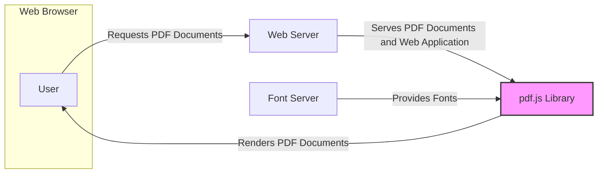
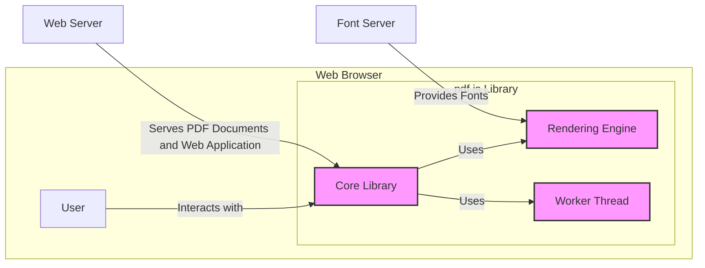

# BUSINESS POSTURE

- Business Priorities and Goals:
  - Provide a free and open-source JavaScript library for rendering PDF documents in web browsers.
  - Enable web developers to easily integrate PDF rendering capabilities into their web applications without relying on browser plugins.
  - Ensure accurate and performant rendering of PDF documents across different browsers and platforms.
  - Promote open web standards and accessibility by providing a standards-compliant PDF rendering solution.
  - Maintain a secure and reliable library to protect users from potential vulnerabilities in PDF documents.

- Most Important Business Risks:
  - Security vulnerabilities in pdf.js could be exploited by malicious actors to compromise users' browsers or systems when viewing PDF documents.
  - Rendering errors or inconsistencies could lead to misinterpretation of PDF content, potentially causing legal, financial, or reputational damage.
  - Performance issues or lack of browser compatibility could hinder user experience and adoption of pdf.js.
  - Dependence on community contributions and maintenance could lead to delays in addressing critical bugs or security issues if community support wanes.
  - Legal and compliance risks associated with handling and rendering potentially sensitive data contained within PDF documents, especially regarding privacy regulations.

# SECURITY POSTURE

- Existing Security Controls:
  - security control: Code reviews are likely conducted by Mozilla developers and community contributors as part of the pull request process. (Location: GitHub Pull Request process)
  - security control: Static code analysis tools and linters are likely used to identify potential code quality and security issues. (Location: Development process, potentially integrated into CI)
  - security control: Unit and integration tests are likely implemented to ensure the functionality and stability of the library, indirectly contributing to security by reducing bugs. (Location: Test suite within the repository)
  - security control: Vulnerability reporting process is in place, likely through Mozilla's security channels. (Location: Mozilla Security website and GitHub repository guidelines)
  - security control: Regular updates and patches are released to address identified vulnerabilities and bugs. (Location: GitHub releases and repository commit history)
  - accepted risk: Reliance on browser security model for isolation and sandboxing of JavaScript code.
  - accepted risk: Potential vulnerabilities in third-party dependencies used by pdf.js.
  - accepted risk: Risk of undiscovered vulnerabilities in complex PDF parsing and rendering logic.

- Recommended Security Controls:
  - security control: Implement automated security scanning tools (SAST/DAST) in the CI/CD pipeline to proactively identify vulnerabilities.
  - security control: Conduct regular penetration testing and security audits by external security experts.
  - security control: Implement a robust Content Security Policy (CSP) for web applications embedding pdf.js to mitigate potential XSS attacks.
  - security control: Enhance input validation and sanitization for PDF document parsing to prevent injection attacks.
  - security control: Implement Subresource Integrity (SRI) for including pdf.js in web pages to ensure integrity and prevent tampering.

- Security Requirements:
  - Authentication: Not applicable for pdf.js library itself, as it is a client-side library. Authentication might be relevant for systems that serve or manage PDF documents that use pdf.js for rendering.
  - Authorization: Not directly applicable to pdf.js library. Authorization is relevant in the context of web applications using pdf.js to control access to PDF documents and functionalities.
  - Input Validation:
    - Requirement: Strictly validate and sanitize all input data related to PDF documents, including file headers, metadata, and content streams, to prevent injection attacks and parsing vulnerabilities.
    - Requirement: Implement robust error handling for invalid or malformed PDF documents to prevent unexpected behavior or crashes.
  - Cryptography:
    - Requirement: Properly handle encrypted PDF documents, ensuring secure decryption and rendering according to PDF standards.
    - Requirement: Utilize secure cryptographic libraries and best practices when implementing cryptographic operations within pdf.js, if any.
    - Requirement: Protect sensitive data within PDF documents from unauthorized access or modification during rendering and processing.

# DESIGN

## C4 CONTEXT



- Context Diagram Elements:
  - Element:
    - Name: User
    - Type: Person
    - Description: End-user accessing web applications that utilize pdf.js to view PDF documents.
    - Responsibilities: View PDF documents within a web browser. Interact with web applications embedding pdf.js.
    - Security controls: Browser security features (sandboxing, CSP), user awareness of phishing and malicious links.
  - Element:
    - Name: pdf.js Library
    - Type: Software System
    - Description: JavaScript library responsible for parsing and rendering PDF documents within a web browser.
    - Responsibilities: Parse PDF document structure. Render PDF content (text, images, vectors). Handle user interactions (zooming, panning, searching).
    - Security controls: Input validation, secure PDF parsing logic, memory management, adherence to web security best practices.
  - Element:
    - Name: Web Server
    - Type: Software System
    - Description: Serves web application code (including pdf.js) and PDF documents to users' web browsers.
    - Responsibilities: Host web application files. Serve PDF documents. Handle user requests. Implement access control for PDF documents.
    - Security controls: HTTPS, access control lists, web application firewall (WAF), regular security updates, secure server configuration.
  - Element:
    - Name: Font Server
    - Type: Software System
    - Description: Provides font files required for rendering PDF documents, if fonts are not embedded in the PDF itself or available locally.
    - Responsibilities: Serve font files to the pdf.js library upon request. Ensure font files are accessible and correctly served.
    - Security controls: Access control for font files, protection against unauthorized access and modification, potentially font integrity checks.

## C4 CONTAINER



- Container Diagram Elements:
  - Element:
    - Name: Core Library
    - Type: Container - JavaScript Module
    - Description: Main JavaScript module of pdf.js, responsible for PDF parsing, document object model (DOM) creation, and coordination of rendering.
    - Responsibilities: PDF parsing and interpretation. Document structure management. API for embedding applications. Communication with Rendering Engine and Worker Thread.
    - Security controls: Input validation, secure parsing logic, memory management, API security, integration with browser security features.
  - Element:
    - Name: Rendering Engine
    - Type: Container - JavaScript Module
    - Description: Module responsible for the actual rendering of PDF content onto the browser canvas, handling text, vector graphics, and images.
    - Responsibilities: Drawing PDF content on canvas. Font handling and text rendering. Image decoding and rendering. Vector graphics rendering.
    - Security controls: Secure rendering algorithms, handling of potentially malicious content in PDF streams, protection against rendering exploits, font handling security.
  - Element:
    - Name: Worker Thread
    - Type: Container - JavaScript Module (Web Worker)
    - Description: Optional module running in a separate browser thread to offload computationally intensive tasks like PDF parsing and rendering, improving performance and responsiveness.
    - Responsibilities: Background PDF parsing and processing. Offloading rendering tasks from the main thread. Communication with Core Library.
    - Security controls: Secure communication with the main thread, isolation from the main thread, secure handling of data in worker thread, resource management in worker thread.

## DEPLOYMENT

- Deployment Architecture Options:
  - Option 1: Direct embedding in static HTML pages served from a web server.
  - Option 2: Integration into complex web applications (e.g., document management systems, online editors) deployed on application servers and potentially using CDNs.
  - Option 3: Usage in browser extensions or desktop applications that embed a web browser component.

- Detailed Deployment Architecture (Option 1 - Static HTML Embedding):

```mermaid
graph LR
    subgraph "User's Device"
        subgraph "Web Browser"
            A[Web Browser Instance]
            B[pdf.js Library (JavaScript)]
        end
    end
    C[Web Server] -- Serves HTML, JS, PDF --> A
    D[Internet] -- Connects User and Web Server --> C
    style B fill:#f9f,stroke:#333,stroke-width:2px
```

- Deployment Diagram Elements:
  - Element:
    - Name: Web Browser Instance
    - Type: Software - Web Browser
    - Description: User's web browser (e.g., Chrome, Firefox, Safari) running on their device.
    - Responsibilities: Execute JavaScript code (pdf.js). Render web pages and display PDF content. Provide user interface for interacting with PDF documents.
    - Security controls: Browser security sandbox, Content Security Policy (CSP), same-origin policy, browser updates and security patches.
  - Element:
    - Name: pdf.js Library (JavaScript)
    - Type: Software - JavaScript Library
    - Description: Deployed as static JavaScript files served by the web server and executed within the user's web browser.
    - Responsibilities: PDF parsing and rendering within the browser environment.
    - Security controls: Subresource Integrity (SRI), minimized and obfuscated code (limited security benefit), reliance on browser security.
  - Element:
    - Name: Web Server
    - Type: Infrastructure - Web Server (e.g., Nginx, Apache)
    - Description: Web server hosting the HTML page embedding pdf.js and the PDF documents to be viewed.
    - Responsibilities: Serving static files (HTML, JavaScript, PDF documents). Handling HTTP requests.
    - Security controls: HTTPS, secure server configuration, access control lists, web application firewall (WAF), regular security updates.
  - Element:
    - Name: Internet
    - Type: Network - Public Network
    - Description: Public network connecting the user's device to the web server.
    - Responsibilities: Network connectivity.
    - Security controls: Encryption (HTTPS), network security best practices.

## BUILD

```mermaid
graph LR
    A[Developer] -- Code Changes --> B(GitHub Repository)
    B -- Trigger --> C{CI/CD Pipeline (e.g., GitHub Actions)}
    C -- Checkout Code --> B
    C -- Run Linters & SAST --> D[Code Analysis Tools]
    C -- Build & Test --> E[Build Environment]
    E -- Run Tests --> C
    C -- Build Artifacts --> F[Artifact Repository]
    F -- Publish Artifacts (e.g., npm, CDN) --> G[Distribution Channels]
    style C fill:#f9f,stroke:#333,stroke-width:2px
```

- Build Process Description:
  - Developer commits code changes to the GitHub repository.
  - GitHub Actions or another CI/CD system is triggered by code changes (e.g., push, pull request).
  - CI/CD pipeline checks out the code from the repository.
  - Code analysis tools (linters, SAST scanners) are executed to identify code quality and security issues.
  - The project is built and tested in a controlled build environment.
  - Unit and integration tests are executed to ensure code functionality and stability.
  - Build artifacts (minified JavaScript files, distribution packages) are created.
  - Artifacts are stored in an artifact repository (e.g., GitHub Releases, npm registry).
  - Artifacts are published to distribution channels (e.g., CDN, npm).

- Build Process Security Controls:
  - security control: Automated CI/CD pipeline to ensure consistent and repeatable builds. (Location: GitHub Actions configuration)
  - security control: Static Application Security Testing (SAST) tools integrated into the CI/CD pipeline to detect potential vulnerabilities in the code. (Location: CI/CD pipeline configuration)
  - security control: Code linters to enforce code style and identify potential code quality issues. (Location: CI/CD pipeline configuration)
  - security control: Dependency scanning to identify vulnerabilities in third-party libraries. (Location: CI/CD pipeline configuration, dependency management tools)
  - security control: Automated unit and integration tests to verify code functionality and prevent regressions. (Location: Test suite within the repository, CI/CD pipeline)
  - security control: Secure build environment to prevent tampering with the build process. (Location: CI/CD infrastructure security)
  - security control: Code signing or artifact signing to ensure the integrity and authenticity of distributed artifacts. (Location: Release process, artifact publishing scripts)
  - security control: Access control to the CI/CD pipeline and artifact repository to prevent unauthorized modifications. (Location: CI/CD platform and artifact repository access management)

# RISK ASSESSMENT

- Critical Business Processes:
  - Secure and accurate rendering of PDF documents in web browsers.
  - Maintaining the integrity and availability of the pdf.js library.
  - Protecting users from potential security vulnerabilities when viewing PDF documents using pdf.js.

- Data to Protect and Sensitivity:
  - PDF Document Content: Sensitivity varies greatly depending on the content of the PDF. PDFs can contain highly sensitive personal data, financial information, confidential business documents, or other sensitive information. The sensitivity level is determined by the content of each individual PDF document.
  - pdf.js Library Code: While the code is open source, its integrity and availability are important. Tampering with the code or making it unavailable could disrupt services relying on pdf.js and potentially introduce vulnerabilities. Sensitivity is moderate to high, as it's a widely used library.
  - User Data (indirectly): pdf.js itself does not directly collect user data. However, vulnerabilities in pdf.js could be exploited to access user data in the context of web applications embedding the library. Indirect sensitivity is high, as vulnerabilities can lead to data breaches.

# QUESTIONS & ASSUMPTIONS

- Questions:
  - What is the process for handling and prioritizing security vulnerability reports for pdf.js?
  - Are there specific security testing methodologies or frameworks that are regularly applied to pdf.js beyond standard SAST and code reviews?
  - What is the intended use case and risk appetite for organizations embedding pdf.js? (This will influence the level of security controls they need to implement around pdf.js usage).
  - Are there specific types of PDF features or functionalities that are considered higher risk from a security perspective in pdf.js?
  - What is the process for managing third-party dependencies and ensuring their security?

- Assumptions:
  - Mozilla prioritizes security for pdf.js given its public nature and potential impact on web users.
  - The pdf.js project follows secure software development lifecycle principles.
  - Organizations embedding pdf.js are responsible for implementing appropriate security controls in their own applications and environments.
  - The primary threat vector for pdf.js is through malicious or crafted PDF documents.
  - Performance and browser compatibility are also important considerations alongside security for pdf.js development.