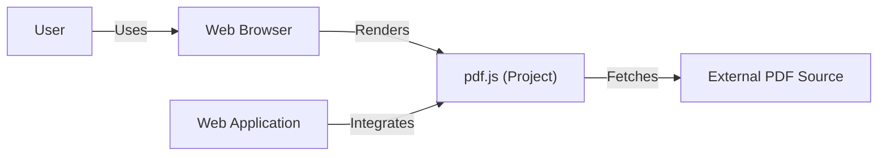
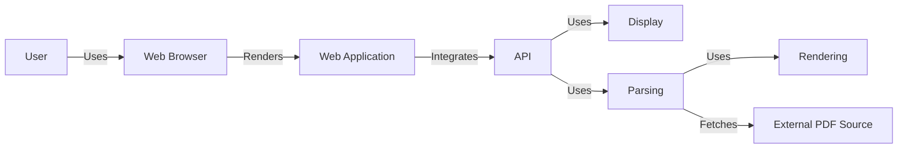
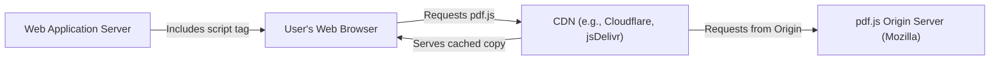
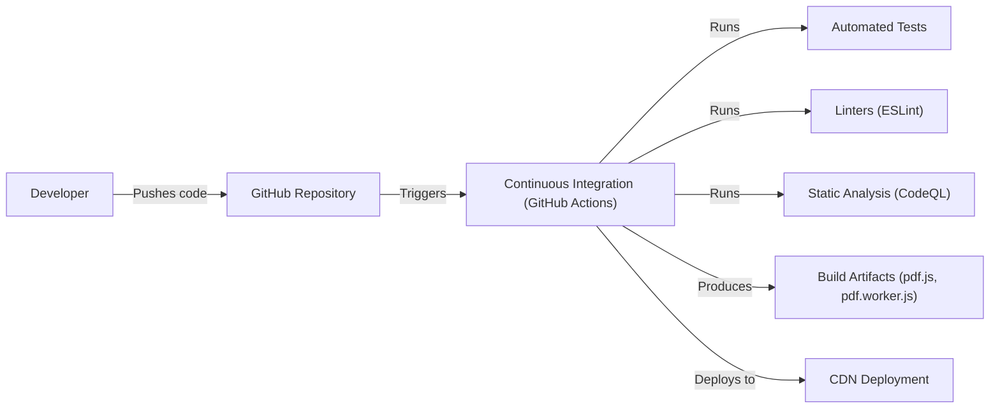

# BUSINESS POSTURE

Business Priorities and Goals:

*   Provide a web-based, open-source PDF renderer that is widely accessible and compatible across different browsers and platforms.
*   Maintain high accuracy and fidelity in rendering PDF documents, ensuring that they appear as intended by the document creator.
*   Offer a performant and efficient PDF viewing experience, minimizing resource consumption and loading times.
*   Ensure the security and privacy of users by preventing potential vulnerabilities associated with PDF rendering.
*   Foster a community-driven development model, encouraging contributions and collaboration from external developers.
*   Maintain compatibility with the latest PDF specifications and features.
*   Provide a customizable and extensible platform for developers to integrate PDF rendering capabilities into their applications.

Most Important Business Risks:

*   Security vulnerabilities in the PDF parsing and rendering engine could expose users to malicious code execution or data breaches.
*   Incompatibility with certain PDF files or features could lead to rendering errors or incomplete display of documents.
*   Performance issues could result in slow loading times or excessive resource consumption, degrading the user experience.
*   Lack of community engagement or contributions could slow down development and innovation.
*   Failure to keep up with evolving PDF standards could lead to compatibility issues in the future.
*   Legal or licensing issues related to PDF specifications or third-party libraries could pose risks to the project.

# SECURITY POSTURE

Existing Security Controls:

*   security control: The project is written in JavaScript, which inherently benefits from the security features of modern web browsers, such as sandboxing and same-origin policy.
*   security control: The project undergoes regular code reviews and testing to identify and address potential security vulnerabilities. (Described in CONTRIBUTING.md and test/README.md)
*   security control: The project utilizes a continuous integration (CI) system to automate testing and ensure code quality. (Described in .github/workflows)
*   security control: The project has a security policy in place for reporting and handling vulnerabilities. (Described in SECURITY.md)
*   security control: The project uses a Content Security Policy (CSP) to mitigate the risk of cross-site scripting (XSS) attacks. (Described in web/app.js)
*   security control: Input sanitization is performed to prevent injection vulnerabilities. (Described in various parts of the codebase, e.g., src/core/primitives.js)
*   security control: The project is open-source, allowing for public scrutiny and contributions to security improvements.

Accepted Risks:

*   accepted risk: The project relies on the security of the underlying browser environment and its handling of PDF data.
*   accepted risk: While efforts are made to ensure compatibility, there may be edge cases or rare PDF features that are not fully supported, potentially leading to rendering issues.
*   accepted risk: The project's performance may be affected by the complexity of the PDF document being rendered and the capabilities of the user's device.

Recommended Security Controls:

*   security control: Implement a robust fuzzing framework to proactively discover vulnerabilities in the PDF parsing and rendering engine.
*   security control: Regularly conduct penetration testing to identify and address potential attack vectors.
*   security control: Integrate static application security testing (SAST) and dynamic application security testing (DAST) tools into the CI/CD pipeline.
*   security control: Consider using a memory-safe language or runtime environment for critical components of the PDF parsing engine to mitigate memory corruption vulnerabilities.

Security Requirements:

*   Authentication:
    *   Not directly applicable, as the project is a library for rendering PDFs and does not handle user authentication itself. Authentication would be the responsibility of the application integrating pdf.js.

*   Authorization:
    *   Not directly applicable, as the project is a library. Authorization would be handled by the integrating application.

*   Input Validation:
    *   The project must thoroughly validate and sanitize all input data, including PDF data streams, font data, and image data, to prevent injection vulnerabilities and ensure data integrity.
    *   The project must handle malformed or corrupted PDF data gracefully, without crashing or exposing vulnerabilities.

*   Cryptography:
    *   If the project handles encrypted PDF documents, it must use strong, industry-standard cryptographic algorithms and protocols for decryption and signature verification.
    *   Cryptographic keys must be managed securely, following best practices for key generation, storage, and usage.

# DESIGN

## C4 CONTEXT

Element Descriptions:

*   Element:
    *   Name: User
    *   Type: Person
    *   Description: A person who views PDF documents using a web browser.
    *   Responsibilities: Interacts with a web browser to view PDF documents.
    *   Security controls: Relies on the security controls of the web browser.

*   Element:
    *   Name: pdf.js (Project)
    *   Type: Software System
    *   Description: A JavaScript library for rendering PDF documents in web browsers.
    *   Responsibilities: Parses and renders PDF documents, handles user interaction, and provides an API for integration with web applications.
    *   Security controls: Input sanitization, CSP, sandboxing (via browser), code reviews, CI, security policy.

*   Element:
    *   Name: Web Browser
    *   Type: Software System
    *   Description: A software application for accessing and displaying web content, including PDF documents.
    *   Responsibilities: Provides the runtime environment for pdf.js, handles network requests, and manages user interaction.
    *   Security controls: Sandboxing, same-origin policy, regular security updates.

*   Element:
    *   Name: Web Application
    *   Type: Software System
    *   Description: A web application that integrates pdf.js to provide PDF viewing capabilities.
    *   Responsibilities: Integrates pdf.js, handles user authentication and authorization (if applicable), and manages PDF document access.
    *   Security controls: Depends on the specific web application; should follow secure coding practices.

*   Element:
    *   Name: External PDF Source
    *   Type: External System
    *   Description: A source of PDF documents, such as a web server or local file system.
    *   Responsibilities: Provides PDF documents to pdf.js for rendering.
    *   Security controls: Depends on the specific source; may include access controls and data integrity checks.

## C4 CONTAINER

Element Descriptions:

*   Element:
    *   Name: User
    *   Type: Person
    *   Description: A person who views PDF documents using a web browser.
    *   Responsibilities: Interacts with a web browser to view PDF documents.
    *   Security controls: Relies on the security controls of the web browser.

*   Element:
    *   Name: Web Browser
    *   Type: Software System
    *   Description: A software application for accessing and displaying web content, including PDF documents.
    *   Responsibilities: Provides the runtime environment for pdf.js, handles network requests, and manages user interaction.
    *   Security controls: Sandboxing, same-origin policy, regular security updates.

*   Element:
    *   Name: Web Application
    *   Type: Software System
    *   Description: A web application that integrates pdf.js to provide PDF viewing capabilities.
    *   Responsibilities: Integrates pdf.js, handles user authentication and authorization (if applicable), and manages PDF document access.
    *   Security controls: Depends on the specific web application; should follow secure coding practices.

*   Element:
    *   Name: External PDF Source
    *   Type: External System
    *   Description: A source of PDF documents, such as a web server or local file system.
    *   Responsibilities: Provides PDF documents to pdf.js for rendering.
    *   Security controls: Depends on the specific source; may include access controls and data integrity checks.

*   Element:
    *   Name: API
    *   Type: Container (JavaScript Library)
    *   Description: The public API of pdf.js, providing methods for loading, rendering, and interacting with PDF documents.
    *   Responsibilities: Exposes functionality to web applications, manages communication between different components.
    *   Security controls: Input validation, API rate limiting (if applicable).

*   Element:
    *   Name: Display
    *   Type: Container (JavaScript Module)
    *   Description: Handles the display and presentation of PDF content in the browser.
    *   Responsibilities: Manages page layout, rendering of text, images, and other elements, handles user interaction events.
    *   Security controls: Output encoding, XSS prevention.

*   Element:
    *   Name: Parsing
    *   Type: Container (JavaScript Module)
    *   Description: Parses the PDF data stream and extracts information about the document structure, objects, and resources.
    *   Responsibilities: Reads and interprets the PDF file format, handles different PDF versions and features.
    *   Security controls: Input validation, robust parsing logic, fuzzing.

*   Element:
    *   Name: Rendering
    *   Type: Container (JavaScript Module)
    *   Description: Renders the PDF content into a visual representation, typically using HTML5 Canvas or SVG.
    *   Responsibilities: Converts parsed PDF data into visual elements, handles font rendering, image decoding, and other rendering tasks.
    *   Security controls: Secure handling of image and font data, protection against rendering-related vulnerabilities.

## DEPLOYMENT

Possible Deployment Solutions:

1.  **CDN (Content Delivery Network):** pdf.js can be deployed to a CDN, allowing web applications to easily include it via a `<script>` tag. This is the most common and recommended approach.
2.  **NPM (Node Package Manager):** pdf.js is available as an NPM package, allowing developers to install and manage it as a dependency in their projects.
3.  **Self-Hosting:** Developers can download the pdf.js source code and host it on their own servers.
4.  **Bundling:** pdf.js can be bundled with other JavaScript code using tools like Webpack or Browserify.

Chosen Solution (CDN):

Element Descriptions:

*   Element:
    *   Name: User's Web Browser
    *   Type: Software System
    *   Description: The user's web browser, which requests and executes pdf.js.
    *   Responsibilities: Downloads and executes JavaScript code, renders web pages, and interacts with the user.
    *   Security controls: Sandboxing, same-origin policy, regular security updates.

*   Element:
    *   Name: CDN (e.g., Cloudflare, jsDelivr)
    *   Type: Infrastructure
    *   Description: A content delivery network that caches and distributes pdf.js files globally.
    *   Responsibilities: Serves pdf.js files to users from the nearest edge server, reducing latency and improving performance.
    *   Security controls: HTTPS, DDoS protection, regular security audits.

*   Element:
    *   Name: Web Application Server
    *   Type: Software System
    *   Description: Server that hosts web application which uses pdf.js.
    *   Responsibilities: Serves web application files.
    *   Security controls: HTTPS, DDoS protection, regular security audits.

*   Element:
    *   Name: pdf.js Origin Server (Mozilla)
    *   Type: Infrastructure
    *   Description: The server where the official pdf.js releases are hosted.
    *   Responsibilities: Provides the original source files for pdf.js to the CDN.
    *   Security controls: Access controls, regular security updates, code signing (if applicable).

## BUILD

Build Process Description:

1.  **Code Development:** Developers write code and push changes to the GitHub repository.
2.  **Continuous Integration:** GitHub Actions triggers a CI workflow on each push.
3.  **Automated Tests:** The CI workflow runs a suite of automated tests, including unit tests, integration tests, and regression tests. (test/README.md)
4.  **Linting:** Linters (ESLint) are used to enforce code style and identify potential errors. (.eslintrc.js)
5.  **Static Analysis:** Static analysis tools (CodeQL) are used to scan the codebase for security vulnerabilities and code quality issues. (.github/workflows/codeql.yml)
6.  **Build Artifacts:** If all tests and checks pass, the CI workflow builds the production artifacts (pdf.js, pdf.worker.js).
7.  **Deployment:** The build artifacts are deployed to a CDN (e.g., Cloudflare, jsDelivr) for distribution.

Security Controls in Build Process:

*   security control: **Automated Tests:** Ensure code correctness and prevent regressions.
*   security control: **Linters:** Enforce code style and identify potential errors.
*   security control: **Static Analysis (SAST):** Detect security vulnerabilities and code quality issues.
*   security control: **Continuous Integration:** Automates the build and testing process, ensuring consistency and repeatability.
*   security control: **Dependency Management:** NPM is used to manage dependencies, and package-lock.json ensures consistent versions.
*   security control: **Code Reviews:** All code changes are reviewed by other developers before merging. (CONTRIBUTING.md)

# RISK ASSESSMENT

Critical Business Processes to Protect:

*   **PDF Rendering:** The core functionality of pdf.js, ensuring accurate and reliable rendering of PDF documents.
*   **User Data Privacy:** Protecting user data from unauthorized access or disclosure, especially when handling sensitive PDF documents.
*   **Application Availability:** Ensuring that pdf.js is available and accessible to users when needed.
*   **Reputation:** Maintaining the reputation of pdf.js as a secure and reliable PDF rendering library.

Data to Protect and Sensitivity:

*   **PDF Document Content:** This can range from publicly available documents to highly sensitive information, such as financial records, medical records, or legal documents. Sensitivity varies greatly depending on the content.
*   **User Metadata:** Information about the user's interaction with PDF documents, such as viewing history or annotations. Sensitivity is generally low, but privacy regulations may apply.
*   **No direct user data is stored by pdf.js itself.** It operates on the client-side within the browser's sandbox. The integrating application is responsible for handling any user data.

# QUESTIONS & ASSUMPTIONS

Questions:

*   Are there any specific compliance requirements (e.g., HIPAA, GDPR) that need to be considered when integrating pdf.js into an application?
*   What are the expected performance requirements for pdf.js, in terms of document loading times and resource consumption?
*   Are there any plans to support advanced PDF features, such as digital signatures or form filling, in the future?
*   What is the process for handling security vulnerabilities reported by external researchers?

Assumptions:

*   BUSINESS POSTURE: The primary goal is to provide a free, open-source, and widely accessible PDF rendering solution.
*   BUSINESS POSTURE: The project prioritizes security and aims to minimize the risk of vulnerabilities.
*   SECURITY POSTURE: The web browser provides a secure execution environment for pdf.js.
*   SECURITY POSTURE: The integrating application is responsible for handling user authentication, authorization, and data security.
*   DESIGN: pdf.js will be primarily used as a client-side library within web browsers.
*   DESIGN: The CDN deployment model is the preferred method for distributing pdf.js.
*   DESIGN: The build process is automated and includes security checks.