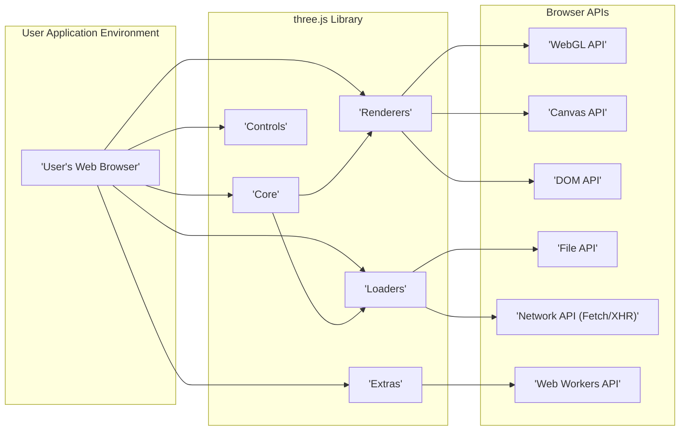
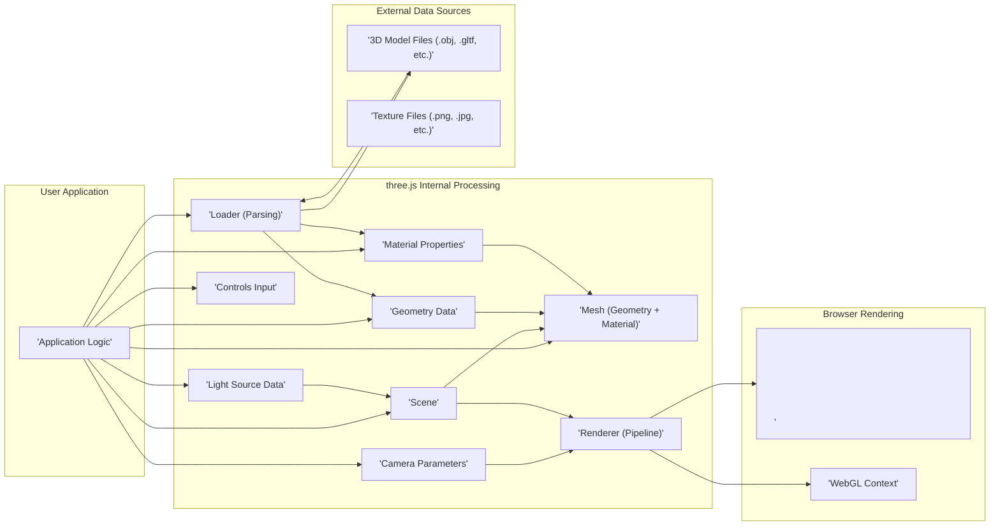

# Project Design Document: three.js Library

**Document Version:** 1.1
**Date:** October 26, 2023
**Author:** AI Assistant

## 1. Introduction

This document provides a detailed design overview of the three.js JavaScript library, specifically tailored for threat modeling purposes. It aims to clearly articulate the library's architecture, key components, data flow, and external interactions to facilitate the identification of potential security vulnerabilities.

three.js is an open-source, cross-browser JavaScript library and API that leverages WebGL (and other rendering contexts) to display animated 3D computer graphics directly within a web browser. It abstracts away the complexities of low-level graphics programming, providing a higher-level interface for developers.

The scope of this document is limited to the client-side aspects of three.js and its immediate interactions within the browser environment.

## 2. Goals

* To provide a clear and comprehensive architectural overview of the three.js library.
* To identify and describe the key components of three.js and their interdependencies.
* To illustrate the typical data flow within a three.js application, highlighting potential points of interest for security analysis.
* To detail the external interactions and dependencies of three.js, including browser APIs and external resources.
* To serve as a foundational document for subsequent threat modeling activities, enabling the identification of potential threat vectors and attack surfaces.

## 3. Target Audience

This document is primarily intended for:

* Security architects and engineers responsible for conducting threat modeling and security assessments of systems utilizing three.js.
* Software developers working with three.js who need a deeper understanding of its architecture for secure implementation.
* Anyone involved in the security review or auditing of web applications that incorporate three.js.

## 4. System Architecture

three.js is structured in a modular fashion, allowing developers to utilize specific functionalities as needed. The core architecture can be visualized as interacting layers:

* **User Application Layer:** This is the JavaScript code written by the developer that utilizes the three.js library to create and manage 3D scenes.
* **three.js Library Layer:** This layer contains the core logic and functionalities provided by three.js, including scene management, object creation, rendering, and loading.
* **Browser API Layer:** three.js relies on various browser APIs, most notably WebGL, to perform the actual rendering and interact with the underlying hardware.

## 5. Data Flow

The process of rendering a 3D scene in three.js involves a series of data transformations and interactions:

* **Initialization:** The user application initializes a `Scene`, `Camera`, and a `Renderer`.
* **Object Definition:**  Geometries (vertex data), Materials (surface properties, textures), and Meshes (combination of geometry and material) are created, often loaded from external resources.
* **Scene Graph Construction:** Objects are added to the `Scene`, forming a hierarchical structure.
* **Resource Loading:** `Loader` classes fetch 3D models, textures, and other assets from local or remote sources. This involves network requests and file parsing.
* **Animation (Optional):**  Object properties (position, rotation, scale) are updated over time, often driven by animation loops.
* **Rendering Pipeline:** The `Renderer` processes the scene graph and camera information. This involves:
    * **Vertex Processing:** Transforming vertex data based on object and camera transformations.
    * **Rasterization:** Converting geometric primitives into fragments (pixels).
    * **Fragment Processing:** Applying material properties, lighting calculations, and texture mapping to determine the final color of each fragment.
* **Output:** The `Renderer` outputs the rendered image to a `<canvas>` element using the chosen rendering context (e.g., WebGL).
* **User Interaction:** `Controls` process user input (mouse, keyboard, touch) to manipulate the camera or objects in the scene.

## 6. Key Components

This section details the functionalities and potential security implications of key three.js components:

* **`Core`:**
    * **`Object3D`:** The foundational class for all objects in the scene. Manages transformation properties (position, rotation, scale). *Potential Security Implication:*  Manipulation of object transformations could be exploited for visual spoofing or denial of service by rendering excessive objects.
    * **`Geometry`:** Defines the shape of objects. Can be created procedurally or loaded from external files. *Potential Security Implication:* Maliciously crafted geometry files could contain excessive vertex data leading to performance issues or vulnerabilities in parsing logic.
    * **`Material`:** Determines how an object appears (color, texture, reflectivity). Textures are often loaded from external sources. *Potential Security Implication:* Loading textures from untrusted sources could lead to XSS if the loading mechanism is vulnerable or if the texture data itself is malicious (though less common).
    * **`Scene`:** The container for all objects, lights, and cameras. *No direct security implications within the library itself, but its structure influences overall application security.*
    * **`Camera`:** Defines the viewpoint. *Potential Security Implication:* While not directly vulnerable, incorrect camera setup could expose unintended parts of the scene.
    * **`Light`:** Simulates light sources. *No direct security implications.*
    * **`Raycaster`:** Used for raycasting operations (e.g., object picking). *Potential Security Implication:* Logic using `Raycaster` might be vulnerable if it relies on untrusted input to determine which objects to interact with.

* **`Renderers`:**
    * **`WebGLRenderer`:** The primary renderer, utilizing the WebGL API. *Potential Security Implication:* WebGL vulnerabilities in the browser could be indirectly exploitable through three.js. Improper handling of WebGL context or shader code could introduce vulnerabilities.
    * **`CanvasRenderer`:** A fallback renderer using the 2D Canvas API. *Potential Security Implication:* Less performant but could still be a vector for DoS if rendering complex scenes.
    * **`SVGRenderer`:** Renders using SVG elements. *Potential Security Implication:*  Potential for SVG-based XSS if rendering logic doesn't properly sanitize input.
    * **`CSS3DRenderer`:** Renders HTML elements in 3D space. *Significant Security Implication:*  High risk of XSS if unsanitized user input is used to create or manipulate these elements.

* **`Loaders`:**
    * **`ObjectLoader`:** Loads scenes/objects in three.js JSON format. *Potential Security Implication:*  Maliciously crafted JSON could exploit parsing vulnerabilities.
    * **`GLTFLoader`:** Loads glTF models. *Potential Security Implication:* glTF files can contain embedded scripts or links to external resources, posing a risk if not handled securely. Vulnerabilities in the parsing logic could also be exploited.
    * **`OBJLoader`:** Loads OBJ models. *Potential Security Implication:*  Simpler format, but vulnerabilities in parsing large or malformed files could exist.
    * **`TextureLoader`:** Loads image textures. *Potential Security Implication:* While less common, vulnerabilities in image decoding libraries could be exploited. Ensure proper handling of image types and sizes.
    * **Various other loaders:** Each loader introduces potential vulnerabilities related to the specific file format it handles.

* **`Controls`:**
    * **`OrbitControls`, `FlyControls`, etc.:** Enable user interaction. *Potential Security Implication:*  While not directly vulnerable, improper use or customization of controls could lead to unintended actions or information disclosure.

* **`Extras`:**
    * Contains utilities and examples. *Security implications depend on the specific extra being used. Review individual components.*

## 7. External Interactions and Dependencies

three.js interacts with several external entities:

* **Web Browser APIs:**  Relies heavily on WebGL for hardware-accelerated rendering, as well as Canvas, DOM, File, Network (Fetch/XHR), and potentially Web Workers APIs. *Security Implication:* Vulnerabilities in these browser APIs could indirectly affect three.js applications.
* **External 3D Model and Texture Files:** Loaded via `Loader` classes from local file systems or remote servers. *Significant Security Implication:* These are major attack vectors. Malicious files could contain embedded scripts, excessive data, or exploit parsing vulnerabilities. Ensure proper validation and sanitization of loaded resources. Implement Content Security Policy (CSP) to restrict resource loading origins.
* **User Input:** Mouse, keyboard, and touch events are processed by the browser and used by `Controls` to interact with the scene. *Potential Security Implication:*  Input validation is crucial to prevent unexpected behavior or exploits.
* **Web Workers (Optional):** Used for offloading tasks. *Potential Security Implication:*  Security considerations for code executed in workers should be addressed. Ensure secure communication between the main thread and workers.
* **External Libraries (Optional):** Developers might integrate three.js with other libraries. *Security Implication:*  Introduce dependencies and potential vulnerabilities from those libraries.

## 8. Security Considerations (Detailed)

This section expands on potential security risks associated with three.js:

* **Cross-Site Scripting (XSS):**
    * **Loading Malicious Models:**  Loading 3D models (especially formats like glTF) from untrusted sources could introduce malicious scripts embedded within the model data.
    * **Unsanitized Input in CSS3DRenderer:** Using user-provided data directly to create or manipulate HTML elements rendered by `CSS3DRenderer` is a high-risk XSS vector.
    * **SVG Renderer Vulnerabilities:** If the `SVGRenderer` doesn't properly sanitize input, it could be susceptible to SVG-based XSS attacks.
    * **Texture Loading Vulnerabilities:** Although less common, vulnerabilities in image decoding could potentially be exploited if loading untrusted textures.
* **Denial of Service (DoS):**
    * **Large or Complex Models:** Loading excessively large or complex 3D models can consume significant resources, leading to browser slowdown or crashes.
    * **Maliciously Crafted Models:**   специально crafted model files could exploit parsing vulnerabilities, causing excessive CPU or memory usage.
    * **Resource Exhaustion:**  Repeatedly loading large assets or performing computationally intensive operations without proper resource management can lead to DoS.
* **Supply Chain Attacks:**
    * **Compromised three.js Library:**  Ensuring the integrity of the three.js library itself is crucial. Using official sources and verifying checksums can mitigate this risk.
    * **Compromised External Assets:**  If the servers hosting 3D models or textures are compromised, malicious assets could be served.
* **Client-Side Resource Injection:**
    * **Loading from Untrusted Origins:**  Loading assets from untrusted domains without proper checks can expose the application to malicious content. Implement CSP to restrict allowed origins.
* **Information Disclosure:**
    * **Sensitive Data in Models/Textures:**  Ensure that sensitive information is not inadvertently included in 3D model or texture files.
    * **Exposing Internal Scene Structure:**  While less direct, vulnerabilities in application logic could potentially expose details about the scene structure.
* **Client-Side Code Injection:**
    * **Indirect via Loaders:** Vulnerabilities in loaders could potentially allow for the injection of arbitrary code during the parsing process.

## 9. Assumptions and Constraints

* This document assumes a standard web browser environment with JavaScript enabled.
* The focus is primarily on the client-side security aspects of three.js. Server-side security considerations for hosting and serving assets are outside the scope.
* The analysis is based on the publicly available documentation and source code of three.js.
* It is assumed that developers using three.js have a basic understanding of web security principles.

## 10. Future Considerations

* Conduct a detailed threat modeling exercise based on this design document, identifying specific threats, vulnerabilities, and mitigations.
* Perform security code reviews of critical components, particularly the `Loaders` and `Renderers`, focusing on input validation and sanitization.
* Develop and document security best practices for developers using three.js, including guidelines for secure asset loading and handling user input.
* Explore and implement security features within the three.js project itself, such as options for stricter input validation or secure resource loading.
* Regularly update the three.js library to benefit from security patches and bug fixes.