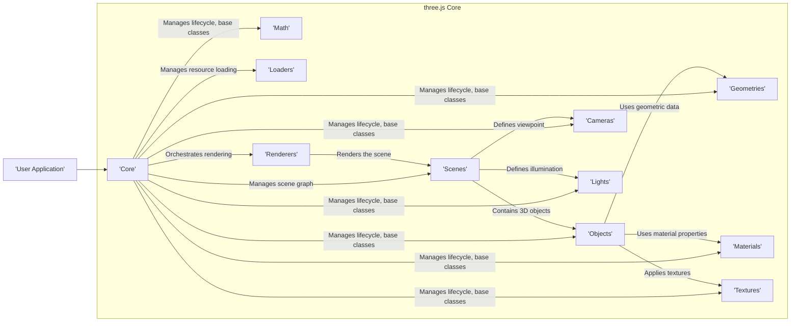
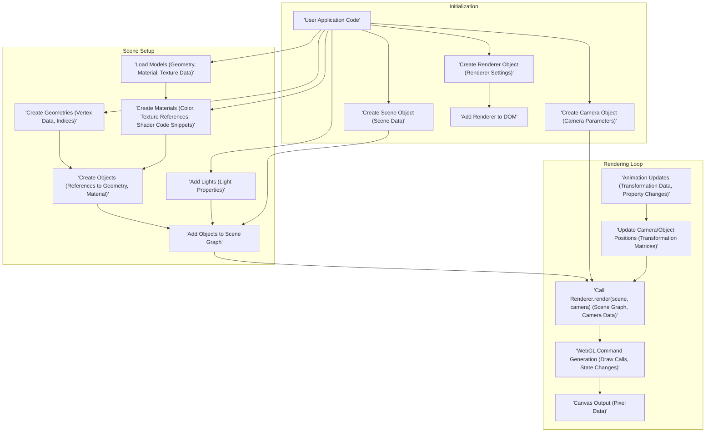

# Project Design Document: three.js Library

**Version:** 1.1
**Date:** October 26, 2023
**Author:** Gemini (AI Language Model)

## 1. Introduction

This document provides a detailed design overview of the three.js JavaScript library. It aims to capture the key architectural components, data flows, and functionalities of the library to facilitate a comprehensive threat modeling exercise. This document will serve as a foundation for identifying potential security vulnerabilities and risks associated with the use of three.js in web applications.

## 2. Goals

*   Provide a clear and concise description of the three.js library's architecture.
*   Identify the major components and their interactions, focusing on data handling.
*   Outline the key data flows within the library, including examples of different data types.
*   Serve as a basis for conducting a thorough threat modeling exercise, highlighting potential attack surfaces.
*   Document the design in a format suitable for security analysis by security engineers and developers.

## 3. Scope

This document focuses on the core architecture and functionalities of the three.js library itself. It includes:

*   Core modules and their responsibilities in processing and rendering 3D scenes.
*   Key data structures (e.g., geometries, materials, textures) and their manipulation within the library.
*   The rendering pipeline and its stages, from scene graph traversal to WebGL command generation.
*   Loading and processing of external resources (models, textures, audio, etc.) and their potential security implications.
*   Mechanisms for user interaction and how they affect the scene.

This document does *not* cover:

*   Specific applications built using three.js or their unique security implementations.
*   The intricacies of the browser environment in which three.js operates, except where directly relevant to library functionality (e.g., WebGL API).
*   Third-party libraries or extensions commonly used with three.js, unless they are deeply integrated into the core functionality (explicitly mentioned).
*   Detailed implementation specifics of individual classes or methods beyond their general purpose and data handling.

## 4. Architectural Overview

three.js is a JavaScript library that provides a set of abstractions and tools for creating and displaying animated 3D computer graphics in a web browser using WebGL. Its architecture is modular, allowing developers to choose and utilize specific components as needed.

Here's a high-level architectural diagram:

### 4.1. Key Components

*   **Core:** Provides fundamental classes and utilities, including the `Object3D` base class for all scene graph objects. It manages the lifecycle of various components and provides core functionalities. This component handles fundamental data structures and orchestrates interactions between other modules.
*   **Math:** Contains mathematical utilities like vectors, matrices, quaternions, and color representations. This component processes numerical data related to transformations, geometry calculations, and color manipulations.
*   **Objects:** Defines various 3D object types, such as `Mesh` (geometry with a material), `Line`, `Points`, and `Sprite`. These components encapsulate geometric and material data and are the building blocks of the scene.
*   **Geometries:** Represents the shape of 3D objects, including built-in geometries (e.g., `BoxGeometry`, `SphereGeometry`) and methods for creating custom geometries. This component stores vertex data, face indices, and other information defining the shape of objects.
*   **Materials:** Defines the visual surface properties of objects, such as color, texture, and reflectivity (e.g., `MeshBasicMaterial`, `MeshStandardMaterial`). This component holds data related to the appearance of objects and references textures.
*   **Textures:** Represents images or procedural data applied to the surfaces of objects. This component stores image data or instructions for generating procedural textures. It's a key point for potential malicious content injection.
*   **Loaders:** Handles the loading of external resources, such as 3D models (e.g., `GLTFLoader`, `OBJLoader`), textures, and audio. This component parses external file formats and converts them into three.js internal data structures. It's a critical entry point for potentially untrusted data.
*   **Cameras:** Defines the viewpoint from which the scene is rendered (e.g., `PerspectiveCamera`, `OrthographicCamera`). This component stores data about the camera's position, orientation, and projection parameters.
*   **Lights:** Simulates light sources in the scene, affecting the appearance of objects (e.g., `DirectionalLight`, `PointLight`, `AmbientLight`). This component stores data about light properties like color, intensity, and position.
*   **Renderers:** Responsible for drawing the scene to the screen using WebGL (e.g., `WebGLRenderer`). This component takes the scene graph and camera information and generates WebGL commands to be executed by the browser.
*   **Scenes:** Represents the root of the 3D scene graph, containing all the objects, cameras, and lights to be rendered. This component manages the hierarchical structure of the 3D world.

## 5. Data Flow

The typical data flow in a three.js application involves the following stages, handling various types of data:

### 5.1. Detailed Data Flow Descriptions

*   **Initialization:** The user application initializes the core three.js components. This involves creating instances of `Scene`, `Camera`, and `Renderer`, passing configuration data like renderer size and type. The renderer is then attached to the Document Object Model (DOM) to prepare for rendering output.
*   **Scene Setup:**  The application populates the scene with 3D content. This can involve:
    *   **Loading External Resources:** Using `Loaders` to fetch and parse 3D models (containing geometry, material, and texture data) and individual texture files.
    *   **Procedural Creation:** Directly creating `Geometries` by defining vertex data and indices, and `Materials` by setting properties and referencing textures.
    *   **Object Instantiation:** Creating `Objects` (like `Mesh`) by combining `Geometries` and `Materials`.
    *   **Lighting:** Adding `Lights` to the scene, defining their properties like color and intensity.
    *   **Scene Graph Assembly:** Adding the created `Objects` and `Lights` to the `Scene` object, forming a hierarchical structure.
*   **Rendering Loop:**  A continuous loop is established to update and render the scene, typically driven by the browser's animation frames.
    *   **Animation Updates:**  Optional updates to object properties (position, rotation, scale), material properties, or animation states, often based on time or user input. This involves manipulating transformation data and other object attributes.
    *   **Camera/Object Updates:**  The camera's position and orientation might be updated based on user interaction or animation logic. Object transformations are also applied, updating their world matrices.
    *   **Rendering Invocation:** The `renderer.render(scene, camera)` method is called. This method takes the `Scene` object (containing the scene graph) and the `Camera` object as input.
    *   **WebGL Command Generation:** The renderer traverses the scene graph, extracts relevant data (geometry, material, camera information), and translates it into a series of WebGL commands. These commands instruct the GPU on how to draw the scene.
    *   **Canvas Output:** The WebGL commands are executed by the browser's graphics processing unit (GPU), and the resulting image (pixel data) is drawn on the HTML canvas element.

## 6. Security Considerations (For Threat Modeling)

This section highlights potential areas of security concern that should be explored during threat modeling, focusing on data handling and potential attack vectors.

*   **Loading of External Resources:**
    *   **Malicious Models:** Loading untrusted 3D models (e.g., GLTF, OBJ, STL) could introduce vulnerabilities. Parsers for these formats might have bugs that can be exploited. Models could contain excessively large or complex data leading to denial-of-service (DoS) by exhausting client resources. They might also embed scripts or links to external malicious resources, potentially leading to Cross-Site Scripting (XSS) if not handled carefully by the application.
    *   **Malicious Textures:** Loading untrusted textures (e.g., PNG, JPG, GIF) could exploit image parsing vulnerabilities in the browser or within JavaScript image processing libraries used by three.js. Specifically crafted images could trigger buffer overflows or other memory corruption issues.
    *   **Malicious Audio:** Loading untrusted audio files could exploit vulnerabilities in audio decoding libraries.
    *   **Supply Chain Attacks:** Compromised or malicious model repositories, texture sources, or Content Delivery Networks (CDNs) could serve malicious assets without the developer's knowledge. Using Subresource Integrity (SRI) can mitigate this risk.
*   **Input Validation:**
    *   **User-Provided Data:** If user input is directly used to manipulate scene properties (e.g., object positions, colors, material parameters) without proper validation and sanitization, it could lead to unexpected behavior, logic errors, or even the injection of malicious data that could be interpreted as code or commands.
    *   **Data Injection:** If data from external sources (e.g., APIs, databases) is directly used to create or modify scene elements (e.g., dynamically generating geometry or materials) without proper sanitization, it could lead to injection attacks. For example, unsanitized strings used in material definitions or shader code could introduce vulnerabilities.
*   **WebGL Context:**
    *   **Resource Exhaustion:** Maliciously crafted scenes with an extremely high number of objects, excessive geometry detail, or overly complex shaders can consume excessive GPU and CPU resources, leading to client-side denial-of-service (DoS) and potentially crashing the user's browser or device.
    *   **WebGL API Exploits:** While less likely at the three.js level, vulnerabilities in the underlying WebGL implementation or browser graphics drivers could be exploited if three.js inadvertently triggers them through specific rendering patterns or API calls.
*   **Shader Code:**
    *   **Custom Shaders (GLSL):** If custom shader code (GLSL) is used, vulnerabilities in the shader logic could lead to unexpected rendering behavior, information disclosure (e.g., by manipulating framebuffer data), or even denial-of-service by creating infinite loops or excessive computations on the GPU. Care must be taken to sanitize any user-provided data that influences shader parameters.
*   **Cross-Site Scripting (XSS):**
    *   If three.js is used in a context where user-controlled data can influence the rendered output or interact with the DOM (e.g., displaying object names or descriptions fetched from an external source), XSS vulnerabilities might arise if proper sanitization is not implemented in the application code *around* the three.js usage. While three.js itself doesn't directly render HTML, the application using it might.
*   **Information Disclosure:**
    *   Accidental exposure of sensitive data embedded within 3D models or textures (e.g., proprietary designs, internal information).
    *   Information leakage through verbose error messages or debugging information exposed in production environments.
*   **Client-Side Vulnerabilities:**
    *   Exploiting vulnerabilities in the browser's JavaScript engine or WebGL implementation could indirectly affect three.js applications. Keeping browsers up-to-date is crucial.
*   **Integer Overflows/Underflows:** When manipulating large numbers of vertices, faces, or other numerical data, especially when interacting with external data sources, there's a potential for integer overflows or underflows that could lead to unexpected behavior or memory corruption.

## 7. Future Considerations

*   **Security Audits:** Regular security audits of the three.js codebase by security experts are crucial to proactively identify and address potential vulnerabilities in the library itself.
*   **Input Sanitization Guidance:** Provide clear guidance and best practices for developers on how to sanitize and validate external data (models, textures, user input) before using it with three.js. Potentially recommend or integrate with existing sanitization libraries.
*   **Content Security Policy (CSP) Recommendations:** Offer detailed recommendations and examples on how to effectively use Content Security Policy (CSP) to mitigate certain types of attacks, such as XSS, when using three.js.
*   **Subresource Integrity (SRI) Enforcement:** Strongly encourage the use of Subresource Integrity (SRI) for all loaded external resources (models, textures, even the three.js library itself from CDNs) to prevent tampering and ensure the integrity of the loaded assets.
*   **Secure Defaults:** Explore opportunities to implement more secure default settings within the library, where feasible, to reduce the likelihood of common security misconfigurations.
*   **Vulnerability Disclosure Program:** Establish a clear and accessible process for security researchers to report potential vulnerabilities in the three.js library.

This document provides a more detailed and security-focused understanding of the three.js library's design for the purpose of threat modeling. Further analysis and investigation, guided by the points raised here, will be required to identify specific vulnerabilities and develop appropriate mitigation strategies within applications using three.js.