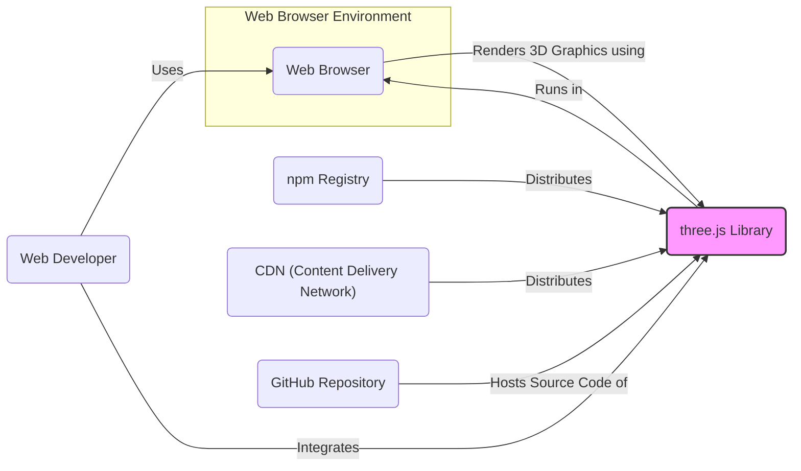
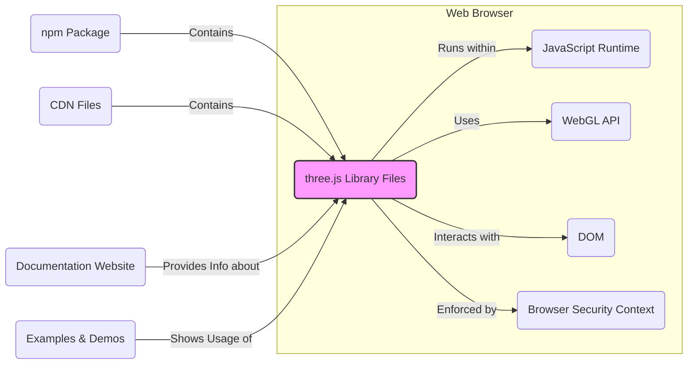
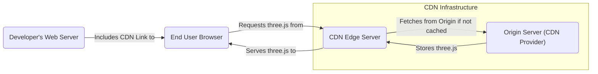
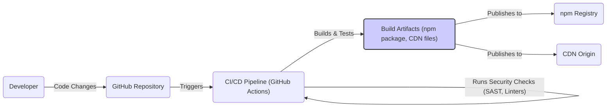

# BUSINESS POSTURE

This project, three.js, aims to provide an accessible and powerful JavaScript library for creating and displaying 3D graphics in web browsers. It targets web developers who want to incorporate 3D elements into their websites and applications without needing deep expertise in WebGL or 3D graphics programming.

- Business priorities and goals:
  - Lower the barrier to entry for web-based 3D graphics development.
  - Provide a comprehensive and well-documented API for 3D rendering.
  - Foster a strong community around the library for support and contributions.
  - Ensure cross-browser compatibility and performance.
  - Maintain the library as open-source and freely available.

- Most important business risks:
  - Security vulnerabilities in the library could be exploited in applications using three.js, leading to potential harm to end-users and reputational damage.
  - Supply chain attacks targeting the distribution channels (e.g., npm, CDN) could compromise the library and applications using it.
  - Lack of consistent security updates and maintenance could lead to unaddressed vulnerabilities.
  - Misuse of the library by developers who are not security-conscious could introduce vulnerabilities in their applications.

# SECURITY POSTURE

- Existing security controls:
  - security control: Open Source Code - The source code is publicly available on GitHub, allowing for community review and scrutiny. Implemented: GitHub repository.
  - security control: Community Review -  The project benefits from community contributions and issue reporting, which can help identify potential bugs and security issues. Implemented: GitHub community engagement.
  - security control: Standard JavaScript Development Practices - The project likely follows general JavaScript development practices, which may include some level of basic input validation and secure coding principles. Implemented: Codebase (implicitly).

- Accepted risks:
  - accepted risk: Reliance on Community Security Contributions - Security is partially reliant on the community to identify and report vulnerabilities.
  - accepted risk: Open Source Vulnerability Disclosure - Publicly disclosed vulnerabilities can be exploited before patches are widely adopted.
  - accepted risk: Dependency Vulnerabilities - The project depends on other JavaScript libraries, which may have their own vulnerabilities.

- Recommended security controls:
  - recommended security control: Automated Security Scanning (SAST/DAST) - Implement automated static and dynamic analysis security testing in the CI/CD pipeline to identify potential vulnerabilities in the code.
  - recommended security control: Dependency Scanning - Regularly scan project dependencies for known vulnerabilities and update them promptly.
  - recommended security control: Vulnerability Disclosure Policy - Establish a clear vulnerability disclosure policy to guide security researchers on how to report vulnerabilities responsibly.
  - recommended security control: Secure Release Process - Implement a secure release process that includes security checks and code signing to ensure the integrity of distributed artifacts.
  - recommended security control: Security Awareness Training for Contributors - Provide security awareness training for core contributors to promote secure coding practices.

- Security requirements:
  - Authentication: Not directly applicable to the library itself, as it's a client-side library. Authentication is the responsibility of the applications using three.js.
  - Authorization: Not directly applicable to the library itself. Authorization is the responsibility of the applications using three.js.
  - Input Validation:
    - The library should handle various input data formats (e.g., 3D model files, textures, user interactions) robustly and validate them to prevent unexpected behavior or vulnerabilities.
    - Input validation should be applied to any user-provided data that influences rendering or scene construction.
  - Cryptography:
    - If the library handles sensitive data (e.g., in custom shaders or data processing), appropriate cryptographic measures should be considered. However, for a rendering library, direct cryptographic requirements are less common.
    - Ensure that any dependencies used for cryptographic operations are secure and up-to-date.
  - General Security Practices:
    - Follow secure coding practices to prevent common web vulnerabilities such as Cross-Site Scripting (XSS), Cross-Site Request Forgery (CSRF), and injection attacks. While three.js itself is less directly vulnerable to CSRF, applications using it might be. XSS is a potential concern if three.js is used to render user-generated content without proper sanitization in the application layer.

# DESIGN

## C4 CONTEXT

- Context Diagram Elements:
  - - Name: Web Browser
    - Type: Software System
    - Description: The web browser is the runtime environment where three.js applications execute. It provides the WebGL API that three.js uses for rendering 3D graphics.
    - Responsibilities: Executes JavaScript code, provides WebGL rendering context, handles user interactions, fetches resources.
    - Security controls: Browser security sandbox, Content Security Policy (CSP) (application responsibility), Same-Origin Policy.
  - - Name: Web Developer
    - Type: Person
    - Description: Web developers are the primary users of three.js. They use the library to create 3D web applications and integrate them into websites.
    - Responsibilities: Develops web applications using three.js, integrates three.js into web projects, configures and uses three.js API.
    - Security controls: Secure development practices, input validation in applications, secure configuration of web applications.
  - - Name: three.js Library
    - Type: Software System
    - Description: A JavaScript library for creating and displaying animated 3D computer graphics in web browsers. It provides a high-level API on top of WebGL.
    - Responsibilities: 3D scene management, rendering, animation, handling 3D models and textures, providing a user-friendly API for 3D graphics.
    - Security controls: Input validation within the library (e.g., model loading), secure coding practices in library development, community security reviews.
  - - Name: npm Registry
    - Type: Software System
    - Description: A public registry for JavaScript packages. three.js is distributed through npm, allowing developers to easily include it in their projects.
    - Responsibilities: Package hosting and distribution, version management, dependency resolution.
    - Security controls: Package signing, malware scanning (npm's responsibility), HTTPS for distribution.
  - - Name: CDN (Content Delivery Network)
    - Type: Software System
    - Description: Content Delivery Networks are used to distribute three.js library files globally for faster and more reliable access by web browsers.
    - Responsibilities: Hosting and distributing static files (JavaScript, assets), providing fast content delivery to end-users.
    - Security controls: HTTPS for content delivery, access controls, DDoS protection (CDN provider's responsibility).
  - - Name: GitHub Repository
    - Type: Software System
    - Description: The central repository for three.js source code, issue tracking, and community contributions.
    - Responsibilities: Source code version control, issue tracking, pull request management, community collaboration.
    - Security controls: Access controls, code review process, branch protection, vulnerability scanning (GitHub's responsibility and potentially project-level tools).

## C4 CONTAINER

- Container Diagram Elements:
  - - Name: three.js Library Files
    - Type: Container - JavaScript Library
    - Description: The core JavaScript files that constitute the three.js library. These files are modular and provide various functionalities for 3D graphics.
    - Responsibilities: 3D scene management, rendering algorithms, geometry and material handling, animation system, input handling, utilities.
    - Security controls: Input validation within library functions, secure coding practices, code review, automated security scanning.
  - - Name: JavaScript Runtime
    - Type: Container - Runtime Environment
    - Description: The JavaScript engine within the web browser that executes the three.js library code.
    - Responsibilities: Executing JavaScript code, memory management, providing core JavaScript functionalities.
    - Security controls: Browser security sandbox, JavaScript engine security features (browser responsibility).
  - - Name: WebGL API
    - Type: Container - API
    - Description: The WebGL (Web Graphics Library) API provided by the web browser, which three.js uses to interact with the graphics processing unit (GPU) for hardware-accelerated 3D rendering.
    - Responsibilities: Providing low-level access to GPU functionalities, rendering primitives, managing graphics state.
    - Security controls: WebGL API security features (browser responsibility), browser security policies.
  - - Name: DOM (Document Object Model)
    - Type: Container - API
    - Description: The Document Object Model API allows three.js to interact with the web page structure and elements, enabling integration of 3D graphics into web content.
    - Responsibilities: Representing web page structure, allowing JavaScript to manipulate page content and style, handling user events.
    - Security controls: Browser security policies, DOM API security features (browser responsibility), Content Security Policy (CSP) (application responsibility).
  - - Name: Browser Security Context
    - Type: Container - Security Boundary
    - Description: The security context provided by the web browser, which isolates web pages and JavaScript code from each other and the underlying operating system.
    - Responsibilities: Enforcing security policies, isolating web origins, managing permissions, protecting user data.
    - Security controls: Browser security sandbox, Same-Origin Policy, Content Security Policy (CSP), Permissions API (browser responsibility).
  - - Name: npm Package
    - Type: Container - Distribution Package
    - Description: The npm package containing the three.js library files, metadata, and installation instructions.
    - Responsibilities: Packaging and distributing the library, versioning, dependency management.
    - Security controls: Package signing (npm), malware scanning (npm), HTTPS for download.
  - - Name: CDN Files
    - Type: Container - Distribution Files
    - Description: The files hosted on Content Delivery Networks (CDNs) for fast and reliable distribution of the three.js library.
    - Responsibilities: Hosting and distributing static files, providing fast content delivery.
    - Security controls: HTTPS for content delivery, access controls, CDN provider security measures.
  - - Name: Documentation Website
    - Type: Container - Web Application
    - Description: The official three.js documentation website, providing API documentation, guides, and examples.
    - Responsibilities: Providing documentation, tutorials, examples, community forum (potentially).
    - Security controls: HTTPS, web application security best practices, input validation on website forms (if any), access controls for website management.
  - - Name: Examples & Demos
    - Type: Container - Web Application
    - Description: A collection of examples and demos showcasing the capabilities of three.js and providing usage patterns.
    - Responsibilities: Demonstrating library features, providing code examples, testing different scenarios.
    - Security controls: HTTPS, web application security best practices, input validation if examples involve user input, Content Security Policy (CSP).

## DEPLOYMENT

Deployment of three.js is primarily focused on making the library available to web developers for inclusion in their projects. There are multiple deployment options:

- npm Registry: Developers can install three.js as a dependency in their projects using npm or yarn.
- CDN: Developers can include three.js directly in their HTML files by referencing a CDN URL.
- GitHub Releases: Developers can download specific versions of three.js from GitHub releases.
- Self-hosting: Developers can download three.js and host it on their own servers.

We will focus on the CDN deployment scenario as it's a common and important method for distributing JavaScript libraries.

- Deployment Diagram Elements (CDN Deployment):
  - - Name: CDN Edge Server
    - Type: Infrastructure - Server
    - Description: CDN Edge Servers are geographically distributed servers that cache content closer to end-users, improving loading speed and reducing latency.
    - Responsibilities: Caching and serving three.js library files, handling user requests, optimizing content delivery.
    - Security controls: HTTPS for content delivery, access controls, DDoS protection, CDN provider's infrastructure security.
  - - Name: Origin Server (CDN Provider)
    - Type: Infrastructure - Server
    - Description: The Origin Server is the authoritative source for the three.js library files within the CDN infrastructure. Edge servers fetch content from the origin server when it's not available in the cache.
    - Responsibilities: Storing the original three.js library files, providing content to edge servers, managing CDN content.
    - Security controls: Access controls, server hardening, regular security updates, CDN provider's infrastructure security.
  - - Name: Developer's Web Server
    - Type: Infrastructure - Server
    - Description: The web server hosting the web application that uses three.js. It serves the HTML page that includes the CDN link to three.js.
    - Responsibilities: Hosting and serving the web application, including HTML, CSS, and JavaScript files (excluding three.js which is served by CDN).
    - Security controls: Server hardening, HTTPS, access controls, web application security best practices.
  - - Name: End User Browser
    - Type: Infrastructure - Client
    - Description: The web browser of the end-user accessing the web application. It downloads and executes three.js from the CDN to render 3D graphics.
    - Responsibilities: Requesting and downloading web resources, executing JavaScript code, rendering web pages, providing user interface.
    - Security controls: Browser security features, user security practices, operating system security.

## BUILD

- Build Process Elements:
  - - Name: Developer
    - Type: Person
    - Description: Developers write code, fix bugs, and add features to the three.js library.
    - Responsibilities: Writing code, committing changes to the repository, participating in code reviews.
    - Security controls: Secure coding practices, code review participation, access control to development environment.
  - - Name: GitHub Repository
    - Type: Software System - Version Control
    - Description: The central Git repository hosted on GitHub, containing the source code of three.js.
    - Responsibilities: Version control, source code management, collaboration platform, triggering CI/CD pipelines.
    - Security controls: Access controls, branch protection, commit signing (optional), vulnerability scanning (GitHub's responsibility and project-level tools).
  - - Name: CI/CD Pipeline (GitHub Actions)
    - Type: Software System - Automation
    - Description: Automated CI/CD pipeline configured using GitHub Actions. It builds, tests, and performs security checks on the code.
    - Responsibilities: Automated build process, running unit tests, performing static analysis security testing (SAST), linting, creating build artifacts, publishing artifacts.
    - Security controls: Secure pipeline configuration, access controls to pipeline secrets, dependency scanning, SAST tools, secure artifact signing and publishing.
  - - Name: Build Artifacts (npm package, CDN files)
    - Type: Data - Software Package
    - Description: The packaged and built versions of the three.js library, ready for distribution. Includes npm package and files for CDN distribution.
    - Responsibilities: Distributable library files, packaged for different distribution channels.
    - Security controls: Code signing, integrity checks, secure storage of artifacts before publishing.
  - - Name: npm Registry
    - Type: Software System - Package Registry
    - Description: The npm registry where the three.js npm package is published for public consumption.
    - Responsibilities: Hosting and distributing npm packages, version management, dependency resolution.
    - Security controls: Package signing, malware scanning (npm's responsibility), HTTPS for distribution.
  - - Name: CDN Origin
    - Type: Software System - CDN Origin Server
    - Description: The origin server for the CDN, where the CDN pulls the three.js files to distribute them globally.
    - Responsibilities: Hosting the original files for CDN distribution, providing content to CDN edge servers.
    - Security controls: Access controls, server hardening, regular security updates, CDN provider's infrastructure security.

# RISK ASSESSMENT

- Critical business process we are trying to protect:
  - Maintaining the integrity and availability of the three.js library as a widely used and trusted open-source project.
  - Ensuring that applications built with three.js are not vulnerable due to security flaws in the library itself.
  - Protecting the reputation of the three.js project and its maintainers.

- Data we are trying to protect and their sensitivity:
  - Source code: Publicly available, but integrity is crucial to prevent malicious modifications. Sensitivity: Public, Integrity: High.
  - Build artifacts (npm package, CDN files): Publicly distributed, but integrity is paramount to prevent supply chain attacks. Sensitivity: Public, Integrity: High.
  - Project infrastructure (GitHub repository, CI/CD pipeline): Access control and integrity are important to prevent unauthorized modifications and ensure secure builds. Sensitivity: Confidentiality and Integrity: Medium.
  - User data (related to three.js project itself, not applications using it): Minimal user data collected directly by the three.js project (e.g., GitHub issues, forum posts if any). Sensitivity: Low.

# QUESTIONS & ASSUMPTIONS

- BUSINESS POSTURE:
  - Assumption: The primary goal is to provide a free and open-source library for the benefit of the web development community.
  - Assumption: Widespread adoption and positive community perception are key success metrics.
  - Question: What is the project's formal stance on security vulnerability handling and disclosure? Is there a dedicated security team or contact?

- SECURITY POSTURE:
  - Assumption: Current security controls are primarily based on open-source community review and general JavaScript development practices.
  - Assumption: There is no formal security testing or vulnerability management process currently in place.
  - Question: Are there any existing security policies or guidelines for contributors? Are there any plans to implement more formal security measures like regular security audits or bug bounty programs?

- DESIGN:
  - Assumption: The library is designed to be modular and primarily client-side, minimizing server-side dependencies and attack surface within the library itself.
  - Assumption: Distribution is mainly through npm and CDNs, leveraging their security features.
  - Question: Are there any specific architectural decisions made with security in mind? Are there any plans to incorporate security considerations more explicitly into the design and development process?