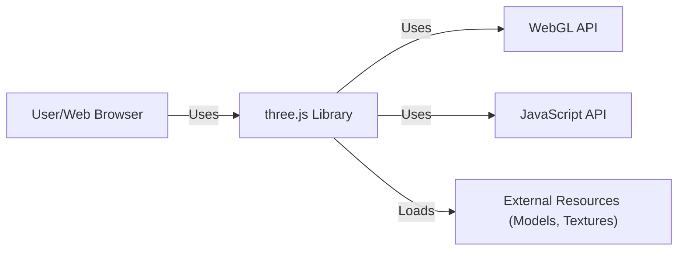
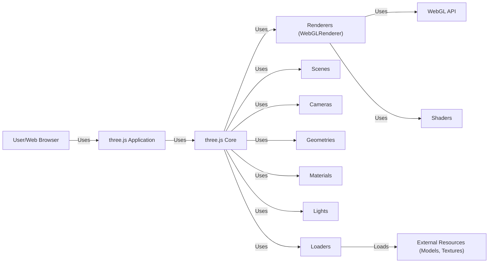
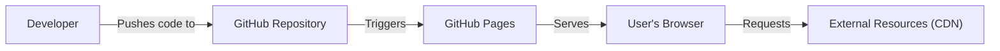
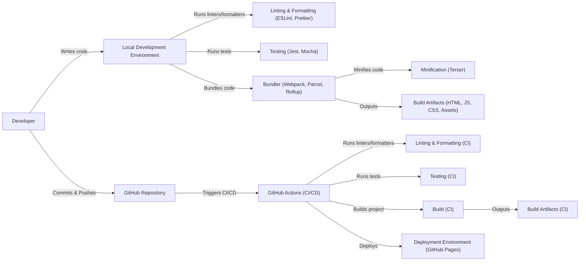

# Project Design Document: three.js

## BUSINESS POSTURE

three.js is a popular open-source JavaScript library for creating and displaying animated 3D computer graphics in a web browser. It simplifies the creation of complex 3D scenes using WebGL. Given its widespread use in various applications, from simple visualizations to complex games and interactive experiences, the business posture can be characterized as follows:

Priorities and Goals:

*   Accessibility: Enable developers of all skill levels to easily create 3D graphics for the web.
*   Performance: Provide a high-performance rendering engine that can handle complex scenes and animations.
*   Cross-browser Compatibility: Ensure the library works consistently across different web browsers and devices.
*   Community Support: Foster a strong and active community to contribute to the library's development and provide support to users.
*   Extensibility: Allow developers to extend the library's functionality through plugins and custom shaders.
*   Open Source: Maintain the library as an open-source project, encouraging contributions and transparency.

Business Risks:

*   Security Vulnerabilities: As a widely used library, any security vulnerabilities could impact a large number of websites and applications. Cross-site scripting (XSS) and denial-of-service (DoS) are potential concerns.
*   Performance Bottlenecks: Poorly optimized code or inefficient use of the library could lead to performance issues, negatively impacting user experience.
*   Browser Compatibility Issues: Changes in web browser standards or implementations could break existing functionality.
*   Dependency Management: Reliance on external dependencies could introduce vulnerabilities or compatibility problems.
*   Lack of Maintenance: Insufficient maintenance or updates could lead to the library becoming outdated or insecure.
*   Malicious Use: The library could be used to create malicious content, such as phishing sites or malware distribution.

## SECURITY POSTURE

Existing Security Controls:

*   security control: Code Reviews: The project is hosted on GitHub, which facilitates community code reviews and pull request processes.
*   security control: Issue Tracking: GitHub Issues are used to track and manage reported bugs and security vulnerabilities.
*   security control: Community Vigilance: A large and active community helps identify and report potential security issues.

Accepted Risks:

*   accepted risk: WebGL Limitations: The library relies on WebGL, which has inherent security considerations and potential attack vectors.
*   accepted risk: User-Provided Content: The library allows users to load and display custom 3D models and textures, which could contain malicious code or data.
*   accepted risk: Third-Party Dependencies: The library may depend on third-party libraries, which could introduce their own security risks.

Recommended Security Controls:

*   security control: Content Security Policy (CSP): Implement CSP headers to mitigate XSS attacks.
*   security control: Input Validation: Sanitize user-provided data, such as model and texture URLs, to prevent injection attacks.
*   security control: Regular Security Audits: Conduct periodic security audits to identify and address potential vulnerabilities.
*   security control: Dependency Scanning: Regularly scan dependencies for known vulnerabilities.
*   security control: Security-Focused Documentation: Provide clear documentation on secure usage of the library and potential security risks.

Security Requirements:

*   Authentication: Not directly applicable to the library itself, but applications using three.js should implement appropriate authentication mechanisms.
*   Authorization: Not directly applicable to the library itself, but applications using three.js should implement appropriate authorization mechanisms to control access to resources and functionality.
*   Input Validation:
    *   Validate all user-provided data, including URLs, model data, and texture data.
    *   Sanitize user input to prevent XSS and other injection attacks.
    *   Implement checks to prevent loading of malicious models or textures.
*   Cryptography:
    *   If handling sensitive data, use appropriate cryptographic techniques for data transmission and storage.
    *   Consider using Web Crypto API for cryptographic operations within the browser.
*   Data Handling:
    *   If handling sensitive data, ensure it is stored and transmitted securely.
    *   Follow best practices for data privacy and protection.

## DESIGN

### C4 CONTEXT

Element Description:

*   Element:
    *   Name: User/Web Browser
    *   Type: User
    *   Description: The end-user interacting with a web application that utilizes the three.js library.
    *   Responsibilities: Interacting with the 3D graphics rendered by three.js. Providing input through mouse, keyboard, touch, or other input devices.
    *   Security controls: Browser security mechanisms (e.g., same-origin policy, CSP).

*   Element:
    *   Name: three.js Library
    *   Type: Library
    *   Description: The core three.js library, providing a high-level API for creating and manipulating 3D graphics.
    *   Responsibilities: Abstracting WebGL complexities. Providing scene graph management. Handling rendering, animation, and user interaction.
    *   Security controls: Input validation, community code reviews, issue tracking.

*   Element:
    *   Name: WebGL API
    *   Type: API
    *   Description: The low-level WebGL API provided by the browser, enabling access to the GPU for rendering.
    *   Responsibilities: Rendering 3D graphics based on instructions from three.js.
    *   Security controls: Browser-level security controls for WebGL.

*   Element:
    *   Name: JavaScript API
    *   Type: API
    *   Description: Standard JavaScript APIs provided by the browser.
    *   Responsibilities: Providing core functionalities like DOM manipulation, event handling, and network requests.
    *   Security controls: Browser-level security controls for JavaScript.

*   Element:
    *   Name: External Resources (Models, Textures)
    *   Type: External Resources
    *   Description: External resources loaded by three.js, such as 3D models, textures, and other assets.
    *   Responsibilities: Providing the visual content for the 3D scene.
    *   Security controls: Input validation, potentially scanning for malicious content.

### C4 CONTAINER

Element Description:

*   Element:
    *   Name: User/Web Browser
    *   Type: User
    *   Description: The end-user interacting with the three.js application.
    *   Responsibilities: Interacting with the rendered 3D scene.
    *   Security controls: Browser security mechanisms.

*   Element:
    *   Name: three.js Application
    *   Type: Application
    *   Description: The specific application built using the three.js library.
    *   Responsibilities: Defining the scene, objects, interactions, and overall application logic.
    *   Security controls: Application-specific security measures, input validation.

*   Element:
    *   Name: three.js Core
    *   Type: Library
    *   Description: The core components of the three.js library.
    *   Responsibilities: Providing the main classes and functionalities for creating and managing 3D scenes.
    *   Security controls: Internal input validation, code reviews.

*   Element:
    *   Name: Renderers (WebGLRenderer)
    *   Type: Component
    *   Description: The renderer responsible for drawing the 3D scene to the canvas using WebGL.
    *   Responsibilities: Translating the scene graph into WebGL commands. Managing shaders and rendering state.
    *   Security controls: Relies on WebGL security.

*   Element:
    *   Name: Scenes
    *   Type: Component
    *   Description: Represents the 3D scene, containing objects, lights, and cameras.
    *   Responsibilities: Organizing the objects in the 3D world.
    *   Security controls: None directly.

*   Element:
    *   Name: Cameras
    *   Type: Component
    *   Description: Defines the viewpoint from which the scene is rendered.
    *   Responsibilities: Controlling the perspective and position of the viewer.
    *   Security controls: None directly.

*   Element:
    *   Name: Geometries
    *   Type: Component
    *   Description: Defines the shape of 3D objects.
    *   Responsibilities: Providing the vertex data for rendering.
    *   Security controls: Input validation if loading external geometry data.

*   Element:
    *   Name: Materials
    *   Type: Component
    *   Description: Defines the appearance of 3D objects (color, texture, shininess, etc.).
    *   Responsibilities: Specifying how objects interact with light.
    *   Security controls: Input validation if loading external textures.

*   Element:
    *   Name: Lights
    *   Type: Component
    *   Description: Illuminates the scene.
    *   Responsibilities: Providing light sources for realistic rendering.
    *   Security controls: None directly.

*   Element:
    *   Name: Loaders
    *   Type: Component
    *   Description: Handles loading external resources like models and textures.
    *   Responsibilities: Fetching and parsing external data.
    *   Security controls: Input validation of URLs and loaded data.

*   Element:
    *   Name: WebGL API
    *   Type: API
    *   Description: The browser's WebGL API.
    *   Responsibilities: Low-level rendering.
    *   Security controls: Browser-level security.

*   Element:
    *   Name: Shaders
    *   Type: Component
    *   Description: Programs that run on the GPU, controlling how objects are rendered.
    *   Responsibilities: Performing vertex and fragment calculations.
    *   Security controls: Input validation if using custom shaders.

*   Element:
    *   Name: External Resources (Models, Textures)
    *   Type: External Resources
    *   Description: External files loaded by the application.
    *   Responsibilities: Providing visual data.
    *   Security controls: Input validation, potentially scanning for malicious content.

### DEPLOYMENT

Deployment Solutions:

1.  Static Website Hosting: three.js applications are often deployed as static websites. This involves simply placing the HTML, JavaScript, CSS, and asset files on a web server. Services like Netlify, Vercel, GitHub Pages, AWS S3, and Google Cloud Storage are commonly used.
2.  Traditional Web Server: Deploying to a traditional web server like Apache or Nginx. This offers more control over the server environment but requires more configuration.
3.  Containerization (Docker): The application can be containerized using Docker and deployed to container orchestration platforms like Kubernetes or AWS ECS. This provides more isolation and scalability.
4.  Serverless Functions: While less common for the core rendering, serverless functions (e.g., AWS Lambda, Google Cloud Functions) could be used for supporting tasks like asset processing or data fetching.

Chosen Solution (Static Website Hosting - GitHub Pages):

Element Description:

*   Element:
    *   Name: Developer
    *   Type: User
    *   Description: The developer writing and deploying the three.js application.
    *   Responsibilities: Writing code, managing assets, and deploying the application.
    *   Security controls: Code reviews, secure coding practices.

*   Element:
    *   Name: GitHub Repository
    *   Type: Repository
    *   Description: The Git repository hosted on GitHub, containing the application code and assets.
    *   Responsibilities: Storing the codebase, managing versions, and triggering deployments.
    *   Security controls: GitHub's security features, access controls.

*   Element:
    *   Name: GitHub Pages
    *   Type: Hosting Service
    *   Description: GitHub's static website hosting service.
    *   Responsibilities: Serving the static files to users' browsers.
    *   Security controls: GitHub's security infrastructure, HTTPS.

*   Element:
    *   Name: User's Browser
    *   Type: User Agent
    *   Description: The end-user's web browser.
    *   Responsibilities: Rendering the three.js application.
    *   Security controls: Browser security mechanisms.

*   Element:
    *   Name: External Resources (CDN)
    *   Type: External Resource
    *   Description: Content Delivery Network (CDN) hosting external assets like models and textures.
    *   Responsibilities: Providing fast and reliable access to assets.
    *   Security controls: CDN's security features, HTTPS.

### BUILD

Build Process Description:

1.  Development: Developers write code in their local environment, using tools like ESLint and Prettier for linting and formatting.
2.  Testing: Unit and integration tests are written and run locally using frameworks like Jest or Mocha.
3.  Bundling: A bundler like Webpack, Parcel, or Rollup is used to combine the JavaScript modules, optimize assets, and minify the code (e.g., using Terser).
4.  Build Artifacts: The bundler outputs the build artifacts (HTML, JavaScript, CSS, and assets) ready for deployment.
5.  Version Control: Developers commit and push their code to a GitHub repository.
6.  Continuous Integration/Continuous Deployment (CI/CD): GitHub Actions (or a similar CI/CD system) is triggered by pushes to the repository.
7.  CI/CD Pipeline:
    *   Linting and Formatting: The CI pipeline runs linters and formatters to ensure code quality.
    *   Testing: The CI pipeline runs the test suite.
    *   Build: The CI pipeline builds the project, creating the build artifacts.
    *   Deployment: The CI pipeline deploys the build artifacts to the target environment (e.g., GitHub Pages).

Security Controls in Build Process:

*   security control: Linting and Formatting: Tools like ESLint and Prettier help enforce coding standards and identify potential security issues.
*   security control: Testing: Automated tests help catch bugs and regressions that could lead to vulnerabilities.
*   security control: Dependency Management: Package managers like npm or yarn help manage dependencies, and tools like `npm audit` can be used to identify known vulnerabilities in dependencies.
*   security control: CI/CD Pipeline: Automating the build and deployment process ensures consistency and reduces the risk of manual errors. Security checks can be integrated into the pipeline.
*   security control: Code Reviews: The pull request process on GitHub facilitates code reviews, allowing other developers to review changes before they are merged.

## RISK ASSESSMENT

Critical Business Processes:

*   Rendering 3D graphics in web browsers: This is the core functionality of the library.
*   Providing a user-friendly API for developers: This enables widespread adoption and use of the library.
*   Maintaining cross-browser compatibility: This ensures the library works consistently for a broad audience.

Data Sensitivity:

*   User-provided data (models, textures, URLs): This data could be malicious or contain sensitive information. The sensitivity depends on the specific application using three.js. A game might have low sensitivity, while a medical visualization application could have high sensitivity.
*   Application-specific data: Applications built with three.js may handle their own sensitive data, which is outside the scope of the library itself but needs to be considered in the overall application security.
*   No data is stored by the library itself.

## QUESTIONS & ASSUMPTIONS

Questions:

*   Are there any specific security certifications or compliance requirements that applications using three.js need to meet?
*   What is the expected level of security expertise of developers using three.js?
*   Are there any known attack vectors or vulnerabilities specific to WebGL or three.js that need to be addressed?
*   What is process of vulnerability reporting?

Assumptions:

*   BUSINESS POSTURE: The primary goal is to provide a user-friendly and performant 3D graphics library for the web. Security is a high priority, but not at the expense of usability or performance.
*   SECURITY POSTURE: Developers using three.js are responsible for securing their own applications, including handling user input and protecting sensitive data. The library provides some basic security measures, but it is not a comprehensive security solution.
*   DESIGN: The library is designed to be modular and extensible, allowing developers to customize its functionality. The core rendering relies on WebGL, which has inherent security considerations.