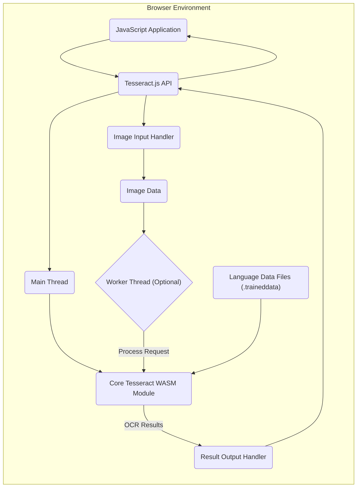
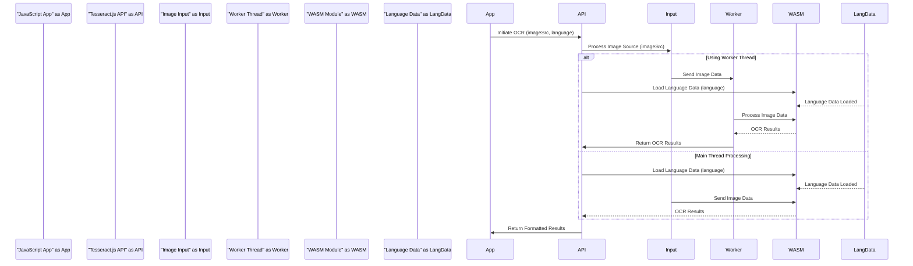

# Project Design Document: Tesseract.js

**Version:** 1.1
**Date:** October 26, 2023
**Author:** AI Software Architect

## 1. Introduction

This document provides an enhanced and detailed design overview of the Tesseract.js project, a pure Javascript port of the popular Tesseract OCR engine. This document serves as a comprehensive foundation for future threat modeling activities. It meticulously outlines the system's architecture, components, data flow, and the underlying technologies involved. This revision aims to provide greater clarity and depth for security analysis.

## 2. Project Goals

* Provide a robust client-side, browser-based OCR solution, minimizing server-side dependencies for OCR tasks.
* Offer a well-defined and intuitive Javascript API for seamless integration into modern web applications.
* Maintain a high degree of functional parity with the core, native Tesseract OCR engine, ensuring consistent OCR quality.
* Support a wide range of common image formats encountered in web contexts.
* Enable comprehensive language support for accurate OCR across diverse linguistic datasets.

## 3. Non-Goals

* Serving as a direct replacement for the native Tesseract engine in scenarios requiring high-throughput, server-side OCR processing where performance is paramount.
* Incorporating advanced, specialized image pre-processing algorithms directly within the Tesseract.js library itself. These functions are expected to be handled by external, dedicated image manipulation libraries.
* Developing a complete image editing or manipulation suite as part of the Tesseract.js project.

## 4. System Architecture

The Tesseract.js architecture is modular and centers around the interaction between JavaScript and a WebAssembly-based core. The key components are:

* **Core Tesseract WASM Module:** This is the compiled Tesseract OCR engine, transformed into WebAssembly for efficient execution within the browser. It encapsulates the core OCR algorithms.
* **JavaScript API:** This acts as the primary interface for developers, providing a set of functions to interact with the underlying WASM module. It manages image loading, engine initialization, parameter configuration, and result retrieval.
* **Image Input Handler:** This component is responsible for ingesting image data from various sources within the browser environment. It normalizes and prepares the data for processing by the WASM module.
* **Worker Thread (Optional but Recommended):** Tesseract.js leverages Web Workers to offload the computationally intensive OCR processing to a separate thread. This prevents blocking the main browser thread, ensuring a responsive user interface.
* **Language Data Files (.traineddata):** These files contain language-specific models and data crucial for accurate character recognition. They are loaded and utilized by the WASM module during the OCR process.
* **Result Output Handler:** This component formats the raw output from the WASM module into a structured and easily consumable format for the JavaScript application.

## 5. Detailed Component Description

* **JavaScript Application:** This represents the user's web application or script that integrates and utilizes the Tesseract.js library to perform OCR. It initiates the process and consumes the results.
* **Tesseract.js API:** This is the central interface exposed by the library. It provides a set of asynchronous functions for:
    * `initialize(options)`:  Sets up the Tesseract engine, potentially downloading and initializing the WASM module and worker scripts.
    * `loadLanguage(lang)`: Fetches and loads the specified language data file (`.traineddata`).
    * `setParameters(params)`: Configures various OCR parameters, such as the OCR Engine Mode (OEM) and Page Segmentation Mode (PSM).
    * `recognize(image, options)`:  Initiates the OCR process on the provided image data.
    * `terminate()`: Cleans up resources and terminates the Tesseract engine.
    * Provides progress events to track the status of the OCR process.
* **Image Input Handler:** This component handles the ingestion of image data from diverse browser sources:
    * **File Upload:** Reads binary image data from files selected via the `<input type="file">` element.
    * **Image Element (``):** Accesses image data from loaded `` tags.
    * **Canvas Element (`<canvas>`):** Extracts pixel data from `<canvas>` elements using methods like `getImageData()`.
    * **Blob Objects:** Processes image data provided as Blob objects.
    * **Image URLs:** Fetches image data from provided URLs (subject to CORS restrictions).
    * This component often performs necessary conversions, such as converting images to grayscale or extracting raw pixel arrays, to prepare the data for the WASM module.
* **Worker Thread (Optional but Recommended):** When employed, the worker thread executes the computationally demanding OCR processing in isolation from the main browser thread. This prevents the UI from freezing during long OCR operations, enhancing user experience. Communication between the main thread and the worker thread relies on asynchronous message passing. The worker receives image data and configuration from the main thread and sends back the OCR results.
* **Core Tesseract WASM Module:** This is a pre-compiled binary of the Tesseract OCR engine, built using tools like Emscripten to target the WebAssembly platform. It performs the core OCR algorithms. Key functionalities include:
    * Image decoding and loading.
    * Image pre-processing steps (e.g., noise reduction, binarization, deskewing).
    * Layout analysis to identify text regions.
    * Character segmentation.
    * Character recognition using the loaded language data.
    * Post-processing of the recognized text.
* **Language Data Files (.traineddata):** These are binary files containing trained data for specific languages. They include statistical models and character shape information used by the OCR engine for accurate recognition. Different language files must be loaded based on the language of the text in the input image.
* **Result Output Handler:** This component takes the raw output from the WASM module and structures it into a more usable format for the JavaScript application. This typically includes:
    * The recognized text string.
    * Confidence scores for individual words or characters.
    * Information about the location (bounding boxes) of recognized text elements.
    * Other metadata related to the OCR process.

## 6. Data Flow

The typical sequence of operations during an OCR task using Tesseract.js is as follows:

1. The **JavaScript Application** initiates the OCR process by calling the `recognize()` function in the **Tesseract.js API**, providing the image source and optionally specifying language or other parameters.
2. The **Image Input Handler** receives the image source and processes it, potentially performing format conversions and extracting pixel data.
3. If configured to use a **Worker Thread**, the image data and relevant parameters are passed to the worker thread for processing. Otherwise, the OCR processing occurs directly in the main thread.
4. The **Tesseract.js API** (or the worker thread) ensures the necessary **Language Data Files (.traineddata)** are loaded into the **Core Tesseract WASM Module**.
5. The image data is passed to the **Core Tesseract WASM Module**.
6. The **Core Tesseract WASM Module** executes the OCR algorithms on the image data, utilizing the loaded language data.
7. The **Core Tesseract WASM Module** generates **OCR Results**, which include the recognized text, confidence levels, and layout information.
8. The **OCR Results** are passed back to the **Tesseract.js API** (or the worker thread).
9. The **Result Output Handler** within the **Tesseract.js API** formats the raw results into a structured JavaScript object.
10. The **Tesseract.js API** returns the formatted results to the **JavaScript Application**, typically via a Promise or callback.

## 7. Technology Stack

* **Core Programming Languages:** JavaScript (primary), C/C++ (for the underlying Tesseract engine), WebAssembly.
* **Build and Compilation Tools:** Emscripten (for compiling C/C++ to WebAssembly).
* **Image Format Handling:** Relies on browser built-in capabilities or potentially external libraries for decoding various image formats.
* **Web Standards:** HTML, CSS (for integration into web pages), Web Workers API.
* **Package Management:** Typically distributed via npm (Node Package Manager).

## 8. Deployment Model

Tesseract.js is designed for client-side execution and is commonly deployed in the following ways:

* **Direct Script Inclusion:** The Tesseract.js library files are directly included in an HTML page using `<script>` tags. This is a simple deployment method for smaller projects.
* **Module Bundlers:** Integrated into larger JavaScript applications using module bundlers like Webpack, Parcel, or Rollup. This allows for better dependency management and code optimization.
* **Content Delivery Networks (CDNs):** Served from CDNs to leverage browser caching and improve loading times for users. Language data files are often hosted alongside the library or on separate CDNs.

## 9. Security Considerations (Detailed)

Given its client-side nature, Tesseract.js introduces specific security considerations:

* **Cross-Site Scripting (XSS):**
    * **Risk:** If the application displays the raw OCR results without proper sanitization, a malicious actor could potentially inject script tags into the image content, leading to XSS attacks.
    * **Mitigation:** Always sanitize OCR output before rendering it on the page. Use browser-provided escaping mechanisms or dedicated sanitization libraries. Implement a strong Content Security Policy (CSP).
* **Content Security Policy (CSP):**
    * **Risk:**  Due to the use of WebAssembly, a restrictive CSP is crucial. Without proper configuration, the browser might block the loading or execution of the WASM module.
    * **Mitigation:** Configure the CSP to allow `wasm-unsafe-eval` or `wasm-unsafe-streaming` (depending on the Tesseract.js version and browser support) and ensure that the sources for scripts and other resources are explicitly whitelisted.
* **Supply Chain Security:**
    * **Risk:**  Compromised dependencies or malicious code injected into the Tesseract.js library itself could pose a significant threat.
    * **Mitigation:** Obtain Tesseract.js from trusted sources like npm. Verify the integrity of downloaded packages using checksums. Regularly update the library to benefit from security patches. Consider using tools like Snyk or Dependabot to monitor dependencies for vulnerabilities.
* **Denial of Service (DoS) - Client-Side:**
    * **Risk:** Processing extremely large or complex images can consume significant client-side resources (CPU, memory), potentially freezing the user's browser or device.
    * **Mitigation:** Implement safeguards to limit the size or complexity of images processed. Provide feedback to the user about processing times. Consider offering options to adjust OCR parameters for performance.
* **Data Privacy:**
    * **Risk:** If sensitive information is present in the images being processed, the OCR results could expose this data on the client-side.
    * **Mitigation:**  Inform users about the client-side processing of data. Avoid processing highly sensitive information directly in the browser if possible. Consider server-side OCR for sensitive data where more robust security controls can be implemented.
* **WebAssembly Security:**
    * **Risk:** While WebAssembly provides a sandboxed environment, vulnerabilities within the compiled Tesseract engine (the WASM module) could potentially be exploited.
    * **Mitigation:** Keep the Tesseract.js library updated, as updates often include security fixes for the underlying Tesseract engine. Rely on the security mechanisms provided by the browser's WebAssembly implementation.
* **Language Data Integrity:**
    * **Risk:**  If the language data files (`.traineddata`) are compromised or maliciously altered, it could lead to incorrect OCR results or potentially even introduce vulnerabilities if the WASM module improperly handles corrupted data.
    * **Mitigation:**  Serve language data files over HTTPS to ensure integrity during transit. Verify the integrity of downloaded language data files using checksums or signatures. Obtain language data files from trusted sources.

This enhanced design document provides a more in-depth understanding of the Tesseract.js project's architecture and its associated security considerations. This detailed information is essential for conducting thorough threat modeling and implementing appropriate security measures.