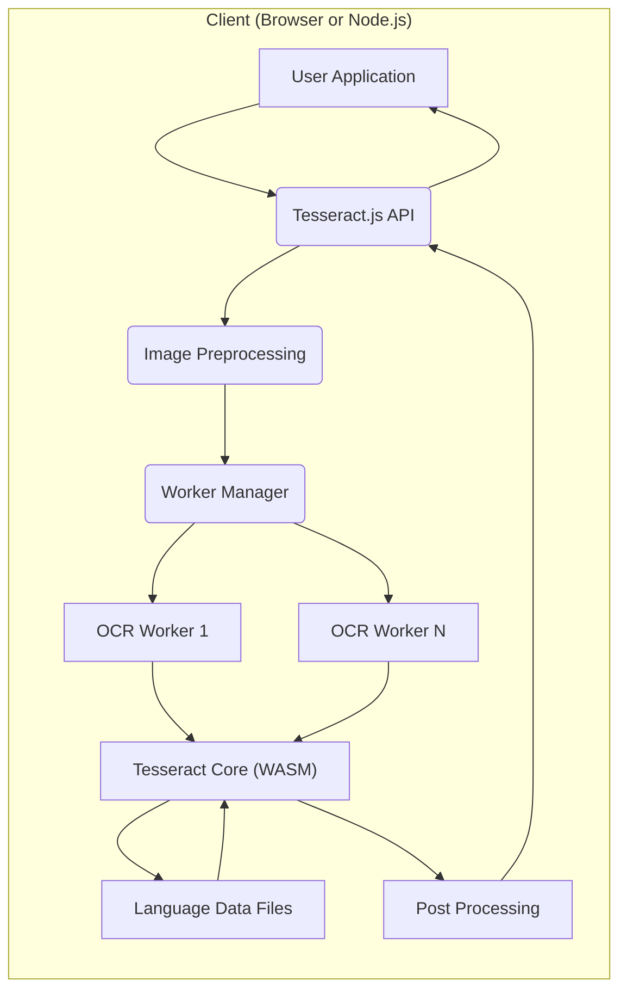
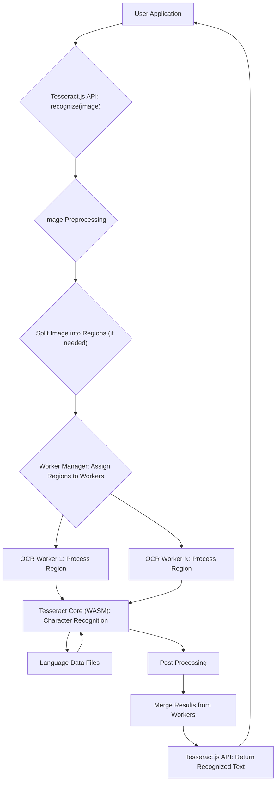

# Project Design Document: Tesseract.js

**Version:** 1.1
**Date:** October 26, 2023
**Author:** AI Software Architect

## 1. Introduction

This document provides a detailed architectural design for the Tesseract.js project, a pure Javascript OCR engine that gets words in almost any image. This document aims to clearly outline the system's components, data flow, and key considerations, making it suitable for subsequent threat modeling activities. This revision includes more detailed descriptions and expands on security considerations.

## 2. Goals and Objectives

The primary goal of Tesseract.js is to provide a client-side Optical Character Recognition (OCR) capability within web browsers and Node.js environments. Key objectives include:

*   Accurate text extraction from images.
*   Performance suitable for real-time or near real-time processing.
*   Cross-browser compatibility.
*   Support for multiple languages.
*   Ease of integration into web applications and Node.js projects.
*   Maintain a small bundle size where feasible.

## 3. System Architecture

Tesseract.js adopts a modular architecture, leveraging WebAssembly for performance-critical operations and worker threads for parallel processing.

### 3.1. High-Level Architecture Diagram

### 3.2. Component Description

*   **User Application:** The web application or Node.js script that initiates the OCR process by interacting with the Tesseract.js API. This component provides the input image and consumes the recognized text.
*   **Tesseract.js API:** The public interface exposed by the library. It provides functions for:
    *   Initializing the Tesseract.js engine, including loading language data.
    *   Processing images (`recognize()` function).
    *   Accessing configuration options.
    *   Potentially managing worker lifecycle.
*   **Image Preprocessing:**  A module responsible for preparing the input image for optimal OCR. This involves a series of steps:
    *   **Input Handling:** Accepts various image formats (e.g., JPEG, PNG, GIF, TIFF, Blob, HTMLImageElement, HTMLCanvasElement).
    *   **Format Conversion:** Converts the image to a suitable internal representation (e.g., grayscale pixel data).
    *   **Resizing:** Adjusts the image dimensions to improve processing efficiency or accuracy.
    *   **Grayscaling:** Converts color images to grayscale.
    *   **Noise Reduction:** Applies filters to reduce image noise and improve clarity.
    *   **Binarization:** Converts the grayscale image to a binary image (black and white) to simplify character segmentation.
*   **Worker Manager:**  Manages the pool of OCR worker threads. Its responsibilities include:
    *   Creating and initializing worker threads.
    *   Distributing image processing tasks (e.g., different regions of the image) to available workers.
    *   Collecting results from worker threads.
    *   Managing worker lifecycle and potential recycling.
*   **OCR Worker (1 to N):**  Independent worker threads that execute the core OCR logic in parallel. Each worker:
    *   Receives a portion of the preprocessed image from the Worker Manager.
    *   Instantiates and interacts with the Tesseract Core (WASM).
    *   Loads necessary language data files.
    *   Performs character recognition on its assigned image region.
    *   Sends the recognized text and confidence scores back to the Worker Manager.
*   **Tesseract Core (WASM):**  The core OCR engine, originally written in C++, compiled to WebAssembly for efficient and portable execution within web browsers and Node.js. This component performs the fundamental steps of OCR:
    *   **Text Segmentation:** Identifying individual characters and words within the image.
    *   **Feature Extraction:** Extracting relevant features from the segmented characters.
    *   **Character Recognition:** Matching the extracted features against trained language models to identify the characters.
*   **Language Data Files:**  Data files containing language-specific information required by the Tesseract Core for accurate recognition. These files include:
    *   **Trained Data:** Statistical models trained on large datasets of text and images for specific languages.
    *   **Character Sets:** Definitions of the characters supported by the language.
    *   **Dictionaries:** Word lists used for improving recognition accuracy.
    *   These files are typically loaded on demand and cached for performance.
*   **Post Processing:**  A module that refines the raw output from the Tesseract Core to improve accuracy and usability. This may involve:
    *   **Spell Checking:** Identifying and correcting potential spelling errors.
    *   **Text Layout Reconstruction:**  Attempting to reconstruct the original layout of the text (e.g., paragraphs, lines).
    *   **Confidence Score Calculation:**  Assigning confidence scores to the recognized characters and words.
    *   **Formatting:** Applying basic formatting to the output text.

## 4. Data Flow

The typical data flow for an OCR operation in Tesseract.js is as follows:

**Detailed Data Flow Steps:**

1. The **User Application** calls the `recognize()` function in the **Tesseract.js API**, providing an image (e.g., `` element, `File` object, or image URL).
2. The **Tesseract.js API** receives the request and passes the image data to the **Image Preprocessing** module.
3. **Image Preprocessing** performs necessary transformations on the image to prepare it for OCR (resizing, grayscaling, noise reduction, binarization, etc.).
4. Based on the image size and configuration, the preprocessed image might be split into smaller regions for parallel processing by the workers.
5. The **Worker Manager** takes the image regions and assigns them to available **OCR Workers**.
6. Each **OCR Worker** receives its assigned image region.
7. The **OCR Worker** loads the necessary **Language Data Files** (if not already loaded or cached).
8. The **OCR Worker** feeds the image region to the **Tesseract Core (WASM)** for character recognition.
9. The **Tesseract Core (WASM)** processes the image region using the loaded language data and performs text segmentation, feature extraction, and character recognition.
10. The recognized text and associated confidence scores from the **Tesseract Core** are passed to the **Post Processing** module within the worker.
11. The **Post Processing** module performs tasks like spell checking and layout reconstruction on the recognized text.
12. The **OCR Worker** sends the processed text back to the **Worker Manager**.
13. The **Worker Manager** collects and merges the results from all the **OCR Workers**, maintaining the correct order of the recognized text.
14. The **Tesseract.js API** receives the merged results and returns the final recognized text to the **User Application**.

## 5. Security Considerations

This section outlines potential security considerations relevant to Tesseract.js. These points will be further explored during threat modeling.

*   **Input Validation:**
    *   **Image Input:**  The library must robustly handle potentially malicious or malformed image files. Vulnerabilities in underlying image decoding libraries (used in preprocessing) could be exploited to cause crashes, memory corruption, or even remote code execution. Attack vectors include crafted headers, excessively large dimensions, or embedded malicious content.
    *   **Configuration Options:**  Improperly validated configuration options passed to the API (e.g., language codes, parameters for preprocessing) could lead to unexpected behavior, resource exhaustion, or bypass security checks. For example, specifying an extremely large image processing area could lead to excessive memory usage.
*   **Data Integrity:**
    *   **Language Data Files:**  The integrity and authenticity of the language data files are critical. If these files are tampered with (e.g., through a man-in-the-middle attack during download or by compromising the hosting server), it could lead to incorrect OCR results, injection of malicious scripts if the data is mishandled, or even denial of service. Mechanisms for verifying the integrity (e.g., checksums, signatures) of these files should be considered.
*   **Cross-Site Scripting (XSS):**
    *   If the recognized text is directly rendered on a web page without proper sanitization, it could introduce XSS vulnerabilities. Malicious actors could craft images containing text designed to inject scripts into the application's context. This is especially relevant when dealing with user-uploaded images.
*   **Dependency Vulnerabilities:**
    *   Tesseract.js relies on various dependencies, including the WebAssembly binary and potentially other JavaScript libraries. Known vulnerabilities in these dependencies could be exploited if not regularly updated. Supply chain security is a concern.
*   **Resource Exhaustion:**
    *   Processing very large or complex images, or a high volume of requests, could potentially lead to excessive memory consumption, CPU usage, or network bandwidth consumption, causing denial-of-service conditions for the client or the server hosting the application.
*   **Data Leakage:**
    *   Care should be taken to ensure that sensitive information contained within the processed images is not inadvertently logged, cached insecurely, or exposed through error messages or debugging information. Browser history or temporary files could also be potential leakage points.
*   **WebAssembly Security:**
    *   While WebAssembly provides a sandboxed environment, potential vulnerabilities within the Tesseract Core (WASM) itself could exist. Bugs in the C++ code before compilation or issues in the compilation process could introduce security flaws.
*   **Worker Thread Security:**
    *   Communication between the main thread and worker threads should be carefully managed to prevent potential security issues. Malicious code in the main thread could potentially manipulate worker threads or vice versa if proper isolation and message handling are not implemented.
*   **Side-Channel Attacks:**
    *   While less likely in a client-side JavaScript environment, consider potential side-channel attacks based on timing or resource consumption during the OCR process, which might reveal information about the input image.

## 6. Deployment

Tesseract.js is primarily deployed in two environments, each with its own security considerations:

*   **Web Browsers:**
    *   Integrated directly into web applications using `<script>` tags or module bundlers.
    *   Language data files are typically fetched from a server (potentially a CDN). Security of this delivery mechanism is important (HTTPS).
    *   Vulnerable to client-side attacks like XSS if the output is not handled carefully.
    *   Limited access to local file system resources, reducing some attack vectors.
    *   Relies on browser security features (same-origin policy, content security policy).
*   **Node.js:**
    *   Used in server-side applications or command-line tools.
    *   Language data files are typically accessed from the local file system, requiring secure storage and access controls.
    *   More susceptible to server-side vulnerabilities if not properly integrated and secured.
    *   Has access to the file system and network, increasing the potential impact of vulnerabilities.

## 7. Threat Model Input

This design document provides crucial information for conducting a thorough threat model of Tesseract.js. Specifically, the following aspects are relevant:

*   **Components:** The identified components (User Application, API, Preprocessing, Workers, Core, Language Data, Post Processing) represent the attack surface of the system.
*   **Data Flow:** The data flow diagrams illustrate how data enters, moves through, and exits the system, highlighting potential interception or manipulation points.
*   **Security Considerations:** This section provides a preliminary list of potential threats and vulnerabilities associated with different aspects of the architecture.

Using this document, a threat modeling exercise (e.g., using STRIDE or PASTA methodologies) can systematically identify potential threats, vulnerabilities, and associated risks, leading to the development of appropriate mitigation strategies.

## 8. Future Considerations

*   **Improved Language Support:** Expanding the number of supported languages and improving the accuracy of existing language models.
*   **Performance Optimization:**  Further optimizing the WebAssembly code and exploring other performance enhancements, while being mindful of potential security implications of optimizations.
*   **Advanced Preprocessing Techniques:**  Implementing more sophisticated image preprocessing algorithms to handle challenging image conditions, ensuring these new techniques do not introduce new vulnerabilities.
*   **Integration with Cloud Services:**  Potentially offering integrations with cloud-based OCR services for enhanced capabilities, requiring careful consideration of data privacy and security during transmission and storage.
*   **Security Audits:**  Regular security audits and penetration testing to identify and address potential vulnerabilities.

This design document provides a comprehensive and improved overview of the Tesseract.js project architecture and data flow, with a stronger focus on security considerations. It serves as a solid foundation for subsequent threat modeling activities to identify and mitigate potential security risks.