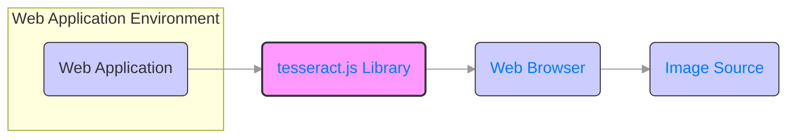
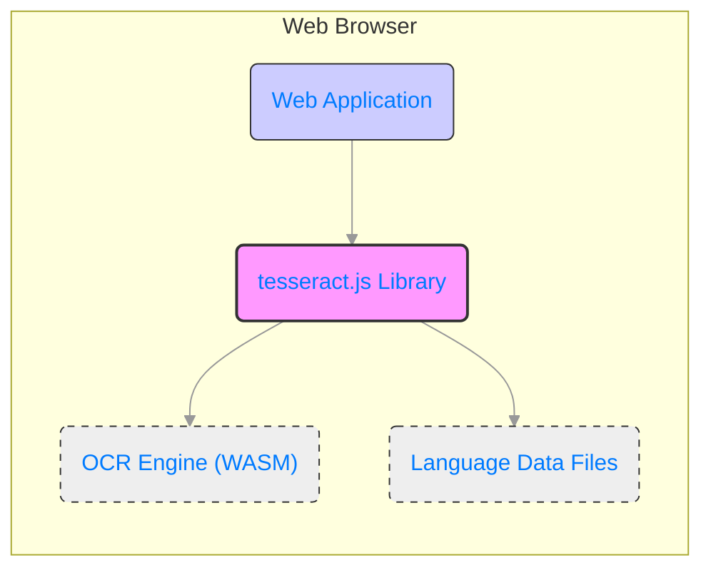
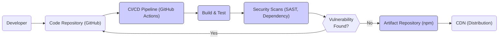

# BUSINESS POSTURE

This project, tesseract.js, aims to provide Optical Character Recognition (OCR) capabilities directly within web browsers. This eliminates the need for server-side OCR processing, offering benefits like reduced latency, offline functionality, and potentially lower infrastructure costs for applications that require client-side OCR.

Business Priorities and Goals:
- Enable client-side OCR functionality for web applications.
- Provide an easy-to-integrate JavaScript library for OCR.
- Offer a performant and reasonably accurate OCR solution in the browser environment.
- Reduce reliance on server-side OCR services for certain use cases.

Business Risks:
- Data privacy concerns related to processing potentially sensitive image data within the user's browser.
- Accuracy limitations of client-side OCR compared to more powerful server-side solutions.
- Performance impact on client devices, especially lower-powered ones.
- Security vulnerabilities within the tesseract.js library itself, potentially exposing user data or devices.
- Dependence on browser capabilities and compatibility across different browsers and versions.

# SECURITY POSTURE

Security Controls:
- security control: Open Source Project - The project is open source, allowing for community review and scrutiny of the code. Implemented: GITHUB REPOSITORY.
- security control: Publicly Available Code - The source code is publicly accessible on GitHub, promoting transparency. Implemented: GITHUB REPOSITORY.
- security control: npm Package - Distributed as an npm package, leveraging the npm ecosystem for distribution and versioning. Implemented: NPM REGISTRY.

Accepted Risks:
- accepted risk: Client-Side Processing - Image processing happens within the user's browser, which inherently carries some level of risk as the execution environment is less controlled than a server environment.
- accepted risk: Dependency on Browser Security - Relies on the security features and policies of web browsers to protect user data and the execution environment.

Recommended Security Controls:
- recommended security control: Dependency Scanning - Implement automated dependency scanning to identify and address known vulnerabilities in third-party libraries used by tesseract.js.
- recommended security control: Static Application Security Testing (SAST) - Integrate SAST tools into the development pipeline to automatically analyze the tesseract.js codebase for potential security flaws.
- recommended security control: Input Validation Guidance - Provide clear documentation and best practices for developers on how to properly handle and validate image inputs to prevent potential injection attacks or unexpected behavior.
- recommended security control: Security Audits - Conduct periodic security audits by security experts to identify and remediate potential vulnerabilities in the library.

Security Requirements:
- Authentication: Not directly applicable as tesseract.js is a client-side library and does not handle user authentication itself. Applications using tesseract.js will need to implement their own authentication mechanisms if required.
- Authorization: Not directly applicable to tesseract.js library itself. Authorization will be the responsibility of the web application integrating tesseract.js to control access to OCR functionality and processed data.
- Input Validation: Crucial for tesseract.js. The library needs to be robust against malformed or malicious image inputs to prevent crashes, unexpected behavior, or potential security exploits. Input validation should be performed on image data before processing.
- Cryptography: While not directly core to OCR functionality, cryptography might be relevant if tesseract.js is used in contexts where processed text or intermediate data needs to be protected. Consider if encryption is needed for sensitive data handling within applications using tesseract.js, but this is likely outside the scope of the library itself.

# DESIGN

## C4 CONTEXT



Context Diagram Elements:

- Element:
    - Name: Web Application
    - Type: Software System
    - Description: The web application that integrates the tesseract.js library to provide OCR functionality to its users.
    - Responsibilities:
        - Provides user interface for interacting with OCR functionality.
        - Handles image input from users or other sources.
        - Integrates tesseract.js library.
        - Processes and utilizes OCR output.
        - Implements application-level security controls (authentication, authorization, etc.).
    - Security controls:
        - security control: Web Application Security - Standard web application security practices, including input validation, output encoding, authentication, authorization, and protection against common web vulnerabilities (OWASP guidelines). Implemented: WEB APPLICATION CODE.

- Element:
    - Name: tesseract.js Library
    - Type: Software System
    - Description: The tesseract.js JavaScript library that performs OCR on images within the web browser.
    - Responsibilities:
        - Receives image data from the web application.
        - Performs OCR processing on the image data using its internal algorithms and models.
        - Returns the extracted text to the web application.
    - Security controls:
        - security control: Input Validation - Validates image inputs to prevent unexpected behavior or vulnerabilities. Implemented: TESSERACT.JS CODE.
        - security control: Memory Management - Manages memory effectively to prevent memory leaks or buffer overflows during image processing. Implemented: TESSERACT.JS CODE.

- Element:
    - Name: Web Browser
    - Type: Container
    - Description: The user's web browser environment where the web application and tesseract.js library execute.
    - Responsibilities:
        - Executes JavaScript code of the web application and tesseract.js.
        - Provides access to browser APIs (e.g., Canvas, WebAssembly).
        - Enforces browser security policies and sandboxing.
    - Security controls:
        - security control: Browser Security Policies - Relies on browser-enforced security policies such as Same-Origin Policy, Content Security Policy (CSP), and sandboxing to isolate web application code and protect user data. Implemented: WEB BROWSER.
        - security control: Regular Browser Updates - Users are expected to keep their web browsers updated to benefit from the latest security patches and features. Implemented: USER RESPONSIBILITY.

- Element:
    - Name: Image Source
    - Type: External System
    - Description: The source of images that are processed by tesseract.js. This could be user uploads, images from webcams, or images fetched from remote URLs.
    - Responsibilities:
        - Provides image data to the web application.
    - Security controls:
        - security control: Input Validation at Source (if applicable) - If the image source is external and controllable, input validation at the source can help prevent malicious images from reaching the web application. Implemented: EXTERNAL SYSTEM (if applicable).

## C4 CONTAINER



Container Diagram Elements:

- Element:
    - Name: Web Application
    - Type: Web Application
    - Description: The main web application code, typically written in JavaScript, HTML, and CSS, that utilizes the tesseract.js library.
    - Responsibilities:
        - User interface rendering and interaction.
        - Handling user input and image selection.
        - Calling tesseract.js API to perform OCR.
        - Displaying OCR results to the user.
    - Security controls:
        - security control: Web Application Security - Standard web application security practices (as described in Context Diagram). Implemented: WEB APPLICATION CODE.
        - security control: Input Sanitization - Sanitizing user inputs and OCR results before displaying them to prevent XSS vulnerabilities. Implemented: WEB APPLICATION CODE.

- Element:
    - Name: tesseract.js Library
    - Type: JavaScript Library
    - Description: The core tesseract.js library, written in JavaScript, which acts as a wrapper and interface to the underlying OCR engine.
    - Responsibilities:
        - Provides a JavaScript API for web applications to use OCR functionality.
        - Loads and manages the OCR engine (WebAssembly module).
        - Loads and manages language data files.
        - Handles communication between the web application and the OCR engine.
        - Implements core OCR logic in JavaScript (pre-processing, post-processing).
    - Security controls:
        - security control: Input Validation - Validates image inputs received from the web application. Implemented: TESSERACT.JS CODE.
        - security control: Secure Coding Practices - Follows secure coding practices to minimize vulnerabilities in the JavaScript code. Implemented: TESSERACT.JS CODE.

- Element:
    - Name: OCR Engine (WASM)
    - Type: WebAssembly Module
    - Description: The compiled WebAssembly module of the Tesseract OCR engine (likely based on the original Tesseract C++ engine).
    - Responsibilities:
        - Performs the computationally intensive OCR processing on image data.
        - Implements the core OCR algorithms.
    - Security controls:
        - security control: WebAssembly Security - Relies on the security features of WebAssembly and the browser's WebAssembly runtime environment. Implemented: WEB BROWSER / WASM RUNTIME.
        - security control: Memory Safety (WASM) - WebAssembly's memory-safe nature helps prevent certain types of memory-related vulnerabilities. Implemented: WASM ARCHITECTURE.

- Element:
    - Name: Language Data Files
    - Type: Data Files
    - Description: Data files containing language-specific data required for OCR, such as trained models and dictionaries.
    - Responsibilities:
        - Provide language-specific data for the OCR engine to accurately recognize characters.
    - Security controls:
        - security control: Data Integrity - Ensure the integrity and authenticity of language data files to prevent malicious data injection. Implemented: BUILD PROCESS, DISTRIBUTION MECHANISM (e.g., CDN).

## DEPLOYMENT

Deployment Environment: Web Browsers

Deployment Diagram:

```mermaid
flowchart LR
    subgraph "User Device"
        A("Web Browser Instance")
        subgraph "Browser Environment"
            B("Web Application Code")
            C("tesseract.js Library")
            D("OCR Engine (WASM)")
            E("Language Data Files")
        end
    end
    F("Image Source")

    A --> F:::accesses
    A --> B:::executes
    A --> C:::executes
    A --> D:::executes
    A --> E:::loads

    classDef browser_instance stroke:#007bff,stroke-width:2px,color:#007bff
    classDef browser_env stroke-dasharray: 5 5

    style A fill:#ccf,stroke:#333,stroke-width:1px
    style B fill:#ccf,stroke:#333,stroke-width:1px
    style C fill:#f9f,stroke:#333,stroke-width:2px
    style D fill:#eee,stroke:#333,stroke-width:1px
    style E fill:#eee,stroke:#333,stroke-width:1px
    style "User Device" fill:#eee,stroke:#333,stroke-width:1px

    linkStyle 0,1,2,3,4 stroke:#999,stroke-width:1px,dasharray:5 5
```

Deployment Diagram Elements:

- Element:
    - Name: Web Browser Instance
    - Type: Software Instance
    - Description: A running instance of a web browser (e.g., Chrome, Firefox, Safari) on a user's device.
    - Responsibilities:
        - Provides the runtime environment for the web application and tesseract.js.
        - Manages resources (CPU, memory, network) for the web application.
        - Enforces security policies and sandboxing.
    - Security controls:
        - security control: Browser Security Features - Leverages built-in browser security features (as described in Context Diagram). Implemented: WEB BROWSER.
        - security control: Operating System Security - Relies on the security of the underlying operating system of the user's device. Implemented: OPERATING SYSTEM.

- Element:
    - Name: Web Application Code
    - Type: Software Artifact
    - Description: The HTML, CSS, and JavaScript files that constitute the web application.
    - Responsibilities:
        - Client-side application logic and user interface.
    - Security controls:
        - security control: Secure Coding Practices - Follows secure coding practices in the web application code. Implemented: WEB APPLICATION DEVELOPMENT PROCESS.

- Element:
    - Name: tesseract.js Library
    - Type: Software Artifact
    - Description: The JavaScript files of the tesseract.js library.
    - Responsibilities:
        - Client-side OCR library logic.
    - Security controls:
        - security control: Secure Build Pipeline - Built and distributed through a secure build pipeline (see Build section). Implemented: BUILD PROCESS.

- Element:
    - Name: OCR Engine (WASM)
    - Type: Software Artifact
    - Description: The WebAssembly file containing the compiled OCR engine.
    - Responsibilities:
        - Core OCR processing logic.
    - Security controls:
        - security control: Secure Build Pipeline - Built and distributed through a secure build pipeline (see Build section). Implemented: BUILD PROCESS.

- Element:
    - Name: Language Data Files
    - Type: Data Artifacts
    - Description: The language data files required for OCR.
    - Responsibilities:
        - Language-specific data for OCR.
    - Security controls:
        - security control: Secure Distribution - Distributed securely, potentially via CDN with integrity checks. Implemented: DISTRIBUTION INFRASTRUCTURE.

- Element:
    - Name: Image Source
    - Type: External Entity
    - Description: The source from which images are obtained for OCR processing.
    - Responsibilities:
        - Providing image data.
    - Security controls:
        - security control: Secure Image Retrieval (if applicable) - If images are fetched from remote sources, secure protocols (HTTPS) should be used. Implemented: WEB APPLICATION CODE.

## BUILD

Build Process Diagram:



Build Process Description:

1. Developer: Developers write and modify the tesseract.js code.
2. Code Repository (GitHub): Code is stored and version controlled in a GitHub repository.
3. CI/CD Pipeline (GitHub Actions): GitHub Actions is used for Continuous Integration and Continuous Delivery.
4. Build & Test: The CI/CD pipeline automatically builds the tesseract.js library and runs automated tests.
5. Security Scans (SAST, Dependency): Automated security scans are performed, including Static Application Security Testing (SAST) and dependency vulnerability scanning.
6. Vulnerability Check: The pipeline checks for vulnerabilities identified by security scans. If vulnerabilities are found, the build process fails, and developers need to address them.
7. Artifact Repository (npm): If no critical vulnerabilities are found, the built artifacts (JavaScript library, WASM module, data files) are published to the npm registry.
8. CDN (Distribution): npm registry makes the tesseract.js library available for distribution via Content Delivery Networks (CDNs).

Build Process Security Controls:

- security control: Secure Code Repository (GitHub) - Using GitHub with access controls and audit logs to protect the source code. Implemented: GITHUB.
- security control: Automated CI/CD Pipeline (GitHub Actions) - Automating the build and deployment process to ensure consistency and reduce manual errors. Implemented: GITHUB ACTIONS.
- security control: Static Application Security Testing (SAST) - Integrating SAST tools to automatically analyze the code for potential security vulnerabilities during the build process. Implemented: CI/CD PIPELINE.
- security control: Dependency Scanning - Using dependency scanning tools to identify and alert on known vulnerabilities in third-party dependencies. Implemented: CI/CD PIPELINE.
- security control: Automated Testing - Running automated unit and integration tests to ensure code quality and catch regressions. Implemented: CI/CD PIPELINE.
- security control: Code Review - Implementing code review processes to have multiple developers review code changes before merging. Implemented: DEVELOPMENT PROCESS.
- security control: Secure Artifact Repository (npm) - Publishing build artifacts to a secure and reputable artifact repository like npm. Implemented: NPM REGISTRY.
- security control: Signed Releases - Consider signing releases to ensure authenticity and integrity of the distributed library. Implemented: BUILD PROCESS (TO BE IMPLEMENTED).

# RISK ASSESSMENT

Critical Business Processes:
- Providing client-side OCR functionality to web applications.
- Maintaining the usability and performance of web applications that rely on tesseract.js.
- Protecting the reputation and trust associated with the tesseract.js project and its maintainers.

Data to Protect:
- User Images: Images processed by tesseract.js may contain sensitive information (personal data, financial documents, etc.).
    - Sensitivity: Medium to High, depending on the context and content of the images.
- OCR Output (Extracted Text): The extracted text might also contain sensitive information derived from the images.
    - Sensitivity: Medium to High, depending on the context and content of the images.
- Language Data Files: Integrity of language data files is important for OCR accuracy and preventing malicious data injection.
    - Sensitivity: Low to Medium (Integrity is more important than confidentiality).
- Source Code: Confidentiality and integrity of the source code are important to prevent unauthorized modifications or exposure of vulnerabilities.
    - Sensitivity: Medium (Integrity and Availability are key).

# QUESTIONS & ASSUMPTIONS

Questions:
- What is the risk appetite of the target audience for applications using tesseract.js? (e.g., startups vs. large enterprises)
- Are there specific use cases or industries that are particularly targeted for tesseract.js usage?
- Are there any specific regulatory compliance requirements that applications using tesseract.js need to adhere to (e.g., GDPR, HIPAA)?
- What is the expected level of security expertise of developers who will be integrating tesseract.js into their applications?
- Are there any specific performance requirements or constraints for tesseract.js in different deployment scenarios?

Assumptions:
- BUSINESS POSTURE: The primary business goal is to provide a widely accessible and easy-to-use client-side OCR library for general web application use cases.
- SECURITY POSTURE: Security is a significant concern, but the project operates with the inherent risks of client-side processing and reliance on browser security. The project aims to implement reasonable security controls within the library and provide guidance to developers.
- DESIGN: The architecture is primarily client-side, leveraging JavaScript and WebAssembly within web browsers. The build process involves standard web development practices and CI/CD pipelines.