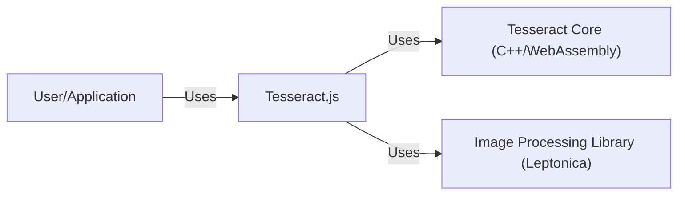
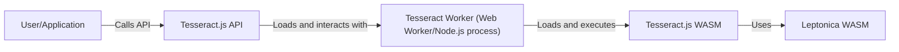
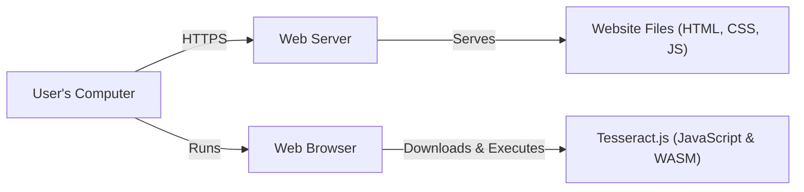
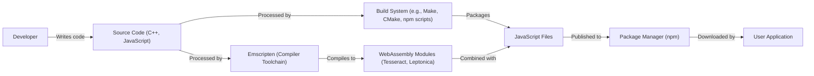

# Project Design Document: Tesseract.js

## BUSINESS POSTURE

Tesseract.js is a pure JavaScript Optical Character Recognition (OCR) engine that works in the browser and with Node.js. It supports over 100 languages, automatic text orientation and script detection, and can handle various image formats. The project is open-source and widely used, indicating a community-driven development model.

Business Priorities and Goals:

*   Accessibility: Enable text extraction from images, making information accessible to a wider audience, including visually impaired users and applications requiring text-based data from images.
*   Ease of Use: Provide a simple and intuitive API for developers to integrate OCR functionality into their applications without requiring specialized knowledge or infrastructure.
*   Versatility: Support a wide range of languages, image formats, and use cases, making it a flexible solution for various OCR needs.
*   Community-Driven Development: Maintain an active open-source community to ensure continuous improvement, bug fixes, and feature additions.
*   Cost-Effectiveness: Offer a free and open-source solution, eliminating the need for expensive OCR software or services.

Business Risks:

*   Accuracy and Reliability: Inaccurate OCR results can lead to misinformation and user frustration. The system must strive for high accuracy and provide confidence levels for extracted text.
*   Performance: OCR processing can be computationally intensive. The system must be optimized for performance to avoid slow processing times and excessive resource consumption.
*   Security: Maliciously crafted images could potentially exploit vulnerabilities in the underlying image processing libraries or the JavaScript engine.
*   Maintenance and Support: As an open-source project, ensuring long-term maintenance and support can be challenging, relying on community contributions and potentially requiring dedicated maintainers.
*   Legal and Compliance: Depending on the use case, there might be legal or compliance requirements related to data privacy, copyright, and the processing of sensitive information extracted from images.

## SECURITY POSTURE

Existing Security Controls:

*   security control: Input Validation: The library likely performs some level of input validation to handle different image formats and prevent processing of invalid or corrupted images. (Implementation details are within the Tesseract.js and its dependencies' codebases).
*   security control: Sandboxing: When used in a browser environment, Tesseract.js runs within the browser's JavaScript sandbox, which provides some level of isolation and prevents access to the underlying operating system.
*   security control: Dependency Management: The project uses package managers (like npm) to manage dependencies, allowing for updates and security patches to be applied. (Described in package.json and package-lock.json).
*   security control: Community Scrutiny: Being an open-source project, the codebase is subject to public scrutiny, which can help identify and address potential security vulnerabilities.

Accepted Risks:

*   accepted risk: Reliance on Third-Party Libraries: Tesseract.js relies on external libraries (like Leptonica and Tesseract's C++ core) for image processing and OCR, inheriting any potential vulnerabilities in those libraries.
*   accepted risk: Limited Control over Execution Environment: When used in a browser, the security of Tesseract.js is partially dependent on the browser's security mechanisms and the user's security practices.
*   accepted risk: Potential for Denial of Service: Processing large or complex images can consume significant resources, potentially leading to denial-of-service (DoS) if not properly managed.

Recommended Security Controls:

*   security control: Regular Security Audits: Conduct periodic security audits of the codebase and its dependencies to identify and address potential vulnerabilities.
*   security control: Content Security Policy (CSP): When used in a web application, implement a strong CSP to mitigate the risk of cross-site scripting (XSS) and other code injection attacks.
*   security control: Input Sanitization and Size Limits: Implement strict input sanitization and size limits to prevent maliciously crafted images from exploiting vulnerabilities or causing excessive resource consumption.
*   security control: Consider WebAssembly Security: Since Tesseract.js uses WebAssembly, ensure that the WebAssembly runtime is configured securely and that the compiled code is validated.

Security Requirements:

*   Authentication: Not directly applicable, as Tesseract.js is a library, not a service requiring authentication.
*   Authorization: Not directly applicable, as Tesseract.js does not manage access control. Authorization would be the responsibility of the application using the library.
*   Input Validation:
    *   Validate image format and size.
    *   Sanitize input data to prevent code injection or other attacks.
    *   Handle invalid or corrupted images gracefully.
*   Cryptography: Not directly applicable, as Tesseract.js does not handle encryption or cryptographic operations. If the application using Tesseract.js requires cryptography, it should be implemented separately.

## DESIGN

### C4 CONTEXT

Element Descriptions:

*   Element:
    *   Name: User/Application
    *   Type: User/External System
    *   Description: Represents a user or an application that utilizes Tesseract.js for OCR functionality.
    *   Responsibilities: Provides images as input to Tesseract.js and receives extracted text as output.
    *   Security controls: Implements appropriate security measures for handling user input and protecting sensitive data.

*   Element:
    *   Name: Tesseract.js
    *   Type: Software System
    *   Description: The JavaScript library that provides a high-level API for interacting with the Tesseract OCR engine.
    *   Responsibilities: Handles image loading, processing, and communication with the Tesseract Core. Provides a user-friendly API for developers.
    *   Security controls: Input validation, sandboxing (in browser environment), dependency management.

*   Element:
    *   Name: Tesseract Core (C++/WebAssembly)
    *   Type: External Library
    *   Description: The core OCR engine, written in C++ and compiled to WebAssembly for use in web browsers.
    *   Responsibilities: Performs the actual OCR processing, including text recognition and layout analysis.
    *   Security controls: Relies on the security of the C++ codebase and the WebAssembly runtime.

*   Element:
    *   Name: Image Processing Library (Leptonica)
    *   Type: External Library
    *   Description: A library used for image processing and manipulation, often used in conjunction with Tesseract.
    *   Responsibilities: Provides functions for image format conversion, preprocessing, and other image-related tasks.
    *   Security controls: Relies on the security of the Leptonica codebase.

### C4 CONTAINER

Element Descriptions:

*   Element:
    *   Name: User/Application
    *   Type: User/External System
    *   Description: Represents a user or an application that utilizes Tesseract.js for OCR functionality.
    *   Responsibilities: Provides images as input to Tesseract.js and receives extracted text as output.
    *   Security controls: Implements appropriate security measures for handling user input and protecting sensitive data.

*   Element:
    *   Name: Tesseract.js API
    *   Type: API
    *   Description: The JavaScript API exposed by Tesseract.js for developers to interact with the library.
    *   Responsibilities: Provides functions for initializing Tesseract, loading images, configuring OCR settings, and retrieving results.
    *   Security controls: Input validation.

*   Element:
    *   Name: Tesseract Worker (Web Worker/Node.js process)
    *   Type: Process
    *   Description: A separate process (Web Worker in the browser, or a child process in Node.js) that handles the OCR processing to avoid blocking the main thread.
    *   Responsibilities: Loads the Tesseract.js WASM module, manages communication with the main thread, and handles OCR requests.
    *   Security controls: Sandboxing (Web Worker), process isolation.

*   Element:
    *   Name: Tesseract.js WASM
    *   Type: WebAssembly Module
    *   Description: The Tesseract OCR engine compiled to WebAssembly.
    *   Responsibilities: Performs the core OCR processing.
    *   Security controls: Relies on the security of the WebAssembly runtime and the compiled C++ code.

*   Element:
    *   Name: Leptonica WASM
    *   Type: WebAssembly Module
    *   Description: The Leptonica image processing library compiled to WebAssembly.
    *   Responsibilities: Provides image processing functions used by Tesseract.js WASM.
    *   Security controls: Relies on the security of the WebAssembly runtime and the compiled C++ code.

### DEPLOYMENT

Possible Deployment Solutions:

1.  Browser-based Web Application: Tesseract.js is loaded directly into the user's web browser via a `<script>` tag or as a module.
2.  Node.js Server-side Application: Tesseract.js is installed as a Node.js package and used on a server to process images.
3.  Hybrid Approach: A combination of browser-based and server-side processing, where some OCR tasks are offloaded to the server.

Chosen Deployment Solution (Browser-based Web Application):

Element Descriptions:

*   Element:
    *   Name: User's Computer
    *   Type: Device
    *   Description: The user's computer, where the web browser is running.
    *   Responsibilities: Runs the web browser and executes the JavaScript code.
    *   Security controls: Operating system security, browser security, user security practices.

*   Element:
    *   Name: Web Server
    *   Type: Server
    *   Description: The server that hosts the website files.
    *   Responsibilities: Serves the website files to the user's browser.
    *   Security controls: Server security, HTTPS, firewall.

*   Element:
    *   Name: Web Browser
    *   Type: Application
    *   Description: The user's web browser (e.g., Chrome, Firefox, Safari).
    *   Responsibilities: Downloads and executes the website files, including Tesseract.js.
    *   Security controls: Browser security features, sandboxing, CSP.

*   Element:
    *   Name: Tesseract.js (JavaScript & WASM)
    *   Type: Library
    *   Description: The Tesseract.js library, including the JavaScript code and the WebAssembly module.
    *   Responsibilities: Performs OCR processing within the browser.
    *   Security controls: Input validation, sandboxing, reliance on browser security.

*   Element:
    *   Name: Website Files (HTML, CSS, JS)
    *   Type: Files
    *   Description: The files that make up the website, including the HTML, CSS, and JavaScript code.
    *   Responsibilities: Provide the structure, styling, and functionality of the website.
    *   Security controls: Secure coding practices, CSP.

### BUILD

The build process for Tesseract.js involves compiling the C++ code of Tesseract and Leptonica into WebAssembly, and then packaging the JavaScript wrapper and the WebAssembly modules for distribution.

Security Controls in Build Process:

*   security control: Dependency Management: The build process uses npm to manage dependencies, allowing for updates and security patches.
*   security control: Static Analysis: Linters and static analysis tools can be integrated into the build process to identify potential code quality and security issues. (e.g., ESLint). This is hinted at in the "lint" scripts in package.json.
*   security control: Build Automation: The build process is automated using scripts (e.g., npm scripts), reducing the risk of manual errors and ensuring consistency.
*   security control: Supply Chain Security: While not explicitly mentioned, using a package manager like npm introduces a supply chain risk. Measures like verifying package integrity and using trusted sources can mitigate this risk.

## RISK ASSESSMENT

Critical Business Processes:

*   Text extraction from images for accessibility.
*   Data extraction from images for various applications.
*   Enabling OCR functionality in web and Node.js applications.

Data Sensitivity:

*   The sensitivity of the data depends on the content of the images being processed. Images may contain:
    *   No sensitive data.
    *   Personally Identifiable Information (PII).
    *   Protected Health Information (PHI).
    *   Financial data.
    *   Proprietary or confidential information.
*   The system itself does not store the images or the extracted text persistently. The responsibility for data protection lies with the application using Tesseract.js.

## QUESTIONS & ASSUMPTIONS

Questions:

*   Are there any specific compliance requirements (e.g., GDPR, HIPAA) that need to be considered for applications using Tesseract.js?
*   What are the expected performance requirements (e.g., processing time per image, number of concurrent requests)?
*   What level of accuracy is required for the OCR results?
*   Are there any specific image formats or languages that need to be prioritized?
*   What is the process for reporting and addressing security vulnerabilities?

Assumptions:

*   BUSINESS POSTURE: The primary goal is to provide a free, open-source, and versatile OCR solution.
*   SECURITY POSTURE: The project relies on community contributions for security audits and updates. The user application is responsible for securing any sensitive data processed by Tesseract.js.
*   DESIGN: The deployment model will primarily be browser-based, with Node.js support as a secondary option. The build process is automated and uses standard tools.