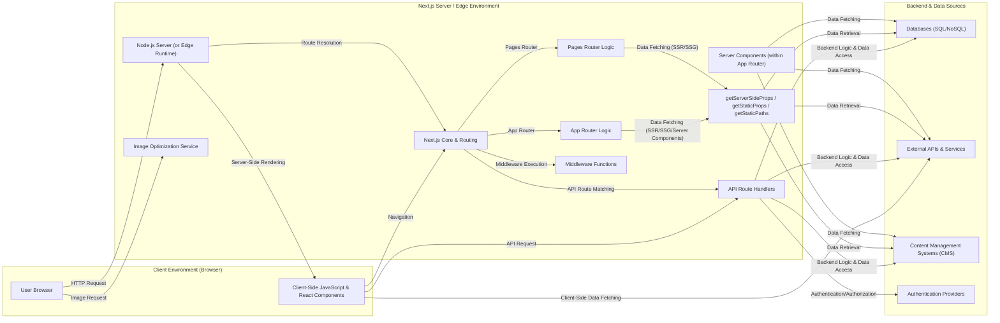

## Project Design Document: Next.js Framework (Improved)

**1. Introduction**

This document provides an enhanced architectural overview of the Next.js framework, a popular React framework for building performant and scalable web applications. This document is specifically designed to serve as a robust foundation for subsequent threat modeling activities. It details the key components, data flows, and interactions within a typical Next.js application, with a focus on security-relevant aspects.

**2. Goals**

* Provide a clear, comprehensive, and security-focused description of the Next.js architecture.
* Identify the major components and their responsibilities, emphasizing their role in the application's security posture.
* Illustrate the various data flows within a Next.js application, highlighting potential points of vulnerability.
* Detail key interactions and processes relevant to security considerations and threat modeling.
* Serve as a definitive reference for security assessments and mitigation strategies.

**3. Architectural Overview**

Next.js is a versatile full-stack framework built upon React, enabling the development of diverse web applications, including server-rendered applications, static websites, and robust API endpoints. The core architecture orchestrates a blend of client-side and server-side processes, with optional edge computing capabilities. Understanding these distinct execution environments is crucial for security analysis.

**4. Key Components**

* **React Components:** Reusable and composable building blocks for constructing the user interface. These components handle rendering UI elements, managing state, and responding to user interactions. Security considerations include protection against XSS vulnerabilities.
* **Pages Router (`pages` directory):** A file-system based routing mechanism where files within the `pages` directory automatically define application routes. Security implications involve controlling access to specific routes and protecting against unauthorized navigation.
* **App Router (`app` directory - Experimental):** A more advanced routing system offering features like layouts, server components, and streaming. Security considerations are similar to the Pages Router but with added complexity due to server components and potential data exposure during streaming.
* **Server Components (within `app`):** React components that execute exclusively on the server. They can directly access backend resources and are crucial for data fetching and server-side logic. Security is paramount here, as vulnerabilities can expose sensitive data or backend systems.
* **Client Components (within `app` or `pages`):** Traditional React components that execute in the user's browser. They handle user interactions and dynamic updates. Security concerns primarily revolve around XSS and client-side data handling.
* **API Routes (`pages/api` or `app/api`):** Serverless functions defined within specific directories, allowing developers to create backend endpoints directly within the Next.js application. These are critical attack vectors and require careful security considerations, including input validation, authorization, and protection against injection attacks.
* **Middleware:** Functions that execute before a request is handled by the routes. They enable cross-cutting concerns like authentication, authorization, redirection, and request modification. Secure implementation of middleware is vital for enforcing security policies.
* **Next.js Core:** The underlying framework logic responsible for routing, rendering strategies (SSR, SSG, ISR), build processes, and overall application lifecycle management. Security vulnerabilities within the core framework itself are rare but can have significant impact.
* **Node.js Server:** The runtime environment for server-side rendering, API routes (when not using edge functions), and middleware execution. Security hardening of the Node.js environment is essential.
* **Edge Functions (Optional):** Serverless functions that run on edge infrastructure (e.g., Vercel Edge Network, Cloudflare Workers) for low latency and improved performance. Security considerations include the specific edge environment's security model and potential cold start vulnerabilities.
* **Image Optimization (`next/image`):** Built-in functionality for optimizing images for different devices and screen sizes. Security concerns involve preventing denial-of-service through excessive image requests or manipulation.
* **Client-Side JavaScript:** The JavaScript code executed in the user's browser, responsible for interactivity and dynamic updates. Security focuses on preventing XSS and ensuring secure handling of user data.
* **Build Process:** The process of compiling, optimizing, and bundling the application for deployment. Security considerations include supply chain security and preventing the inclusion of sensitive information in the build artifacts.

**5. Data Flow**

The data flow in a Next.js application is dynamic and depends on the rendering strategy and the specific features being utilized. Understanding these flows is crucial for identifying potential data breaches or manipulation points.

* **Initial Page Load (Server-Side Rendering - SSR):**
    * User initiates a request for a page via their browser.
    * The request is received by the Next.js server (or an edge function).
    * Next.js's routing mechanism determines the appropriate page component based on the requested URL.
    * If the page uses `getServerSideProps` (or data fetching within Server Components), this function executes on the server to fetch necessary data from databases, APIs, or other sources.
    * The designated React component is rendered into HTML on the server, incorporating the fetched data.
    * The server sends the fully rendered HTML to the user's browser.
    * The browser displays the initial HTML content.
    * React hydrates the HTML, attaching event listeners and making the page interactive. *Security Note: Ensure sensitive data is not inadvertently exposed during server-side rendering.*

* **Client-Side Navigation (within the application):**
    * User navigates to a different page within the application by clicking a link or triggering a programmatic navigation.
    * Next.js intercepts the navigation request.
    * The necessary page component (and its associated JavaScript) is fetched from the server (if not already loaded).
    * The new page is rendered directly in the browser, updating the DOM without a full page reload. *Security Note: Client-side routing should still respect access controls and authorization rules.*

* **API Route Request:**
    * Client-side JavaScript (or an external service) sends an HTTP request to a defined API route (e.g., `/api/users`).
    * The request is routed to the corresponding serverless function defined in the `pages/api` or `app/api` directory.
    * The serverless function executes, potentially interacting with databases, external APIs, or other backend services to process the request. *Security Note: API routes are prime targets for attacks. Implement robust input validation, authorization, and protection against common web vulnerabilities.*
    * The serverless function returns a response (e.g., JSON data, status code) to the client.

* **Static Site Generation (SSG):**
    * During the build process, Next.js pre-renders specific pages to static HTML files. This is often used for content-heavy pages that don't require frequent updates.
    * When a user requests a statically generated page, the pre-rendered HTML file is served directly from the server or a CDN. *Security Note: Ensure that any data used during the build process is secure and doesn't expose sensitive information in the static files.*
    * Client-side JavaScript can still hydrate the page to add interactivity.

* **Incremental Static Regeneration (ISR):**
    * Similar to SSG, but allows for re-generation of static pages at specified intervals or on-demand.
    * The first request after a revalidation period will serve the existing static content while triggering a background regeneration. Subsequent requests will receive the updated content. *Security Note: Consider the security implications of stale data and the potential for race conditions during regeneration.*

* **Data Fetching (Client-Side):**
    * React components can fetch data directly from external APIs or internal endpoints using techniques like `fetch` or libraries like `axios`. This is common for dynamic content updates after the initial page load. *Security Note: Be mindful of exposing API keys or sensitive information in client-side code and implement proper error handling.*

**6. Architecture Diagram**

**7. Key Interactions and Processes (Security Focused)**

* **Routing and Access Control:** Next.js's routing mechanisms define the application's accessible endpoints. Securely configuring routing and implementing proper authorization checks (e.g., using middleware) is crucial to prevent unauthorized access to sensitive pages or functionalities.
* **Rendering and Data Exposure:** The chosen rendering strategy (SSR, SSG, ISR) impacts where and when data is rendered. Ensure that sensitive data is not inadvertently exposed in the HTML source code during server-side rendering or in statically generated files.
* **Data Fetching and Security:** Data fetching methods (`getServerSideProps`, `getStaticProps`, within Server Components) often involve interacting with backend systems. Secure these interactions by using parameterized queries, validating data sources, and protecting API keys or credentials.
* **API Handling and Vulnerability Mitigation:** API routes are critical entry points for potential attacks. Implement robust input validation, sanitize user inputs, protect against injection vulnerabilities (SQL, NoSQL, command injection), and enforce proper authentication and authorization for all API endpoints.
* **Middleware and Security Policies:** Middleware functions are essential for enforcing security policies like authentication, authorization, rate limiting, and request sanitization. Ensure middleware is correctly implemented and tested to prevent bypasses.
* **Build Process and Supply Chain Security:** The build process involves numerous dependencies. Regularly audit dependencies for known vulnerabilities and consider using tools to detect and prevent supply chain attacks. Avoid including sensitive information in the build output.
* **Client-Side Security:** Protect against client-side vulnerabilities like XSS by properly escaping user-generated content and using secure coding practices in React components. Be mindful of storing sensitive data in the browser's local storage or cookies.

**8. External Dependencies (Security Implications)**

The security of a Next.js application is also influenced by its external dependencies. Consider the following security implications:

* **React:** Regularly update React to benefit from security patches. Be aware of potential XSS vulnerabilities in community-developed components.
* **Node.js:** Keep Node.js updated with the latest security releases. Implement security best practices for Node.js applications.
* **npm or Yarn:** Be cautious of dependency vulnerabilities. Use tools like `npm audit` or `yarn audit` to identify and address known issues.
* **Cloud Providers:** Understand the security responsibilities shared with your cloud provider. Configure security settings appropriately (e.g., network security groups, IAM roles).
* **Databases:** Implement proper authentication, authorization, and data encryption for your databases. Protect against SQL injection or NoSQL injection vulnerabilities.
* **External APIs:** Secure communication with external APIs using HTTPS. Implement proper authentication and authorization mechanisms (e.g., API keys, OAuth). Be mindful of rate limiting and potential denial-of-service attacks.
* **Authentication Providers:** Choose reputable authentication providers and follow their security best practices. Securely handle authentication tokens and session management.
* **Content Management Systems (CMS):** Ensure your CMS is securely configured and updated. Be aware of potential vulnerabilities in CMS plugins or themes.

**9. Security Considerations (Detailed)**

This section expands on the high-level security considerations, providing more specific examples and potential attack vectors.

* **Cross-Site Scripting (XSS):**  Ensure proper sanitization and escaping of user-generated content to prevent injection of malicious scripts into the application's pages. This applies to both server-rendered and client-rendered content.
* **Cross-Site Request Forgery (CSRF):** Implement anti-CSRF tokens to protect against unauthorized actions performed on behalf of authenticated users.
* **Server-Side Request Forgery (SSRF):** Validate and sanitize URLs used in server-side requests to prevent attackers from making requests to internal or unintended external resources.
* **Injection Attacks (SQL, NoSQL, Command Injection):** Use parameterized queries or ORM/ODM features to prevent injection vulnerabilities when interacting with databases. Avoid executing arbitrary commands based on user input.
* **Authentication and Authorization Flaws:** Implement robust authentication mechanisms and enforce granular authorization rules to control access to resources and functionalities. Avoid relying solely on client-side checks.
* **Insecure Direct Object References (IDOR):** Implement proper authorization checks to prevent users from accessing resources they are not authorized to view or modify by manipulating object identifiers.
* **Security Misconfiguration:** Ensure proper configuration of the Next.js application, server environment, and cloud provider settings. Avoid exposing sensitive information through misconfigured headers or error messages.
* **Exposure of Sensitive Data:** Prevent the unintentional exposure of sensitive information in client-side code, server logs, error messages, or during server-side rendering.
* **Denial of Service (DoS):** Implement rate limiting and other measures to protect against attacks that aim to overwhelm the application with excessive requests.
* **Dependency Vulnerabilities:** Regularly scan and update dependencies to address known security vulnerabilities.
* **Supply Chain Attacks:** Be vigilant about the security of your development dependencies and build pipeline.

**10. Conclusion**

This improved design document provides a more detailed and security-focused overview of the Next.js framework. It highlights key components, data flows, and potential security considerations that are crucial for effective threat modeling. This document serves as a valuable resource for security assessments, vulnerability identification, and the development of appropriate mitigation strategies to build secure and resilient Next.js applications. The next step is to leverage this document to conduct a comprehensive threat modeling exercise, identifying specific threats and vulnerabilities within the context of a particular Next.js application.
