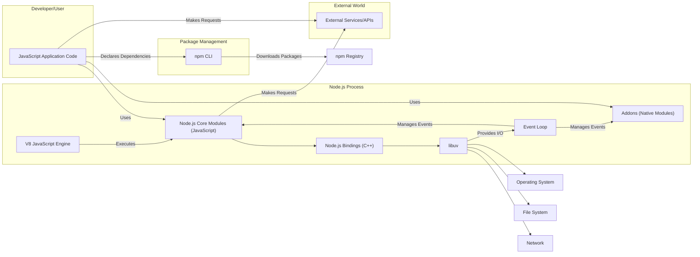
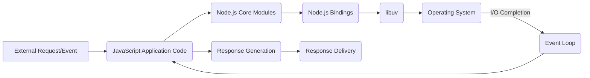

## Project Design Document: Node.js

**1. Introduction**

This document provides a high-level architectural overview of the Node.js project. It is intended to serve as a foundation for subsequent threat modeling activities, providing a clear understanding of the system's components, interactions, and data flow. This document focuses on the core aspects of Node.js relevant to security considerations.

**2. Project Overview**

Node.js is an open-source, cross-platform, back-end JavaScript runtime environment that executes JavaScript code outside of a web browser. It allows developers to use JavaScript for server-side scripting and to build scalable network applications. Node.js uses an event-driven, non-blocking I/O model that makes it lightweight and efficient, suitable for real-time applications.

**3. Goals**

* Provide a clear and concise architectural overview of Node.js.
* Identify key components and their interactions.
* Illustrate the flow of data within the system.
* Serve as a basis for identifying potential security vulnerabilities during threat modeling.

**4. Target Audience**

* Security engineers
* Developers
* Architects

**5. Architectural Overview**

Node.js architecture can be broadly divided into the following key components:

* **V8 JavaScript Engine:**  Developed by Google, V8 compiles and executes JavaScript code. It's responsible for the core JavaScript execution within the Node.js environment.
* **libuv:** A cross-platform support library that provides asynchronous I/O primitives, such as file system access, networking, and concurrency. It handles the event loop and manages the operating system interface.
* **Node.js Core Modules (JavaScript):**  A set of built-in modules written in JavaScript that provide essential functionalities like file system access (`fs`), networking (`net`, `http`), streams (`stream`), and more. These modules interact with libuv for underlying I/O operations.
* **Node.js Bindings (C++):**  C++ code that bridges the gap between the JavaScript core modules and the libuv library. These bindings expose libuv's functionalities to JavaScript.
* **Addons (Native Modules):**  Optional modules written in C or C++ that can be dynamically loaded into Node.js to provide access to system-level resources or performance-critical functionalities.
* **npm (Node Package Manager):**  A package manager for the Node.js ecosystem, allowing developers to easily install and manage dependencies. While not strictly part of the runtime, it's a crucial part of the development and deployment lifecycle.

**6. System Architecture Diagram**

**7. Data Flow**

The typical data flow within a Node.js application involves the following steps:

* **Request Initiation:** An external request (e.g., HTTP request) or an internal event triggers an action.
* **JavaScript Execution:** The request is handled by JavaScript code within the Node.js application.
* **Core Module Interaction:** The JavaScript code often interacts with Node.js core modules (e.g., `http`, `fs`).
* **Binding Invocation:** Core modules utilize C++ bindings to interact with libuv.
* **Asynchronous I/O:** libuv handles the underlying asynchronous I/O operations, interacting with the operating system kernel.
* **Event Loop Processing:** When an I/O operation completes, libuv places an event in the event queue. The event loop picks up the event and executes the associated callback function in the JavaScript code.
* **Response Generation:** The JavaScript code processes the results of the I/O operation and generates a response.
* **Response Delivery:** The response is sent back to the initiator (e.g., HTTP response sent to the client).

**Simplified Data Flow Diagram:**

**8. Key Components and their Responsibilities**

* **V8 JavaScript Engine:**
    * Compiles and executes JavaScript code.
    * Manages memory allocation for JavaScript objects.
    * Provides garbage collection.
* **libuv:**
    * Provides a consistent API for asynchronous I/O operations across different operating systems.
    * Manages the event loop, which is central to Node.js's non-blocking nature.
    * Handles thread pooling for certain blocking operations (e.g., file I/O on some platforms).
* **Node.js Core Modules:**
    * Offer high-level abstractions for common tasks like networking, file system access, and stream manipulation.
    * Provide a standard library for Node.js applications.
* **Node.js Bindings:**
    * Expose libuv's functionalities to JavaScript.
    * Handle the marshaling of data between JavaScript and C++.
* **Addons (Native Modules):**
    * Extend Node.js functionality with platform-specific or performance-critical code.
    * Can provide access to hardware or system-level APIs.
* **npm:**
    * Facilitates the discovery, installation, and management of third-party packages.
    * Manages project dependencies.

**9. Security Considerations (High-Level)**

This section provides a preliminary overview of security considerations. A more detailed analysis will be performed during the threat modeling phase.

* **Dependency Management:**  Vulnerabilities in third-party packages managed by npm can introduce security risks.
* **Native Addons:**  Malicious or poorly written native addons can potentially compromise the entire Node.js process.
* **Input Validation:**  Improper handling of user input can lead to various vulnerabilities, such as cross-site scripting (XSS) or injection attacks.
* **Denial of Service (DoS):**  The event-driven nature of Node.js requires careful handling of resource-intensive operations to prevent DoS attacks.
* **Cryptographic Operations:**  Secure implementation of cryptographic functions is crucial for protecting sensitive data.
* **Process Isolation:**  Node.js runs as a single process by default. Care must be taken to isolate sensitive operations or consider using worker threads or child processes for better isolation.
* **Permissions and Access Control:**  Properly managing file system permissions and network access is essential for security.

**10. Future Considerations**

* Detailed data flow diagrams for specific use cases.
* Identification of trust boundaries within the system.
* Mapping of components to potential threat actors and attack vectors.

This document serves as a starting point for understanding the architecture of Node.js for security analysis. The information presented here will be further elaborated upon during the threat modeling process.
