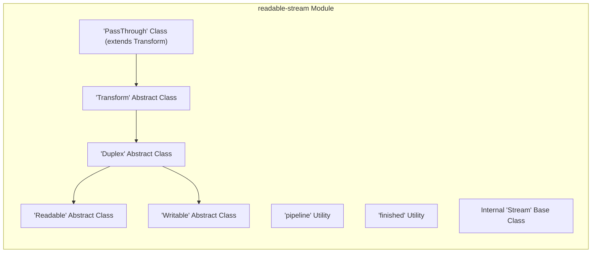
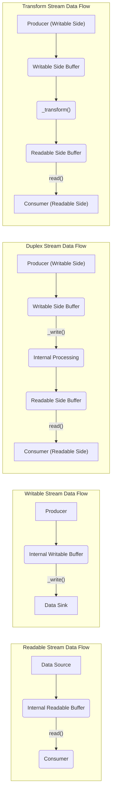

# Project Design Document: Node.js Readable Stream

**Version:** 1.1
**Date:** October 26, 2023
**Author:** AI Software Architect

## 1. Introduction

This document provides an enhanced design overview of the Node.js `readable-stream` module, located at [https://github.com/nodejs/readable-stream](https://github.com/nodejs/readable-stream). As a foundational component of Node.js, `readable-stream` provides the core abstractions for handling streaming data. This revised document aims to provide an even clearer and more detailed understanding of the module's architecture, components, and data flow, specifically tailored for subsequent threat modeling activities. A strong understanding of this design is crucial for identifying potential security vulnerabilities within the module itself and in systems that utilize it.

## 2. Goals and Objectives

The fundamental goal of the `readable-stream` module remains to offer a robust and consistent API for managing streaming data within Node.js. Key objectives include:

*   Defining and implementing abstract base classes for `Readable`, `Writable`, `Duplex`, and `Transform` streams.
*   Enabling efficient processing of large datasets with minimal memory overhead.
*   Providing a flexible framework for developers to create custom stream implementations tailored to specific needs.
*   Ensuring seamless interoperability between various stream implementations, regardless of their underlying data sources or sinks.
*   Implementing robust backpressure mechanisms to prevent data producers from overwhelming consumers, ensuring application stability.

## 3. Architectural Overview

The `readable-stream` module's architecture revolves around a hierarchy of abstract classes that define the behavior of different types of streams. These classes provide a common interface and set of functionalities for interacting with streaming data.

**Key Components:**

*   **`Readable` Abstract Class:**  The foundation for streams that act as data sources. Implementations are responsible for providing the `_read()` method to fetch data. It manages internal buffering and state related to data availability.
*   **`Writable` Abstract Class:**  The foundation for streams that act as data destinations. Implementations must provide the `_write()` method to handle incoming data. It manages internal buffering and backpressure signaling.
*   **`Duplex` Abstract Class:**  Combines the functionalities of both `Readable` and `Writable` streams, allowing data to flow in both directions. Implementations need to provide both `_read()` and `_write()` methods.
*   **`Transform` Abstract Class:** A specialized type of `Duplex` stream where data written to the stream is transformed before being made available for reading. Implementations provide a `_transform()` method to perform the data transformation.
*   **`PassThrough` Class:** A concrete implementation of `Transform` that simply passes all input data directly to the output without modification. Useful for basic stream piping.
*   **`pipeline` Utility:** A higher-order function designed to simplify the process of connecting multiple streams together. It automatically manages error propagation and ensures proper closure of all streams in the pipeline.
*   **`finished` Utility:**  Provides a standardized way to determine when a stream has completed its lifecycle, either successfully or due to an error. It listens for relevant events to signal completion.
*   **Internal `Stream` Base Class:**  An internal class that provides core stream functionalities and event handling mechanisms inherited by the public abstract stream classes. This class manages fundamental stream states and behaviors.

## 4. Detailed Design

### 4.1. Core Stream Classes - Deep Dive

*   **`Readable`:**
    *   **Purpose:** To abstract the process of reading data from an underlying source.
    *   **Key Methods:**
        *   `read(size)`: Attempts to pull `size` bytes of data from the internal buffer. Triggers a call to `_read()` if the buffer is empty or below a certain threshold.
        *   `push(chunk)`:  Manually adds a `chunk` of data to the readable stream's internal buffer, making it available for consumption.
        *   `unshift(chunk)`:  Adds a `chunk` of data back to the *beginning* of the internal buffer. Use with caution as it can disrupt the expected data order.
        *   `pipe(destination, options)`: Connects the output of this readable stream to the input of a `destination` writable stream. Manages backpressure automatically.
        *   `unpipe(destination)`: Removes a previously established pipe to a specific `destination` or all pipes if no destination is provided.
        *   `isPaused()`: Returns a boolean indicating whether the stream is currently in a paused state.
        *   `pause()`:  Transitions the stream to a paused state, temporarily halting the emission of `'data'` events. Data may still be buffered.
        *   `resume()`:  Resumes a paused stream, allowing it to start emitting `'data'` events again.
        *   `setEncoding(encoding)`: Sets the encoding for data read from the stream.
        *   `_read(size)`: **(Implementation-Specific)** The crucial method that concrete implementations *must* override to provide the logic for fetching data from the underlying source.
    *   **Key Events:**
        *   `'data'`: Emitted whenever a chunk of data is available for reading.
        *   `'end'`: Emitted when there is no more data to be read from the underlying source.
        *   `'error'`: Emitted when an error occurs during the reading process or within the stream implementation.
        *   `'close'`: Emitted when the underlying resource (e.g., file descriptor, network connection) associated with the stream has been closed.
        *   `'readable'`: Emitted when there is data available to be read from the stream's buffer.

*   **`Writable`:**
    *   **Purpose:** To abstract the process of writing data to an underlying destination.
    *   **Key Methods:**
        *   `write(chunk, encoding, callback)`: Sends a `chunk` of data to the stream. Optionally accepts an `encoding` and a `callback` function to be executed after the chunk is processed. Returns `false` if the internal buffer is full, indicating backpressure.
        *   `end(chunk, encoding, callback)`: Signals that no more data will be written to the stream. Optionally accepts a final `chunk` to be written before closing.
        *   `setDefaultEncoding(encoding)`: Sets the default encoding to be used when writing string data to the stream.
        *   `cork()`:  Forces all subsequent `write()` operations to be buffered until `uncork()` is called. Useful for optimizing writes.
        *   `uncork()`: Emits all data buffered since the last call to `cork()`.
        *   `destroy(error)`: Immediately destroys the stream, optionally emitting an `'error'` event.
        *   `_write(chunk, encoding, callback)`: **(Implementation-Specific)** The core method that concrete implementations *must* override to handle the actual writing of data to the underlying destination. The `callback` must be called to signal completion or error.
        *   `_writev(chunks, callback)`: **(Optional, Implementation-Specific)** An optimized method for writing multiple chunks of data at once.
        *   `_final(callback)`: **(Optional, Implementation-Specific)** Called after `end()` has been called and all buffered writes have been completed. Allows for finalization logic.
        *   `_destroy(err, callback)`: **(Optional, Implementation-Specific)** Called when the stream is being destroyed. Implementations can use this to clean up resources.
    *   **Key Events:**
        *   `'drain'`: Emitted when it is safe to write more data to the stream after the buffer was previously full (backpressure has subsided).
        *   `'error'`: Emitted when an error occurs during the writing process or within the stream implementation.
        *   `'close'`: Emitted when the underlying resource associated with the stream has been closed.
        *   `'finish'`: Emitted after `end()` has been called and all data has been successfully written to the underlying destination.
        *   `'pipe'`: Emitted when the stream is the destination of a `pipe()` operation from a readable stream.
        *   `'unpipe'`: Emitted when a pipe to this writable stream is removed.

*   **`Duplex`:**
    *   **Purpose:** To handle data flow in both directions simultaneously.
    *   **Implementation:**  Typically inherits from both `Readable` and `Writable` or internally manages both read and write sides.
    *   **Key Methods:** Inherits and utilizes methods from both `Readable` and `Writable`.
    *   **Key Events:** Inherits and emits events from both `Readable` and `Writable`.

*   **`Transform`:**
    *   **Purpose:** To modify or transform data as it flows through the stream.
    *   **Implementation:** Extends `Duplex`.
    *   **Key Methods:**
        *   `_transform(chunk, encoding, callback)`: **(Implementation-Specific)** The central method that concrete implementations *must* override to perform the transformation on the input `chunk`. The `callback` should be called with the transformed data (or an error).
        *   `_flush(callback)`: **(Optional, Implementation-Specific)** Called before the stream is finished to allow for any remaining buffered or pending data to be processed and emitted.
    *   **Key Events:** Inherits events from `Duplex`.

### 4.2. Utilities - Functionality

*   **`pipeline`:**
    *   **Purpose:** To establish a chain of streams, automatically managing data flow and error handling between them.
    *   **Functionality:** Connects the output of one stream to the input of the next. If any stream in the pipeline emits an error, the pipeline will be destroyed, and the error will be passed to the provided callback. It also ensures that streams are properly closed when the pipeline finishes or encounters an error.
    *   **Error Handling:**  Crucially manages error propagation. If a stream in the pipeline errors, all other streams in the pipeline are destroyed, preventing resource leaks and ensuring consistent behavior.

*   **`finished`:**
    *   **Purpose:** To provide a promise or callback-based mechanism to be notified when a stream has finished, regardless of whether it finished successfully or with an error.
    *   **Functionality:**  Attaches listeners for the `'end'`, `'finish'`, and `'error'` events on the provided stream(s). Resolves the promise or calls the callback when the stream finishes successfully and rejects the promise or calls the callback with an error if an error occurs.

## 5. Data Flow - In Detail

Data within `readable-stream` flows in asynchronous chunks. The direction and transformation of this flow are determined by the specific stream type.

**Key Data Flow Considerations:**

*   **Buffering:** Both `Readable` and `Writable` streams utilize internal buffers to manage the flow of data. This allows for decoupling the speed of data production and consumption. Buffer management is critical for performance and preventing data loss.
*   **Backpressure:**  A fundamental mechanism to prevent data producers from overwhelming consumers. When a `Writable` stream's buffer is full, it signals backpressure to the connected `Readable` stream (typically through the `pipe()` mechanism), causing the `Readable` stream to pause data emission until the `Writable` stream's buffer has space. The `'drain'` event signals that it's safe to resume writing.
*   **Chunking:** Data is processed in discrete units called "chunks." The size and type of these chunks can vary depending on the stream implementation and the data source/sink. Streams operate on these chunks asynchronously.

## 6. Security Considerations - Enhanced

Understanding the potential security implications of `readable-stream` is crucial for building secure applications.

*   **Input Validation in Custom Streams:**  When implementing custom streams, especially those interacting with external data sources, rigorous input validation is paramount. Failure to validate input can lead to various vulnerabilities, including:
    *   **Injection Attacks:** Malicious data injected into the stream could be interpreted as commands or code by downstream consumers.
    *   **Buffer Overflow:**  Processing unexpectedly large or malformed data chunks could lead to buffer overflows if not handled correctly.
    *   **Denial of Service (DoS):**   специально crafted input could consume excessive resources, leading to a DoS.
*   **Error Handling and Information Leaks:**  Improper error handling within stream implementations can inadvertently expose sensitive information:
    *   **Stack Traces:**  Revealing full stack traces in error messages might expose internal implementation details.
    *   **Sensitive Data in Error Messages:**  Error messages might inadvertently contain fragments of the data being processed.
*   **Resource Management and Leaks:** Streams often interact with underlying resources (files, network connections). Failure to properly manage these resources can lead to:
    *   **File Descriptor Leaks:**  Not closing file streams can exhaust available file descriptors.
    *   **Memory Leaks:**  Holding onto references to large buffers or other resources after they are no longer needed.
*   **Backpressure Handling Vulnerabilities:**  While backpressure is designed for stability, vulnerabilities can arise if not implemented correctly:
    *   **Deadlocks:**  Circular dependencies in backpressure signaling could lead to deadlocks.
    *   **Resource Exhaustion:**  If backpressure is not respected, producers might continue to allocate resources, leading to exhaustion.
*   **Event Handling Misuse:**  Stream events can be powerful but also potential attack vectors:
    *   **Event Injection:**  In some scenarios, malicious actors might be able to trigger events prematurely or with unexpected data.
    *   **Denial of Service through Event Flooding:**  Flooding a stream with a large number of events could overwhelm the event loop.
*   **Dependency Chain Risks:** While `readable-stream` has minimal direct dependencies, applications using it will have their own dependency trees. Vulnerabilities in those dependencies could indirectly affect stream behavior.
*   **Denial of Service through Stream Manipulation:**  Malicious actors might attempt to exploit stream behavior to cause DoS:
    *   **Slowloris Attacks (on Writable Streams):**  Sending data very slowly to a writable stream, tying up resources.
    *   **Unbounded Data Production (against Consumers):**  Flooding a consumer with an overwhelming amount of data from a readable stream.
*   **Prototype Pollution (Indirect Risk):** While less direct, vulnerabilities in other parts of the application could potentially lead to prototype pollution, which might then affect the behavior of stream objects.

## 7. Dependencies

The `readable-stream` module itself is designed to be lightweight and has minimal direct external dependencies. It primarily relies on core Node.js modules. However, applications utilizing `readable-stream` will invariably have their own set of dependencies, which need to be considered during a comprehensive security assessment.

## 8. Deployment

The `readable-stream` module is a core component of Node.js and is included in the standard Node.js distribution. Therefore, it is typically deployed implicitly as part of any Node.js application that utilizes streams. No separate installation is generally required.

## 9. Future Considerations

*   Ongoing efforts to improve performance and reduce overhead.
*   Potential enhancements to the backpressure mechanism for more fine-grained control.
*   Alignment with emerging web standards related to streams and asynchronous data handling.
*   Exploration of new stream types or utility functions to address evolving use cases.

This improved design document provides a more in-depth understanding of the Node.js `readable-stream` module, offering valuable insights for security professionals undertaking threat modeling activities. The detailed explanations of core components, data flow, and security considerations aim to facilitate a more thorough and effective identification of potential vulnerabilities.