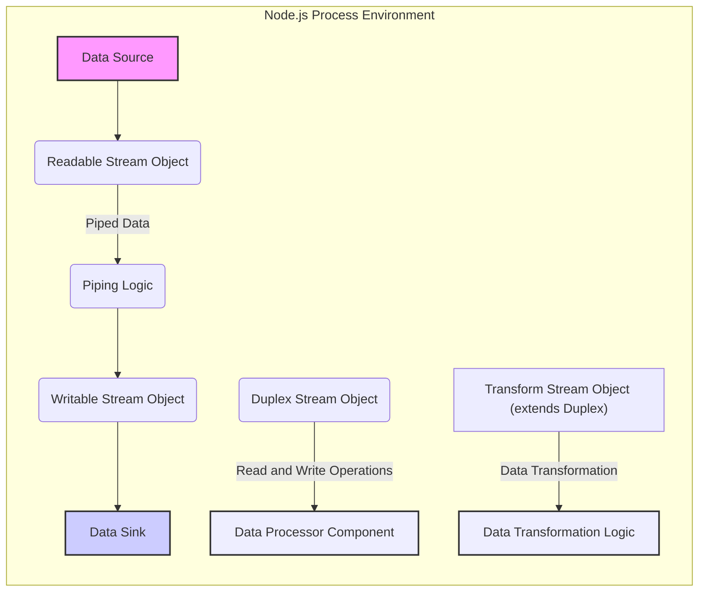
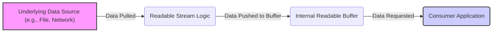
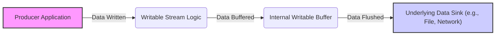

# Project Design Document: Node.js `readable-stream`

**Version:** 1.1
**Date:** October 26, 2023
**Author:** AI Software Architect

## 1. Introduction

This document provides a detailed design overview of the Node.js `readable-stream` project, located at [https://github.com/nodejs/readable-stream](https://github.com/nodejs/readable-stream). This document aims to provide a comprehensive understanding of the project's architecture, components, and data flow, which will serve as the foundation for subsequent threat modeling activities. The `readable-stream` library provides an implementation of the WHATWG Streams Standard API, offering a consistent and powerful way to work with streams of data in JavaScript environments, particularly within Node.js. Understanding the internal workings of this library is crucial for identifying potential vulnerabilities in systems that rely on it.

## 2. Goals

The primary goals of the `readable-stream` project are:

*   Provide a spec-compliant implementation of the WHATWG Streams Standard API for Node.js environments.
*   Offer a developer-friendly and performant interface for creating and interacting with data streams.
*   Ensure broad compatibility across different Node.js versions and execution environments.
*   Maintain a high level of code quality through comprehensive testing and adherence to best practices.
*   Serve as a fundamental building block for other stream-based modules and applications within the Node.js ecosystem.

## 3. Scope

This design document focuses on the internal architecture and core components of the `readable-stream` library itself. It details the fundamental mechanisms for creating, manipulating, and managing streams. This document does *not* cover:

*   Specific concrete stream implementations built *using* `readable-stream` (for example, the `fs.createReadStream` or `http.IncomingMessage`).
*   Applications that consume or utilize the `readable-stream` library in their business logic.
*   The historical development timeline or details of previous versions of the library.
*   In-depth performance benchmarking data or specific optimization techniques employed within the library.

## 4. Architecture Overview

The `readable-stream` library provides a set of abstract classes and key utility functions that form the basis for stream manipulation in Node.js. The central concepts are:

*   **Readable Streams:**  Represent a source of data that can be consumed sequentially. They abstract the process of fetching data.
*   **Writable Streams:** Represent a destination for data that is written sequentially. They abstract the process of handling data output.
*   **Duplex Streams:** Combine the functionalities of both Readable and Writable streams, enabling bidirectional data flow.
*   **Transform Streams:** A specialized type of Duplex stream where data written to the stream is transformed before being made available for reading.
*   **Piping:** A core mechanism for connecting the output of a Readable stream directly to the input of a Writable stream, managing data flow and error propagation.

## 5. Component Details

The `readable-stream` library is built upon several fundamental classes and internal mechanisms:

*   **`Readable` Class:**
    *   The foundational abstract class for implementing readable streams.
    *   Manages the internal buffer that holds data ready to be read.
    *   Provides core methods like `read()`, which consumers use to pull data, and `pipe()`, which connects this stream to a writable stream.
    *   Emits events such as `'data'` (when data is available), `'end'` (when the source has no more data), and `'error'` (when an error occurs).
    *   Subclasses **must** implement the `_read(size)` method to provide data to the internal buffer. This is a key point for understanding how data enters the stream.

*   **`Writable` Class:**
    *   The foundational abstract class for implementing writable streams.
    *   Manages an internal buffer for data waiting to be written to the underlying sink.
    *   Provides core methods like `write(chunk, encoding, callback)` to send data to the stream and `end(chunk, encoding, callback)` to signal the end of the data.
    *   Emits events such as `'drain'` (when the buffer is empty enough to resume writing), `'finish'` (when all data has been written), and `'error'` (when an error occurs).
    *   Subclasses **must** implement the `_write(chunk, encoding, callback)` method to handle writing data to the destination. This is a crucial point for understanding how data exits the stream.

*   **`Duplex` Class:**
    *   An abstract class that inherits from both `Readable` and `Writable`, representing a stream that is both readable and writable.
    *   Subclasses **must** implement both `_read(size)` and `_write(chunk, encoding, callback)` methods to handle both data input and output.

*   **`Transform` Class:**
    *   An abstract class that extends `Duplex` and is specifically designed for streams that modify data as it passes through.
    *   Subclasses **must** implement the `_transform(chunk, encoding, callback)` method, which takes a chunk of data, processes it, and then pushes the transformed data to the readable side of the stream using `this.push(transformedChunk)`.
    *   Optionally, subclasses can implement the `_flush(callback)` method, which is called when there is no more incoming data but the transform operation needs to perform final processing before the stream closes.

*   **`PassThrough` Class:**
    *   A concrete implementation of a `Transform` stream that simply passes data through without any modification. This is useful for basic piping and stream manipulation.

*   **`pipeline` Function:**
    *   A utility function that simplifies the process of piping multiple streams together. It automatically handles error propagation and ensures proper closure of all streams in the pipeline. This is important for resource management and preventing leaks.

*   **Internal Buffering:**
    *   Both Readable and Writable streams utilize internal buffers to manage the flow of data.
    *   Readable streams buffer data fetched from the source, allowing consumers to read data at their own pace.
    *   Writable streams buffer data received from producers before writing it to the destination.
    *   These buffers are crucial for handling asynchronous operations and differences in processing speeds between data sources and sinks. However, they also represent a potential point of resource exhaustion if not managed correctly.

*   **Backpressure Mechanism:**
    *   `readable-stream` implements backpressure to prevent overwhelming consumers or producers.
    *   Writable streams emit a `'drain'` event when their buffer is no longer full, signaling to the producer that it can resume writing.
    *   The `pipe()` method automatically manages backpressure between connected streams. Understanding how backpressure is handled is critical for preventing memory issues and ensuring reliable data flow.

*   **Error Handling:**
    *   Streams emit `'error'` events to signal that something has gone wrong during data processing.
    *   Properly handling these errors is essential to prevent unhandled exceptions and ensure the stability of applications using streams. The `pipeline` function provides a centralized way to manage errors in a series of piped streams.

## 6. Data Flow

The movement of data through streams follows distinct patterns depending on the stream type:

**Readable Stream Data Flow:**

1. Data originates from an **Underlying Data Source**.
2. The **Readable Stream Logic** (specifically the implementation of `_read()`) pulls data from the source.
3. The fetched data is pushed into the **Internal Readable Buffer**.
4. The **Consumer Application** requests data, which is then read from the buffer.

**Writable Stream Data Flow:**

1. The **Producer Application** writes data to the writable stream.
2. The **Writable Stream Logic** (specifically the implementation of `_write()`) receives the data.
3. The data is buffered in the **Internal Writable Buffer**.
4. The buffered data is eventually flushed to the **Underlying Data Sink**.

**Piping Data Flow:**

When a readable stream is piped to a writable stream, the `pipe()` method establishes a connection where data automatically flows from the readable stream's buffer to the writable stream's buffer. This process also includes backpressure management to prevent either stream from being overwhelmed.

## 7. Dependencies

The `readable-stream` library has a minimal set of dependencies, primarily relying on core Node.js modules:

*   `util`: Provides utility functions, including inheritance mechanisms.
*   `events`: Enables the event emitter pattern used extensively within streams.
*   `string_decoder`: Facilitates the decoding of buffer data into strings, handling multi-byte characters correctly.

## 8. Security Considerations (Preliminary)

Understanding the architecture and data flow of `readable-stream` is crucial for identifying potential security vulnerabilities in applications that utilize it. Here are some preliminary security considerations for threat modeling:

*   **Denial of Service (DoS) through Resource Exhaustion:**
    *   **Unbounded Readable Streams:** A malicious or compromised data source could push an extremely large amount of data into a readable stream, potentially filling up the internal buffer and consuming excessive memory, leading to a denial of service. Consider the risk of uncontrolled data sources.
    *   **Slow Consumers and Backpressure Neglect:** If a writable stream's consumer is slow and backpressure mechanisms are not properly implemented or respected, the writable stream's buffer could grow indefinitely, leading to memory exhaustion. Evaluate how backpressure is handled in stream pipelines.

*   **Data Injection and Manipulation:**
    *   **Vulnerable `_write()` Implementations:** If a custom writable stream's `_write()` method does not properly validate or sanitize incoming data, it could be susceptible to injection attacks if the data is used in further processing (e.g., constructing database queries or system commands). Analyze custom `_write()` implementations for potential vulnerabilities.
    *   **Transform Stream Vulnerabilities:** If a transform stream's `_transform()` method has vulnerabilities, malicious data could be injected or existing data could be manipulated during the transformation process. Scrutinize the logic within `_transform()` methods for potential flaws.

*   **Error Handling and Information Disclosure:**
    *   **Unhandled Errors:** Improper error handling within stream pipelines could lead to unhandled exceptions, potentially crashing the application or revealing sensitive information through error messages or stack traces. Review error handling logic throughout stream processing.
    *   **Error Propagation:** Understand how errors are propagated through piped streams. Incorrectly handled errors might mask underlying issues or lead to unexpected behavior.

*   **Prototype Pollution in Custom Stream Implementations:**
    *   If custom stream implementations are not carefully constructed, they might be vulnerable to prototype pollution attacks, potentially allowing an attacker to inject malicious properties into object prototypes. Assess the security of custom stream classes extending `readable-stream` base classes.

*   **Timing Attacks and Side Channels:**
    *   In certain scenarios, the timing of stream operations or the size of internal buffers could potentially be exploited to infer information about the data being processed. While less common, this is a consideration for highly sensitive applications.

## 9. Deployment Considerations

The `readable-stream` library is typically deployed as a dependency within Node.js applications. It is included in the application's `node_modules` directory and is used implicitly by other modules that rely on stream functionality. Developers generally do not need to explicitly deploy `readable-stream`; it is a fundamental part of the Node.js ecosystem.

## 10. Future Considerations

The `readable-stream` library is a mature project, but ongoing development and potential future enhancements might include:

*   Further alignment with evolving specifications of the WHATWG Streams Standard.
*   Performance improvements and optimizations in internal buffering and data handling mechanisms.
*   Potential addition of new utility functions or stream types to address specific use cases.
*   Continued focus on security best practices and addressing any newly discovered vulnerabilities.

This design document provides a foundation for understanding the architecture of `readable-stream` for the purpose of threat modeling. Security assessments should consider the specific ways in which this library is used within an application and the potential attack vectors exposed by the flow of data through streams.