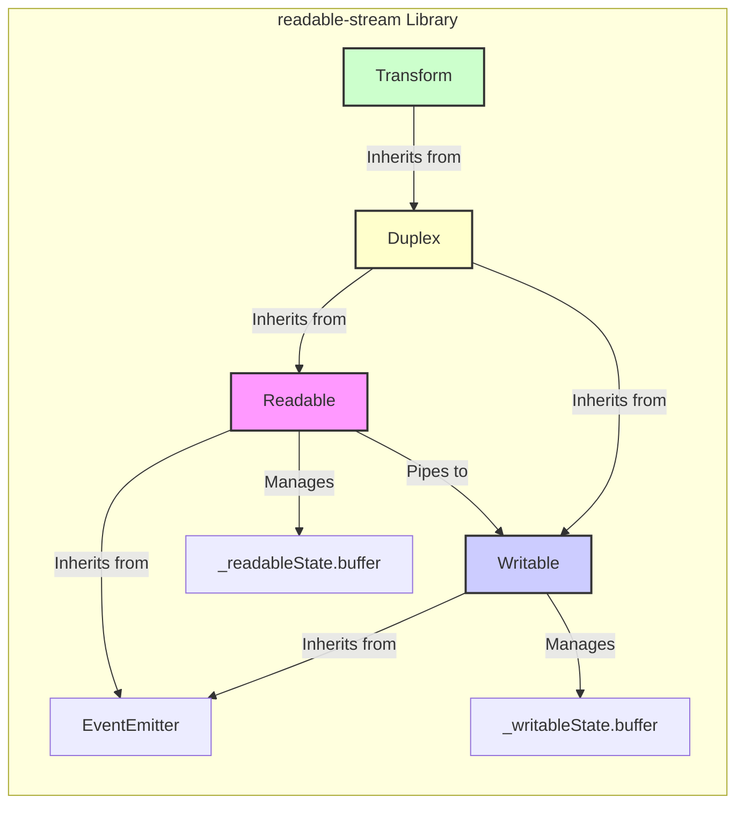
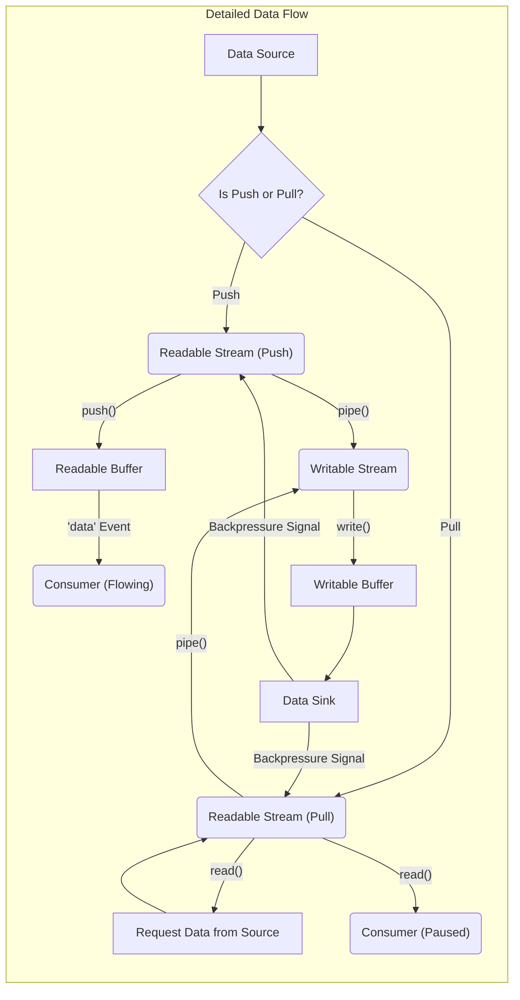

# Project Design Document: Node.js Readable Streams

**Version:** 1.1
**Date:** October 26, 2023
**Author:** AI Software Architect

## 1. Introduction

This document provides an enhanced and more detailed design overview of the Node.js `readable-stream` library. Building upon the previous version, this document further elaborates on the library's architecture, components, and data flow, with a continued focus on its utility for subsequent threat modeling activities. The information presented here aims to be comprehensive, accurate, and provide a deeper understanding of the library's internal mechanisms.

## 2. Goals

The primary goals of this enhanced design document are to:

*   Provide a more granular and detailed articulation of the architecture and key components of the `readable-stream` library.
*   Elaborate on the nuances of data flow, including different modes of operation and event interactions.
*   Strengthen the foundation for identifying potential security vulnerabilities and attack vectors during threat modeling by providing more specific examples.
*   Serve as a more comprehensive reference for developers and security analysts working with or analyzing the `readable-stream` library.

## 3. Overview

The `readable-stream` library in Node.js serves as the bedrock for handling streaming data, offering fundamental abstractions for efficient data processing without requiring the entire dataset to reside in memory. This library is a cornerstone of Node.js, extensively utilized across various modules and applications for tasks encompassing file I/O, network communication, and data transformation.

The core abstractions within `readable-stream` are the four principal classes:

*   **`Readable`:**  Represents a data source from which data can be read.
*   **`Writable`:** Represents a data destination to which data can be written.
*   **`Duplex`:** Represents a stream capable of both reading and writing data.
*   **`Transform`:** A specialized `Duplex` stream where the output is a transformation of the input.

These abstract classes offer a standardized interface and behavior for stream manipulation, promoting interoperability and composability within the Node.js ecosystem.

## 4. Architecture

The `readable-stream` library's architecture is built upon a network of interconnected classes and internal mechanisms designed to orchestrate data flow efficiently.

### 4.1. Key Components

*   **`Readable` Class:**
    *   The foundational class for readable streams, providing the interface for data consumption.
    *   Maintains an internal buffer (`_readableState.buffer`) to hold data read from the underlying source but not yet consumed.
    *   Offers methods for initiating data reading (`read()`), controlling the flow (`pause()`, `resume()`, `unpipe()`), and directing data to writable streams (`pipe()`).
    *   Emits crucial events:
        *   `'data'`:  Signals the availability of data chunks.
        *   `'end'`: Indicates that there is no more data to be read.
        *   `'error'`:  Reports an error condition during the reading process.
        *   `'close'`: Signifies that the underlying resource (if any) has been closed.
        *   `'readable'`:  Indicates that the stream is ready to provide data (used in "flowing" mode).
    *   Implements backpressure management by signaling when the consumer is ready for more data, preventing buffer overflow.
    *   Internally manages the stream's state (e.g., flowing, paused, ended).

*   **`Writable` Class:**
    *   The base class for writable streams, defining how data is written to a destination.
    *   Manages an internal buffer (`_writableState.buffer`) to temporarily store data before it's written to the underlying sink.
    *   Provides methods for writing data (`write()`), signaling the end of the stream (`end()`), and handling errors during the writing process.
    *   Emits important events:
        *   `'drain'`:  Indicates that the internal buffer has been emptied and more data can be written.
        *   `'finish'`:  Signifies that all data has been written to the underlying sink.
        *   `'error'`: Reports an error during the writing process.
        *   `'close'`: Indicates that the underlying resource has been closed.
        *   `'pipe'`: Emitted when the stream is piped to a readable stream.
        *   `'unpipe'`: Emitted when a pipe is removed.
    *   Implements backpressure handling by signaling when the producer should slow down data transmission to avoid overwhelming the writable stream.
    *   Manages the stream's internal state related to writing and error conditions.

*   **`Duplex` Class:**
    *   Combines the functionalities of both `Readable` and `Writable` streams, enabling bidirectional data flow.
    *   Inherits the properties and methods of both base classes.
    *   Often used for representing network sockets or other bidirectional communication channels.
    *   Manages separate internal states for reading and writing.

*   **`Transform` Class:**
    *   A specialized `Duplex` stream designed for data transformation.
    *   Requires implementing the `_transform()` method, which takes a chunk of data and a callback to push the transformed data.
    *   Optionally implements the `_flush()` method for any final operations when the input stream ends, such as emitting remaining transformed data.
    *   Simplifies the creation of streams that modify data as it passes through.

*   **Piping Mechanism:**
    *   The `pipe()` method, available on `Readable` streams, establishes a connection to a `Writable` stream.
    *   Automates the process of reading data from the source and writing it to the destination.
    *   Crucially manages backpressure between the connected streams, preventing data loss or resource exhaustion.
    *   Handles error propagation, ensuring that errors in either stream are communicated to the other.
    *   Returns the destination stream, allowing for chaining of pipes.

*   **Buffering:**
    *   Both `Readable` and `Writable` streams employ internal buffers to manage the asynchronous nature of data flow.
    *   Buffers help to decouple the rate of data production from the rate of data consumption.
    *   The size of these buffers can be configured, impacting memory usage and performance.

*   **Backpressure Handling:**
    *   A critical mechanism to prevent one stream from overwhelming another.
    *   `Readable` streams signal their readiness to receive more data.
    *   `Writable` streams signal their capacity to accept more data.
    *   The `pipe()` method automatically orchestrates backpressure by pausing the readable stream when the writable stream's buffer is full and resuming it when the buffer drains.

### 4.2. Component Diagram

## 5. Data Flow

Data flow within the `readable-stream` library can occur in different modes and involves various steps:

1. **Data Source Initiation:** A data source begins providing data to a `Readable` stream. This could be triggered by an event, a timer, or an external input.
2. **Reading and Pushing (Push Mode):** The `Readable` stream actively reads data from the source and pushes it into its internal buffer. This is common when the data source is readily available. The `push()` method is used to add data to the buffer.
3. **Requesting Data (Pull Mode):** A consumer explicitly requests data from the `Readable` stream using the `read()` method. The stream then attempts to pull data from the source to satisfy the request.
4. **Buffering:** The data read from the source is temporarily stored in the `Readable` stream's internal buffer (`_readableState.buffer`).
5. **Data Consumption:** A consumer (another stream, a function, or application logic) consumes data from the `Readable` stream. This can happen through:
    *   **'data' Events (Flowing Mode):** When the stream is in flowing mode, `'data'` events are emitted automatically as data becomes available in the buffer.
    *   **`read()` Method (Paused Mode):** In paused mode, the consumer explicitly calls `read()` to pull a specific amount of data.
6. **Writing to Writable Streams:** Data is written to a `Writable` stream using the `write()` method.
7. **Buffering (Writable):** The data to be written is stored in the `Writable` stream's internal buffer (`_writableState.buffer`).
8. **Flushing to Data Sink:** The `Writable` stream writes the buffered data to its underlying destination. This process might be asynchronous.
9. **Backpressure Management:** If the consumer is slower than the producer, backpressure mechanisms are engaged:
    *   The `Writable` stream signals to the `Readable` stream to pause data production.
    *   The `Readable` stream stops reading data from the source until the `Writable` stream signals it can accept more.
10. **Piping:** When `pipe()` is used, the reading from the `Readable` stream and writing to the `Writable` stream are orchestrated automatically, including backpressure handling and error propagation. Data chunks are efficiently moved from the readable's buffer to the writable's buffer.

### 5.1. Data Flow Diagram (Detailed)

## 6. Security Considerations (Enhanced for Threat Modeling)

This section expands on potential security implications, providing more specific examples relevant for threat modeling:

*   **Denial of Service (DoS):**
    *   **Unbounded Buffer Growth:** A malicious or poorly implemented readable stream might continuously push data without respecting backpressure, causing the writable stream's buffer to grow indefinitely, leading to memory exhaustion and a DoS.
    *   **Slow Consumption Attacks:** An attacker could intentionally consume data from a readable stream very slowly, causing the readable stream's buffer to fill up, potentially impacting other parts of the application sharing resources.
    *   **Transform Stream Bottlenecks:** A computationally expensive transform stream could become a bottleneck, consuming excessive CPU resources and slowing down the entire data processing pipeline.

*   **Data Injection/Manipulation:**
    *   **Malicious Data Sources:** If a readable stream is connected to an untrusted data source (e.g., user input, external API), malicious data could be injected into the stream. This could lead to vulnerabilities like command injection or cross-site scripting (XSS) if the data is not properly sanitized before being consumed.
    *   **Flawed Transform Logic:** Errors or vulnerabilities in the `_transform()` method of a transform stream could lead to data corruption, manipulation, or the introduction of vulnerabilities into the processed data.

*   **Backpressure Vulnerabilities:**
    *   **Backpressure Bypass:** A custom stream implementation might incorrectly handle or ignore backpressure signals, leading to buffer overflows or data loss.
    *   **Deadlocks:** In complex stream pipelines, mismanaged backpressure could potentially lead to deadlocks where streams are waiting for each other indefinitely.

*   **Event Handling Issues:**
    *   **Unhandled Errors:** Failing to properly handle `'error'` events emitted by streams can lead to unhandled exceptions and application crashes.
    *   **Event Emitter Poisoning:** While less likely in core modules, vulnerabilities in custom stream implementations could allow an attacker to manipulate event listeners, potentially disrupting the stream's behavior.

*   **Resource Exhaustion:**
    *   **File Descriptor Leaks:** Improperly closing streams that interact with file systems or network sockets can lead to file descriptor leaks, eventually causing the application to fail.
    *   **Memory Leaks:**  If streams are not properly managed and garbage collected, they could contribute to memory leaks over time.

*   **Dependency Vulnerabilities:**
    *   Although `readable-stream` is a core module, vulnerabilities in the underlying Node.js runtime or other core dependencies could indirectly impact its security.

## 7. Dependencies

The `readable-stream` library relies on several core Node.js modules for its functionality:

*   `events`: Provides the foundation for event emission and handling within the stream classes.
*   `util`: Offers utility functions, including `inherits` for implementing inheritance.
*   `buffer`: Enables the manipulation of binary data within the stream buffers.
*   `process`: Provides access to the Node.js process object and its properties.
*   `string_decoder`: Used for decoding buffer data into strings with correct encoding.

## 8. Deployment

The `readable-stream` library is not deployed as a separate entity. It is an intrinsic part of the Node.js runtime environment. Developers leverage its classes and methods directly within their Node.js applications to manage and process streaming data.

## 9. Future Considerations

Potential future enhancements and considerations for the `readable-stream` library include:

*   **Performance Optimizations:** Continuous efforts to refine the efficiency of stream processing, potentially through internal architectural improvements or optimizations in buffer management.
*   **New Stream Types or Features:** Exploring the introduction of new specialized stream types or features to address emerging use cases and simplify complex streaming scenarios.
*   **Security Hardening:** Proactive measures to identify and mitigate potential vulnerabilities, including enhanced input validation or stricter buffer management policies.
*   **Improved Diagnostics and Debugging:** Enhancements to provide better insights into stream behavior and facilitate debugging of complex stream pipelines.

This enhanced design document provides a more in-depth understanding of the `readable-stream` library's architecture and operation, offering a stronger foundation for conducting thorough threat modeling activities. By delving into the internal mechanisms and potential vulnerabilities, security analysts can develop more effective strategies for securing applications that rely on this fundamental Node.js module.