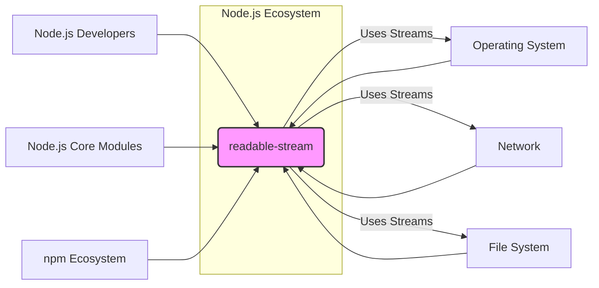
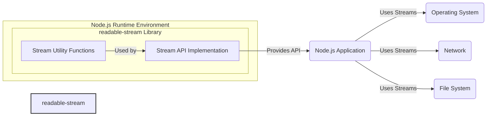

# BUSINESS POSTURE

- Business Priorities and Goals:
 - Provide a robust and performant implementation of stream API for Node.js applications.
 - Ensure compatibility and stability of stream API across different Node.js versions.
 - Facilitate efficient and reliable data processing in Node.js ecosystem.
 - Maintain and improve the quality and security of the `readable-stream` library as a foundational component of Node.js.
- Business Risks:
 - Vulnerabilities in `readable-stream` can impact a wide range of Node.js applications, potentially leading to data breaches, denial of service, or other security incidents.
 - Performance regressions in `readable-stream` can negatively affect the performance of Node.js applications.
 - Breaking changes in `readable-stream` API can cause compatibility issues and require significant rework in dependent Node.js modules and applications.
 - Bugs or instability in `readable-stream` can lead to application crashes or data corruption.

# SECURITY POSTURE

- Existing Security Controls:
 - security control: Code review process for all contributions to the `nodejs/readable-stream` repository. Implemented in: GitHub pull request workflow.
 - security control: Continuous integration testing to ensure code quality and prevent regressions. Implemented in: GitHub Actions.
 - security control: Vulnerability reporting and disclosure process managed by the Node.js security team. Described in: Node.js security policy.
 - security control: Use of static analysis tools and linters as part of the development process. Implemented in: Development guidelines and CI.
 - security control: Regular updates and maintenance of the library to address reported issues and vulnerabilities. Implemented in: Node.js release cycle.
 - accepted risk: Reliance on the security of the underlying Node.js runtime environment and its dependencies.
 - accepted risk: Potential for undiscovered vulnerabilities in the complex stream implementation logic.

- Recommended Security Controls:
 - security control: Implement automated dependency scanning to detect vulnerabilities in third-party dependencies (if any, although `readable-stream` is a core module with minimal external dependencies).
 - security control: Conduct regular security audits and penetration testing specifically focused on stream API and its potential attack vectors.
 - security control: Integrate fuzzing into the CI pipeline to proactively discover potential vulnerabilities related to input handling and stream processing.
 - security control: Enhance static analysis with security-focused rules to identify common security weaknesses in the code.

- Security Requirements:
 - Authentication: Not directly applicable to a library. Authentication is the responsibility of applications using `readable-stream`.
 - Authorization: Not directly applicable to a library. Authorization is the responsibility of applications using `readable-stream`.
 - Input Validation:
  - Requirement: `readable-stream` should handle various input types and formats robustly and prevent unexpected behavior or crashes due to malformed input.
  - Requirement: Implement validation checks for parameters passed to stream constructors and methods to prevent misuse and potential vulnerabilities.
  - Requirement: Ensure proper handling of different data encodings and character sets to avoid encoding-related vulnerabilities.
 - Cryptography:
  - Requirement: `readable-stream` itself does not directly implement cryptography, but it should be capable of securely handling and processing cryptographic data streams when used in conjunction with cryptographic modules.
  - Requirement: If cryptographic operations are performed on streams, ensure that best practices for secure key management and cryptographic algorithm selection are followed in the application code that utilizes `readable-stream`.

# DESIGN

## C4 CONTEXT



- Context Diagram Elements:
 - - Name: readable-stream
   - Type: Software System / Library
   - Description: A core Node.js module that provides an implementation of the Stream API, enabling efficient handling of streaming data.
   - Responsibilities:
    - Provide base classes and utilities for creating readable, writable, and transform streams.
    - Implement the Stream API specification for Node.js.
    - Offer a performant and reliable foundation for stream-based operations in Node.js.
   - Security controls:
    - Security controls are primarily focused on secure development practices, code review, and testing within the Node.js project.
 - - Name: Node.js Developers
   - Type: User
   - Description: Developers who use the `readable-stream` library directly or indirectly through other Node.js modules to build applications.
   - Responsibilities:
    - Utilize the `readable-stream` library to implement stream-based functionalities in their applications.
    - Report issues and contribute to the development of `readable-stream`.
    - Follow secure coding practices when using streams in their applications.
   - Security controls:
    - Responsible for secure usage of the library in their applications.
 - - Name: Node.js Core Modules
   - Type: Software System / Library
   - Description: Other core Node.js modules that depend on and utilize the `readable-stream` library, such as `http`, `fs`, `net`, `zlib`, etc.
   - Responsibilities:
    - Leverage `readable-stream` to implement stream-based functionalities within Node.js core modules.
    - Ensure compatibility and proper integration with `readable-stream`.
   - Security controls:
    - Adhere to Node.js security guidelines and best practices when using `readable-stream`.
 - - Name: npm Ecosystem
   - Type: Software System / Ecosystem
   - Description: The vast ecosystem of Node.js packages available through npm, many of which rely on `readable-stream` either directly or indirectly.
   - Responsibilities:
    - Utilize `readable-stream` or modules that depend on it.
    - Contribute to the ecosystem and potentially report issues related to `readable-stream` usage.
   - Security controls:
    - Rely on the security and stability of `readable-stream` as a foundational component.
 - - Name: Operating System
   - Type: Infrastructure
   - Description: The underlying operating system on which Node.js and applications using `readable-stream` are running. Provides system-level resources and APIs for I/O operations.
   - Responsibilities:
    - Provide the environment for Node.js and `readable-stream` to execute.
    - Handle low-level I/O operations related to streams.
   - Security controls:
    - Operating system security controls, such as access control, process isolation, and kernel security features.
 - - Name: Network
   - Type: Infrastructure
   - Description: Network infrastructure used for network communication, which can involve streams for data transfer.
   - Responsibilities:
    - Facilitate network data transfer using streams.
    - Ensure network security and integrity.
   - Security controls:
    - Network security controls, such as firewalls, intrusion detection systems, and network segmentation.
 - - Name: File System
   - Type: Infrastructure
   - Description: File system used for file storage and retrieval, which can involve streams for reading and writing file data.
   - Responsibilities:
    - Manage file storage and access.
    - Provide file I/O operations using streams.
   - Security controls:
    - File system access controls, permissions, and encryption.

## C4 CONTAINER



- Container Diagram Elements:
 - - Name: readable-stream Library
   - Type: Library / Container
   - Description: A Node.js library that encapsulates the Stream API implementation and related utility functions. It's a single logical container in this context, representing the entire library.
   - Responsibilities:
    - Implement the core Stream API classes (Readable, Writable, Transform, Duplex).
    - Provide utility functions for stream manipulation and composition (e.g., pipeline, pump).
    - Manage stream internal state and data flow.
   - Security controls:
    - Code review, static analysis, CI testing, vulnerability reporting process (as described in SECURITY POSTURE).
 - - Name: Stream API Implementation
   - Type: Component
   - Description: The core logic and classes that implement the Stream API specification within `readable-stream`.
   - Responsibilities:
    - Handle stream data processing, buffering, and flow control.
    - Implement the methods and events defined by the Stream API.
   - Security controls:
    - Input validation within stream methods, memory safety considerations in data handling.
 - - Name: Stream Utility Functions
   - Type: Component
   - Description: Utility functions provided by `readable-stream` to simplify stream operations and common patterns.
   - Responsibilities:
    - Offer helper functions for stream piping, error handling, and stream lifecycle management.
   - Security controls:
    - Secure implementation of utility functions to prevent misuse or vulnerabilities.
 - - Name: Node.js Application
   - Type: Application
   - Description: A Node.js application that utilizes the `readable-stream` library to process streaming data.
   - Responsibilities:
    - Implement application-specific logic using streams.
    - Handle stream events and data.
    - Manage application-level security related to stream processing.
   - Security controls:
    - Application-level security controls, input validation, authorization, and secure data handling.
 - - Name: Operating System, Network, File System
   - Type: Infrastructure
   - Description: External systems that interact with Node.js applications and streams for I/O operations.
   - Responsibilities:
    - Provide underlying resources for stream operations.
   - Security controls:
    - Infrastructure-level security controls.

## DEPLOYMENT

- Deployment Architecture:
 - `readable-stream` is not deployed as a standalone service. It is a core module within the Node.js runtime environment. Therefore, its deployment is inherently tied to the deployment of Node.js itself. Node.js can be deployed in various environments, including:
  - On-premise servers
  - Cloud environments (e.g., AWS EC2, Azure VMs, Google Compute Engine)
  - Containerized environments (e.g., Docker, Kubernetes)
  - Serverless environments (e.g., AWS Lambda, Azure Functions, Google Cloud Functions)

 - Detailed Deployment (Example: Containerized Environment - Docker):
  - We will describe deployment in a containerized environment using Docker as a representative example, as it's a common and relevant deployment scenario for Node.js applications.

```mermaid
flowchart LR
    subgraph "Docker Container"
        subgraph "Node.js Runtime"
            RS[readable-stream Library]
            NA[Node.js Application]
        end
        OS[Operating System (Container OS)]
    end
    DockerHost[Docker Host Infrastructure] -- "Runs" --> "Docker Container"
    DockerRegistry[Docker Registry] -- "Pulls Image" --> DockerHost
    Internet[Internet] -- "Accesses" --> DockerHost
    style "Docker Container" fill:#efe,stroke:#333,stroke-width:2px
```

- Deployment Diagram Elements:
 - - Name: Docker Container
   - Type: Container
   - Description: A Docker container encapsulating the Node.js runtime environment, including the `readable-stream` library and the Node.js application.
   - Responsibilities:
    - Provide an isolated and consistent environment for running the Node.js application.
    - Execute the Node.js application and manage its dependencies, including `readable-stream`.
   - Security controls:
    - Container isolation, resource limits, security scanning of container images, vulnerability management for container base image.
 - - Name: Node.js Runtime
   - Type: Software Environment
   - Description: The Node.js runtime environment installed within the Docker container, which includes the `readable-stream` library as a core module.
   - Responsibilities:
    - Execute JavaScript code of the Node.js application.
    - Provide access to core modules like `readable-stream`.
   - Security controls:
    - Node.js runtime security features, security updates for Node.js.
 - - Name: readable-stream Library
   - Type: Library
   - Description: The `readable-stream` library, part of the Node.js core modules within the container.
   - Responsibilities:
    - Provide stream API implementation within the containerized Node.js environment.
   - Security controls:
    - Security controls are inherited from the Node.js project's security practices.
 - - Name: Node.js Application
   - Type: Application
   - Description: The Node.js application running inside the Docker container, utilizing `readable-stream`.
   - Responsibilities:
    - Implement application logic using streams within the container.
   - Security controls:
    - Application-level security controls within the container.
 - - Name: Operating System (Container OS)
   - Type: Operating System
   - Description: The operating system running inside the Docker container (e.g., Linux distribution).
   - Responsibilities:
    - Provide the base operating system environment for the Node.js runtime within the container.
   - Security controls:
    - Container OS security hardening, patching, and security configurations.
 - - Name: Docker Host Infrastructure
   - Type: Infrastructure
   - Description: The physical or virtual infrastructure hosting the Docker runtime environment.
   - Responsibilities:
    - Provide resources for running Docker containers.
    - Manage Docker runtime environment.
   - Security controls:
    - Host-level security controls, infrastructure security, access control to Docker host.
 - - Name: Docker Registry
   - Type: Service
   - Description: A Docker registry (e.g., Docker Hub, private registry) used to store and distribute Docker images.
   - Responsibilities:
    - Store and serve Docker images.
    - Manage access to Docker images.
   - Security controls:
    - Registry access control, image signing, vulnerability scanning of images in the registry.
 - - Name: Internet
   - Type: Network
   - Description: The external network through which users or other systems may access the Node.js application running in the Docker container.
   - Responsibilities:
    - Provide network connectivity to the application.
   - Security controls:
    - Network security controls, firewalls, load balancers, DDoS protection.

## BUILD

```mermaid
flowchart LR
    Developer[Developer] -- "Code Changes" --> VCS(Version Control System - GitHub)
    VCS -- "Webhook" --> CI(CI System - GitHub Actions)
    CI -- "Build & Test" --> BuildEnv(Build Environment)
    BuildEnv -- "SAST, Linters, Tests" --> Artifacts[Build Artifacts]
    Artifacts -- "Publish" --> Registry[npm Registry]
    Registry -- "Download" --> NodejsUsers[Node.js Users]
    style BuildEnv fill:#cef,stroke:#333,stroke-width:2px
```



- Build Process Elements:
 - - Name: Developer
   - Type: Person
   - Description: A software developer contributing to the `readable-stream` project.
   - Responsibilities:
    - Write code, fix bugs, and implement new features for `readable-stream`.
    - Commit code changes to the version control system.
   - Security controls:
    - Developer workstations security, secure coding practices, code review participation.
 - - Name: Version Control System (VCS - GitHub)
   - Type: Software System
   - Description: GitHub repository hosting the `nodejs/readable-stream` source code.
   - Responsibilities:
    - Store and manage the source code of `readable-stream`.
    - Track code changes and facilitate collaboration.
   - Security controls:
    - Access control to the repository, branch protection, audit logs.
 - - Name: CI System (GitHub Actions)
   - Type: Software System
   - Description: GitHub Actions used for continuous integration and continuous delivery of `readable-stream`.
   - Responsibilities:
    - Automate the build, test, and release process.
    - Run security checks during the build process.
   - Security controls:
    - Secure CI/CD pipeline configuration, access control to CI system, secrets management, audit logs.
 - - Name: Build Environment
   - Type: Infrastructure / Environment
   - Description: The environment where the `readable-stream` library is built and tested during the CI process.
   - Responsibilities:
    - Provide necessary tools and dependencies for building `readable-stream`.
    - Execute build scripts, tests, and security checks.
   - Security controls:
    - Secure build environment configuration, hardened build agents, access control to build environment.
 - - Name: SAST, Linters, Tests
   - Type: Security Tools / Processes
   - Description: Static Application Security Testing tools, linters, and unit/integration tests run during the build process.
   - Responsibilities:
    - Identify potential security vulnerabilities and code quality issues.
    - Ensure code correctness and prevent regressions.
   - Security controls:
    - Regularly updated security tools, configured security rules, test coverage.
 - - Name: Build Artifacts
   - Type: Data / Software
   - Description: The compiled and packaged `readable-stream` library and related files produced by the build process.
   - Responsibilities:
    - Represent the distributable version of `readable-stream`.
   - Security controls:
    - Integrity checks of build artifacts, signing of artifacts (potentially).
 - - Name: npm Registry
   - Type: Software System / Service
   - Description: The npm registry where Node.js packages, including `readable-stream`, are published and distributed.
   - Responsibilities:
    - Host and distribute Node.js packages.
    - Manage package versions and metadata.
   - Security controls:
    - Registry access control, package signing, malware scanning of published packages.
 - - Name: Node.js Users
   - Type: User / System
   - Description: Node.js developers and applications that download and use the `readable-stream` library from the npm registry.
   - Responsibilities:
    - Download and integrate `readable-stream` into their projects.
    - Utilize `readable-stream` in their applications.
   - Security controls:
    - Dependency management practices, vulnerability scanning of dependencies in their projects.

# RISK ASSESSMENT

- Critical Business Processes:
 - Reliable and performant data streaming within Node.js applications. This is critical for various functionalities like web servers, file processing, data pipelines, and real-time applications built on Node.js.
 - Stability and compatibility of the Node.js platform itself, as `readable-stream` is a foundational component.

- Data to Protect and Sensitivity:
 - The primary data to protect is the integrity and availability of the `readable-stream` library code itself.
 - Sensitivity of data processed by streams depends entirely on the applications using `readable-stream`. The library itself is data-agnostic. If applications use streams to process sensitive data (e.g., user data, financial data), then vulnerabilities in `readable-stream` could potentially expose this sensitive data.
 - Confidentiality, Integrity, and Availability (CIA) of stream data are all important depending on the application context. For core library itself, integrity and availability are paramount.

# QUESTIONS & ASSUMPTIONS

- Questions:
 - What is the specific scope of threat modeling exercise for `readable-stream`? Is it focused on specific attack vectors or general security posture?
 - Are there any specific compliance requirements or industry standards that `readable-stream` needs to adhere to?
 - What is the risk appetite of the Node.js project and the organization maintaining it regarding security vulnerabilities in core modules like `readable-stream`?

- Assumptions:
 - BUSINESS POSTURE: The primary business goal is to maintain a secure, stable, and performant stream API for the Node.js ecosystem. Security is a high priority due to the widespread use of `readable-stream`.
 - SECURITY POSTURE: Existing security controls are in place within the Node.js project, including code review and CI testing. However, there is room for improvement in proactive security measures like fuzzing and dependency scanning.
 - DESIGN: The design is relatively simple from a container perspective, as `readable-stream` is a library. The focus is on the build and deployment process of Node.js and its core modules, and the security considerations within those processes. The deployment context is assumed to be varied, ranging from on-premise to cloud and containerized environments.