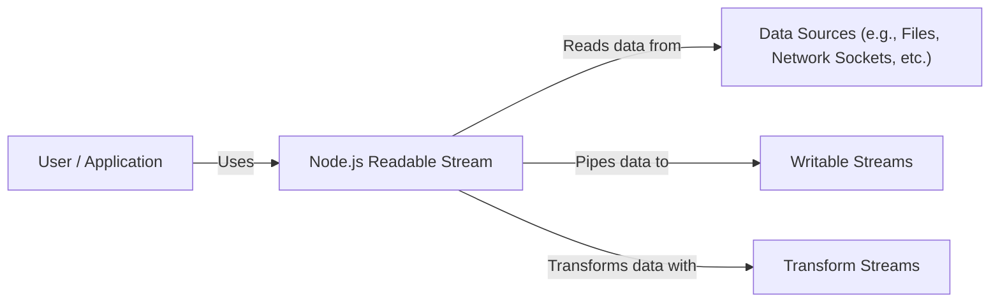
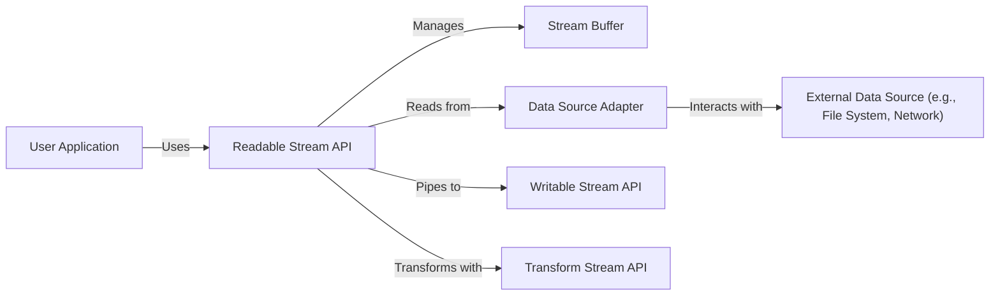
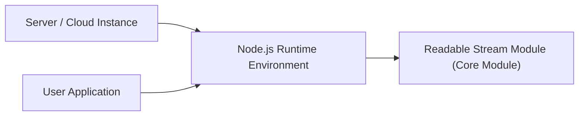
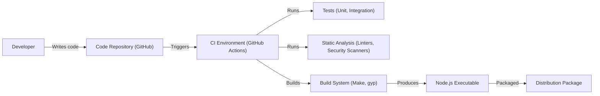

# Project Design Document: Node.js Readable Stream

## BUSINESS POSTURE

*   Priorities and Goals:
    *   Provide a stable, efficient, and well-documented API for working with streaming data in Node.js.
    *   Ensure backward compatibility with existing Node.js streams while providing a clear path for future improvements.
    *   Minimize memory consumption and overhead when processing large streams of data.
    *   Provide a user-friendly API that is easy to understand and use, even for developers new to streams.
    *   Support a wide range of use cases, including file I/O, network communication, and data transformation.
    *   Maintain high performance and low latency for stream operations.

*   Business Risks:
    *   Instability or bugs in the stream implementation could lead to data loss, corruption, or application crashes.
    *   Performance bottlenecks in the stream implementation could negatively impact the performance of applications that rely on streams.
    *   Complexity of the API could make it difficult for developers to use streams correctly, leading to errors and inefficiencies.
    *   Lack of compatibility with other Node.js modules or libraries could limit the usefulness of the stream implementation.
    *   Security vulnerabilities in the stream implementation could be exploited by attackers to gain unauthorized access to data or system resources.

## SECURITY POSTURE

*   Existing Security Controls:
    *   security control: The Node.js security team actively monitors and addresses security vulnerabilities in the core modules, including streams. (Node.js security policy).
    *   security control: Regular updates and patches are released to address security vulnerabilities. (Node.js release cycle).
    *   security control: The stream API is designed to minimize the risk of common vulnerabilities, such as buffer overflows. (Code review process).
    *   security control: Input validation is performed on user-provided data to prevent injection attacks. (Code review process).
    *   security control: The stream implementation uses safe buffer handling practices to prevent memory corruption. (Code review process).

*   Accepted Risks:
    *   accepted risk: There is always a residual risk of undiscovered security vulnerabilities, as with any complex software project.
    *   accepted risk: Third-party modules that interact with streams may introduce their own security vulnerabilities.

*   Recommended Security Controls:
    *   security control: Implement fuzz testing to proactively identify potential vulnerabilities in the stream implementation.
    *   security control: Conduct regular security audits of the stream code and its dependencies.
    *   security control: Provide clear documentation and guidance on secure usage of streams, including best practices for handling user input and external data sources.

*   Security Requirements:

    *   Authentication: Not directly applicable to the core stream implementation, but relevant for applications that use streams to handle authenticated data.
    *   Authorization: Not directly applicable to the core stream implementation, but relevant for applications that use streams to access resources with restricted permissions.
    *   Input Validation:
        *   All user-provided data passed to stream methods should be validated to ensure it conforms to expected types and formats.
        *   Validation should be performed before any processing of the data to prevent injection attacks or unexpected behavior.
        *   Specific validation rules will depend on the type of data being handled by the stream.
    *   Cryptography:
        *   Not directly applicable to the core stream implementation.
        *   Applications that use streams to handle sensitive data should use appropriate cryptographic techniques (e.g., TLS for network streams) to protect the data in transit and at rest.
    *   Error Handling:
        *   Stream errors should be handled gracefully to prevent application crashes or data loss.
        *   Error events should be emitted to allow applications to respond to errors appropriately.
        *   Error messages should be informative but should not reveal sensitive information.

## DESIGN

### C4 CONTEXT

*   Elements:

    *   User / Application:
        *   Name: User / Application
        *   Type: Person
        *   Description: A user or application that utilizes the Node.js Readable Stream.
        *   Responsibilities: Consumes data from the Readable Stream, processes it, and potentially sends it to other destinations.
        *   Security controls: Input validation, output encoding, secure handling of sensitive data.

    *   Node.js Readable Stream:
        *   Name: Node.js Readable Stream
        *   Type: Software System
        *   Description: The core component of this design, providing an API for reading data from various sources as a stream.
        *   Responsibilities: Managing data flow, buffering, error handling, and providing a consistent interface for reading data.
        *   Security controls: Input validation, safe buffer handling, error handling.

    *   Data Sources:
        *   Name: Data Sources
        *   Type: Software System
        *   Description: The sources from which the Readable Stream reads data.
        *   Responsibilities: Providing data to the Readable Stream. Examples include files, network sockets, and other data producers.
        *   Security controls: Access controls, data integrity checks, secure communication protocols (e.g., TLS).

    *   Writable Streams:
        *   Name: Writable Streams
        *   Type: Software System
        *   Description: Streams to which data from a Readable Stream can be piped.
        *   Responsibilities: Receiving data from a Readable Stream and writing it to a destination (e.g., file, network socket).
        *   Security controls: Output validation, secure communication protocols.

    *   Transform Streams:
        *   Name: Transform Streams
        *   Type: Software System
        *   Description: Streams that can be used to transform data as it flows from a Readable Stream to a Writable Stream.
        *   Responsibilities: Modifying data in transit (e.g., compression, encryption, data transformation).
        *   Security controls: Input validation, output validation, secure handling of sensitive data.

### C4 CONTAINER

*   Elements:

    *   User Application:
        *   Name: User Application
        *   Type: Application
        *   Description: The application that uses the Readable Stream API.
        *   Responsibilities: Initiates stream operations, handles data received from the stream, and manages the stream lifecycle.
        *   Security controls: Input validation, output encoding, secure handling of sensitive data.

    *   Readable Stream API:
        *   Name: Readable Stream API
        *   Type: API
        *   Description: The public interface of the Readable Stream module.
        *   Responsibilities: Provides methods for reading data, pausing/resuming the stream, handling events, and piping to other streams.
        *   Security controls: Input validation, error handling.

    *   Stream Buffer:
        *   Name: Stream Buffer
        *   Type: Component
        *   Description: Internal buffer that stores data read from the data source before it is consumed by the application.
        *   Responsibilities: Managing memory allocation, buffering data, and providing data to the Readable Stream API.
        *   Security controls: Safe buffer handling, size limits to prevent excessive memory consumption.

    *   Data Source Adapter:
        *   Name: Data Source Adapter
        *   Type: Component
        *   Description: An abstraction layer that adapts the specific data source (e.g., file system, network socket) to the Readable Stream interface.
        *   Responsibilities: Reading data from the specific data source and providing it to the Stream Buffer.
        *   Security controls: Data source specific security measures (e.g., file permissions, network security).

    *   External Data Source:
        *   Name: External Data Source
        *   Type: External System
        *   Description: The actual source of the data (e.g., file system, network socket).
        *   Responsibilities: Providing data to the Data Source Adapter.
        *   Security controls: Access controls, data integrity checks, secure communication protocols.

    *   Writable Stream API:
        *   Name: Writable Stream API
        *   Type: API
        *   Description: The API for Writable Streams, where data from Readable Streams can be piped.
        *   Responsibilities: Receiving data from a Readable Stream and writing it to a destination.
        *   Security controls: Output validation, secure communication protocols.

    *   Transform Stream API:
        *   Name: Transform Stream API
        *   Type: API
        *   Description: The API for Transform Streams, used for data transformation within the stream pipeline.
        *   Responsibilities: Modifying data in transit.
        *   Security controls: Input validation, output validation, secure handling of sensitive data.

### DEPLOYMENT

*   Possible Deployment Solutions:
    *   Node.js Runtime Environment: The Readable Stream is a core module of Node.js and is deployed as part of the Node.js runtime environment.
    *   npm Package: While a core module, it can also be conceptually considered as a package managed by npm (Node Package Manager) during Node.js installation.

*   Chosen Solution (Node.js Runtime Environment):

*   Elements:

    *   Server / Cloud Instance:
        *   Name: Server / Cloud Instance
        *   Type: Infrastructure
        *   Description: The physical or virtual server where the Node.js runtime environment is installed.
        *   Responsibilities: Providing the computing resources for running the Node.js application.
        *   Security controls: Operating system security, network security, access controls.

    *   Node.js Runtime Environment:
        *   Name: Node.js Runtime Environment
        *   Type: Runtime Environment
        *   Description: The environment that executes JavaScript code using the V8 engine and provides core modules, including Readable Stream.
        *   Responsibilities: Executing JavaScript code, managing modules, providing I/O capabilities.
        *   Security controls: Node.js security updates, secure module loading.

    *   Readable Stream Module (Core Module):
        *   Name: Readable Stream Module (Core Module)
        *   Type: Module
        *   Description: The Readable Stream module, part of the Node.js core.
        *   Responsibilities: Providing the stream API for reading data.
        *   Security controls: Internal security measures within the module.

    *   User Application:
        *   Name: User Application
        *   Type: Application
        *   Description: The application deployed within the Node.js runtime that utilizes the Readable Stream module.
        *   Responsibilities: Using the Readable Stream API for its data processing needs.
        *   Security controls: Application-level security measures.

### BUILD

*   Build Process:
    1.  Developer writes code for the Node.js Readable Stream module (part of the Node.js core).
    2.  Code is reviewed by other Node.js core contributors.
    3.  Automated tests (unit tests, integration tests) are run as part of the continuous integration (CI) process.
    4.  Static analysis tools (linters, security scanners) are used to identify potential code quality and security issues.
    5.  The Node.js build system (using tools like Make, gyp, and others) compiles the C++ and JavaScript code into the Node.js executable.
    6.  The resulting Node.js executable, including the Readable Stream module, is packaged for distribution.

*   Security Controls:
    *   Code Review: All changes to the Node.js core, including the Readable Stream module, undergo mandatory code review by other core contributors.
    *   Automated Testing: A comprehensive suite of automated tests is run to ensure the correctness and stability of the code.
    *   Static Analysis: Static analysis tools are used to identify potential code quality and security issues before the code is merged.
    *   CI/CD: The continuous integration and continuous delivery (CI/CD) pipeline automates the build, test, and packaging process, ensuring consistency and reducing the risk of human error.
    *   Supply Chain Security: Node.js project is working on improving supply chain security.

## RISK ASSESSMENT

*   Critical Business Processes:
    *   Data ingestion and processing for applications that rely on streaming data.
    *   Real-time data analysis and processing.
    *   File uploads and downloads.
    *   Network communication.

*   Data Protection:
    *   Data Sensitivity: Varies depending on the application using the Readable Stream. Can range from non-sensitive data to highly sensitive data (e.g., personal information, financial data).
    *   Data Types:
        *   Raw bytes
        *   Text data (various encodings)
        *   Binary data
        *   Structured data (e.g., JSON, CSV)

## QUESTIONS & ASSUMPTIONS

*   Questions:
    *   Are there any specific performance requirements or benchmarks that the Readable Stream implementation needs to meet?
    *   Are there any specific security certifications or compliance requirements that need to be considered?
    *   What are the expected data volumes and rates that the Readable Stream will need to handle?
    *   What are the most common use cases for Readable Streams within the organization?

*   Assumptions:
    *   BUSINESS POSTURE: The Node.js Readable Stream is a critical component for many applications, and its stability, performance, and security are of high importance.
    *   SECURITY POSTURE: The existing security controls provided by the Node.js project are sufficient for most use cases, but additional security measures may be required for applications handling highly sensitive data.
    *   DESIGN: The design of the Readable Stream API is well-established and understood, and the focus is on maintaining backward compatibility while improving performance and security.
    *   The primary users of the `readable-stream` library are developers building applications on Node.js.
    *   The library is used in a wide variety of applications, with varying security requirements.
    *   The development team follows secure coding practices.