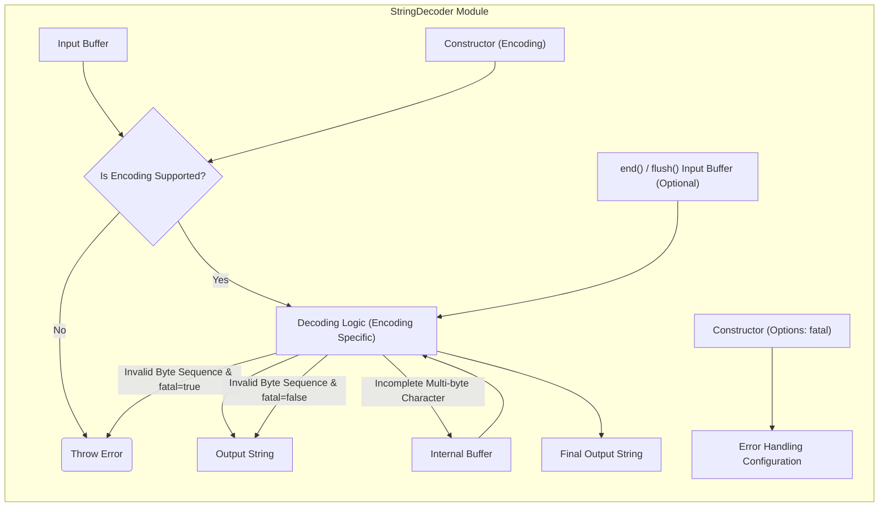

# Project Design Document: Node.js `string_decoder` Module

**Version:** 1.1
**Date:** October 26, 2023
**Author:** AI Software Architect

## 1. Introduction

This document provides an enhanced design overview of the Node.js `string_decoder` module. This core module addresses the challenge of correctly decoding `Buffer` objects into strings, particularly when dealing with multi-byte character encodings like UTF-8 where character boundaries may occur mid-chunk in a stream of data. This detailed design aims to facilitate a comprehensive understanding of the module's architecture, functionality, and data flow, serving as a robust foundation for subsequent threat modeling activities.

## 2. Goals

*   Clearly articulate the purpose and operational mechanics of the `string_decoder` module.
*   Detail the internal components and their interactions within the module.
*   Visually represent the data flow through the module.
*   Precisely identify the key data inputs and outputs of the module.
*   Establish a solid basis for identifying potential security vulnerabilities during the threat modeling process.

## 3. Overview

The `string_decoder` module offers a mechanism to transform a sequence of bytes (represented by `Buffer` objects) into human-readable strings. Its primary function is to handle the complexities of multi-byte character encodings, ensuring that incomplete characters at the end of a received `Buffer` are buffered and correctly combined with subsequent data. This is essential for reliable processing of streamed text data. The module supports a range of common character encodings, including 'utf8', 'ucs2/utf16le', 'latin1', and 'ascii'.

## 4. Functional Description

The `string_decoder` module exposes the `StringDecoder` class, which is instantiated to manage the decoding process for a specific encoding. Key aspects of its functionality include maintaining internal state to manage partial characters. The core methods are:

*   **`constructor(encoding = 'utf8', options)`**:
    *   Initializes a new `StringDecoder` instance.
    *   `encoding`: Specifies the character encoding to use for decoding. Defaults to 'utf8'.
    *   `options`: An optional object that may contain:
        *   `fatal`: A boolean that specifies whether to throw an error when an invalid character sequence is encountered. Defaults to `false`.
*   **`write(buffer)`**:
    *   Accepts a `Buffer` object as input.
    *   Decodes the provided `Buffer` content based on the configured encoding.
    *   If the `Buffer` ends with an incomplete multi-byte character sequence, these bytes are stored in the internal buffer.
    *   Returns the decoded string.
*   **`end([buffer])`**:
    *   Signals the end of the input stream.
    *   If an optional `buffer` is provided, it is processed first.
    *   Decodes any remaining bytes held in the internal buffer, ensuring no data is lost.
    *   Returns any remaining decoded string. This method should be called once all input data has been processed.
*   **`flush()`**:
    *   An alias for `end()`, providing a semantically equivalent way to finalize the decoding process.

Internally, the module determines the appropriate decoding algorithm based on the specified encoding. For multi-byte encodings, it employs logic to detect and store partial character sequences in its internal buffer, combining them with subsequent bytes as they arrive. The `fatal` option in the constructor influences how invalid byte sequences are handled.

## 5. Data Flow Diagram

**Data Flow Description:**

*   **Input Buffer:** The `write()` method receives a `Buffer` containing bytes to be decoded.
*   **Is Encoding Supported?:** The module validates if the configured encoding is supported.
*   **Decoding Logic (Encoding Specific):**  The appropriate decoding algorithm is selected and applied based on the encoding.
*   **Output String:** The decoded string is returned by the `write()` method.
*   **Internal Buffer:**  Partial multi-byte character sequences are temporarily stored here.
*   **`end() / flush()` Input Buffer (Optional):**  The `end()` or `flush()` method can process a final `Buffer`.
*   **Final Output String:**  The `end()` or `flush()` method returns the final decoded string, including any buffered characters.
*   **Constructor (Encoding):** The encoding specified during instantiation influences the decoding path.
*   **Constructor (Options: fatal):** The `fatal` option configures how decoding errors are handled.
*   **Error Handling Configuration:** The `fatal` option sets the behavior for invalid byte sequences.
*   **Throw Error:**  An error is thrown for unsupported encodings or, if configured, for invalid byte sequences.

## 6. Components

*   **`StringDecoder` Class:** The central component responsible for managing the decoding process and maintaining state.
    *   **`encoding` Property:** Stores the configured character encoding.
    *   **`fatal` Property:** Stores the error handling configuration for invalid sequences.
    *   **`_byteBuffer` (Internal Buffer):** A `Buffer` used to store incomplete multi-byte character sequences.
    *   **Decoding Functions (Internal):**  Specific functions or algorithms tailored to each supported encoding (e.g., UTF-8 decoding logic, Latin-1 decoding). These functions handle the byte-to-character conversion and the logic for identifying and buffering partial characters.
    *   **Error Handling Logic (Internal):**  Manages how invalid byte sequences are treated based on the `fatal` option.

## 7. Data Elements

*   **Input Buffer (`Buffer`):**  A Node.js `Buffer` object containing the raw byte data to be decoded.
*   **Encoding (String):** A string specifying the character encoding (e.g., 'utf8', 'latin1').
*   **Output String (String):** The resulting decoded string.
*   **Internal Buffer (`Buffer`):**  A `Buffer` used to hold partial multi-byte character fragments.
*   **Fatal Flag (Boolean):**  A flag indicating whether to throw errors on invalid byte sequences.

## 8. Dependencies

The `string_decoder` module, being a core Node.js module, primarily depends on:

*   **`Buffer` (Node.js Core):**  Fundamental for working with raw byte data in Node.js.

## 9. Security Considerations (For Threat Modeling)

This section details potential security considerations to be thoroughly examined during threat modeling:

*   **Unsupported or Malicious Encodings:**
    *   **Threat:** An attacker might attempt to provide an unsupported or crafted encoding string to the `StringDecoder` constructor.
    *   **Vulnerability:** If not properly validated, this could lead to unexpected behavior, exceptions, or potentially even allow for code injection if the encoding string is used in a dynamic context.
    *   **Mitigation:** Strict validation of the encoding string against a known whitelist of supported encodings is crucial.

*   **Invalid or Malformed Byte Sequences:**
    *   **Threat:** An attacker might send a stream of bytes that are invalid according to the declared encoding.
    *   **Vulnerability:** If `fatal` is set to `false` (the default), the decoder might produce unexpected or incorrect output, potentially leading to vulnerabilities in downstream applications that rely on the integrity of the decoded string. If `fatal` is `true`, it could lead to denial-of-service through repeated error throwing.
    *   **Mitigation:**  Careful consideration of the `fatal` option is needed. If data integrity is paramount, setting `fatal` to `true` and handling potential errors gracefully is important. Logging and monitoring of decoding errors can also be beneficial.

*   **State Management Exploitation:**
    *   **Threat:** An attacker might craft a sequence of `Buffer` inputs designed to manipulate the internal buffer and state of the `StringDecoder` in unintended ways.
    *   **Vulnerability:** This could potentially lead to incorrect decoding, information leakage (if the internal buffer retains data it shouldn't), or even buffer overflows (though less likely in modern JavaScript environments, it's worth considering).
    *   **Mitigation:** Thorough testing with various edge cases and malformed input sequences is necessary to ensure the state management logic is robust.

*   **Resource Exhaustion (Internal Buffer):**
    *   **Threat:** An attacker might send a continuous stream of bytes that always form incomplete multi-byte characters, causing the internal buffer to grow indefinitely.
    *   **Vulnerability:** This could lead to excessive memory consumption and potentially a denial-of-service.
    *   **Mitigation:**  Implementing limits on the size of the internal buffer or timeouts for incomplete character sequences could mitigate this risk.

*   **Encoding Confusion Attacks:**
    *   **Threat:** An attacker might control both the content and the declared encoding, potentially causing the decoder to misinterpret the data.
    *   **Vulnerability:** This could be exploited in scenarios where the decoded string is used in security-sensitive contexts, such as command execution or file path manipulation.
    *   **Mitigation:**  Where possible, the encoding should be determined by a trusted source, not directly from user input. If user-provided encodings are necessary, strict sanitization and validation of the decoded output are essential.

*   **Downstream Vulnerabilities:**
    *   **Threat:** Even if the `string_decoder` functions correctly, vulnerabilities can arise in how the *decoded output* is used by other parts of the application.
    *   **Vulnerability:**  Decoded strings might be vulnerable to injection attacks (e.g., SQL injection, cross-site scripting) if not properly sanitized before being used in these contexts.
    *   **Mitigation:**  While not a direct vulnerability of the `string_decoder`, it's crucial to consider the context in which the decoded output is used and implement appropriate security measures (e.g., input sanitization, parameterized queries).

## 10. Future Considerations

*   **Performance Enhancements:**  Investigate potential optimizations for the decoding algorithms, particularly for frequently used encodings like UTF-8, to improve performance.
*   **Advanced Error Handling:** Explore more granular error reporting or recovery mechanisms beyond the simple `fatal` flag.
*   **Custom Decoding Support:** Consider if there are use cases that would benefit from allowing users to register custom decoding logic or handle specific, non-standard encodings.

This revised document provides a more detailed and nuanced design overview of the Node.js `string_decoder` module, specifically tailored to support comprehensive threat modeling activities. The enhanced descriptions and expanded security considerations aim to provide a deeper understanding of potential vulnerabilities and inform effective mitigation strategies.
