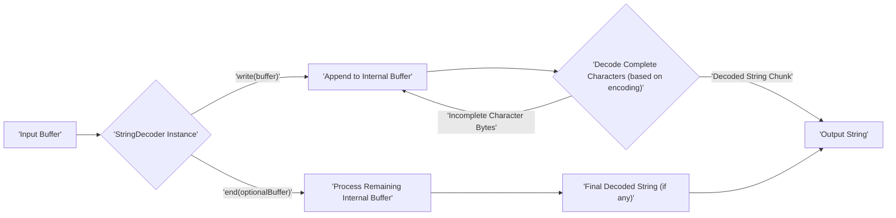
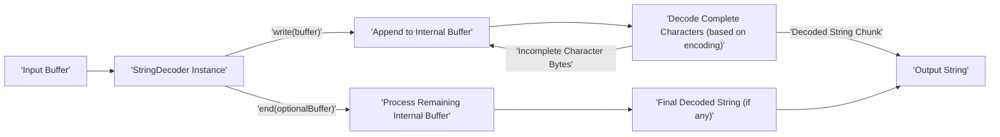

# Project Design Document: Node.js `string_decoder` Module

**Version:** 1.1
**Date:** October 26, 2023
**Author:** Gemini (AI Language Model)

## 1. Introduction

This document provides an enhanced design overview of the Node.js `string_decoder` module, located at [https://github.com/nodejs/string_decoder](https://github.com/nodejs/string_decoder). The primary purpose of this document is to serve as a robust foundation for threat modeling activities by clearly outlining the module's architecture, data flow, and key operational aspects.

## 2. Goals

The primary goals of this design document are to:

*   Provide a clear and comprehensive description of the `string_decoder` module's functionality, internal structure, and external interfaces.
*   Precisely identify the key components within the module and detail their interactions and responsibilities.
*   Illustrate the complete lifecycle of data as it flows through the module, from input to output.
*   Explicitly highlight potential security considerations and areas of concern relevant to the module's design and operation, specifically with threat modeling in mind.
*   Serve as a definitive and easily understandable reference point for security engineers and developers involved in threat modeling and security analysis.

## 3. Scope

This document focuses specifically on the design and functionality of the `string_decoder` module as it is implemented within the specified GitHub repository. The scope includes:

*   The `StringDecoder` class and its public and internal methods.
*   The different encoding schemes supported by the module and how they are handled.
*   The internal buffering mechanism employed for managing multi-byte character sequences.
*   The module's interaction with the Node.js `Buffer` object.

This document explicitly **excludes**:

*   The historical context or the evolution of the `string_decoder` module.
*   Detailed examples of how the module is used in various Node.js applications.
*   In-depth performance analysis or optimization techniques for the module.
*   Line-by-line code walkthroughs, unless absolutely necessary for clarifying a design point.

## 4. Architectural Overview

The `string_decoder` module is designed to facilitate the reliable conversion of `Buffer` objects, which represent sequences of bytes, into JavaScript strings. Its core function is to correctly handle multi-byte character encodings, preventing the corruption of characters that span across multiple `Buffer` chunks.

At the heart of the module is the `StringDecoder` class. When instantiated, it can be configured with a specific character encoding. The module maintains an internal buffer to store incomplete multi-byte character sequences encountered during the decoding process.

Key architectural elements:

*   **Encoding Agnostic Core:** The `StringDecoder` is designed to work with various encodings supported by Node.js. The specified encoding dictates how byte sequences are interpreted as characters.
*   **Stateful Decoding:** The module maintains internal state, specifically the internal buffer, to handle fragmented multi-byte characters correctly across multiple calls to the `write()` method.
*   **Chunk-Based Processing:** The module processes input data in chunks (as `Buffer` objects), making it suitable for streaming scenarios.

## 5. Component Description

The primary component is the `StringDecoder` class. Its key methods and properties are:

*   **`StringDecoder(encoding = 'utf8')`:**
    *   This is the constructor for creating a new `StringDecoder` instance.
    *   It accepts an optional `encoding` string, which defaults to `'utf8'`.
    *   Internally, it initializes the buffer (`_readableState.decoderBuffer`) and sets the `encoding` property.

*   **`write(buffer)`:**
    *   This method is used to feed new `Buffer` data to the decoder.
    *   It appends the incoming `buffer` to the internal buffer.
    *   It then attempts to decode as much complete character data as possible from the internal buffer, based on the configured encoding.
    *   Any trailing bytes that form an incomplete multi-byte character are retained in the internal buffer for subsequent `write()` calls.
    *   It returns the decoded string.

*   **`end(buffer)`:**
    *   This method signals the end of the input data stream.
    *   It optionally accepts a final `buffer` to be processed.
    *   It processes any remaining bytes in the internal buffer, ensuring that any trailing partial characters are handled (which might result in replacement characters or be discarded depending on the encoding).
    *   It returns any final decoded string.
    *   After `end()` is called, the `StringDecoder` instance should not be used further.

*   **Internal Buffer (`_readableState.decoderBuffer`):**
    *   This is a `Buffer` object used internally to store bytes that are part of an incomplete multi-byte character sequence.
    *   Its size dynamically adjusts as needed.

*   **`encoding` Property:**
    *   Stores the encoding specified during the `StringDecoder`'s construction.

## 6. Data Flow

The following diagram illustrates the flow of data through a `StringDecoder` instance:

Detailed steps in the data flow:

1. An `'Input Buffer'` containing encoded byte data is provided to the `'StringDecoder Instance'` via the `write(buffer)` method.
2. The incoming buffer is `'Append to Internal Buffer'` within the `StringDecoder`.
3. The `'Decode Complete Characters (based on encoding)'` process analyzes the internal buffer.
4. Successfully decoded character sequences are output as `'Decoded String Chunk'`.
5. These chunks are concatenated to form the final `'Output String'`.
6. If the decoding process encounters `'Incomplete Character Bytes'` at the end of the buffer, these bytes remain in the `'Internal Buffer'` for the next `write()` operation.
7. When the `'end(optionalBuffer)'` method is called, any remaining bytes in the `'Internal Buffer'` are processed.
8. This processing results in a `'Final Decoded String (if any)'`.
9. The final decoded string is also appended to the `'Output String'`.

## 7. Dependencies

The `string_decoder` module has a direct dependency on the core `Buffer` object provided by Node.js.

*   **`Buffer` (from Node.js core):** Used for representing and manipulating sequences of bytes. The `StringDecoder` relies on `Buffer` for storing input data and performing byte-level operations during the decoding process.

## 8. Security Considerations

This section outlines potential security considerations relevant to the `string_decoder` module, serving as a starting point for threat modeling:

*   **Incorrect or Malicious Encoding Specification:**
    *   If an attacker can control the `encoding` parameter passed to the `StringDecoder` constructor, they might be able to force the module to misinterpret byte sequences.
    *   This could lead to unexpected output, potentially exploitable in downstream systems if the decoded string is used in security-sensitive operations (e.g., file path construction, command execution).
    *   Consider the attack surface where the encoding is determined (e.g., user input, configuration files).

*   **Large or Malformed Input Buffers:**
    *   Providing extremely large input `Buffer` objects could potentially lead to excessive memory consumption within the `StringDecoder`'s internal buffer, causing a denial-of-service (DoS).
    *   Malformed input that triggers inefficient decoding paths could also contribute to DoS.

*   **State Management Vulnerabilities:**
    *   Although unlikely due to the nature of JavaScript's memory management, potential vulnerabilities related to the internal buffer's state management (e.g., race conditions if the module were used in a multi-threaded environment, which it isn't in standard Node.js) should be considered.

*   **Output Handling Vulnerabilities:**
    *   While not a direct vulnerability of the `string_decoder` itself, the decoded string produced by the module could be a source of vulnerabilities in downstream consumers.
    *   For example, if the decoded string is used in web applications without proper sanitization, it could lead to cross-site scripting (XSS) attacks.
    *   If used in command execution contexts, it could lead to command injection.

*   **Unexpected Behavior with Edge-Case Encodings:**
    *   Certain less common or complex encodings might have edge cases that could lead to unexpected behavior or vulnerabilities if not handled correctly by the decoding logic.

## 9. Diagrams

### 9.1. Data Flow Diagram (Mermaid)

## 10. Future Considerations

*   **Enhanced Error Handling and Validation:** Implementing more robust error handling for invalid encoding specifications or malformed input data could improve the module's resilience.
*   **Security Audits for Uncommon Encodings:**  Performing targeted security audits focusing on the handling of less common and more complex encodings could uncover potential vulnerabilities.
*   **Consideration for Streaming Security:**  In scenarios where the `StringDecoder` is used in streaming pipelines, further analysis of potential security implications related to the order and timing of data chunks might be warranted.
*   **Documentation of Security Best Practices:**  Providing clear guidance in the module's documentation on secure usage patterns and potential pitfalls could help developers avoid common mistakes.

This improved design document provides a more detailed and security-focused overview of the Node.js `string_decoder` module, making it a more effective resource for threat modeling activities.