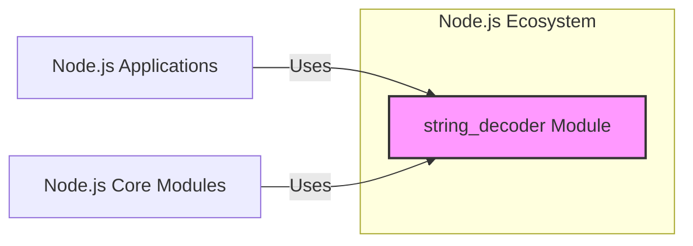

# BUSINESS POSTURE

- Business Priorities and Goals
  - Provide a reliable and efficient module for decoding byte streams into strings within the Node.js ecosystem.
  - Ensure compatibility with various character encodings to support diverse internationalization requirements.
  - Maintain performance and minimize overhead to avoid impacting the overall performance of Node.js applications.
  - Uphold the security and stability of the Node.js platform by providing a robust and vulnerability-free string decoding mechanism.
- Business Risks
  - Vulnerabilities in the `string_decoder` module could lead to widespread security issues in Node.js applications, including data corruption, denial of service, or injection attacks if improperly handled.
  - Performance bottlenecks in string decoding could negatively impact the responsiveness and efficiency of Node.js applications.
  - Incompatibility with certain character encodings could lead to data loss or misinterpretation, affecting application functionality and user experience.
  - Lack of maintenance or security updates could result in the module becoming outdated and vulnerable over time.

# SECURITY POSTURE

- Existing Security Controls
  - security control: Code review process within the Node.js project. (Location: Node.js project development guidelines and practices)
  - security control: Continuous integration testing as part of the Node.js build process. (Location: Node.js GitHub repository and CI configuration)
  - security control: Static analysis and linting tools used in the Node.js development workflow. (Location: Node.js project tooling and scripts)
  - security control: Vulnerability scanning as part of the Node.js security release process. (Location: Node.js security documentation and processes)
- Accepted Risks
  - accepted risk: Reliance on the security of the underlying Node.js runtime environment.
  - accepted risk: Potential for undiscovered vulnerabilities in the module due to the complexity of character encoding and decoding.
  - accepted risk: Risk of misuse of the module by developers leading to security vulnerabilities in applications.
- Recommended Security Controls
  - security control: Implement fuzz testing specifically targeting different character encodings and edge cases in the `string_decoder` module.
  - security control: Integrate SAST (Static Application Security Testing) tools specifically configured to detect encoding-related vulnerabilities.
  - security control: Conduct regular security audits of the `string_decoder` module by security experts.
- Security Requirements
  - Authentication: Not directly applicable to the `string_decoder` module itself, as it is a library. Authentication is the responsibility of the applications using this module.
  - Authorization: Not directly applicable to the `string_decoder` module itself. Authorization is the responsibility of the applications using this module.
  - Input Validation: Critical. The `string_decoder` module must robustly handle invalid or malformed byte sequences to prevent unexpected behavior or vulnerabilities. Input validation should be performed at the boundaries of the module to ensure that only valid byte streams are processed.
  - Cryptography: Not directly applicable to the core functionality of the `string_decoder` module. However, encoding and decoding are often used in conjunction with cryptographic operations, so ensuring correct encoding is important for data integrity in cryptographic contexts.

# DESIGN

## C4 CONTEXT



- Context Diagram Elements
  - Element:
    - Name: Node.js Applications
    - Type: Software System
    - Description: Applications built using the Node.js runtime environment. These applications rely on Node.js core modules and potentially external libraries to provide functionality to end-users or other systems.
    - Responsibilities: Processing user requests, managing application logic, interacting with external systems, and utilizing Node.js core modules for various functionalities including string decoding.
    - Security controls: Application-level security controls, including authentication, authorization, input validation, output encoding, and secure session management.
  - Element:
    - Name: Node.js Core Modules
    - Type: Software System
    - Description: Built-in modules provided as part of the Node.js runtime environment. These modules offer fundamental functionalities such as file system access, networking, and string manipulation, and are used by both Node.js applications and other core modules.
    - Responsibilities: Providing reusable and efficient functionalities to Node.js applications and other core modules, ensuring the stability and performance of the Node.js platform.
    - Security controls: Security controls implemented at the Node.js runtime level, including memory management, process isolation, and secure coding practices for core modules.
  - Element:
    - Name: string_decoder Module
    - Type: Software Component / Library
    - Description: A Node.js core module responsible for decoding byte streams into strings, handling various character encodings. It is used by other Node.js modules and applications when dealing with binary data that needs to be interpreted as text.
    - Responsibilities: Providing reliable and efficient string decoding functionality, supporting different character encodings, and handling potentially invalid byte sequences gracefully.
    - Security controls: Input validation within the module to handle invalid byte sequences, code review and testing as part of the Node.js development process, and adherence to secure coding practices.

## C4 CONTAINER

```mermaid
flowchart LR
    subgraph Node.js Runtime Environment
        subgraph "Core Modules"
            A["string_decoder Module"]
        end
        B["Stream Module"]
        C["Buffer Module"]
        D["Other Core Modules"]
    end
    E["Node.js Application Code"] -->|Uses Streams, Buffers, string_decoder| Node.js Runtime Environment
    B -->|Uses| A
    C -->|Uses| A
    D -->|Potentially Uses| A
    style A fill:#f9f,stroke:#333,stroke-width:2px
```

- Container Diagram Elements
  - Element:
    - Name: Node.js Runtime Environment
    - Type: Execution Environment
    - Description: The JavaScript runtime environment that executes Node.js applications and provides access to core modules and system resources. It manages the execution of JavaScript code and provides APIs for interacting with the operating system and network.
    - Responsibilities: Executing Node.js application code, managing memory and processes, providing access to core modules, and handling I/O operations.
    - Security controls: Operating system level security controls, Node.js runtime security features (e.g., permissions model, sandboxing - if applicable), and security updates for the Node.js runtime.
  - Element:
    - Name: string_decoder Module
    - Type: Library / Module
    - Description:  A core Node.js module implemented in JavaScript and potentially native code, responsible for decoding byte streams into strings. It is a component within the Node.js runtime environment.
    - Responsibilities: Decoding byte streams into strings according to specified or detected character encodings, handling partial or incomplete byte sequences, and providing an API for applications and other modules to use for string decoding.
    - Security controls: Input validation to handle invalid byte sequences, memory safety practices in native code (if any), and integration with Node.js security mechanisms.
  - Element:
    - Name: Stream Module
    - Type: Library / Module
    - Description: A core Node.js module providing an API for working with streaming data. Streams are fundamental for handling data efficiently in Node.js, and `string_decoder` is often used in conjunction with streams to decode data as it is received.
    - Responsibilities: Providing an abstraction for handling streaming data, allowing for efficient processing of large datasets or continuous data flows.
    - Security controls: Stream handling mechanisms within Node.js to prevent resource exhaustion or other stream-related vulnerabilities.
  - Element:
    - Name: Buffer Module
    - Type: Library / Module
    - Description: A core Node.js module for working with raw binary data. Buffers are used to represent fixed-size chunks of memory and are often the input to the `string_decoder` module.
    - Responsibilities: Providing a way to manipulate raw binary data in Node.js, allowing for efficient handling of byte streams.
    - Security controls: Buffer management within Node.js to prevent buffer overflows or other memory-related vulnerabilities.
  - Element:
    - Name: Other Core Modules
    - Type: Library / Modules
    - Description: Other built-in modules in Node.js that may indirectly or directly interact with the `string_decoder` module, such as `http`, `fs`, `net`, etc., when they need to handle text-based data from various sources.
    - Responsibilities: Providing diverse functionalities within the Node.js ecosystem, potentially relying on `string_decoder` for text processing.
    - Security controls: Security controls specific to each core module, and overall security of the Node.js core module ecosystem.
  - Element:
    - Name: Node.js Application Code
    - Type: Software Application
    - Description: The custom JavaScript code written by developers to create Node.js applications. This code utilizes Node.js core modules, including `string_decoder`, to implement application logic.
    - Responsibilities: Implementing application-specific functionalities, handling user requests, and utilizing Node.js modules for various tasks including string decoding.
    - Security controls: Application-level security controls implemented by developers, including secure coding practices, input validation, output encoding, and dependency management.

## DEPLOYMENT

- Deployment Architecture Options:
  - Option 1: Deployed as part of the Node.js runtime, which is then deployed on various operating systems (Linux, Windows, macOS) and hardware architectures (x86, ARM).
  - Option 2: Used within serverless environments (e.g., AWS Lambda, Google Cloud Functions, Azure Functions) where Node.js runtime is pre-installed.
  - Option 3: Containerized Node.js applications (e.g., using Docker) where Node.js runtime including `string_decoder` is part of the container image.

- Detailed Deployment Architecture (Option 1: Standalone Node.js Deployment):

```mermaid
flowchart LR
    subgraph Target Environment: Server
        subgraph Operating System (e.g., Linux)
            A["Node.js Runtime"]
        end
    end
    style A fill:#ccf,stroke:#333,stroke-width:2px
```

- Deployment Diagram Elements (Option 1):
  - Element:
    - Name: Server
    - Type: Infrastructure / Hardware
    - Description: Physical or virtual server infrastructure where the Node.js runtime environment is deployed. This could be on-premises servers, cloud-based virtual machines, or bare-metal servers.
    - Responsibilities: Providing the physical or virtual resources (CPU, memory, storage, network) necessary to run the operating system and Node.js runtime.
    - Security controls: Physical security of data centers, server hardening, operating system security configurations, network security controls (firewalls, intrusion detection/prevention systems).
  - Element:
    - Name: Operating System (e.g., Linux)
    - Type: Software / Operating System
    - Description: The operating system installed on the server, providing a platform for the Node.js runtime to execute. Common operating systems for Node.js deployments include Linux distributions, Windows Server, and macOS Server.
    - Responsibilities: Managing system resources, providing system services, enforcing security policies, and providing an interface for the Node.js runtime to interact with hardware.
    - Security controls: Operating system security hardening, access control lists, patch management, security monitoring, and logging.
  - Element:
    - Name: Node.js Runtime
    - Type: Software / Runtime Environment
    - Description: The Node.js runtime environment, including the V8 JavaScript engine and core modules like `string_decoder`. It is installed on the operating system and provides the environment for executing Node.js applications.
    - Responsibilities: Executing Node.js applications, providing access to core modules and system APIs, managing JavaScript code execution, and handling runtime errors.
    - Security controls: Node.js runtime security features, secure coding practices in Node.js core modules, vulnerability patching for the Node.js runtime, and configuration options for security hardening.

## BUILD

```mermaid
flowchart LR
    A["Developer"] -->|Code Changes, Commit, Push| B["Version Control System (e.g., GitHub)"]
    B -->|Webhook, Trigger| C["CI/CD System (e.g., GitHub Actions)"]
    C -->|Build Process (npm install, compile, test, lint, SAST)| D["Build Artifacts (Node.js distribution)"]
    D -->|Publish| E["Distribution Server (nodejs.org)"]
    style C fill:#eef,stroke:#333,stroke-width:2px
```

- Build Process Description
  - Developer: Node.js developers write code, including changes to the `string_decoder` module, and commit/push these changes to the version control system.
  - Version Control System (e.g., GitHub): Stores the source code of Node.js, including the `string_decoder` module, and manages code changes through versioning.
    - Security controls: Access control to the repository, branch protection, audit logging of code changes.
  - CI/CD System (e.g., GitHub Actions): Automates the build, test, and release process for Node.js. Triggered by code changes in the version control system.
    - Security controls: Secure configuration of CI/CD pipelines, access control to CI/CD system, secrets management for credentials used in the build process, and build environment security.
  - Build Process (npm install, compile, test, lint, SAST): Steps performed by the CI/CD system to build and validate the Node.js distribution. Includes:
    - `npm install`: Installing dependencies.
    - Compile: Compiling native modules if necessary.
    - Test: Running unit tests, integration tests, and potentially fuzz tests.
    - Lint: Performing code linting and static analysis.
    - SAST: Static Application Security Testing to identify potential vulnerabilities in the code.
    - Security controls: Dependency scanning, SAST tools, secure build environment, and verification of build artifacts.
  - Build Artifacts (Node.js distribution): The output of the build process, which is a distributable package of Node.js including the `string_decoder` module.
    - Security controls: Signing of build artifacts to ensure integrity and authenticity.
  - Distribution Server (nodejs.org): Hosts the built Node.js distributions for users to download.
    - Security controls: Security hardening of the distribution server, access control, and integrity checks for hosted files.

# RISK ASSESSMENT

- Critical Business Processes:
  - Ensuring correct and secure string processing within Node.js applications is critical for all applications that handle text data, which is a vast majority of Node.js applications. Incorrect string decoding can lead to data corruption, misinterpretation of data, and security vulnerabilities.
- Data Sensitivity:
  - The `string_decoder` module itself processes byte streams and converts them to strings. The sensitivity of the data depends entirely on the context of the application using this module. It can range from publicly available text data to highly sensitive personal or financial information. If `string_decoder` fails to correctly decode sensitive data, it could lead to information disclosure or other security breaches in the application. The module itself does not inherently handle sensitive data, but its correct functioning is crucial for applications that do.

# QUESTIONS & ASSUMPTIONS

- BUSINESS POSTURE
  - Assumption: The primary business goal for the `string_decoder` module is to support the stability and security of the Node.js platform.
  - Assumption: Performance is a key non-functional requirement, as `string_decoder` is used in performance-sensitive contexts.
  - Question: Are there specific performance benchmarks or SLAs for the `string_decoder` module?
- SECURITY POSTURE
  - Assumption: The Node.js project follows a secure software development lifecycle, including code reviews and testing.
  - Assumption: Security vulnerabilities in core modules like `string_decoder` are treated with high priority.
  - Question: What specific security testing methodologies (beyond unit tests and standard linting) are applied to the `string_decoder` module? Are fuzzing or penetration testing regularly performed?
  - Question: Is there a documented process for handling security vulnerabilities discovered in the `string_decoder` module?
- DESIGN
  - Assumption: The current design of `string_decoder` is considered adequate for its intended purpose within the Node.js ecosystem.
  - Assumption: The module is designed to be compatible with various character encodings commonly used in web applications and other contexts.
  - Question: Are there any known limitations or design constraints of the `string_decoder` module that could impact security or functionality?
  - Question: Is there any ongoing effort to refactor or redesign the `string_decoder` module for improved performance, security, or maintainability?